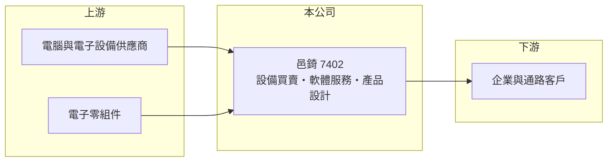

# 7402 邑錡

> 上櫃｜[[產業索引-光電業|光電業]]｜上市（櫃）日期 2015/12/29

# 第一章：企業模式與商業藍圖

> [!info] 撰寫說明
> 精簡版，由 Claude 依公開資料整理，架構比照 [[2330台積電]]，資料截至 2026-10-07。來源：nstock.tw 邑錡公司概況、winvest.tw 營收快訊。公開資料有限，本次只查到營業登記項目，具體產品、營收比重、客戶與營運據點未查到。#待校對

邑錡是被歸在光電類的小型公司，登記業務以電腦設備批發、軟體服務與產品設計為主。

- **核心業務：** 邑錡成立於 2002 年，2015 年 12 月上櫃，營業項目包括電腦及事務性機器設備批發、國際貿易、資訊軟體與資料處理服務，以及[[產品設計]]。
- **營收結構：** 本次未查到產品或客戶別比重；2025 年全年營收 5.21 億元。
- **營運據點：** 營運與生產據點本次未查到，本文不推測。
- **長期方向：** 公開資訊不足以判斷公司具體的產品發展方向，建議以公司年報與法說資料補充。

# 第二章：護城河深度與競爭優勢

邑錡的[[毛利率]]接近四成，顯示產品有一定附加價值，但護城河內容本次無法確認。

- **競爭優勢：** 業務同時涵蓋產品設計、軟體與設備買賣，可能以設計加整合服務取得較高毛利（推估）。
- **主要對手：** 資料庫將其與 [[3481群創]]、[[2409友達]]、[[6116彩晶]] 歸為同類光電股，但實際業務差異大，真正的直接對手本次未查到。
- **觀察重點：** 月營收能否擺脫年減、毛利率能否維持在三成以上，以及市值相對於獲利是否偏高。

# 第三章：財務體質與盈利規模

資料日期：2026-10-07，以下數字是撰寫當時的快照；最新月營收、毛利率、累計 EPS 由自動排程寫在本筆記的屬性欄位（月營收、毛利率、累計EPS 等）。#待校對

邑錡 2026 年營收小幅衰退，毛利率高但獲利規模小。

- **營收規模：** 2026 年 1 至 9 月累計營收 3.77 億元，年減 8.03%；5 月營收 3,203.1 萬元、年減 38.3%，7 月 4,951.8 萬元、年增 35.31%，9 月約 0.5 億元、年增 0.43%，單月波動大。
- **獲利：** 2026 年第二季 EPS 0.1 元，[[毛利率]] 37.29%，[[營業利益率]] 6.92%，淨利率 2.87%。
- **財務特色：** 資本額約 3.53 億元，市值約 35.14 億元，市值相對營收與獲利偏高，股價可能反映市場對未來題材的預期（推估）；2024 年全年配息 1.8 元。

# 第四章：總體風險與地緣政治

邑錡的主要風險在於資訊透明度低與營收波動。

- **產業週期：** 電腦與電子設備需求隨企業資本支出與消費電子景氣起伏。
- **營運風險：** 營收規模小、單月波動大，少數訂單變化就會影響全年獲利；本次未查到客戶集中度。
- **其他風險：** 市值與獲利落差大，若市場預期落空，股價波動可能較大；另有匯率與零組件供應風險。

# 專有名詞解析

## 金融

- **[[毛利率]]**：營業毛利占營收的比率，反映產品售價扣除直接成本後的獲利空間。
- **[[營業利益率]]**：營業利益占營收的比率，反映扣除營業費用後本業的獲利能力。

## 產業

- **[[產品設計]]**：替客戶規劃產品規格、外觀與電路等的設計服務，常與代工或買賣搭配收費。

# 核心供應鏈

- 上游：電腦與電子設備供應商、電子零組件廠（推估）
- 下游／客戶：企業與通路客戶（推估），名稱未揭露
- 同業：本次未查到直接同業

## 最新新聞
<!-- news:start -->
<!-- news:end -->

## 相關連結
- [公開資訊觀測站](https://mopsov.twse.com.tw/mops/web/t05st03?step=1&firstin=1&co_id=7402)
- [Goodinfo](https://goodinfo.tw/tw/StockDetail.asp?STOCK_ID=7402)
- [Yahoo 股市](https://tw.stock.yahoo.com/quote/7402)
- [鉅亨網新聞](https://www.cnyes.com/twstock/7402/news)
