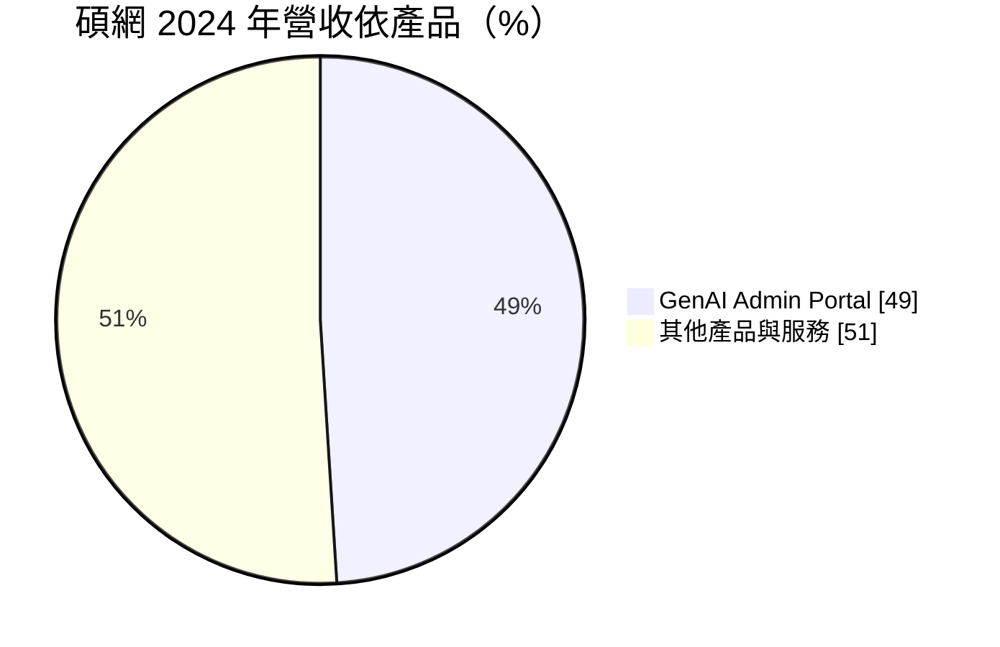
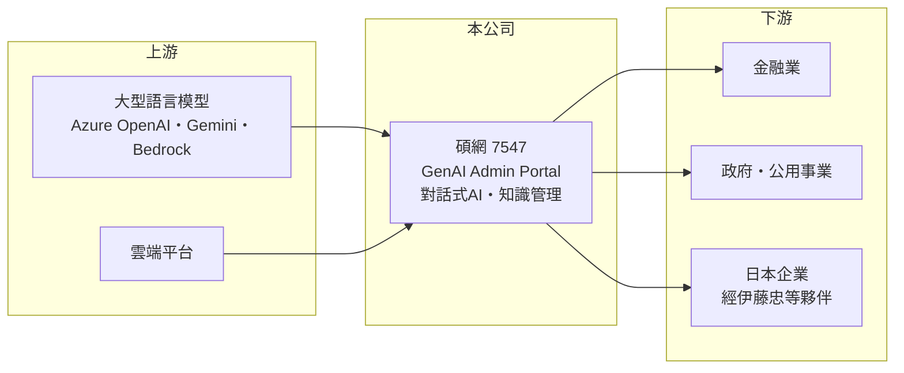

# 7547 碩網

> 上櫃｜[[產業索引-數位雲端|數位雲端]]｜上市（櫃）日期 2025/07/29

# 第一章：企業模式與商業藍圖

> [!info] 撰寫說明
> 精簡版，由 Claude 依公開資料整理，架構比照 [[2330台積電]]，資料截至 2026-10-08。來源：櫃買中心開放資料（基本資料、2026 年上半年綜合損益與資產負債、每月營收、本益比殖利率）、Goodinfo 年度經營績效（2018 至 2025 年）、優分析 2025 年 8 月個股分析（2024 年產品與地區比重、客戶數、RPO）、ETtoday 與聯合新聞網上櫃報導標題。#待校對

碩網資訊成立於 1999 年，是台灣老牌的企業對話式 AI 軟體公司，早期以智能客服與知識管理起家，近年主力產品是企業生成式 AI 平台 GenAI Admin Portal，2025 年 7 月上櫃。

- **核心業務：** 碩網替企業建置[[對話式 AI]]，從客服機器人、內部知識問答到串接 ERP、CRM、人資與供應鏈系統的 AI 助理。GenAI Admin Portal 支援多家大型語言模型（如 [[MSFT微軟]] Azure OpenAI、[[GOOGL谷歌]] Gemini、[[AMZN亞馬遜]] Bedrock），企業可以在同一平台上切換模型並控管權限與資料，這種「模型中立」的定位是碩網的產品主軸。
- **營收結構：** 依優分析整理，GenAI Admin Portal 在 2024 年貢獻約 1.6 億元，占營收比重由前一年的 4% 跳升到 49%；日本市場占比由 7% 升到 35%；[[經常性收入]]約占 29%。台灣以專案導入與顧問為主、客製化程度高，日本則以訂閱產品透過當地夥伴銷售為主。

- **營運據點：** 總部位於新北市新店區，國內客戶超過 700 家，涵蓋金融、政府、公用事業、製造、運輸、醫療與零售，其中金融業市占率超過八成。日本有 30 家以上企業客戶，包括大型保險公司，合作夥伴包括微軟與伊藤忠。
- **長期方向：** 長期目標是把日本的「夥伴代銷加訂閱」模式複製到東南亞與北美，並提高訂閱收入比重。2025 年第一季未認列合約金額（RPO）約 2.1 億元、連續五季成長，代表未來營收有一定的能見度。

# 第二章：護城河深度與競爭優勢

碩網的護城河來自金融業的高市占、二十多年的中文語意技術累積，以及日本市場的早期卡位，屬於窄護城河。

- **競爭優勢：** 金融業對客服機器人的準確度、合規與資安要求極高，碩網在金融業市占率超過八成，累積大量問答知識庫與導入經驗，新進者很難在短期內取得同等信任。平台支援多種大型語言模型，企業不必綁定單一雲端，這在模型快速更迭的時代是重要賣點。
- **主要對手：** 國內對手包括 [[6925意藍]]（AI Search）、[[6752叡揚]] 等軟體公司與系統整合商；國際上則有微軟 Copilot Studio、Google 等雲端大廠的自建工具，以及日本當地的對話式 AI 業者。大廠工具越來越容易上手，會壓縮中小型平台的差異化。
- **觀察重點：** 長期要看日本與海外訂閱收入能否持續提高占比，讓營收從專案型轉為經常性；也要看 GenAI 平台能否在大廠推出同類工具後仍維持定價能力。

# 第三章：財務體質與盈利規模

資料日期：2026-10-08，表格是撰寫當時的快照；最新月營收、毛利率、累計 EPS 由自動排程寫在本筆記的屬性欄位（月營收、毛利率、累計EPS 等）。#待校對

碩網在生成式 AI 帶動下，2024 年起營收與獲利率同步躍升，屬於產品組合改變帶來的結構性改善。

| 年度 | 營收（億元） | [[毛利率]] | [[營業利益率]] | EPS（元） | [[ROE]] |
|---|---|---|---|---|---|
| 2021 | 1.86 | 40.6% | 10.6% | 0.64 | 3.72% |
| 2022 | 1.85 | 44.8% | 12.4% | 0.78 | 4.50% |
| 2023 | 2.02 | 46.9% | 13.5% | 1.22 | 6.99% |
| 2024 | 3.33 | 44.6% | 17.0% | 2.01 | 11.0% |
| 2025 | 3.52 | 54.5% | 28.0% | 2.65 | 10.3% |
| 2026 上半年 | 1.95 | 56.3% | 30.3% | 1.52 | 未查得 |

註：2021 至 2025 年取自 Goodinfo，2026 年上半年取自櫃買中心開放資料（營業毛利 1.10 億元、營業利益 0.59 億元）。

- **長期指標：** 2020 至 2025 年營收從 1.66 億元成長到 3.52 億元，年複合成長率約 16%（推算）；2021 至 2025 年平均 ROE 約 7%（推算），偏低的原因是帳上權益大、現金多。最近一次現金股利約每股 1.78 元，以 2025 年 EPS 2.65 元計算配息率約 67%。
- **[[ROIC]] 與 [[WACC]]：** 2025 年營業利益約 0.99 億元（3.52 億元 × 28%），稅後營業利益約 0.79 億元；2026 年 6 月底股東權益 9.75 億元，負債 1.81 億元幾乎全是流動的營運性負債，有息負債視為接近零，ROIC 約 8%（推算）。WACC 約 7.75%（推算：無風險利率 1.75%、市場風險溢酬 6%、β 取軟體同業常見值 1.0，無負債）。以全部權益計算的 ROIC 只略高於 WACC，但權益中有大量上櫃募得與累積的現金；若扣除超額現金，本業的資本報酬遠高於資金成本。真正的問題是現金能否被有效運用。
- **財務特色：** 2026 年 6 月底負債比率約 16%，每股淨值 28.72 元。毛利率從四成多升到五成以上，反映平台型產品比重提高；營業利益率由一成出頭升到三成，顯示軟體的營運槓桿開始發揮。

# 第四章：總體風險與地緣政治

碩網的風險在於生成式 AI 技術變化太快，以及大型平台業者向下整合。

- **產業週期：** 企業 AI 預算目前處於擴張期，但若生成式 AI 的投資報酬不如預期，企業可能放慢導入；台灣的專案型收入也容易受客戶預算與驗收時點影響，季度營收起伏大。
- **營運風險：** 大型語言模型由國外大廠提供，碩網的價值在於整合與應用層。若微軟、Google 把類似功能直接內建在辦公與雲端產品中，平台型中小業者的定價空間會被壓縮。客戶集中在金融業，單一產業的 IT 政策變化影響大。
- **其他風險：** 日本營收比重高，日圓匯率會影響換算後的營收；AI 應用涉及個資、資料外洩與模型錯誤回答的責任，法規趨嚴時合規成本會增加。

# 專有名詞解析

## 應用

- **[[對話式 AI]]**：能用自然語言與人對話、理解問題並回覆的 AI 系統，常見於客服機器人與企業助理。
- **[[大型語言模型]]**：以大量文字訓練、能理解與生成語言的 AI 模型，例如 GPT、Gemini，英文縮寫 LLM。

## 金融

- **[[經常性收入]]**：訂閱、維護等每期重複發生的收入，可預測性高於一次性專案收入。
- **[[ROIC]]**：投入資本報酬率，稅後營業利益除以股東權益加有息負債，衡量本業運用資本的效率。
- **[[WACC]]**：加權平均資金成本，股東與債權人要求報酬率的加權平均，是 ROIC 要超越的門檻。

# 核心供應鏈

- 上游：[[MSFT微軟]]、[[GOOGL谷歌]]、[[AMZN亞馬遜]] 的大型語言模型與雲端服務。
- 下游／客戶：國內 700 家以上企業（金融業市占超過八成），日本 30 家以上企業，透過伊藤忠等夥伴銷售。
- 同業：[[6925意藍]]、[[6752叡揚]]，以及微軟、Google 的企業 AI 工具。

## 最新新聞
<!-- news:start -->
<!-- news:end -->

## 相關連結
- [公開資訊觀測站](https://mopsov.twse.com.tw/mops/web/t05st03?step=1&firstin=1&co_id=7547)
- [Goodinfo](https://goodinfo.tw/tw/StockDetail.asp?STOCK_ID=7547)
- [Yahoo 股市](https://tw.stock.yahoo.com/quote/7547)
- [鉅亨網新聞](https://www.cnyes.com/twstock/7547/news)
