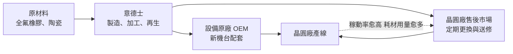
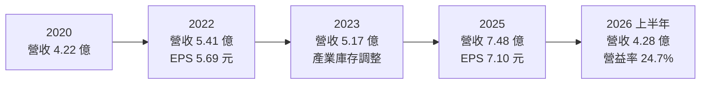
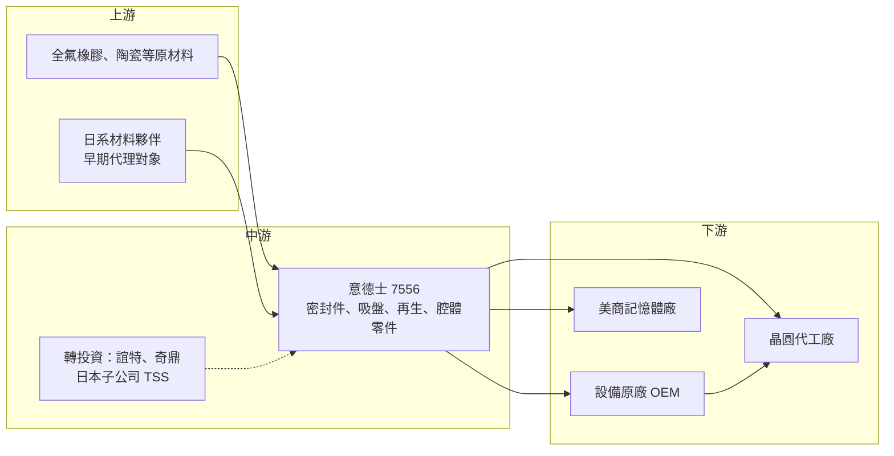

# 7556 意德士

> 上櫃｜[[產業索引-半導體業|半導體業]]｜上市（櫃）日期 2020/10/30

# 第一章：企業模式與商業藍圖

> [!info] 撰寫說明
> 本文由 Claude 依公開資料整理，架構比照 [[2330台積電]] 的四章研究，資料截至 2026-10-08。財務數字來源：櫃買中心開放資料快照（基本資料、2026 年第二季資產負債與綜合損益）、Goodinfo 年度經營績效與股利政策、富果法說會備忘錄（2026 年 9 月）、nStock；產業描述為整理性內容，尚未逐條比對原始文件。#待校對

在評估單一個股的長期投資價值時，首要步驟是拆解企業的底層獲利邏輯。本章針對意德士科技（股票代號：7556，以下簡稱意德士）的商業模式進行定性分析，說明一家從代理日系材料起家的公司，如何轉型為晶圓廠前段製程關鍵耗材與零組件的在地供應商。

## 一、核心定位：前段設備的關鍵耗材與再生服務

意德士成立於 1999 年，2020 年 10 月在櫃買中心掛牌，總部位於台北，主要生產基地在新竹竹東。依 nStock 整理的公司登記資料，它主要從事半導體製程設備精密零組件與材料的製造銷售，並提供製程次系統的維修服務。

依富果整理，意德士早期代理日本 Nihon Ceratec、大金工業等公司的產品，之後逐步發展出自有品牌 YEEDEX 與自主研發能力。它的定位很特別：同時供貨給設備原廠（OEM）與晶圓廠的售後市場（Aftermarket）。設備原廠在出貨新機台時需要它的零件，晶圓廠在機台運轉期間也需要定期更換耗材或送修零件，因此意德士的營收一半跟著晶圓廠蓋新廠走，一半跟著晶圓廠的稼動率走。

## 二、終端應用板塊：四大產品線

依富果整理的 2026 年 9 月法說會內容，意德士的產品分為四大類（各類營收比重未查得）：

* **全氟橡膠密封件：** 這是意德士的自有品牌 YEEDEX 產品。半導體製程腔體需要耐高溫、耐電漿、耐化學腐蝕的密封圈（[[O-ring]]），全氟橡膠（[[FFKM]]）是最高等級的材料。意德士的密封件依序供應 10、5、3 奈米製程，2025 年起供貨至 2 奈米設備。因為每次維修保養都要更換，屬於重複性消耗品，營收穩定度高。
* **真空吸盤：** 用於曝光機固定晶圓的真空吸盤（Vacuum Wafer Table），已導入 10 奈米至 3 奈米製程。曝光機對平坦度要求極高，吸盤的精度直接影響良率。
* **再生維修：** 針對[[靜電吸盤]]（E-Chuck）與加熱器（Heater）提供再生服務。這些零件價格高昂，原廠更換成本高，晶圓廠傾向送修再生以降低成本。
* **客製化腔體零組件：** 包括精密陶瓷零組件等，依客戶需求設計製造。

主要客戶依富果整理包括國內大型晶圓代工廠、美商記憶體公司與前段製程供應鏈夥伴；2025 年意德士獲得 [[2330台積電]] 供應鏈管理論壇的「生產支援與 ESG 協作獎」。

## 三、資本轉化邏輯：耗材型營收的複利效果

意德士的商業模式有兩個引擎。第一個是「裝機量」：晶圓廠每蓋一座新廠、每多裝一台機台，就多一組需要密封件、吸盤與腔體零件的設備。第二個是「耗材替換」：機台一旦運轉，密封件與吸盤就會定期磨損，必須更換或再生。這種模式類似刮鬍刀與刀片，一旦零件被晶圓廠驗證通過並寫入製程規格，後續數年都有穩定的替換需求。

產能方面，富果整理指出公司產能已滿載、連續兩年加班生產。竹東二期新廠預計 2026 年底完工、2027 年上半年投產，產能預計提升 2 倍；2025 年公司透過國內首檔上櫃公司永續發展可轉換公司債與現金增資募得 4.33 億元，其中約 79% 用於竹東二期與技術中心，2026 年 7 月並購入竹東工業區新土地作為三廠預備。

## 四、企業長期藍圖

* **跟著客戶往先進製程走：** 客戶製程每推進一個世代，腔體環境更嚴苛，密封件與零件的規格就要升級，單價也隨之提高。意德士已打入 2 奈米，長期成長與晶圓代工龍頭的先進製程擴產高度連動。
* **在地化取代進口：** 過去高階密封材多由美日大廠供應，nStock 列出的 2023 年新聞提到美商退出市場後，意德士的全氟密封材產能增加兩倍。在地供應鏈的需求，是它長期取代進口品的機會。
* **海外布局與轉投資：** 公司在日本設立子公司 TSS 株式会社，並加入德鑫半導體控股的聯盟拓展海外與新應用。轉投資誼特科技、奇鼎科技等公司，2026 年上半年業外收益約 7,136 萬元。這顯示經營層習慣透過轉投資建立供應鏈聯盟，但也讓獲利結構中有較高比例來自本業以外。

# 第二章：護城河深度與競爭優勢

本章分析意德士在半導體零組件市場的護城河，以及它與國際大廠的競爭位置。

## 一、護城河的核心組成要素

* **製程驗證的轉換成本：** 晶圓廠的零件一旦通過驗證、寫入製程規格，更換供應商就必須重新驗證，風險是良率下降。意德士的密封件已進入 2 奈米，代表它通過了最嚴格的驗證，這種資格很難被新進者複製。
* **自有測試能力：** 依富果整理，公司有自主研發能力與自有電漿測試機台，可以在出貨前模擬腔體環境測試材料耐受度，縮短客戶驗證時間。
* **在地化服務：** 晶圓廠需要快速的維修再生與緊急供貨。與國外原廠相比，在地供應商能更快回應，這在產能吃緊時尤其重要。

## 二、全球主要競爭對手格局

| 對手 | 定位 | 對意德士的威脅 |
|---|---|---|
| 杜邦（Kalrez）等美系密封材大廠 | 全氟橡膠密封件的國際領導品牌 | 品牌與材料配方歷史悠久，在新製程驗證上具先發優勢 |
| 日系材料與陶瓷廠 | 精密陶瓷、靜電吸盤原廠 | 掌握原廠零件與原始設計 |
| 設備原廠的原廠零件 | [[AMAT應用材料]]、[[LRCX科林研發]]、[[8035東京威力科創]] 等 | 原廠零件與維修服務直接競爭售後市場 |
| 台灣零組件同業 | 如 [[3680家登]]、[[6667信紘科]] 等其他在地供應商 | 爭取晶圓廠在地化採購的預算 |

註：上表的國際廠商為產業常見的競爭類型，來源未逐一點名，屬整理性推估。

## 三、優勢轉化：哪些市場守得住、哪些守不住

* **守得住：** 已在先進製程通過驗證的密封件與吸盤。這些產品屬耗材，客戶持續生產就持續需要，轉換成本高。
* **守不住：** 一般規格、可被多家供應商替代的零件。這類產品價格競爭較激烈，且在晶圓廠資本支出放緩時需求會先下降。
* **觀察重點：** 竹東二期投產後產能翻倍能否順利填滿；先進製程密封件在海外晶圓廠（美國、日本）能否取得訂單；以及轉投資收益占獲利比重是否持續偏高。

# 第三章：財務體質與盈利規模

資料日期：2026-10-08。數字取自櫃買中心開放資料、Goodinfo 年度經營績效與股利政策、富果法說會備忘錄，表格是撰寫當時的快照；最新月營收、毛利率、累計 EPS 由自動排程寫在本筆記的屬性欄位（月營收、毛利率、累計EPS 等）。#待校對

財務報表是檢驗護城河是否真實存在的最終標準。本章用多年度三率、ROE、現金流與資本報酬，檢視意德士的獲利品質。

## 一、獲利能力的基石：三率

| 年度 | 營收（新台幣） | [[毛利率]] | [[營業利益率]] | EPS（元） | [[ROE]] |
|---|---|---|---|---|---|
| 2021 | 4.75 億 | 41.8% | 24.6% | 4.62 | 13.5% |
| 2022 | 5.41 億 | 40.8% | 22.5% | 5.69 | 16.2% |
| 2023 | 5.17 億 | 38.5% | 20.8% | 4.71 | 13.2% |
| 2024 | 6.27 億 | 39.5% | 20.4% | 5.82 | 14.9% |
| 2025 | 7.48 億 | 38.6% | 20.4% | 7.10 | 15.9% |
| 2026 上半年 | 4.28 億 | 40.7% | 24.7% | 5.25 | 未查得 |

註：2026 上半年取自櫃買中心開放資料，毛利率與營業利益率以其營業毛利、營業利益除以營收推算。

* **[[毛利率]]：** 2017 年以來毛利率由 34% 左右提升到 38% 至 42% 之間，並且在 2023 年半導體庫存調整期也只降到 38.5%，顯示耗材型營收的穩定性。
* **[[營業利益率]]：** 長期穩定在 20% 到 25%，2026 年上半年回升到約 24.7%，反映產能滿載下的規模效益。
* **業外收益：** 2026 年上半年稅前淨利約 1.77 億元，其中業外收入約 0.71 億元，主要來自轉投資。這部分波動較大，評估本業時應以營業利益為準。
* **長期指標：** 2020 至 2025 年營收年複合成長率約 12.1%（推算）；2021 至 2025 年平均 ROE 約 14.7%（推算）。

## 二、[[ROE]]：資本效率

意德士的 ROE 長期穩定在 13% 到 16%，沒有大起大落，這是耗材型業務的特徵。不過 ROE 不算高，原因之一是股東權益中包含大量轉投資：2026 年第二季底股東權益約 17.5 億元，其中「其他權益」約 3.9 億元，主要是轉投資的未實現評價利益。這些資產不直接產生營業利益，拉低了本業的資本效率。

## 三、資本支出與自由現金流

* **[[CapEx]]：** 竹東二期新廠與技術中心是目前最主要的資本支出，2025 年募資 4.33 億元中約 3.41 億元用於此項目。2026 年第二季底非流動資產約 14.2 億元，已高於流動資產的 10.6 億元，顯示公司正處於擴產投資期。
* **[[自由現金流]]：** 擴產期間自由現金流會被資本支出壓縮，多年度自由現金流數字未查得。新廠 2027 年投產後，折舊會增加，需要靠產能填滿來維持毛利率。
* **股利：** 依 Goodinfo，2019 至 2025 年度每年都同時配發現金與股票股利，現金股利由 2 元逐步提高到 4.04 元，七年未中斷。富果整理 2025 年度股利合計約 4.6 元、配發率約 64.8%。持續配發股票股利代表股本逐年膨脹，長期會稀釋每股盈餘成長。

## 四、[[ROIC]] 與 [[WACC]]：價值創造利差

* **ROIC：** 依富果整理，公司在法說會揭露的 ROIC 為 22.88%（計算方式未說明，推估排除了轉投資與現金）。若以本文的簡化方法推算：2025 年營業利益約 1.53 億元（營收 7.48 億 × 20.4%）× (1 − 20%) ≈ 1.22 億元，除以 2026 年第二季股東權益 17.5 億元加非流動負債 3.6 億元（含可轉債，作為有息負債的上限近似）≈ 21.1 億元，ROIC 約 5.8%（推算）；以 2026 年上半年營業利益年化計算約 8.0%（推算）。兩者差距很大，主要因為權益中有大量轉投資、現金與興建中的新廠。
* **WACC（推算）：** 無風險利率取約 1.75%，市場風險溢酬 6%，β 取半導體零組件同業常見值 1.1（未查得本身的 β），股東權益成本約 8.4%。負債以可轉債為主，假設稅前成本 2%、稅後 1.6%；以帳面價值計負債權重約 17%，WACC 約 7.2%；以市值計負債權重更低，WACC 約 8%。
* **解讀：** 若只看營運資產（公司揭露的 ROIC 22.88%），意德士明顯創造價值；若把轉投資與新廠全部計入，ROIC 約 6% 到 8%，與 WACC 相近。這代表本業本身是好生意，但整體資本中有相當比例放在尚未產生營業利益的轉投資與新廠上。竹東二期投產後 ROIC 能否回升，是判斷資本配置是否成功的關鍵。

# 第四章：總體風險與地緣政治

任何企業都無法脫離宏觀環境獨立存在。本章分析意德士長期必須面對的地緣政治、產業週期與營運風險。

## 一、地緣政治

* **在地化的雙面刃：** 台灣晶圓廠擴大在地採購，是意德士過去成長的重要推力。但若主要客戶把先進製程產能大量移往美國、日本，意德士必須跟著到海外設點服務，否則會失去這部分訂單。日本子公司 TSS 與海外聯盟正是為此布局。
* **材料供應：** 全氟橡膠等高階原料的全球供應商不多，若因貿易限制或供應商退出而斷料，會直接影響生產。

## 二、產業週期與市場結構

* **晶圓廠資本支出週期：** 供應設備原廠的部分跟著晶圓廠蓋廠走，資本支出縮減時這部分營收會下滑。2023 年營收由 5.41 億元降到 5.17 億元，就是產業庫存調整期的影響。
* **稼動率：** 售後市場耗材的需求取決於晶圓廠稼動率，稼動率下降時耗材替換頻率也會下降，但波動通常小於設備。
* **客戶集中：** 營收高度集中在少數晶圓代工與記憶體客戶，單一客戶的採購策略變化影響很大（客戶集中度數字未查得）。

## 三、營運環境的隱性風險

* **擴產執行風險：** 竹東二期使產能提升 2 倍，若需求成長不如預期，新增折舊會壓縮毛利率。
* **業外收益波動：** 轉投資收益占稅前淨利的比重不低，轉投資公司表現或評價變動會造成 EPS 波動。
* **股本稀釋：** 長期配發股票股利並有可轉債，股本持續增加，股東需要以總獲利而非單一年度 EPS 評估成長。

## 四、科技或法規演進

半導體製程走向 2 奈米以下、[[GAA]] 電晶體與更高能量的電漿製程，腔體環境更嚴苛，對密封材與陶瓷零件的耐受度要求提高。這對已通過先進製程驗證的意德士是機會，但材料配方若跟不上，也可能被國際大廠的新材料取代。另一方面，全氟化合物（PFAS）在歐美面臨環保法規限制，若相關規範擴及半導體用全氟橡膠，可能影響材料來源或要求替代材料，屬於需要長期追蹤的法規風險（是否適用未查得）。

# 專有名詞解析

## 半導體

- **[[靜電吸盤]]**：E-Chuck，利用靜電力固定晶圓的平台，價格高昂，磨損後可送修再生以降低成本。
- **[[真空吸盤]]**：以真空吸力固定晶圓的平台，曝光機用的吸盤需要極高平坦度，直接影響曝光精度。
- **[[GAA]]**：環繞式閘極電晶體，閘極從四面包住通道，是 2 奈米以下製程取代 FinFET 的新架構。
- **[[電漿]]**：被游離的高能氣體，半導體蝕刻與沉積製程都靠它反應，也會侵蝕腔體內的零件與密封件。

## 金融

- **[[可轉換公司債]]**：可依約定價格轉換為公司股票的債券，利率通常較低，但轉換後會稀釋股本。
- **[[ROIC]]**：投入資本報酬率，衡量公司每投入一元營運資本能產生多少稅後營業利益。
- **[[WACC]]**：加權平均資金成本，股東與債權人要求報酬的加權平均，是 ROIC 要超越的門檻。
- **[[CapEx]]**：資本支出，企業用於購置廠房、設備等長期資產的支出。

## 產業

- **[[O-ring]]**：O 形密封圈，安裝在設備腔體接縫處維持真空與阻隔氣體，是半導體設備最常更換的耗材之一。
- **[[FFKM]]**：全氟橡膠，耐高溫、耐電漿與耐化學腐蝕能力最好的橡膠材料，用於最嚴苛的半導體製程腔體。
- **[[OEM 與售後市場]]**：OEM 指供貨給設備原廠配裝新機，售後市場指直接供貨給晶圓廠作為替換與維修。
- **[[PFAS]]**：全氟與多氟烷基物質的總稱，歐美正研議限制，含氟材料產業需長期關注相關法規。

# 核心供應鏈

## 1. 上游：材料
- 全氟橡膠、精密陶瓷等原材料供應商（具體名稱未查得）
- 早期代理的日系夥伴：Nihon Ceratec、大金工業

## 2. 中游：意德士本身與轉投資
- 轉投資：誼特科技、奇鼎科技
- 日本子公司 TSS 株式会社；與德鑫半導體控股結盟

## 3. 下游：設備原廠與晶圓廠
- 晶圓代工：[[2330台積電]]（2025 年獲其供應鏈管理論壇獎項）
- 美商記憶體公司（未具名）
- 前段製程設備原廠（未具名）

## 4. 同業
- 國際密封材與陶瓷零件大廠、台灣在地零組件供應商

延伸閱讀：[[台積電供應鏈]]

## 最新新聞
<!-- news:start -->
<!-- news:end -->

## 相關連結
- [公開資訊觀測站](https://mopsov.twse.com.tw/mops/web/t05st03?step=1&firstin=1&co_id=7556)
- [Goodinfo](https://goodinfo.tw/tw/StockDetail.asp?STOCK_ID=7556)
- [Yahoo 股市](https://tw.stock.yahoo.com/quote/7556)
- [鉅亨網新聞](https://www.cnyes.com/twstock/7556/news)
