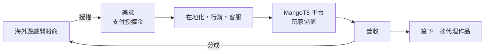
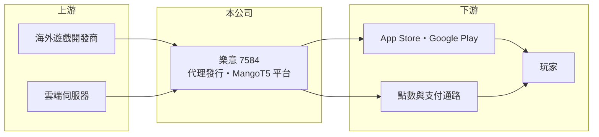

# 7584 樂意

> 上櫃｜[[產業索引-文化創意業|文化創意業]]｜上市（櫃）日期 2024/07/25

# 第一章：企業模式與商業藍圖

> [!info] 撰寫說明
> 精簡版，由 Claude 依公開資料整理，架構比照 [[2330台積電]] 的四章研究，資料截至 2026-10-08。來源：HiStock 公司資料、Goodinfo 年度經營績效頁、櫃買中心開放資料（2026 年第二季綜合損益與資產負債、基本資料、每月營收、本益比殖利率）、財經媒體標題。公開資料有限，代理遊戲名單與營收比重未查得，產業描述為整理性內容。#待校對

樂意（股票代號：7584，英文 HAPPYTUK，以下簡稱樂意）是 2024 年上櫃的遊戲代理發行商，經營「MangoT5 芒果遊戲」平台。本章說明中小型遊戲代理商的商業模式，以及樂意在其中的位置。

## 一、核心定位：遊戲代理發行與聯運平台

依 HiStock 公司資料，樂意成立於 2012 年，2020 年 11 月公開發行，2021 年 5 月登錄興櫃，2024 年 7 月 25 日上櫃，董事長兼總經理（執行長）為梁敏永，公司網址為 mangot5.com，主要業務是「遊戲代理發行、遊戲聯運平台」。依櫃買中心資料，實收資本額約 1.71 億元，是規模相對小的遊戲公司。

樂意的商業模式是[[遊戲代理]]：取得海外遊戲在台灣等特定地區的代理權，負責在地化翻譯、行銷、客服與儲值金流；同時經營自有的遊戲平台，讓玩家用同一個帳號遊玩平台上的多款遊戲，即[[聯運平台]]模式。

## 二、收入來源

公司未在本次查得的資料中揭露營收比重（未查得），依業務性質可分為：

* **代理遊戲營收：** 玩家在代理遊戲中儲值購買虛擬道具的收入，扣除原廠分成與平台費用後為公司毛利。這是主要收入來源。
* **平台聯運：** 透過 MangoT5 平台引入其他開發商或代理商的遊戲，以分潤方式合作。
* **毛利率特性：** 依 Goodinfo 資料，[[毛利率]]長期在 40% 至 50% 之間，介於純開發商與通路商之間，反映要與原廠分成營收的代理模式。

## 三、資本轉化邏輯

代理商的資本主要用在兩個地方：一是預付給原廠的代理授權金，二是上線初期的大量行銷費用。依櫃買中心資料，2026 年第二季底樂意總資產約 7.62 億元，其中非流動資產約 5.64 億元，比重明顯高於一般輕資產遊戲公司，可能包含資本化的代理授權金等無形資產（推估，細項未查得）。這類資產會在授權期間攤銷，若遊戲表現不如預期，還可能需要提列減損。

## 四、企業長期藍圖

樂意的長期發展取決於持續挑選並簽下能長期營運的代理作品，並讓 MangoT5 平台累積足夠的會員基礎，降低每款新遊戲的獲客成本。2024 年營收從約 5.79 億元成長到約 10.1 億元，顯示新作品能快速放大營收；但 2025 年轉為虧損，也說明代理模式的獲利高度取決於單一作品的表現。

# 第二章：護城河深度與競爭優勢

在長期價值投資中，「護城河」指企業抵禦競爭、維持超額利潤的保護機制。本章評估中小型遊戲代理商的競爭位置。

## 一、樂意的競爭條件

* **1. 選品能力：** 代理商的核心能力是在眾多海外作品中挑出適合台灣市場的遊戲，並以合理的授權金簽下。樂意 2020 至 2022 年 ROE 達 23% 至 45%，代表過去曾有成功的選品紀錄。
* **2. 平台會員：** MangoT5 平台累積的會員可以導入新遊戲，降低行銷成本。不過平台規模與 [[6180橘子]] 的 beanfun! 等大型平台相比仍小。
* **3. 營運成本彈性：** 小型代理商組織精簡，能快速決策並承接大廠看不上的中型作品。

整體而言，代理模式的護城河很淺，遊戲 IP 屬於原廠，玩家也很容易轉往其他遊戲。

## 二、主要競爭對手格局

| 對手 | 定位 | 對樂意的威脅 |
|---|---|---|
| [[6180橘子]] | 台灣最大的遊戲代理營運商之一，擁有會員與支付平台 | 在大型作品代理權上競爭 |
| [[5478智冠]]（遊戲新幹線） | 代理營運與點數通路 | 在代理權與通路上競爭 |
| [[3086華義]] | 中型遊戲代理營運商 | 定位相近，搶同一類作品 |
| 海外原廠自營 | 中國遊戲公司在台直接發行 | 代理模式的最大威脅 |

## 三、優勢轉化：哪些守得住、哪些守不住

* **守得住：** 既有作品的玩家社群與平台會員。
* **守不住：** 獲利穩定度。2025 年營收約 9.6 億元仍高於 2023 年，但營業利益率降到 -0.7%，EPS 為 -1.98 元，代表新作的授權金攤銷與行銷費用侵蝕了獲利。
* **觀察重點：** 新代理作品的上線節奏與表現、無形資產的攤銷與減損，以及平台會員數的成長。

# 第三章：財務體質與盈利規模

資料日期：2026-10-08，表格是撰寫當時的快照；最新月營收、毛利率、累計 EPS 由自動排程寫在本筆記的屬性欄位（月營收、毛利率、累計EPS 等）。#待校對

財務報表是檢驗護城河是否真實存在的最終標準。樂意的數字顯示代理商「營收擴張、獲利波動」的典型樣貌。

## 一、多年度經營績效

| 年度 | 營收（新台幣） | [[毛利率]] | [[營業利益率]] | EPS（元） | [[ROE]] |
|---|---|---|---|---|---|
| 2019 | 3.52 億 | 46.8% | 8.4% | 3.11 | 20.2% |
| 2020 | 5.71 億 | 45.3% | 15.5% | 6.83 | 44.7% |
| 2021 | 5.98 億 | 48.4% | 21.6% | 8.18 | 43.3% |
| 2022 | 6.49 億 | 50.4% | 17.7% | 5.09 | 23.1% |
| 2023 | 5.79 億 | 46.0% | 9.0% | 5.94 | 24.2% |
| 2024 | 10.1 億 | 48.9% | 9.4% | 4.06 | 13.2% |
| 2025 | 9.6 億 | 40.0% | -0.7% | -1.98 | -6.4% |
| 2026 上半年 | 4.79 億 | 37.8% | -2.4% | -1.11 | 不適用（半年） |

資料來源：2019 至 2025 年為 Goodinfo 年度經營績效，2026 上半年為櫃買中心開放資料。

* **營收與獲利率背離：** 2024 年營收大增約 74%，但營業利益率沒有同步提升，2025 年起轉為虧損，毛利率也從近 50% 降到 40% 以下。
* **長期指標：** 2021 至 2025 年平均 ROE 約 19.5%（推算），但呈下降趨勢；2020 至 2025 年營收年複合成長率約 10.9%（推算）。

## 二、資產負債與股利

依櫃買中心資料，2026 年第二季底權益約 4.37 億元、負債約 3.25 億元（流動負債約 3.10 億元）。流動資產只有約 1.98 億元，低於流動負債，短期資金調度需要留意（推估，負債中可能含預收儲值等營運性負債）。最近一次現金股利約每股 0.41 元（櫃買中心資料），Goodinfo 統計 2021 至 2026 年發放年度的平均現金股利約 2.34 元，股利隨獲利下降而減少。

## 三、[[ROIC]] 與 [[WACC]]

**ROIC 推算：** 2025 年營業虧損約 0.07 億元，ROIC 略為負值（推算）。以 2021 至 2025 年平均營業利益約 0.77 億元計算，稅後約 0.62 億元；投入資本以權益約 4.37 億元加上假設有息負債約 1.5 億元（推估，細項未查得），合計約 5.87 億元，五年平均 ROIC 約 10.5%（推算）。

**WACC 推算：** 假設台灣 10 年期公債殖利率 1.75%、市場風險溢酬 6%、β 取遊戲同業常見值 1.0（假設），權益成本約 7.75%；負債成本稅後約 2.0%，以權益約 74%、負債約 26% 計算，WACC 約 6.3%（推算）。

**結論：** 樂意過去五年平均的 ROIC 高於 WACC，代表代理模式在選品成功時能創造價值；但近兩年報酬快速下滑，2025 年已低於資金成本，能否回到過去水準取決於下一批代理作品。

# 第四章：總體風險與地緣政治

任何企業都無法脫離宏觀環境獨立存在。本章分析樂意長期必須面對的產業、營運與法規風險。

## 一、產業週期與結構

* **作品生命週期：** 代理遊戲通常在上線初期營收最高，之後逐漸下滑，代理商必須不斷推出新作維持營收。
* **平台抽成：** 手機遊戲儲值多經由 Apple 與 Google 應用程式商店，平台抽成約三成，加上原廠分成，代理商的利潤空間有限。
* **行銷成本上升：** 中國遊戲大量進入台灣市場，廣告競價推高獲客成本。

## 二、營運風險

* **作品集中：** 營收可能集中在少數代理作品，單一作品表現不佳就會影響全年獲利。
* **授權金減損：** 預付的代理授權金若無法回收，需要提列減損損失。
* **代理權變動：** 原廠可能在合約到期後收回自營或改找其他代理商。

## 三、法規與地緣政治風險

* **兩岸政策：** 若代理作品多來自中國開發商（推估），兩岸關係或台灣對中國遊戲的管制政策變動，會影響代理來源。
* **機率型商品規範：** 台灣要求揭露轉蛋機率，規範趨嚴可能影響營收模式。

# 專有名詞解析

## 金融

- **[[ROIC]]**：投入資本報酬率，稅後營業利益除以股東權益與有息負債的合計，衡量本業對所有資金提供者的報酬。
- **[[WACC]]**：加權平均資金成本，依股東權益與負債的比重加權計算的資金成本，ROIC 高於它才代表創造價值。

## 產業

- **[[遊戲代理]]**：營運商取得海外遊戲在特定地區的營運權，負責在地化、行銷與客服，並與原廠分成營收。
- **[[聯運平台]]**：讓玩家以同一帳號遊玩多款遊戲的平台，平台方與開發商或代理商依營收分潤。

# 核心供應鏈

## 1. 上游
- 海外遊戲開發商（實際合作對象未查得）
- 雲端與機房服務業者

## 2. 本公司
- 樂意：遊戲代理發行、MangoT5 芒果遊戲平台

## 3. 下游與通路
- 玩家、應用程式商店、超商與點數通路

## 4. 同業
- [[6180橘子]]、[[5478智冠]]、[[3086華義]]

## 最新新聞
<!-- news:start -->
<!-- news:end -->

## 相關連結
- [公開資訊觀測站](https://mopsov.twse.com.tw/mops/web/t05st03?step=1&firstin=1&co_id=7584)
- [Goodinfo](https://goodinfo.tw/tw/StockDetail.asp?STOCK_ID=7584)
- [Yahoo 股市](https://tw.stock.yahoo.com/quote/7584)
- [鉅亨網新聞](https://www.cnyes.com/twstock/7584/news)
