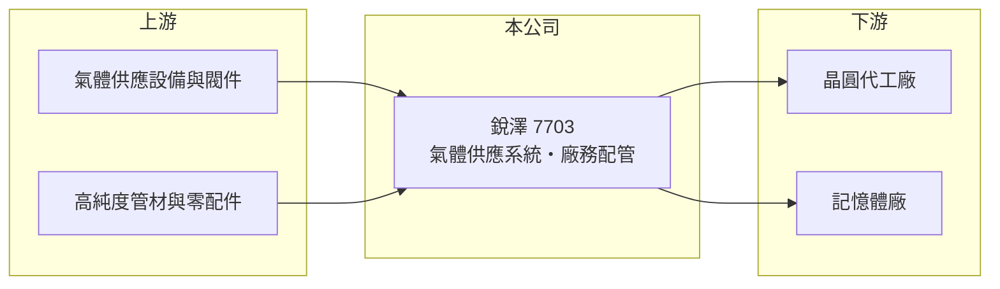

# 7703 銳澤

> 上櫃｜[[產業索引-其他電子業|其他電子業]]｜上市（櫃）日期 2024/11/13

# 第一章：企業模式與商業藍圖

> [!info] 撰寫說明
> 精簡版，由 Claude 依公開資料整理，架構比照 [[2330台積電]]，資料截至 2026-10-07。來源：聯合報 2026 年 6 月銳澤董事改選報導、winvest 營收快訊（2026 年 8 月）。業務別營收比重與客戶名稱未查到。#待校對

銳澤是半導體廠的氣體供應系統工程商，承接高純度氣體主系統、設備裝機與[[廠務工程]]，跟著晶圓廠與記憶體廠擴廠成長。

- **核心業務：** 公司 2007 年成立，2024 年 11 月上櫃，從事高科技廠房設備與廠務配管設計規劃、[[特殊氣體]]供應系統的代理製造，以及半導體設備儀器與零配件進出口。
- **營收結構：** 本次未查到工程與產品銷售的比重；營收主要來自台灣半導體與記憶體客戶的新廠擴建工程。
- **營運據點：** 除台灣外，已在美國、日本、新加坡設立營運據點。
- **長期方向：** 日本已取得氣體主系統工程訂單，預計 2026 年第二季中下旬開始貢獻；美國則跟隨既有客戶爭取新廠擴建案。

# 第二章：護城河深度與競爭優勢

氣體系統工程直接關係晶圓廠安全與良率，客戶驗證與施工紀錄是主要門檻。

- **競爭優勢：** 高純度與特殊氣體多具毒性或易燃性，業主傾向沿用有施工實績的廠商，跟隨客戶到海外建廠也是延續合作的方式（推估）。
- **主要對手：** 廠務與氣體化學系統同業如 [[6196帆宣]]、[[2404漢唐]]、[[6139亞翔]]、[[3402漢科]]。
- **觀察重點：** 日本與美國海外訂單的貢獻、工程毛利率能否維持兩成以上，以及台灣客戶擴廠節奏。

# 第三章：財務體質與盈利規模

資料日期：2026-10-07，以下數字是撰寫當時的快照；最新月營收、毛利率、累計 EPS 由自動排程寫在本筆記的屬性欄位（月營收、毛利率、累計EPS 等）。#待校對

銳澤 2026 年營收成長近三成，但上半年獲利低於去年同期。

- **營收規模：** 2025 年全年營收 25.6 億元；2026 年 8 月營收 3.69 億元、年增 83.26%，公司說明是產品組合與依案件進度認列；1 至 8 月累計 19.93 億元，年增 27.91%。
- **獲利：** 2025 年 EPS 8.72 元、稅後淨利 3 億元，[[毛利率]] 22.54%、[[營業利益率]] 14.15%；2026 年第一季 EPS 約 1.08 元（推算），第二季 2.45 元，上半年 3.53 元、年減 26%。
- **財務特色：** 資本額約 3.47 億元、市值約 71 億元；2025 年度配發現金股利 7 元，配發率約八成。

# 第四章：總體風險與地緣政治

銳澤的風險在於客戶擴廠週期與工程認列的波動。

- **產業週期：** 營收高度依賴半導體與記憶體廠的新廠擴建，資本支出放緩時工程量會下降。
- **營運風險：** 營收依案件進度認列，各季落差大；海外工程的人力調度、成本控管與當地法規都會影響毛利。
- **其他風險：** 美日當地缺工與匯率變動，以及客戶集中在少數晶圓與記憶體廠（推估）。

# 專有名詞解析

## 半導體

- **[[特殊氣體]]**：晶圓製程中用於蝕刻、沉積與摻雜的高純度氣體，多具毒性或易燃性，需專用管路輸送。

## 金融

- **[[毛利率]]**：營收扣除銷貨成本後的毛利占營收比例，反映產品本身的獲利能力。
- **[[營業利益率]]**：營業利益占營收的比率，反映扣除營業費用後本業的獲利能力。

## 產業

- **[[廠務工程]]**：晶圓廠、面板廠等的無塵室、氣體、化學品、水電等基礎設施工程。

# 核心供應鏈

- 上游：氣體供應設備、閥件、高純度管材與零配件供應商（推估）
- 下游／客戶：台灣半導體與記憶體廠，以及美國、日本的新廠專案（名稱未查到）
- 同業：[[6196帆宣]]、[[2404漢唐]]、[[6139亞翔]]、[[3402漢科]]

## 最新新聞
<!-- news:start -->
<!-- news:end -->

## 相關連結
- [公開資訊觀測站](https://mopsov.twse.com.tw/mops/web/t05st03?step=1&firstin=1&co_id=7703)
- [Goodinfo](https://goodinfo.tw/tw/StockDetail.asp?STOCK_ID=7703)
- [Yahoo 股市](https://tw.stock.yahoo.com/quote/7703)
- [鉅亨網新聞](https://www.cnyes.com/twstock/7703/news)
