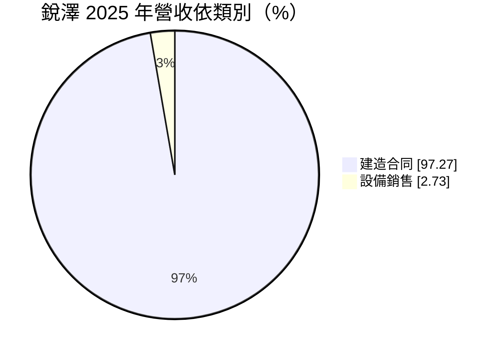
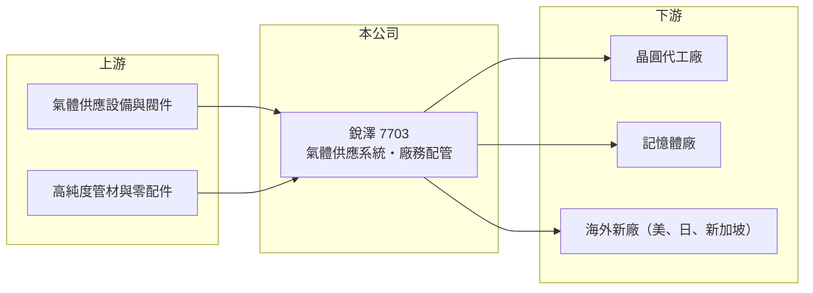

# 7703 銳澤

> 上櫃｜[[產業索引-其他電子業|其他電子業]]｜上市（櫃）日期 2024/11/13

# 第一章：企業模式與商業藍圖

> [!info] 撰寫說明
> 精簡版，由 Claude 依公開資料整理，架構比照 [[2330台積電]]，資料截至 2026-10-08。來源：MoneyDJ 理財網（富邦證券站）銳澤年度損益表、財務比率與基本資料；聯合報 2026 年 6 月銳澤董事改選報導；winvest 公司簡介；櫃買中心 2026 年第二季資產負債資料。客戶名稱未公開。#待校對

銳澤是半導體廠的氣體供應系統工程商，負責把製程需要的高純度與[[特殊氣體]]，從氣體站安全、潔淨地輸送到每一台機台。

- **核心業務：** 公司 2007 年成立，2024 年 11 月上櫃，總部在竹北。業務包括高科技廠房的[[廠務工程]]配管設計規劃、高純度氣體主系統工程、設備裝機，以及特殊氣體供應系統的代理製造與半導體設備零配件進出口。氣體管路的潔淨度與密封性直接影響晶圓良率與工安，屬於技術門檻較高的廠務環節。
- **營收結構：** 依 MoneyDJ 2025 年資料，建造合同占 97.27%、設備銷售 2.73%，幾乎全部來自工程專案。營收主要來自台灣半導體與記憶體客戶的新廠擴建，隨客戶建廠節奏波動。
- **營運據點：** 除台灣外，已在美國、日本、新加坡設立營運據點，並在日本取得氣體主系統工程訂單。這些據點多是跟隨台灣客戶與國際半導體廠的海外建廠而設。
- **長期方向：** 半導體產能往美國、日本等地分散，是廠務工程商的長期機會。銳澤若能在海外複製台灣的施工品質，就能把成長從單一市場擴展到全球建廠週期。

# 第二章：護城河深度與競爭優勢

氣體系統工程直接關係晶圓廠的安全與良率，施工實績與客戶信任是主要門檻。

- **競爭優勢：** 高純度與特殊氣體多具毒性、腐蝕性或易燃性，業主傾向沿用有長期施工紀錄、熟悉其廠務規範的廠商。跟隨客戶到海外建廠，則能把既有關係延伸到新市場，降低開發新客戶的成本（推估）。
- **主要對手：** 廠務與氣體化學系統同業如 [[6196帆宣]]、[[2404漢唐]]、[[6139亞翔]]、[[3402漢科]]。對手多數規模較大、業務線更完整，銳澤以氣體系統的專業分工競爭。
- **觀察重點：** 2021 至 2025 年[[毛利率]]在 15% 至 24% 之間，屬於工程業的正常水準。長期要看海外工程的毛利能否與台灣相當，以及客戶是否能從少數大廠擴展到更多半導體與記憶體業者。

# 第三章：財務體質與盈利規模

資料日期：2026-10-08，表格是撰寫當時的快照；最新月營收、毛利率、累計 EPS 由自動排程寫在本筆記的屬性欄位（月營收、毛利率、累計EPS 等）。#待校對

銳澤營收五年內成長約三倍，獲利隨客戶建廠高峰起伏，2022 年是目前的獲利高點。

| 年度 | 營收（億元） | [[毛利率]] | [[營業利益率]] | EPS（元） | [[ROE]] |
|---|---|---|---|---|---|
| 2021 | 15.54 | 15.29% | 10.81% | 6.62 | 24.81% |
| 2022 | 22.98 | 24.15% | 19.63% | 17.76 | 44.34% |
| 2023 | 17.80 | 23.48% | 17.04% | 9.08 | 19.38% |
| 2024 | 19.51 | 21.54% | 13.64% | 7.41 | 13.30% |
| 2025 | 25.64 | 22.54% | 14.15% | 8.72 | 14.39% |

註：2023 年以前為個別報表，2024 年起為合併報表。

- **營收與獲利趨勢：** 2020 至 2025 年營收年複合成長率約 26%（推算），近五年平均 ROE 約 23.2%（推算）。上櫃前股本較小、ROE 偏高，上櫃後淨值擴大，ROE 回到 13% 至 15% 之間。
- **財務特色：** 負債比率由 2020 年約 64% 降到 2025 年約 27%，財務結構明顯變健康。現金股利 2023 至 2025 年度依序為 7、5.5、7 元，2025 年度配息率約八成。工程業營運現金流受收款時點影響大，2023、2024 年每股營業現金流量為負，2025 年回升到 10.78 元。
- **[[ROIC]] 與 [[WACC]]：** 以 2025 年營業利益 3.63 億元乘以（1－20%）得稅後營業利益約 2.90 億元，除以 2026 年第二季股東權益約 20.23 億元加非流動負債約 0.45 億元，ROIC 約 14%（推算）。WACC 以 CAPM 推估：無風險利率 1.75%、市場風險溢酬 6%、β 取 MoneyDJ 的 0.76，股權成本約 6.3%，有息負債很少，WACC 約 6% 至 6.5%（推算）。ROIC 約為 WACC 的兩倍，代表銳澤在專業廠務工程上能持續創造價值。

# 第四章：總體風險與地緣政治

銳澤的風險在於高度依賴半導體建廠週期，以及海外工程的執行能力。

- **產業週期：** 營收主要來自半導體與記憶體廠的新廠擴建，客戶資本支出放緩時，工程量會明顯減少。2023 年營收年減約 23%，就是擴廠節奏放緩的結果。
- **營運風險：** 工程依進度認列，各季營收與毛利落差大；海外工程需要調派人力、熟悉當地法規與分包體系，成本控管難度遠高於台灣。客戶集中在少數晶圓與記憶體大廠（推估），單一客戶延後建廠就會影響全年表現。
- **其他風險：** 美國與日本當地缺工、工資高漲，以及新台幣匯率變動，都會影響海外專案的獲利。氣體工程涉及工安，一旦發生事故，商譽與法律責任都很重。

# 專有名詞解析

## 半導體

- **[[特殊氣體]]**：晶圓製程中用於蝕刻、沉積與摻雜的高純度氣體，多具毒性或易燃性，需專用管路輸送。

## 金融

- **[[毛利率]]**：營收扣除銷貨成本後的毛利占營收比例，反映產品本身的獲利能力。

## 產業

- **[[廠務工程]]**：晶圓廠、面板廠等的無塵室、氣體、化學品、水電等基礎設施工程。

# 核心供應鏈

- 上游：氣體供應設備、閥件、高純度管材與零配件供應商（推估）
- 下游／客戶：台灣半導體與記憶體廠，以及美國、日本、新加坡的新廠專案（名稱未公開）
- 同業：[[6196帆宣]]、[[2404漢唐]]、[[6139亞翔]]、[[3402漢科]]

## 最新新聞
<!-- news:start -->
<!-- news:end -->

## 相關連結
- [公開資訊觀測站](https://mopsov.twse.com.tw/mops/web/t05st03?step=1&firstin=1&co_id=7703)
- [Goodinfo](https://goodinfo.tw/tw/StockDetail.asp?STOCK_ID=7703)
- [Yahoo 股市](https://tw.stock.yahoo.com/quote/7703)
- [鉅亨網新聞](https://www.cnyes.com/twstock/7703/news)
