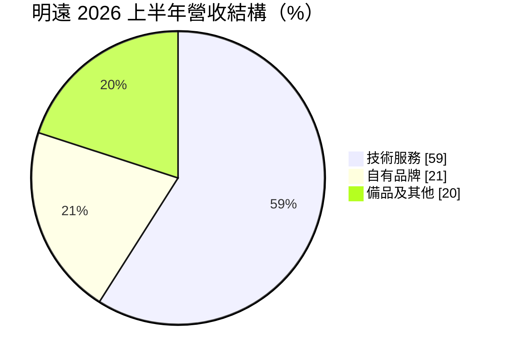
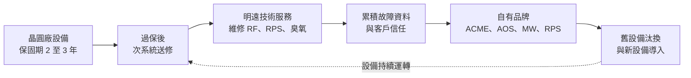
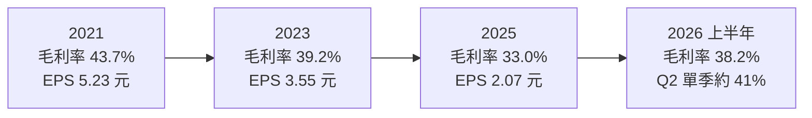
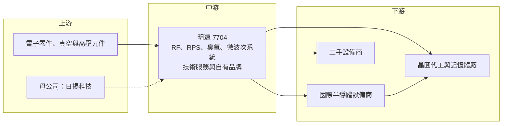

# 7704 明遠精密

> 上櫃｜[[產業索引-半導體業|半導體業]]｜上市（櫃）日期 2024/12/16

# 第一章：企業模式與商業藍圖

> [!info] 撰寫說明
> 本文由 Claude 依公開資料整理，架構比照 [[2330台積電]] 的四章研究，資料截至 2026-10-08。財務數字來源：櫃買中心開放資料快照（基本資料、2026 年第二季資產負債與綜合損益）、Goodinfo 年度經營績效與股利政策、富果法說會備忘錄（2026 年 8 月）、數位時代、科技新報、nStock；產業描述為整理性內容，尚未逐條比對原始文件。#待校對

在評估單一個股的長期投資價值時，首要步驟是拆解企業的底層獲利邏輯。本章針對明遠精密科技（股票代號：7704，以下簡稱明遠）的商業模式進行定性分析，說明一家由大學教授創立的公司，如何從半導體設備維修切入，逐步發展出自有品牌的電漿與臭氧次系統。

## 一、核心定位：電漿應用的設備次系統服務商

明遠成立於 2010 年，總部位於新竹竹北，2023 年 12 月登錄興櫃，2024 年 12 月轉上櫃。依科技新報報導，創辦人寇崇善是清華大學教授，研究專長是電漿技術，他的實驗室在創業前就已是竹科多家半導體公司解決設備問題的據點。

明遠的創業過程並不順利。科技新報指出，公司最初規劃開發類鑽鍍膜設備，但半導體設備的規格與零件早已由國際大廠指定，三年間沒有客戶採用，燒光約 1,500 萬元創業資金。2013 年一家國際二手設備商因為明遠團隊協助解決設備異常而主動投資，公司才轉向維修服務，在累積經驗與客戶信任後，再開始開發自有設備。這段歷程說明了半導體設備業的特性：新進者很難直接賣設備，必須先從維修建立信任。

依富果整理，明遠強調自己「並非單純的射頻電源製造商」，而是半導體前段製程（薄膜、蝕刻）的電漿應用技術服務商，核心技術包括臭氧、電漿、高效率電源與微波四項。依科技新報，明遠的母公司為日揚科技。

## 二、終端應用板塊：技術服務為主、自有品牌為輔

依富果整理的 2026 年 8 月法說會資料，2026 年上半年營收結構如下：

* **技術服務：** 維修晶圓廠設備中的射頻（[[RF]]）電源、微波電源、遠程電漿源（[[RPS]]）、臭氧產生器、感測器與靜電吸盤等次系統。富果整理指出，明遠是某國際最大半導體設備商全球唯一的臭氧（Ozone）維修合作夥伴，也已開始承接 3 奈米等先進製程訂單。這是明遠營收與毛利的主要來源。
* **自有品牌：** 包括八吋廠射頻電源系統 ACME、先進臭氧系統 AOS，以及臭氧系統的關鍵零組件。數位時代報導，ACME 經客戶驗證可節電約 68%，已通過半導體龍頭廠認證並量產出貨。自有 MW、RPS 產品正導入先進製程與先進封裝設備。
* **備品及其他：** 設備零件與備品買賣，客戶包括半導體廠、設備廠與二手設備商。

## 三、資本轉化邏輯：從維修走向自製

明遠的商業模式可以理解為「先修、再造」。晶圓廠的設備在原廠保固期（量產後約 2 至 3 年）結束後，次系統故障就需要找人維修。原廠維修昂貴且等待時間長，明遠以較快的在地服務承接這些需求。維修過程中累積的故障資料與設計知識，讓明遠了解哪些零件容易壞、哪些可以改良，進而開發出自有品牌產品。

這種模式的好處是兩段營收互相支援：技術服務提供穩定現金流，自有品牌則提供較高的成長性。富果整理指出，先進製程晶圓廠的設備會在過保後逐步釋出維修需求，八吋與十二吋成熟製程中部分原廠已停止支援的老舊部件（[[EOS]]），也由明遠提供替代品。

據點方面，明遠在竹北總部、上海設有子公司，數位時代報導提到熊本營運中心已建置完成；富果整理指出董事會已決議在日本福岡購地建廠，以就近服務日本客戶。

## 四、企業長期藍圖

* **從八吋走向十二吋與先進製程：** 科技新報 2025 年報導中，總經理焦元煜表示公司正加速從八吋成熟製程維修轉向十二吋與先進製程，並擴大自有品牌布局。
* **自有品牌進入國際設備商：** 部分產品已進入國際設備大廠總部的上機驗證階段，臭氧產品已打入韓國記憶體大廠。若能被國際設備商採用為原廠配套，明遠將從售後市場升級為設備供應鏈的一環。
* **高配息與併購並行：** 公司在法說會表示未來幾年配息率預估 80% 至 90%，同時持續尋求策略性投資與併購。

# 第二章：護城河深度與競爭優勢

本章分析明遠在半導體設備次系統市場的護城河，以及它與國際大廠的競爭位置。

## 一、護城河的核心組成要素

* **電漿與臭氧的專業技術：** 射頻電源、遠程電漿源與臭氧產生器都是設備中的關鍵次系統，涉及高功率電子、真空與電漿物理。明遠源自清大電漿研究背景，這種跨領域知識是一般維修廠難以複製的。
* **原廠授權的維修資格：** 成為國際最大設備商全球唯一的臭氧維修合作夥伴，代表明遠的維修品質已獲原廠背書。這種資格一旦取得，競爭者很難取代。
* **節能產品的差異化：** ACME 節電約 68% 的效益，讓晶圓廠在汰換舊系統時有明確的成本誘因。在晶圓廠重視碳排與電費的趨勢下，節能是可持續的賣點。

## 二、全球主要競爭對手格局

| 對手 | 定位 | 對明遠的威脅 |
|---|---|---|
| MKS Instruments | 全球射頻電源、遠程電漿源與臭氧次系統大廠 | 原廠配套地位穩固，數位時代報導將其列為技術服務規模比較對象 |
| Advanced Energy | 全球半導體射頻電源大廠 | 在射頻電源原廠配套市場占主導地位（推估，來源未點名） |
| 設備原廠的維修部門 | [[AMAT應用材料]]、[[LRCX科林研發]]、[[8035東京威力科創]] | 原廠自行提供維修與零件，與明遠的售後市場業務直接競爭 |
| 台灣設備維修同業 | 晶圓廠在地維修服務商 | 在成熟製程維修以價格競爭 |

## 三、優勢轉化：哪些市場守得住、哪些守不住

* **守得住：** 臭氧維修與先進製程技術服務。富果整理指出公司在臭氧維修領域自述具寡占優勢，且先進製程維修毛利率較高。
* **守不住：** 自有品牌 ACME 的出貨量。ACME 需求取決於客戶的設備汰換預算，2026 年客戶預算保守，ACME 出貨就明顯減少，顯示自有品牌仍受客戶資本支出牽動。
* **觀察重點：** 自有品牌在國際設備商的上機驗證能否轉為量產訂單；日本與韓國市場能否成為第二個成長來源；以及人力與生產空間的瓶頸能否透過擴廠解決。

# 第三章：財務體質與盈利規模

資料日期：2026-10-08。數字取自櫃買中心開放資料、Goodinfo 年度經營績效與股利政策、富果法說會備忘錄，表格是撰寫當時的快照；最新月營收、毛利率、累計 EPS 由自動排程寫在本筆記的屬性欄位（月營收、毛利率、累計EPS 等）。#待校對

財務報表是檢驗護城河是否真實存在的最終標準。本章用多年度三率、ROE、現金流與資本報酬，檢視明遠的獲利品質。

## 一、獲利能力的基石：三率

| 年度 | 營收（新台幣） | [[毛利率]] | [[營業利益率]] | EPS（元） | [[ROE]] |
|---|---|---|---|---|---|
| 2021 | 5.91 億 | 43.7% | 24.6% | 5.23 | 21.1% |
| 2022 | 7.53 億 | 42.4% | 20.0% | 5.78 | 20.7% |
| 2023 | 7.28 億 | 39.2% | 17.1% | 3.55 | 12.5% |
| 2024 | 7.60 億 | 35.5% | 13.0% | 2.91 | 8.6% |
| 2025 | 6.71 億 | 33.0% | 10.9% | 2.07 | 5.8% |
| 2026 上半年 | 3.69 億 | 38.2% | 18.4% | 1.95 | 未查得 |

註：2026 上半年取自櫃買中心開放資料，毛利率與營業利益率以其營業毛利、營業利益除以營收推算。

* **[[毛利率]]：** 2021 至 2025 年毛利率由 43.7% 一路降到 33.0%，主要因為八吋廠 ACME 等自有品牌出貨減少，以及上海子公司營運較弱。2026 年上半年回升到 38.2%，富果整理的原因是台灣廠全稼動、高毛利的先進製程技術服務（尤其臭氧維修）占比提升，以及保固成本下降。
* **[[營業利益率]]：** 由 24.6% 降到 10.9% 再回升到 18.4%，營運槓桿明顯：營收與毛利率一回升，營業利益率就大幅改善。
* **長期指標：** 2021 至 2025 年營收年複合成長率約 3.2%（推算）；近 5 年平均 ROE 約 13.7%（推算），但趨勢是逐年下滑，直到 2026 年才止跌。

## 二、[[ROE]]：資本效率

明遠的 ROE 下滑有兩個原因：一是獲利下降，二是 2023 至 2024 年興櫃與上櫃期間股本由 1.95 億元增加到 3.38 億元，股東權益擴大。2026 年第二季底股東權益約 11.7 億元，負債僅約 1.75 億元，負債比約 13%，幾乎沒有財務槓桿。ROE 要回到 15% 以上，需要營業利益率回到 20% 左右的水準。

## 三、資本支出與自由現金流

* **[[CapEx]]：** 維修與次系統製造屬於輕資產，台灣總部主要透過產線優化提升 10% 至 20% 產能；日本福岡購地建廠是近期較大的資本支出（金額未查得）。
* **[[自由現金流]]：** 富果整理指出，2026 年上半年營業活動淨現金流入約 9,652 萬元、自由現金流約 9,000 萬元，存貨由 2.5 億元降到 2.1 億元。多年度自由現金流資料未查得。
* **股利：** 依 Goodinfo，2023、2024、2025 年度現金股利分別為 2.8 元、2.256 元、1.8 元，對照當年 EPS 3.55 元、2.91 元、2.07 元，配發率約 77% 到 87%（推算）。公司預估未來配息率 80% 至 90%，屬高配息政策。

## 四、[[ROIC]] 與 [[WACC]]：價值創造利差

* **ROIC（推算）：** 以 2025 年營業利益約 0.73 億元（營收 6.71 億 × 10.9%）× (1 − 20%) ≈ 0.59 億元作為稅後營業利益；投入資本以 2026 年第二季股東權益 11.74 億元加非流動負債 0.14 億元（作為有息負債的上限近似）≈ 11.88 億元。ROIC ≈ 4.9%。以 2026 年上半年營業利益 0.68 億元年化計算，ROIC 約 9.2%。
* **WACC（推算）：** 無風險利率取約 1.75%，市場風險溢酬 6%，β 取半導體設備零組件同業常見值 1.0（未查得本身的 β），股東權益成本約 7.75%。明遠幾乎沒有有息負債，WACC 約 7.75%。
* **解讀：** 2025 年 ROIC 約 4.9%，低於 WACC，代表那一年本業報酬沒有超過資金成本；2026 年上半年年化 ROIC 約 9.2%，重新高於 WACC。明遠的資本效率高度依賴高毛利的先進製程技術服務比重，若比重能持續提升，ROIC 有機會回到 2021 至 2022 年的較高水準；若自有品牌持續疲弱，利差會很薄。

# 第四章：總體風險與地緣政治

任何企業都無法脫離宏觀環境獨立存在。本章分析明遠長期必須面對的地緣政治、產業週期與營運風險。

## 一、地緣政治

* **中國子公司：** 上海子公司服務中國晶圓廠，但 2025 年曾提列約 400 萬元呆帳（富果），且中國半導體受美國出口管制影響，設備維修業務可能面臨合規限制。
* **日本出口管制：** 富果整理指出日本出口管制趨嚴、運輸成本增加，對跨國維修物流造成壓力，這也是公司赴日設廠的原因之一。
* **跟隨客戶全球布局：** 晶圓廠在美國、日本設廠，維修服務必須就近提供。數位時代報導指出，美國市場以合作方式規劃以降低設廠風險。

## 二、產業週期與市場結構

* **晶圓廠資本支出：** 自有品牌 ACME 的需求取決於客戶的設備汰換預算，資本支出縮減時最先受影響。
* **八吋市場景氣：** 明遠早期以八吋廠服務為主，八吋成熟製程景氣若長期疲弱，相關維修與汰換需求會下降。
* **保固期時點：** 先進製程設備的維修需求要等原廠保固到期才會釋出，需求時點取決於客戶設備的導入時間。

## 三、營運環境的隱性風險

* **人力與空間瓶頸：** 富果整理指出，人力與生產空間是目前主要限制。維修需要經驗豐富的工程師，人才培養需要時間。
* **原廠策略改變：** 若國際設備原廠收回維修業務或改變授權政策，明遠的臭氧維修優勢可能受影響。
* **規模偏小：** 年營收約 7 億元，面對國際大廠時研發與議價能力有限。

## 四、科技或法規演進

先進製程與先進封裝使用更多原子層沉積（[[ALD]]）與電漿製程，臭氧與遠程電漿源的需求會隨之增加，這對明遠是長期利多。但次系統技術也在演進，例如更高頻的射頻電源、更精準的電漿控制，若明遠的研發速度跟不上國際大廠，自有品牌產品可能只能停留在舊設備汰換市場。另一方面，晶圓廠的節能減碳要求，讓高效節能電源（如 ACME）具備長期的政策順風。

# 專有名詞解析

## 半導體

- **[[RF]]**：射頻電源，提供產生電漿所需的高頻能量，是蝕刻與沉積設備的核心次系統。
- **[[RPS]]**：遠程電漿源，在腔體外產生電漿再導入腔體，主要用於清潔製程殘留物。
- **[[電漿]]**：被游離的高能氣體，半導體蝕刻與沉積製程都靠它反應，也會侵蝕腔體內的零件與密封件。
- **[[ALD]]**：原子層沉積，一次只長一層原子的薄膜製程，均勻度極高，先進製程大量使用，常需臭氧作為反應氣體。
- **[[CVD]]**：化學氣相沉積，利用氣體化學反應在晶圓上長出薄膜，是最常見的沉積製程。

## 金融

- **[[ROIC]]**：投入資本報酬率，衡量公司每投入一元營運資本能產生多少稅後營業利益。
- **[[WACC]]**：加權平均資金成本，股東與債權人要求報酬的加權平均，是 ROIC 要超越的門檻。
- **[[自由現金流]]**：營業活動現金流減去資本支出，代表企業可自由用於配息、還債或併購的現金。
- **[[CapEx]]**：資本支出，企業用於購置廠房、設備等長期資產的支出。

## 產業

- **[[EOS]]**：停止支援（End of Support），原廠不再提供零件或維修的舊設備，需要第三方提供替代方案。
- **[[次系統]]**：設備中的功能模組，例如電源、真空、氣體供應，通常由專業供應商製造再由設備原廠組裝。
- **[[技術服務]]**：針對設備次系統提供維修、校正與翻新的服務，通常在原廠保固期結束後由第三方承接。

# 核心供應鏈

## 1. 上游：零件與股東
- 電子零件、真空與高壓元件供應商（具體名稱未查得）
- 母公司：日揚科技（科技新報）

## 2. 中游：明遠本身
- 竹北總部、上海子公司、日本營運據點與規劃中的福岡新廠

## 3. 下游：設備商與晶圓廠
- 國際最大半導體設備商（臭氧維修合作夥伴，未具名）
- 晶圓代工龍頭（未具名）、韓國記憶體大廠（透過當地夥伴銷售臭氧零組件）
- 二手設備商

## 4. 同業與比較對象
- MKS Instruments、Advanced Energy、設備原廠維修部門：[[AMAT應用材料]]、[[LRCX科林研發]]、[[8035東京威力科創]]

延伸閱讀：[[台積電供應鏈]]

## 最新新聞
<!-- news:start -->
<!-- news:end -->

## 相關連結
- [公開資訊觀測站](https://mopsov.twse.com.tw/mops/web/t05st03?step=1&firstin=1&co_id=7704)
- [Goodinfo](https://goodinfo.tw/tw/StockDetail.asp?STOCK_ID=7704)
- [Yahoo 股市](https://tw.stock.yahoo.com/quote/7704)
- [鉅亨網新聞](https://www.cnyes.com/twstock/7704/news)
