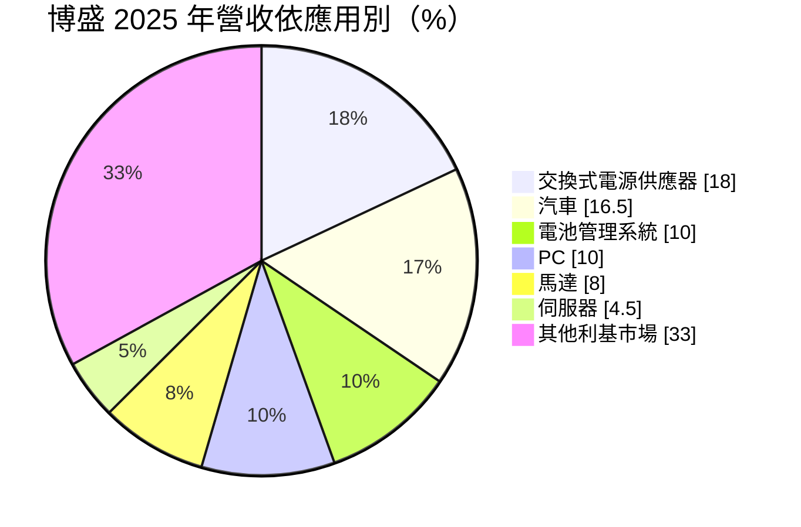
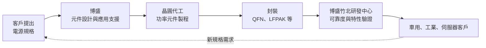
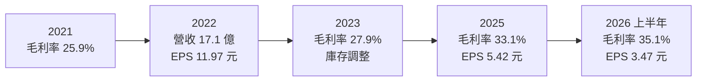
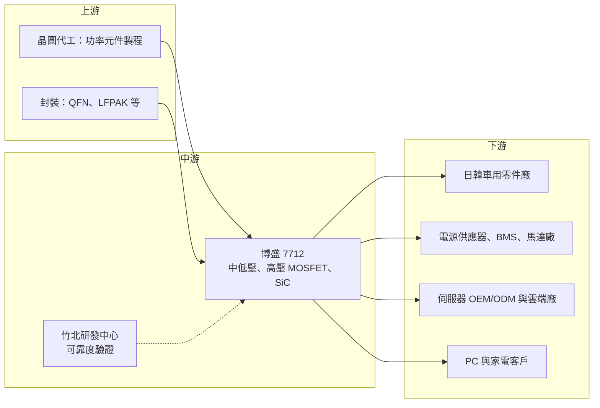

# 7712 博盛半導體

> 上櫃｜[[產業索引-半導體業|半導體業]]｜上市（櫃）日期 2024/12/26

# 第一章：企業模式與商業藍圖

> [!info] 撰寫說明
> 本文由 Claude 依公開資料整理，架構比照 [[2330台積電]] 的四章研究，資料截至 2026-10-08。財務數字來源：櫃買中心開放資料快照（基本資料、2026 年第二季資產負債與綜合損益）、Goodinfo 年度經營績效與股利政策、富果法說會備忘錄（2026 年 3 月）、數位時代、優分析；產業描述為整理性內容，尚未逐條比對原始文件。#待校對

在評估單一個股的長期投資價值時，首要步驟是拆解企業的底層獲利邏輯。本章針對博盛半導體（股票代號：7712，以下簡稱博盛）的商業模式進行定性分析，說明一家年營收十多億元的功率元件設計公司，如何以車用與日本市場建立差異化。

## 一、核心定位：功率 MOSFET 的設計與應用服務公司

博盛成立於 2014 年，總部位於新竹竹北，2024 年 12 月由興櫃轉上櫃，董事長為孟祥集。依數位時代報導，博盛以功率場效電晶體（[[MOSFET]]）為核心，從事設計開發、應用服務與銷售，產品包括消費性中低壓 MOSFET、工業用高壓元件、超接面（[[Super Junction]]）元件，並投入氮化鎵（[[GaN]]）與碳化矽（[[SiC]]）等第三代半導體。

功率 MOSFET 是電子產品中負責「開關電流」的元件。從手機充電器、筆電、電動車、伺服器電源到馬達，只要有電能轉換，就需要 MOSFET。它的技術重點不在於縮小線寬，而在於降低導通電阻（電流通過時的損耗）、提高耐壓與散熱能力，因此大多使用成熟的 8 吋或 6 吋晶圓製程，搭配特殊的元件結構與封裝。

博盛是 [[Fabless]] 公司，自己設計元件結構，再委託晶圓代工與封裝廠生產（合作廠商名稱未查得）。依富果整理，它與上下游供應鏈維持逾十年的合作關係。

## 二、終端應用板塊：分散的應用組合

依富果整理的 2026 年 3 月法說會資料，2025 年營收依應用別如下：

註：「其他利基市場」約 33% 由各項比重推算，來源未直接列出。

* **汽車：** 應用於車頭燈、儀表板、空調、無線充電與車用馬達，主要客戶是日本與韓國一線車用零件廠。富果整理指出，累計正式車規產品銷售超過 1.5 億顆，數位時代報導 2022 年完成車規產品量產。車用是博盛毛利率較高、客戶黏著度最強的板塊。
* **交換式電源供應器（SMPS）與電池管理系統（BMS）：** 用於各類電源轉換器與電池保護電路，是中低壓 MOSFET 最大的應用市場。
* **PC 與伺服器：** 用於主機板 DC-DC 轉換與備援電池模組（[[BBU]]）。2025 年 10 月博盛發表台灣首款自研熱插拔 MOSFET（[[Hot Swap]]），鎖定 AI 伺服器 48V 電源架構。
* **地區分布：** 2025 年海外（台灣與中國以外）營收占 35%，其中日本占 22.2%（2024 年為 15.4%）。公司目標將海外占比提高到 50% 以上，重點是日本、韓國、印度與歐美。

## 三、資本轉化邏輯：設計加驗證的應用服務

功率 MOSFET 產業中，大部分台灣設計公司以「規格對規格」的方式取代國際品牌，價格是主要競爭手段。博盛的差異在於強調「應用服務」：它在 2025 年底啟用竹北研發中心，依優分析報導，機台投資約 1 億元，配置 SEM、3D X-ray 等檢測設備與恆溫恆濕倉儲，可以替客戶提供可靠度與特性報告。對日本與韓國車用客戶來說，供應商能否提供完整的驗證數據，比單價更重要。

博盛的資本需求主要在研發人力、驗證設備與存貨。富果整理指出，2025 年資本支出約 2.7 億元，主要用於竹北研發中心，這是公司成立以來較大的一筆固定資產投資。

## 四、企業長期藍圖

* **產品全球化：** 把海外營收比重提高到 50% 以上，以日本為核心，延伸到韓國、印度與歐美。日本市場除車用外，已切入家電、衛浴、半導體設備等客戶。
* **聚焦高階應用：** 公司把汽車電子視為 2026 至 2028 年的營收基石，並以 AI 伺服器的散熱、BBU、DC-DC 與熱插拔應用作為第二成長來源。
* **第三代半導體：** SiC MOSFET 1200V 與 650V 產品已就緒，目標鎖定 AI 伺服器 800V 高壓直流（[[HVDC]]）架構。這是博盛從中低壓走向高壓、高功率市場的長期布局。

# 第二章：護城河深度與競爭優勢

本章分析博盛在功率 MOSFET 這個競爭者眾多的市場中，如何建立優勢，以及這些優勢能守住多少。

## 一、護城河的核心組成要素

* **車規驗證與日韓客戶關係：** 車用 MOSFET 要通過 [[AEC-Q101]] 等車規認證，並經過車用零件廠的長期驗證。博盛累計超過 1.5 億顆車規產品出貨，代表它已經通過日韓一線客戶的品質門檻，這種信任需要多年累積。
* **完整的設計到驗證能力：** 富果整理指出，管理層認為博盛具備設計、驗證到可靠度測試的完整能力，是相較台灣同業的「隱形優勢」。研發中心的設立，讓它可以在台灣直接完成客戶要求的可靠度報告。
* **應用與地區分散：** 沒有任何單一應用超過兩成，地區上也分散到日本與其他海外市場，降低單一市場景氣的衝擊。

## 二、全球主要競爭對手格局

| 對手 | 定位 | 對博盛的威脅 |
|---|---|---|
| 英飛凌（Infineon）、安森美（onsemi） | 全球功率半導體龍頭，具自有晶圓廠 | 主導車用與伺服器高階市場，具規模與品牌優勢 |
| 日系功率元件廠（如東芝、羅姆） | 日本本土供應商 | 在博盛最重要的日本市場直接競爭 |
| [[5299杰力]]、[[8261富鼎]]、[[6435大中]] | 台灣 MOSFET 設計公司 | 在 PC、電源與消費性市場以價格競爭 |
| 中國功率元件廠 | 受中國在地化政策支持 | 在中國市場以低價搶單，壓低中低壓產品報價 |

註：上表對手為產業常見的競爭者類型，來源未逐一點名，屬整理性推估。

## 三、優勢轉化：哪些市場守得住、哪些守不住

* **守得住：** 日韓車用與日本工業客戶。這些客戶重視驗證與長期供貨，一旦導入就不易更換，是博盛毛利率的支柱。
* **守不住：** PC 與一般消費性電源的報價。這類市場產品同質性高，台灣與中國同業眾多，價格是主要競爭手段。富果整理也提到功率半導體世代更替週期已縮短至一年內，產品的獲利期間變短。
* **觀察重點：** 熱插拔 MOSFET 與 SiC 產品能否打進 AI 伺服器電源供應鏈；日本營收占比能否持續提升；以及印度等新市場的競爭是否壓縮毛利率。

# 第三章：財務體質與盈利規模

資料日期：2026-10-08。數字取自櫃買中心開放資料、Goodinfo 年度經營績效與股利政策、富果法說會備忘錄，表格是撰寫當時的快照；最新月營收、毛利率、累計 EPS 由自動排程寫在本筆記的屬性欄位（月營收、毛利率、累計EPS 等）。#待校對

財務報表是檢驗護城河是否真實存在的最終標準。本章用多年度三率、ROE、現金流與資本報酬，檢視博盛的獲利品質。

## 一、獲利能力的基石：三率

| 年度 | 營收（新台幣） | [[毛利率]] | [[營業利益率]] | EPS（元） | [[ROE]] |
|---|---|---|---|---|---|
| 2021 | 13.6 億 | 25.9% | 17.0% | 8.40 | 42.1% |
| 2022 | 17.1 億 | 30.3% | 17.3% | 11.97 | 43.5% |
| 2023 | 13.3 億 | 27.9% | 14.8% | 4.47 | 13.6% |
| 2024 | 14.0 億 | 34.5% | 18.2% | 8.39 | 17.1% |
| 2025 | 13.2 億 | 33.1% | 16.1% | 5.42 | 9.4% |
| 2026 上半年 | 7.58 億 | 35.1% | 17.0% | 3.47 | 未查得 |

註：2026 上半年取自櫃買中心開放資料，毛利率與營業利益率以其營業毛利、營業利益除以營收推算。

* **[[毛利率]]：** 毛利率由 2021 年的 25.9% 提升到 2024 年以後的 33% 至 35%，這是博盛過去五年最重要的變化。數位時代與富果的資料都顯示，車用與日本客戶比重提高，是毛利率結構性上升的主因。
* **[[營業利益率]]：** 長期穩定在 15% 到 18%。毛利率提升的效益，有一部分被研發中心、海外業務拓展等費用抵銷。
* **匯率：** 富果整理指出約 80% 的收支以外幣計價，2025 年營收以台幣計年減 6%、以美元計僅年減 3%，差異主要來自匯率。
* **長期指標：** 2021 至 2025 年營收年複合成長率約 -0.7%（推算），營收規模停滯在 13 至 17 億元；近 5 年平均 ROE 約 25.1%（推算），但 2021 至 2022 年的高 ROE 是在較小股本下達成，2023 年後約在 9% 到 17% 之間。

## 二、[[ROE]]：資本效率

博盛的 ROE 由 2022 年的 43.5% 降到 2025 年的 9.4%，主要原因有二：一是 2022 年缺貨高峰後獲利回落；二是興櫃與上櫃期間股本由 1.91 億元增加到 3.26 億元，權益大幅擴大。2026 年第二季底股東權益約 18.9 億元，負債約 8.8 億元，負債比約 32%。富果整理指出流動比率由 2.9 倍提高到 3.7 倍，財務結構穩健。

## 三、資本支出與自由現金流

* **[[CapEx]]：** 2025 年資本支出約 2.7 億元，主要用於竹北研發中心，屬一次性的大型投資。研發中心尚有約 300 坪土地可供日後擴充。
* **[[自由現金流]]：** 2025 年底現金約 8.65 億元，較 2024 年底的 12.29 億元減少，主要反映研發中心投資與股利發放（富果）。多年度自由現金流資料未查得。研發中心完成後，資本支出預期回到較低水準（推估）。
* **股利：** 依 Goodinfo，2022 年度配發股票股利 1.46 元，2023 年度現金股利 1.5 元，2024 與 2025 年度各配發現金股利 4 元。對照 EPS，2024 年度配發率約 48%、2025 年度約 74%（推算），上櫃後逐步走向較穩定的現金股利政策。

## 四、[[ROIC]] 與 [[WACC]]：價值創造利差

* **ROIC（推算）：** 以 2025 年營業利益約 2.13 億元（營收 13.2 億 × 16.1%）× (1 − 20%) ≈ 1.70 億元作為稅後營業利益；投入資本以 2026 年第二季股東權益 18.85 億元加非流動負債 2.60 億元（作為有息負債的上限近似，細項未查得）≈ 21.45 億元。ROIC ≈ 7.9%。以 2026 年上半年營業利益 1.29 億元年化計算，ROIC 約 9.6%。
* **WACC（推算）：** 無風險利率取約 1.75%，市場風險溢酬 6%，β 取功率半導體同業常見值 1.2（未查得本身的 β），股東權益成本約 8.95%。假設負債稅前成本 2.5%、稅後 2.0%，以帳面價值計負債權重約 12%，WACC 約 8.1%；以市值計負債權重更低，WACC 約 8.7%。
* **解讀：** ROIC 約 8% 到 10%，與 8% 到 9% 的 WACC 相近，代表博盛目前大致賺回資金成本，但利差不大。若車用與伺服器產品能讓營業利益率由 16% 提升到 20% 以上，ROIC 才會明顯高於 WACC；反之若營收規模持續停滯，新研發中心的折舊會讓資本效率進一步下降。

# 第四章：總體風險與地緣政治

任何企業都無法脫離宏觀環境獨立存在。本章分析博盛長期必須面對的地緣政治、產業週期與營運風險。

## 一、地緣政治

* **美中貿易戰：** 功率元件是中國重點扶植的產業，中國客戶可能優先採購本土產品。博盛把海外營收比重提高到 50% 以上的策略，本質上就是降低對兩岸市場的依賴。
* **日本市場的機會與風險：** 日本車廠與工業客戶尋求「中國以外」的供應來源，是博盛在日本成長的背景。若日本客戶政策改變，或日系本土供應商大幅擴產，這個優勢可能縮小。

## 二、產業週期與市場結構

* **功率半導體的庫存週期：** 2022 年缺貨時營收衝上 17.1 億元，2023 年庫存調整又跌回 13.3 億元，顯示功率元件受下游庫存影響很大。
* **晶圓代工成本：** 富果整理指出，原物料與晶圓代工報價上漲，公司需要與客戶協商價格。作為 Fabless 公司，博盛對晶圓成本的議價能力有限。
* **產品世代縮短：** 功率半導體世代更替週期已縮短至一年內，研發投入需要更快回收。

## 三、營運環境的隱性風險

* **匯率：** 約 80% 收支以外幣計價，新台幣升值會壓縮以台幣計的營收與毛利率。
* **規模劣勢：** 與國際龍頭相比，博盛的營收規模小，產能取得與議價能力有限；在產能吃緊時，可能被排在大客戶之後。管理層雖表示不預期被排擠，但這是長期需要追蹤的風險。
* **新市場競爭：** 印度市場競爭激烈，海外擴張可能需要以價格換取市占。

## 四、科技或法規演進

功率半導體正處於材料轉換期：在高電壓、高頻率的應用（電動車、AI 伺服器 800V 電源、太陽能）中，SiC 與 GaN 逐步取代傳統矽基 MOSFET。這些新材料的晶圓與製程門檻高，國際大廠多以自有晶圓廠垂直整合。博盛雖已推出 SiC 產品，但以 Fabless 模式能否在第三代半導體取得穩定的晶圓供應與成本競爭力，是長期最大的技術課題。另一方面，伺服器電源規格從 12V 走向 48V 甚至 800V 直流，也會改變所需 MOSFET 的耐壓與封裝規格。

# 專有名詞解析

## 半導體

- **[[MOSFET]]**：金屬氧化物半導體場效電晶體，功率電子中負責開關電流的元件，幾乎所有電源轉換電路都需要。
- **[[Super Junction]]**：超接面 MOSFET，以特殊結構在高耐壓下維持低導通電阻，用於高壓電源。
- **[[SiC]]**：碳化矽，第三代半導體材料，耐高壓、耐高溫，用於電動車與高壓電源。
- **[[GaN]]**：氮化鎵，第三代半導體材料，開關速度快、體積小，用於快充與資料中心電源。
- **[[導通電阻]]**：電流通過元件時的電阻，數值越低代表電能損耗越小，是功率 MOSFET 最重要的規格之一。
- **[[Fabless]]**：無晶圓廠的 IC 設計公司，只負責設計，製造交給晶圓代工廠。

## 應用

- **[[AEC-Q101]]**：汽車電子協會針對離散元件（如 MOSFET）制定的可靠度測試標準。
- **[[BBU]]**：備援電池模組，資料中心在斷電時提供短時間電力，避免伺服器資料遺失。
- **[[Hot Swap]]**：熱插拔，在系統不關機的情況下更換模組，相關 MOSFET 需承受插拔瞬間的突波電流。
- **[[HVDC]]**：高壓直流供電，AI 資料中心為降低傳輸損耗而採用的電源架構，例如 800V 直流。

## 金融

- **[[ROIC]]**：投入資本報酬率，衡量公司每投入一元營運資本能產生多少稅後營業利益。
- **[[WACC]]**：加權平均資金成本，股東與債權人要求報酬的加權平均，是 ROIC 要超越的門檻。

# 核心供應鏈

## 1. 上游：晶圓代工與封裝
- 功率元件晶圓代工與封裝廠（具體名稱未查得，公司表示合作逾十年）

## 2. 中游：博盛本身
- 竹北研發中心（2025 年 10 月啟用）

## 3. 下游：客戶
- 日本與韓國一線車用零件廠（未具名）
- 伺服器 OEM/ODM、雲端大廠與控制器合作夥伴（未具名）
- 日本家電、衛浴、半導體設備客戶；韓國大型集團客戶

## 4. 同業
- 英飛凌、安森美、日系功率元件廠、[[5299杰力]]、[[8261富鼎]]、[[6435大中]]

## 最新新聞
<!-- news:start -->
<!-- news:end -->

## 相關連結
- [公開資訊觀測站](https://mopsov.twse.com.tw/mops/web/t05st03?step=1&firstin=1&co_id=7712)
- [Goodinfo](https://goodinfo.tw/tw/StockDetail.asp?STOCK_ID=7712)
- [Yahoo 股市](https://tw.stock.yahoo.com/quote/7712)
- [鉅亨網新聞](https://www.cnyes.com/twstock/7712/news)
