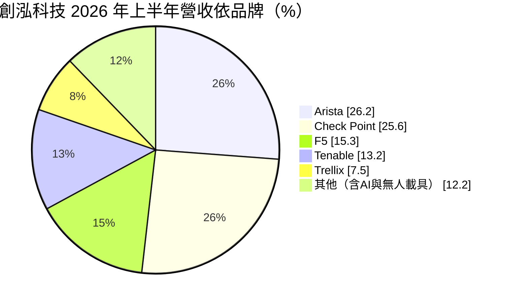
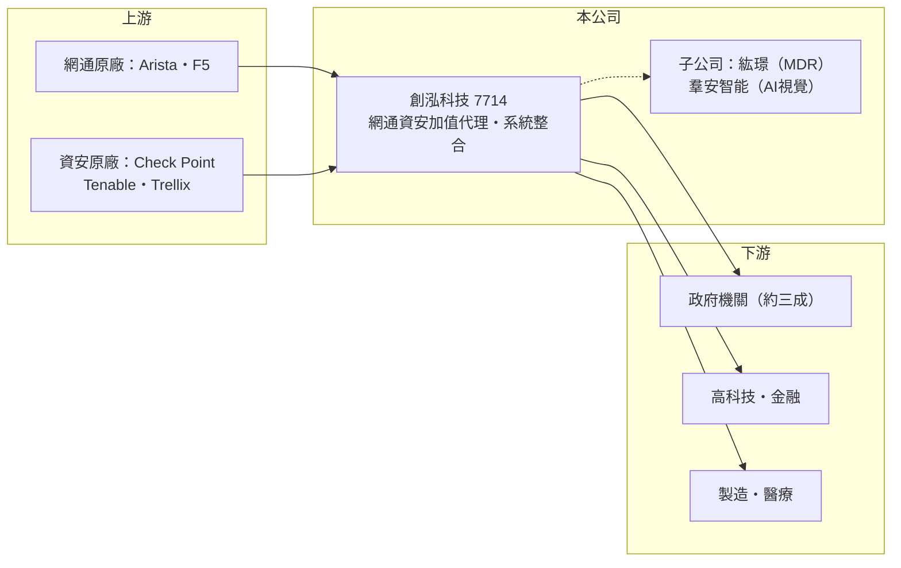

# 7714 創泓科技

> 上櫃｜[[產業索引-數位雲端|數位雲端]]｜上市（櫃）日期 2025/01/15

# 第一章：企業模式與商業藍圖

> [!info] 撰寫說明
> 精簡版，由 Claude 依公開資料整理，架構比照 [[2330台積電]]，資料截至 2026-10-08。來源：櫃買中心開放資料（基本資料、2026 年上半年綜合損益與資產負債、每月營收、本益比殖利率）、Goodinfo 年度經營績效（2020 至 2025 年）、富果研究 2026 年 9 月法說會摘要（2026 年上半年品牌別營收、子公司與策略）、優分析與經濟日報報導標題。#待校對

創泓科技成立於 2010 年，定位為網路與[[資安]]的加值解決方案供應商，代理 Arista、Check Point、F5、Tenable、Trellix 等國際品牌，並搭配自有技術服務替政府與企業建置網路與資安架構，2025 年 1 月上櫃。

- **核心業務：** 創泓的商業模式是「國際原廠產品加上規劃、導入與維運服務」。資安與高階網通設備技術門檻高，客戶需要有人協助設計架構、設定政策與處理事件，創泓的價值在這些加值服務，而不只是轉賣硬體。公司強調自己不是傳統[[代理商]]，而是一站式方案供應商。
- **營收結構：** 依 2026 年上半年法說會資料，Arista 占 26.2%、Check Point 占 25.6%、F5 占 15.3%、Tenable 占 13.2%、Trellix 占 7.5%，其他（含 AI 與無人載具相關）占 12.2%，前五大品牌合計約 88%。客戶中政府機關約占三成，其餘為高科技、金融、製造與醫療產業。

- **營運據點：** 總部位於台北市內湖區，以國內市場為主。子公司紘璟科技（CLOUDFORCE，持股 100%）提供資安監控代管（[[MDR]]）服務，羣安智能（AIFORCE）做 AI 視覺系統，另投資翔隆航太（無人機）、易達通（通訊功率放大器）與天淵實業（紅外線熱影像模組）。
- **長期方向：** 公司以「創泓三稜盾」整合資安、AI 與無人載具三大領域，鎖定[[後量子密碼]]（PQC）遷移、AI 資安治理與實體 AI 應用。資安本業提供穩定現金流，AI 視覺與無人載具則是第二成長曲線，2026 年已開始貢獻營收。

# 第二章：護城河深度與競爭優勢

創泓的護城河來自原廠授權、政府與企業的長期維運關係，以及技術團隊的專業認證，屬窄護城河。

- **競爭優勢：** 資安與資料中心網通產品需要原廠認證的工程師才能導入與維護，創泓同時握有多個一線品牌，能替客戶整合防火牆、應用交付、弱點管理與端點防護，提供一站式方案。政府機關占三成，受資安法規驅動，需求相對穩定，且導入後每年有續約與維護收入。
- **主要對手：** 國內同業包括 [[3029零壹]]、[[6112邁達特]]、[[2480敦陽科]]、[[6214精誠]] 等代理與系統整合商，以及 [[7765中華資安]]、[[6690安碁資訊]] 等資安服務公司。同一原廠通常有多家代理商，價格競爭不可避免。
- **觀察重點：** 前五大品牌占近九成，原廠政策是最大變數；長期要看自有的 MDR 監控服務、AI 視覺與無人載具能否提高比重，降低對代理品牌的依賴，並觀察毛利率能否維持在一成八至兩成以上。

# 第三章：財務體質與盈利規模

資料日期：2026-10-08，表格是撰寫當時的快照；最新月營收、毛利率、累計 EPS 由自動排程寫在本筆記的屬性欄位（月營收、毛利率、累計EPS 等）。#待校對

創泓過去五年營收成長超過三倍，ROE 長期在三成以上，是高周轉、高資本效率的代理型公司。

| 年度 | 營收（億元） | [[毛利率]] | [[營業利益率]] | EPS（元） | [[ROE]] |
|---|---|---|---|---|---|
| 2021 | 5.59 | 18.2% | 4.19% | 1.81 | 12.7% |
| 2022 | 10.7 | 17.8% | 8.14% | 5.53 | 36.5% |
| 2023 | 11.3 | 21.0% | 10.4% | 6.28 | 43.1% |
| 2024 | 12.4 | 22.1% | 9.76% | 5.07 | 33.8% |
| 2025 | 18.0 | 19.1% | 8.98% | 6.33 | 30.8% |
| 2026 上半年 | 10.3 | 18.0% | 8.67% | 3.98 | 未查得 |

註：2021 至 2025 年取自 Goodinfo，2026 年上半年取自櫃買中心開放資料（營業毛利 1.85 億元、營業利益 0.89 億元）。

- **長期指標：** 2020 至 2025 年營收從 5.61 億元成長到 18 億元，年複合成長率約 26%（推算）；法說會資料顯示 2022 至 2025 年淨利年複合成長率 28.6%。2021 至 2025 年平均 ROE 約 31%（推算）。最近一次現金股利每股 5 元，以 2025 年 EPS 6.33 元計算配息率約 79%。
- **[[ROIC]] 與 [[WACC]]：** 2025 年營業利益約 1.62 億元（18 億元 × 8.98%），稅後營業利益約 1.29 億元；投入資本約 6.4 億元（2026 年 6 月底權益總計 5.85 億元，加上有息負債推估約 0.5 億元，流動負債 5.6 億元多為應付帳款與合約負債），ROIC 約 20%（推算）。WACC 約 7.5%（推算：無風險利率 1.75%、市場風險溢酬 6%、β 取資訊服務同業常見值 1.0，權益成本 7.75%；負債成本 2.5%、稅率 20%、負債比重約 8%）。ROIC 高於 WACC 超過 10 個百分點，代表模式長期創造價值。
- **財務特色：** 2026 年 6 月底負債比率約 49%，以營運性負債為主；每股淨值 27.57 元。2024 年營業費用率由 12.3% 降到 9.3%，顯示營收擴大後費用攤提的規模效益。

# 第四章：總體風險與地緣政治

創泓的風險集中在原廠依賴、政府預算與新事業的執行。

- **產業週期：** 資安支出受法規與威脅事件驅動，長期向上；但高階網通設備（如 Arista 資料中心交換器）與大型標案的認列時點不固定，年度營收可能出現跳動。
- **營運風險：** 前五大品牌占營收近九成，任何一家原廠若更換代理商、增加代理家數或改為直接銷售，都會明顯影響營收與毛利。政府客戶約占三成，預算編列與標案時程也會影響收入節奏。
- **其他風險：** 無人載具、紅外線熱影像與通訊元件屬於新領域，需要資本與時間，投資可能出現減損；代理產品以美元計價，匯率會影響進貨成本；資安人才短缺，人力成本持續上升。

# 專有名詞解析

## 應用

- **[[資安]]**：資訊安全，保護系統、網路與資料不被入侵、竄改或外洩的技術與服務。
- **[[MDR]]**：託管式偵測與回應服務，由資安業者 24 小時監控客戶環境並協助處理攻擊事件。

## 金融

- **[[ROIC]]**：投入資本報酬率，稅後營業利益除以股東權益加有息負債，衡量本業運用資本的效率。
- **[[WACC]]**：加權平均資金成本，股東與債權人要求報酬率的加權平均，是 ROIC 要超越的門檻。

## 產業

- **[[代理商]]**：取得原廠授權在特定市場銷售產品或服務的業者，利潤來自價差、回饋與加值服務。
- **[[後量子密碼]]**：能抵抗未來量子電腦破解的新一代加密演算法，美國 NIST 已訂出遷移標準與時程。

# 核心供應鏈

- 上游：Arista、Check Point、F5、Tenable、Trellix 等國際網通與資安原廠。
- 下游／客戶：政府機關約占三成，其餘為高科技、金融、製造與醫療業者（個別客戶未查得）。
- 同業：[[3029零壹]]、[[6112邁達特]]、[[2480敦陽科]]、[[6214精誠]]、[[7765中華資安]]、[[6690安碁資訊]]。

## 最新新聞
<!-- news:start -->
<!-- news:end -->

## 相關連結
- [公開資訊觀測站](https://mopsov.twse.com.tw/mops/web/t05st03?step=1&firstin=1&co_id=7714)
- [Goodinfo](https://goodinfo.tw/tw/StockDetail.asp?STOCK_ID=7714)
- [Yahoo 股市](https://tw.stock.yahoo.com/quote/7714)
- [鉅亨網新聞](https://www.cnyes.com/twstock/7714/news)
