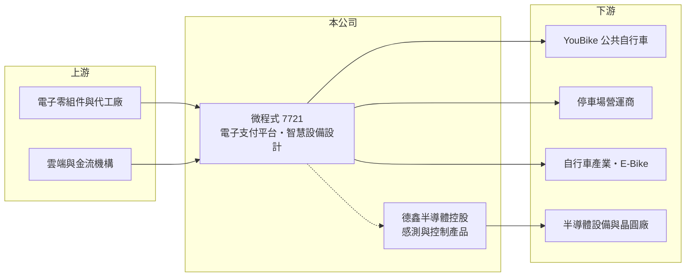

# 7721 微程式

> 上市｜[[產業索引-數位雲端|數位雲端]]｜上市（櫃）日期 2025/07/29

# 第一章：企業模式與商業藍圖

> [!info] 撰寫說明
> 精簡版，由 Claude 依公開資料整理，架構比照 [[2330台積電]]，資料截至 2026-10-08。來源：證交所開放資料（基本資料、2026 年上半年綜合損益、營益分析、資產負債、股利、每月營收）、Goodinfo 年度經營績效（2021 至 2025 年）、富果研究 2025 年 9 月法說會摘要（業務結構、策略股東、德鑫半導體）、ETtoday 上市前報導標題。#待校對

微程式資訊成立於 1995 年，總部在台中，是以設計服務為主的輕資產公司，核心業務是 YouBike、停車場等場域的電子支付平台與智慧設備，另外發展半導體感測與控制產品，2025 年 7 月上市。

- **核心業務：** 微程式自稱設計服務公司（Design House），專注軟硬體研發與系統設計，生產委外。最主要的業務是[[AIoT]]智慧服務：替公共自行車、停車場與自行車產業提供電子支付平台與終端設備，依富果整理已連結超過 20 萬個終端設備，停車場管理平台市占率約 18.7%。
- **營收結構：** 業務分為兩塊。AIoT 智慧服務是營收主力，包括訂閱制的電子支付平台維運、月租與分潤，以及 YouBike 相關硬體、停車場自動化設備與電輔自行車三電整合系統；半導體解決方案占營收不到 10%。服務收入約占總營收四成，屬於[[經常性收入]]，足以支應研發與管銷費用。
- **營運據點：** 總部在台中市西屯區，客戶與場域以台灣的大眾運輸、共享交通、停車場營運與自行車產業為主。策略股東包括 [[9921巨大]]（YouBike 相關）與 [[3680家登]]（半導體），這兩層關係分別支撐了兩條業務線。
- **長期方向：** 公司計畫把電子支付與 YouBike 經驗複製到海外，原規劃 2025 年第四季在北美城市試點；半導體方面，2023 年與家登等公司合資成立德鑫半導體控股，發展 EUV 光罩檢測儀、晶圓搬運 Smart Blade、RFID 辨識與[[質量流量控制器]]（MFC），走進口替代路線。

# 第二章：護城河深度與競爭優勢

微程式的護城河來自場域的長期維運合約與電子支付平台的網路規模，屬窄護城河，但客戶與場域相對集中。

- **競爭優勢：** 電子支付平台一旦接上公共自行車與停車場的數萬個終端，後續的維運、分潤與設備汰換都很難換人，形成長期[[轉換成本]]。與巨大、家登的策略股東關係，讓微程式在 YouBike 生態與半導體設備兩個領域都有穩定的合作入口。
- **主要對手：** 停車場與票證支付領域的對手包括國內停車設備商、票證公司與系統整合商；半導體感測控制則面對國際設備零組件大廠。公開資料沒有點名具體競爭者，以上為產業結構推估。
- **觀察重點：** 長期要看三件事：一是服務與分潤收入能否持續成長，讓營收不再受硬體專案起伏左右；二是北美等海外試點能否轉為實際合約；三是德鑫半導體聯盟的產品能否通過晶圓廠驗證並放量。

# 第三章：財務體質與盈利規模

資料日期：2026-10-08，表格是撰寫當時的快照；最新月營收、毛利率、累計 EPS 由自動排程寫在本筆記的屬性欄位（月營收、毛利率、累計EPS 等）。#待校對

微程式的毛利率長期在五成以上，但硬體專案認列時點讓營收與獲利起伏很大，2025 年明顯回落、2026 年上半年回升。

| 年度 | 營收（億元） | [[毛利率]] | [[營業利益率]] | EPS（元） | [[ROE]] |
|---|---|---|---|---|---|
| 2021 | 4.34 | 51.8% | -10.7% | -0.93 | -8.77% |
| 2022 | 4.61 | 54.7% | 0.76% | 0.16 | 1.55% |
| 2023 | 6.78 | 52.5% | 14.7% | 2.16 | 19.5% |
| 2024 | 7.94 | 56.2% | 19.6% | 3.33 | 18.6% |
| 2025 | 5.08 | 68.2% | 6.1% | 0.55 | 2.51% |
| 2026 上半年 | 3.28 | 61.7% | 13.3% | 0.66 | 未查得 |

註：2021 至 2025 年取自 Goodinfo，2026 年上半年取自證交所營益分析與綜合損益開放資料。2025 年營收下滑而毛利率上升，推估是低毛利硬體出貨減少、高毛利服務比重提高所致，實際原因未查得。

- **長期指標：** 2021 至 2025 年營收年複合成長率約 4%（推算），近 5 年平均 ROE 約 7%（推算），波動很大。2025 年度現金股利每股 1 元，高於當年 EPS 0.55 元，代表公司以累積盈餘維持配息。2026 年 1 至 8 月累計營收年增約 38%，回到成長軌道。
- **[[ROIC]] 與 [[WACC]]：** 2025 年營業利益約 0.31 億元（5.08 億元 × 6.1%），稅後營業利益約 0.25 億元；投入資本約 14.9 億元（2026 年 6 月底股東權益 12.89 億元，加上以非流動負債約 1.9 億元推估的有息負債約 2 億元），ROIC 約 1.7%（推算）；2024 年營業利益約 1.56 億元，當年 ROIC 約 1 成（推算，上市前權益較小）。WACC 約 7.4%（推算：無風險利率 1.75%、市場風險溢酬 6%、β 取同業常見值 1.0，權益成本 7.75%；負債成本 2.5%、稅率 20%、負債比重約 13%）。2025 年 ROIC 低於 WACC，2023 至 2024 年則高於，顯示公司要靠服務規模穩定成長，才能長期維持在資金成本之上。
- **財務特色：** 2026 年 6 月底負債比率約 24%，每股淨值 23.28 元；生產委外、資本支出低，但上市增資後權益擴大，資本效率需要靠營收放大才能回升。

# 第四章：總體風險與地緣政治

微程式的風險在於場域集中、專案認列波動與半導體新事業的驗證門檻。

- **產業週期：** 公共自行車與停車場的建置多來自地方政府標案與營運商的設備汰換，時程受預算與招標影響，硬體營收容易出現大年與小年。
- **營運風險：** 業務高度依賴 YouBike 生態與國內停車場市場，若主要營運商調整供應商或支付方式，影響很大；海外電子支付要面對不同的金流法規與在地競爭，複製難度不低。
- **其他風險：** 半導體感測與控制產品需要通過晶圓廠的長期驗證，投入期長、成功率不確定；電子支付涉及金流與資安，系統中斷或資安事件會直接影響商譽與合約。

# 專有名詞解析

## 半導體

- **[[質量流量控制器]]**：精準控制製程氣體流量的關鍵零組件，用於蝕刻、沉積等半導體設備，英文縮寫 MFC。

## 應用

- **[[AIoT]]**：人工智慧結合物聯網，讓聯網設備蒐集資料後能自動判斷與控制。

## 金融

- **[[經常性收入]]**：訂閱、維護等每期重複發生的收入，可預測性高於一次性專案收入。
- **[[ROIC]]**：投入資本報酬率，稅後營業利益除以股東權益加有息負債，衡量本業運用資本的效率。
- **[[WACC]]**：加權平均資金成本，股東與債權人要求報酬率的加權平均，是 ROIC 要超越的門檻。

## 產業

- **[[轉換成本]]**：客戶更換供應商時要付出的時間、金錢與風險，越高代表客戶黏著度越高。

# 核心供應鏈

- 上游：電子零組件供應商與委外代工廠、金流與雲端服務業者（具體名單未查得）。
- 下游／客戶：YouBike 公共自行車系統（策略股東 [[9921巨大]]）、停車場營運商、自行車產業；半導體產品與 [[3680家登]] 合作推廣至設備與晶圓廠。
- 同業：國內停車設備與票證支付業者、半導體設備零組件業者（具體對手未查得）。

## 最新新聞
<!-- news:start -->
<!-- news:end -->

## 相關連結
- [公開資訊觀測站](https://mopsov.twse.com.tw/mops/web/t05st03?step=1&firstin=1&co_id=7721)
- [Goodinfo](https://goodinfo.tw/tw/StockDetail.asp?STOCK_ID=7721)
- [Yahoo 股市](https://tw.stock.yahoo.com/quote/7721)
- [鉅亨網新聞](https://www.cnyes.com/twstock/7721/news)
