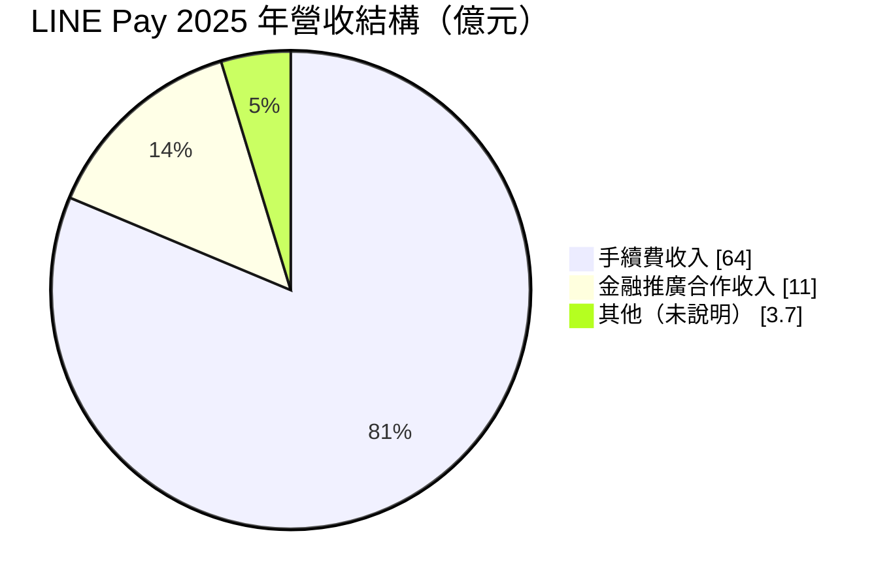
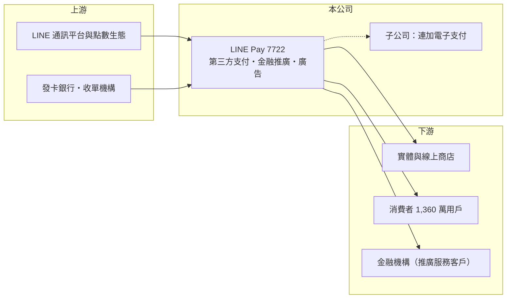

# 7722 LINEPAY

> 上市｜[[產業索引-數位雲端|數位雲端]]｜上市（櫃）日期 2024/12/05

# 第一章：企業模式與商業藍圖

> [!info] 撰寫說明
> 精簡版，由 Claude 依公開資料整理，架構比照 [[2330台積電]]，資料截至 2026-10-08。來源：證交所開放資料（基本資料、2026 年上半年綜合損益、營益分析、資產負債、股利、每月營收）、Goodinfo 年度經營績效（2020 至 2025 年）、富果研究 2026 年 3 月法說會摘要（2025 年營收結構、交易量、用戶數、電子支付子公司）、Money 錢與聯合新聞網報導標題。#待校對

連加網路（LINE Pay，以下稱 LINE Pay）成立於 2015 年，經營台灣最大的行動支付品牌之一，依附在 LINE 通訊軟體的用戶基礎上，提供[[第三方支付]]、電子支付帳戶與金融推廣服務，2024 年 12 月上市。

- **核心業務：** LINE Pay 的業務分三塊：一是支付事業，向商店收取交易手續費，2025 年 12 月起由子公司連加電子支付經營[[電子支付]]帳戶，提供儲值、轉帳與生活繳費；二是電子商務事業，與銀行發行聯名卡、經營 LINE POINTS 點數回饋與票券銷售；三是金融與廣告事業，透過平台替銀行推廣信用卡、保險與貸款，並提供數位廣告。
- **營收結構：** 依法說會資料，2025 年合併營收 78.7 億元，其中手續費收入約 64 億元、金融推廣合作收入約 11 億元，其餘約 3.7 億元未說明。手續費占八成以上，代表營收主要跟著交易量走；金融推廣與廣告是公司所說的高毛利業務與未來重點。

- **營運據點：** 總部位於台北市南港區，市場以台灣為主。2025 年交易量逾 8,680 億元、用戶數 1,360 萬；電子支付子公司開業後，至 2026 年 1 月底用戶超過 298 萬。海外方面，韓國支付據點超過 8 萬個，2026 年計畫拓展日本、新加坡與香港的藥妝、便利商店與免稅店場景。
- **長期方向：** 長期方向是從「收手續費的支付工具」走向「以支付數據為核心的金融與行銷平台」，包括擴大電子支付場景、深化發卡行合作、運用數據替金融機構導客，以及 AI 代理支付（Agent Commerce）。公司明確表示不打價格戰，而是用點數、票券與行銷服務維持手續費率。

# 第二章：護城河深度與競爭優勢

LINE Pay 的護城河來自 LINE 的用戶入口、商店與發卡銀行構成的雙邊[[網路效應]]，屬於寬度中等的護城河，但支付產業競爭者眾多。

- **競爭優勢：** 台灣 LINE 的普及率極高，LINE Pay 不需要另外說服使用者下載 App，取得用戶的成本遠低於獨立支付業者。用戶越多，商店越願意接入；商店越多，用戶越常使用，再加上 LINE POINTS 點數生態與銀行聯名卡，形成彼此強化的循環。
- **主要對手：** 行動支付對手包括街口支付、全支付、悠遊付、[[5903全家]] 等通路自有支付，以及 Apple Pay、Google Pay 等綁卡支付；金融推廣與數位廣告則與各大網路平台競爭。銀行自有 App 與台灣 Pay 也在爭取同一批消費者。
- **觀察重點：** 長期要看三件事：一是手續費率在競爭中能否守住；二是金融推廣、廣告等高毛利業務的占比能否提高；三是電子支付帳戶能否把用戶從「綁信用卡付款」轉為「存錢在帳戶裡」，這會影響長期的資金沉澱與交叉銷售能力。

# 第三章：財務體質與盈利規模

資料日期：2026-10-08，表格是撰寫當時的快照；最新月營收、毛利率、累計 EPS 由自動排程寫在本筆記的屬性欄位（月營收、毛利率、累計EPS 等）。#待校對

LINE Pay 營收五年成長近七倍，但毛利率約三成、營業利益率個位數，且帳上權益龐大，使 ROE 偏低。

| 年度 | 營收（億元） | [[毛利率]] | [[營業利益率]] | EPS（元） | [[ROE]] |
|---|---|---|---|---|---|
| 2021 | 20.9 | 33.1% | 5.61% | 2.68 | 3.26% |
| 2022 | 38.6 | 33.9% | 13.4% | 8.04 | 9.55% |
| 2023 | 49.3 | 30.9% | 11.2% | 8.09 | 9.58% |
| 2024 | 63.0 | 31.5% | 11.8% | 10.67 | 8.25% |
| 2025 | 78.7 | 32.7% | 7.47% | 7.46 | 4.81% |
| 2026 上半年 | 42.3 | 24.3% | 6.41% | 4.35 | 未查得 |

註：2021 至 2025 年取自 Goodinfo，2026 年上半年取自證交所營益分析與綜合損益開放資料。2025 年營業利益率下滑，法說會指出主因是電子支付初期建置與營運費用，約占整體費用的 28%。

- **長期指標：** 2020 至 2025 年營收從 11.5 億元成長到 78.7 億元，年複合成長率約 47%（推算），2020 年仍為虧損。2021 至 2025 年平均 ROE 約 7%（推算）。2025 年度配發現金股利每股 1.5 元與股票股利 0.5 元，以 EPS 7.46 元計算現金配息率約 20%，公司保留大部分盈餘支應電子支付與海外擴張。
- **[[ROIC]] 與 [[WACC]]：** 2025 年營業利益約 5.9 億元（78.7 億元 × 7.47%），稅後營業利益約 4.7 億元；2026 年 6 月底股東權益 110 億元，負債 143 億元主要是代收付款項與用戶儲值等營運性負債，有息負債視為接近零，以全部權益計算的 ROIC 約 4.3%（推算）。2025 年底帳上現金約 96 億元，若扣除現金，本業實際使用的資本很小，ROIC 會大幅提高。WACC 約 7.75%（推算：無風險利率 1.75%、市場風險溢酬 6%、β 取金融科技常見值 1.0，無負債）。以帳面權益計算，ROIC 低於 WACC，主因是大量現金尚未投入高報酬用途；本業本身創造價值，但資本配置效率是長期觀察重點。
- **財務特色：** 2026 年 6 月底總資產 253 億元、負債比率約 57%，負債多為代收付與儲值款項；每股淨值 161.85 元。支付業的特性是先收款、後撥款給商店，現金充沛，但部分資金屬於信託或受監管的用戶款項，不能自由運用。

# 第四章：總體風險與地緣政治

LINE Pay 的風險來自手續費率競爭、金融監理與母集團策略。

- **產業週期：** 支付交易量跟著消費景氣與電商成長走，長期隨無現金化提升；但手續費收入與交易量高度連動，消費轉弱時營收成長會放緩。點數回饋與行銷補貼若加碼，也會侵蝕毛利率。
- **營運風險：** 手續費占營收八成以上，若同業以低費率搶商店，或發卡銀行調整回饋與合作條件，獲利會受壓。電子支付初期費用高，用戶規模要放大到一定程度才能回收投入。
- **其他風險：** 電子支付受金管會嚴格監理，用戶資金保管、洗錢防制與資安要求持續提高；品牌與技術依附 LINE 母集團，母集團的策略調整、授權條件或資安事件都會直接影響公司。

# 專有名詞解析

## 金融

- **[[第三方支付]]**：由支付業者代收代付買賣雙方的款項，商店不必自建金流，常見於線上購物與行動支付。
- **[[電子支付]]**：經金管會許可、可儲值、轉帳與付款的電子帳戶服務，比第三方支付多了儲值與轉帳功能。
- **[[ROIC]]**：投入資本報酬率，稅後營業利益除以股東權益加有息負債，衡量本業運用資本的效率。
- **[[WACC]]**：加權平均資金成本，股東與債權人要求報酬率的加權平均，是 ROIC 要超越的門檻。

## 產業

- **[[網路效應]]**：使用者越多，產品對每位使用者的價值越高，進而吸引更多使用者的正向循環。

# 核心供應鏈

- 上游：LINE 通訊平台與 LINE POINTS 點數生態，以及合作的發卡銀行與收單機構（個別合作銀行本次未查得）。
- 下游／客戶：實體與線上商店、消費者，以及委託推廣信用卡、保險與貸款的金融機構。
- 同業：街口支付、全支付、悠遊付、Apple Pay、Google Pay 等行動支付業者。

## 最新新聞
<!-- news:start -->
<!-- news:end -->

## 相關連結
- [公開資訊觀測站](https://mopsov.twse.com.tw/mops/web/t05st03?step=1&firstin=1&co_id=7722)
- [Goodinfo](https://goodinfo.tw/tw/StockDetail.asp?STOCK_ID=7722)
- [Yahoo 股市](https://tw.stock.yahoo.com/quote/7722)
- [鉅亨網新聞](https://www.cnyes.com/twstock/7722/news)
