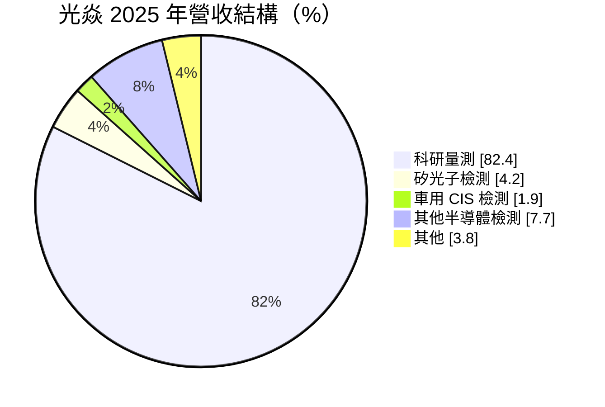
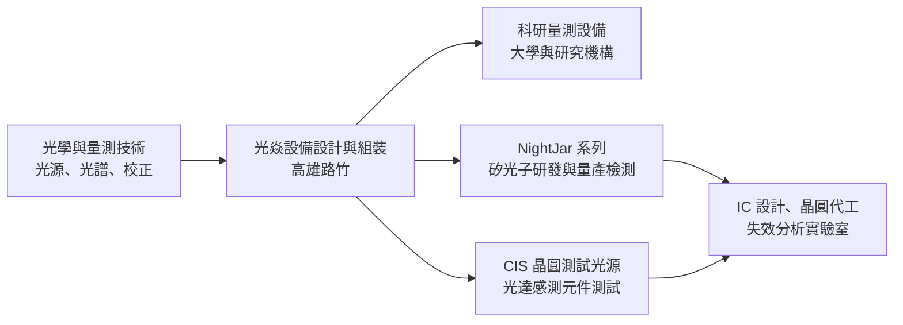
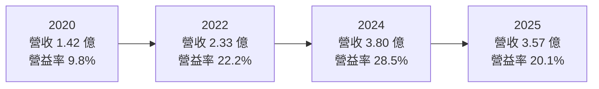
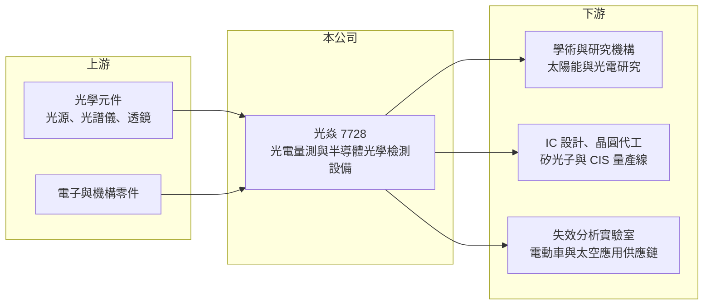

# 7728 光焱科技

> 上櫃｜[[產業索引-其他電子業|其他電子業]]｜上市（櫃）日期 2025/03/06

# 第一章：企業模式與商業藍圖

> [!info] 撰寫說明
> 本文由 Claude 依公開資料整理，架構比照 [[2330台積電]] 的四章研究，資料截至 2026-10-08。財務數字來源：Goodinfo 台灣股市資訊網年度經營績效、富果研究法說會整理（2026 年 9 月）、今周刊報導（2025 年 2 月）、櫃買中心開放資料（本筆記 _data 快照）；產業描述為整理性內容，尚未逐條比對原始文件。#待校對

在評估單一個股的長期投資價值時，首要步驟是拆解企業的底層獲利邏輯。本章說明光焱科技（股票代號：7728，以下簡稱光焱）如何從太陽能電池量測的小眾設備商，逐步轉向半導體光學檢測，以及這個轉型對它長期成長的意義。

## 一、核心定位：光學檢測與量測設備的專業廠商

光焱成立於 2009 年，總部位於高雄路竹，2025 年 3 月在櫃買中心掛牌。依今周刊報導，總經理廖華賢是清華大學博士，在實驗室學會檢測太陽能電池發電效率的方法後，與擔任董事長的太太柯歷亞向親友借款創業。公司最早的產品是太陽能電池效率量測設備，主打價格低於德國進口儀器、量測速度更快。

2012 年台灣太陽能產業萎縮，光焱營收一度腰斬，被迫轉向全球的大學與研究機構市場，並把設備改成可依不同尺寸樣品調整的模組化設計。這段經歷形成了光焱今天的兩大營收引擎：

* **科研量測：** 銷售給全球學術與企業研發單位的光電量測設備，包括太陽能電池等光電元件的效率量測。這是光焱的基本盤，客戶分散、單價不高，但需求穩定。
* **半導體檢測：** 2014 年一家中國 [[CIS]]（影像感測器）公司找上門，讓光焱進入半導體市場。之後陸續發展出 CIS 晶圓級測試光源、光達感測元件測試，以及[[矽光子]]元件檢測設備。

## 二、終端應用板塊：科研仍是大宗，半導體快速放大

依 2026 年 9 月法說，2025 年全年營收結構如下（不同來源的分類口徑不同，今周刊曾報導「2023 年起半導體產業營收占比超過五成」，與法說數字差異較大，待校對）：

* **科研量測（2025 年 82.4%）：** 光焱的設備被學者帶進業界，形成「學界用過、業界跟著採購」的口碑循環。這塊市場不大，但讓光焱長年維持 60% 以上的[[毛利率]]。
* **半導體檢測（2025 年 13.8%，2026 年前八月 36.8%）：** 其中矽光子由 4.2% 升到 17.2%，車用 CIS 由 1.9% 升到 12.6%。半導體客戶買的是量產線設備，單價與數量都遠高於科研設備，是光焱改變規模的關鍵。

## 三、資本轉化邏輯：高單價、少量多樣的設備生意

光焱的商業模式是「設計加組裝」：核心價值在光學設計、量測演算法與校正能力，機台組裝規模小、資本需求低，所以能維持高毛利。依 2026 年 9 月法說，矽光子研發用的 NightJar 每台約 1,200 萬至 1,600 萬元，量產線用的 NightJar-H 約 2,200 萬至 2,600 萬元，高功率可靠度驗證系統 FireFox 約 600 萬元。和科研設備相比，半導體設備單價高出許多，一旦打進量產線，營收規模會出現跳躍。

* **客戶結構：** 依今周刊，光焱的客戶包括印度太空研究組織、亞馬遜太空實驗室、韓國第二大 CIS 公司、美國晶圓代工廠、全球前兩大電動車品牌的供應鏈，以及台灣磊晶廠。客戶遍布全球，代表它的產品有國際競爭力。
* **矽光子的檢測點：** 光焱的設備涵蓋矽光子製程的晶圓級測試（CP）與更前段的光學檢測。在 [[CPO]] 共同封裝光學架構下，光學元件必須在封裝前就確認良好，檢測需求會隨量產擴大而增加。

## 四、企業長期藍圖：新廠、垂直深耕與水平拓展

* **路竹新廠（2026 年宣布）：** 廠房樓地板面積將由 400 餘坪擴大到 3,300 坪，預計約兩年後投產，最高年產能為 NightJar 設備 250 台、科研設備 350 台。這是光焱從小型設備商走向量產設備供應商的結構性投資。
* **產品策略：** 一方面垂直深耕，例如從研發用的 NightJar 延伸到量產用的 NightJar-H；另一方面水平拓展到光偵測器陣列等其他光電元件的檢測。董事長曾表示，目標是讓量產產線營收占比提升到四至五成。
* **資本配置習慣：** 依櫃買中心資料，最近一次年度現金股利約 5.1 元，與 2025 年 EPS 4.92 元相當，顯示公司在擴廠之餘仍維持高配息。

# 第二章：護城河深度與競爭優勢

在長期價值投資中，「護城河」指企業抵禦競爭、維持超額利潤的保護機制。本章分析光焱的技術門檻、競爭對手，以及它從科研利基市場跨入半導體量產市場時面對的挑戰。

## 一、護城河的核心組成要素

光焱的護城河屬於「窄但正在加深」的類型，來源是技術累積與客戶驗證。

* **1. 光學量測的專業知識：** 量測設備的價值在於準確與可重複，背後是光源、光譜與校正的長期經驗。光焱十多年來服務全球研究機構，累積大量不同元件的量測經驗，新進者很難在短時間內複製。
* **2. 科研口碑轉成產業訂單：** 學者與研究人員熟悉光焱設備，進入業界後會推薦採用，形成低成本的行銷管道。這也是光焱能打進國際客戶的重要原因。
* **3. 量產線驗證門檻：** 半導體客戶導入檢測設備前，要經過長時間的驗證，確認數據與既有製程一致。一旦通過，客戶通常不會輕易更換，因為更換設備就要重新驗證整條產線。

## 二、全球主要競爭對手格局

| 對手 | 定位 | 對光焱的威脅 |
|---|---|---|
| 歐美光電量測儀器廠（如德國進口儀器） | 科研量測的傳統供應商 | 品牌歷史久，但價格較高 |
| 國際半導體測試設備大廠（推估，如 Keysight、FormFactor 等） | 晶圓探針與光電測試整合方案 | 資源雄厚，可整包供應量產線 |
| [[6223旺矽]]（推估） | 台灣探針卡與光電測試設備 | 在矽光子晶圓測試領域可能重疊 |

## 三、優勢轉化：守得住／守不住／觀察重點

* **守得住：** 科研量測市場。這個市場規模小、客製化程度高，大廠興趣不大，光焱憑性價比與口碑已站穩全球市場，是長期穩定的現金來源。
* **守不住的風險：** 當矽光子與 CPO 進入大規模量產，國際設備大廠會投入更多資源，可能以整合方案搶占量產線。光焱的規模小，在大客戶的長期擴產計畫中需要證明交期與服務能力。
* **觀察重點：** 長期可以觀察三個指標：半導體檢測占營收的比重能否穩定超過四成；NightJar-H 能否在多家客戶的量產線完成導入；以及新廠投產後，[[毛利率]]能否維持在 60% 以上。

# 第三章：財務體質與盈利規模

資料日期：2026-10-08。數字取自 Goodinfo 年度經營績效、富果研究法說整理與櫃買中心開放資料快照，表格是撰寫當時的快照；最新月營收、毛利率、累計 EPS 由自動排程寫在本筆記的屬性欄位（月營收、毛利率、累計EPS 等）。#待校對

財務報表是檢驗護城河是否真實存在的最終標準。本章用多年度的三率、ROE 與資本報酬，檢視光焱在轉型過程中的獲利品質。

## 一、獲利能力的基石：三率

| 年度 | 營收（新台幣） | [[毛利率]] | [[營業利益率]] | EPS（元） | [[ROE]] |
|---|---|---|---|---|---|
| 2020 | 1.42 億 | 62.6% | 9.8% | 2.47 | 18.3% |
| 2021 | 1.66 億 | 63.9% | 12.7% | 2.54 | 18.0% |
| 2022 | 2.33 億 | 65.8% | 22.2% | 5.35 | 30.7% |
| 2023 | 3.34 億 | 66.1% | 27.3% | 6.84 | 31.9% |
| 2024 | 3.80 億 | 64.5% | 28.5% | 8.79 | 35.4% |
| 2025 | 3.57 億 | 65.9% | 20.1% | 4.92 | 12.4% |

* **[[毛利率]]：** 六年都在 62% 至 66% 之間，非常穩定。這代表光焱賣的是技術與量測能力，而不是硬體本身，定價權相當強。
* **[[營業利益率]]：** 營收從 1.4 億元成長到 3.8 億元時，營業利益率由 10% 升到 28%，顯示研發與管理費用相對固定、具[[營運槓桿]]。2025 年營收小幅下滑、同時為擴張增加人力，營業利益率回落到 20%。
* **長期指標：** 2020 至 2025 年營收年複合成長率約 20%（推算）；2021 至 2025 年五年平均 ROE 約 25.7%（推算）。2025 年 ROE 降到 12.4%，主因是 2025 年掛牌時辦理承銷增資，股東權益大幅增加，EPS 也被稀釋（推估）。2026 年上半年營收 2.08 億元、毛利率 63.7%、EPS 2.59 元。

## 二、[[ROE]]：資本效率

光焱幾乎沒有負債，2026 年第二季底總負債約 2.36 億元、股東權益約 7.22 億元，ROE 完全由本業獲利決定。掛牌前 ROE 長期在 30% 以上，代表這門生意本身的資本效率很高；掛牌後帳上現金增加，短期 ROE 下降，要等新廠投產、營收放大後才能看出新資本的報酬。

## 三、資本支出與自由現金流

* **[[CapEx]]：** 過去以組裝與研發設備為主，資本支出很小。路竹新廠是公司成立以來最大的一筆投資，未來兩年資本支出與折舊會明顯上升，具體金額未查得。
* **[[自由現金流]]：** 高毛利、低資本支出的模式讓自由現金流長期大致為正（推估，逐年數字未查得）。最近一次現金股利約 5.1 元，配息率接近 100%。

## 四、[[ROIC]] 與 [[WACC]]：價值創造利差

光焱沒有明顯的有息負債，投入資本以股東權益近似。以 2025 年為例，營業利益約 0.72 億元（營收 3.57 億元 × 營業利益率 20.1%），扣除 20% 稅率後約 0.57 億元；以 2025 年淨利約 0.69 億元與 ROE 12.4% 回推，平均股東權益約 5.5 億元，ROIC 約 10.3%（推算）。由於權益中有大量掛牌後的現金，若扣除現金，本業的實際 ROIC 會更高。掛牌前的 2022 至 2024 年，ROE 在 30% 至 35%，ROIC 推估也在 25% 以上。

WACC 以 CAPM 推估：台灣 10 年期公債約 1.5% 至 2%，市場風險溢酬約 6%，β 未查得個股數值，採中小型設備股常見的 1.2 至 1.4（假設），股東權益成本約 8.7% 至 10.4%。沒有有息負債，WACC 約 9% 至 10%（推算）。

比較兩者，光焱掛牌前的 ROIC 遠高於 WACC，代表它的利基設備生意長期在創造價值；2025 年因帳上現金增加，利差暫時收窄到接近持平。新廠投產後半導體設備能否放量，是 ROIC 能否回到 20% 以上的關鍵。

# 第四章：總體風險與地緣政治

任何企業都無法脫離宏觀環境獨立存在。本章分析光焱長期必須面對的產業週期、營運與技術風險。

## 一、地緣政治

* **國際客戶分散：** 光焱的客戶遍布美國、印度、韓國、中國與台灣，地緣政治可能影響部分市場的出貨，例如美國對中國半導體的出口管制，可能限制光焱銷售高階檢測設備給中國客戶。
* **研究經費政策：** 科研量測依賴各國大學與研究機構的預算，政府科研經費的增減會影響需求。

## 二、產業週期與市場結構

* **半導體資本支出循環：** 半導體檢測設備跟著客戶的擴產計畫走，當晶片市場進入庫存調整、客戶延後擴產時，設備訂單會先受影響，屬於典型的[[長鞭效應]]。
* **營收認列時點：** 依 2026 年 8 月月營收說明，矽光子設備需要配合客戶整體系統共同驗收，各月份營收認列時點會有差異。大型設備占比提高後，季度營收與獲利的波動會變大。

## 三、營運環境的隱性風險

* **規模與擴廠執行：** 新廠樓地板面積擴大約 8 倍，若半導體訂單不如預期，新增的折舊與人力成本會壓縮獲利。
* **人才：** 光學量測需要跨光學、電子與軟體的工程人才，公司正積極擴充人力，人才競爭是長期成本壓力。
* **匯率：** 客戶以海外為主，新台幣升值會影響營收與毛利。

## 四、科技或法規演進

* **矽光子技術路線：** 矽光子與 CPO 的架構仍在演變，檢測點與規格可能隨技術路線改變。光焱需要持續跟上主要客戶的製程，否則可能錯過下一代量產機會。
* **太陽能技術變化：** 科研量測的需求與新型太陽能電池（例如鈣鈦礦）研究熱度相關，研究方向轉變會影響這塊基本盤的成長。

# 專有名詞解析

## 半導體

- **[[矽光子]]**：在矽晶片上製作光學元件，以光取代電傳輸資料，可降低 AI 資料中心的傳輸耗電。
- **[[CPO]]**：共同封裝光學，把光學引擎與交換器晶片封裝在一起，縮短電訊號傳輸距離以降低功耗。
- **[[CIS]]**：CMOS 影像感測器，把光轉成電訊號的晶片，用於手機鏡頭、車用攝影機與工業視覺。

## 金融

- **[[營運槓桿]]**：費用固定比例高時，營收小幅變動會造成獲利大幅變動的現象。
- **[[ROIC]]**：投入資本報酬率，稅後營業利益除以投入資本，衡量本業運用資金創造報酬的能力。
- **[[WACC]]**：加權平均資金成本，股東與債權人要求報酬率的加權平均，是 ROIC 要超過的門檻。
- **[[長鞭效應]]**：終端需求的小幅變動，沿供應鏈往上游傳遞時被逐級放大，造成上游庫存與訂單劇烈波動。

## 產業

- **[[太陽能電池]]**：把光能轉換成電能的半導體元件，轉換效率是衡量技術水準的核心指標。

# 核心供應鏈

## 1. 上游：光學與電子零組件
- 光源、光譜儀、光學元件與電子零件，供應商公司未揭露

## 2. 本公司：光焱
- 產品：科研光電量測設備、NightJar／NightJar-H 矽光子檢測、FireFox 高功率可靠度驗證、CIS 晶圓測試光源、光達感測元件測試

## 3. 下游：客戶
- 研究機構：全球大學、印度太空研究組織、亞馬遜太空實驗室
- 半導體：韓國 CIS 公司、美國晶圓代工廠、台灣磊晶廠（名稱未揭露）
- 失效分析實驗室與 IC 設計公司研發團隊

## 4. 同業
- 國際：歐美光電量測儀器廠、半導體測試設備大廠
- 台灣：[[6223旺矽]]（推估，矽光子測試領域可能重疊）

## 最新新聞
<!-- news:start -->
<!-- news:end -->

## 相關連結
- [公開資訊觀測站](https://mopsov.twse.com.tw/mops/web/t05st03?step=1&firstin=1&co_id=7728)
- [Goodinfo](https://goodinfo.tw/tw/StockDetail.asp?STOCK_ID=7728)
- [Yahoo 股市](https://tw.stock.yahoo.com/quote/7728)
- [鉅亨網新聞](https://www.cnyes.com/twstock/7728/news)
