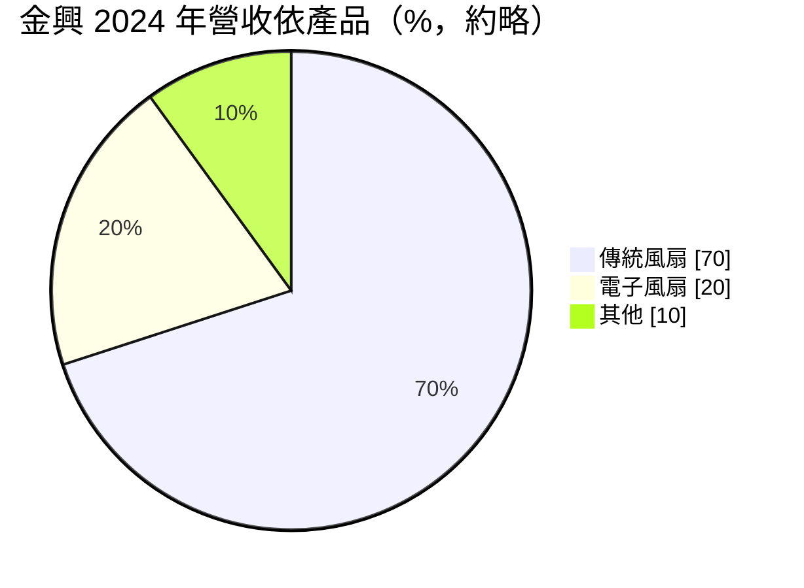
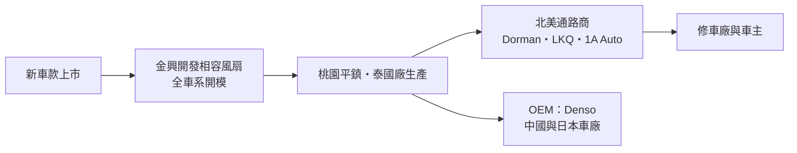
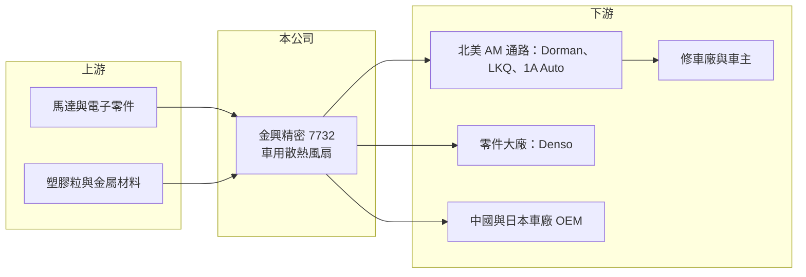

# 7732 金興精密

> 上市｜[[產業索引-汽車工業|汽車工業]]｜上市（櫃）日期 2025/01/14

# 第一章：企業模式與商業藍圖

> [!info] 撰寫說明
> 本文由 Claude 依公開資料整理，架構比照 [[2330台積電]] 的四章研究，資料截至 2026-10-08。財務數字來源：Goodinfo 年度經營績效頁、今周刊 2024 年 12 月上市前專訪、證交所開放資料（基本資料、2026 年第二季資產負債與綜合損益、股利）；產業描述為整理性內容，尚未逐條比對原始文件。#待校對

在評估單一個股的長期投資價值時，首要步驟是拆解企業的底層獲利邏輯。本章說明金興精密（股票代號：7732，以下簡稱金興）如何在北美汽車售後市場，靠一款不起眼的散熱風扇做到市占率過四成。

## 一、核心定位：北美 AM 市場的車用散熱風扇龍頭

金興成立於 1989 年，創辦人施春景以 60 萬元起家，最早從事汽車零件買賣，1995 年推出第一款傳統風扇，用在福特與裕隆的車款上。公司總部在桃園平鎮，2005 年在泰國設廠，2025 年 1 月掛牌上市，實收資本額約 6.47 億元。

金興的產品是汽車引擎室的[[散熱風扇]]，也就是冷卻水箱與冷氣冷凝器所用的風扇總成。它的主要市場和 [[6605帝寶]] 一樣是北美的[[售後維修市場]]：車輛使用多年後風扇馬達損壞，修車廠需要更換相容的副廠件。依今周刊報導，金興的風扇可以應用在美國九成以上、約三萬種車款，北美 AM 市占率超過四成，年銷量達百萬台等級。

## 二、產品板塊：傳統風扇轉向電子風扇

依今周刊 2024 年 12 月報導，傳統風扇約占營收七成、電子風扇約兩成，公司預估五年內電子風扇占比可提高到約七成。

* **傳統風扇：** 以引擎皮帶帶動或簡單溫控的風扇，技術成熟、競爭者多，報導指出毛利約一成。
* **電子風扇：** 以馬達驅動、由車上電腦控制轉速，包括[[無刷馬達]]風扇與採用 [[LIN Bus]] 數位訊號控制的風扇。這類產品開發難度高，報導指出毛利可超過四成。金興的產品演進從 1990 年代的傳統溫控風扇、2000 年的有刷電子風扇、2010 年的無刷風扇，到 2020 年的 LIN Bus 風扇，一路跟著車輛電子化升級。
* **電動車：** 電動車沒有引擎，但電池、馬達與電控系統仍需要散熱，報導提到金興的風扇已用於一家美系電動車大廠的 30 款車型。

## 三、資本轉化邏輯：全車系開模的覆蓋率生意

* **全車系開發：** 金興除了稀有跑車外，幾乎每一款車都開模，每年約以營收 4% 投入研發。這和 AM 車燈的邏輯相同：品項覆蓋越完整，通路商越願意集中向你採購。
* **客戶：** 報導列出的客戶包括 Denso、Dorman、1A Auto、LKQ 等北美零件通路與零件大廠，並已取得中國與日本部分車廠的 [[OEM]] 訂單。
* **泰國廠：** 2005 年在泰國設廠，取得東協關稅與人力成本優勢，也符合客戶「台灣加一」的風險分散需求。

## 四、企業長期藍圖

金興的長期方向有兩個。第一是電子化，提高無刷與 LIN Bus 等高毛利電子風扇的比重，這是公司預估五年內電子風扇占比從兩成升到七成的原因。第二是從 AM 跨入 OEM，利用國際車廠「去中化」的採購趨勢，以台灣與泰國產能爭取原廠訂單。電動車的熱管理需求也提供新的應用，但單一車型的風扇數量與規格仍在演變中。

# 第二章：護城河深度與競爭優勢

本章分析金興在北美 AM 散熱風扇市場的競爭優勢，以及從 AM 走向 OEM、從傳統風扇走向電子風扇時面臨的挑戰。

## 一、護城河的核心組成要素

* **車款覆蓋率：** 覆蓋約三萬種車款，是金興最主要的護城河。通路商不想向十家供應商分別採購，覆蓋最廣的供應商自然成為主要合作夥伴。報導提到，合作 20 年的美國通路商認為金興的產品覆蓋率在同業中最廣。
* **電子風扇的技術門檻：** 電子風扇要和車上電腦溝通，LIN Bus 風扇需要韌體與通訊協定的開發能力，同業投入者較少。金興較早投入，累積了逆向工程與電控經驗。
* **長期通路關係：** 與北美大型零件通路合作多年，交期與品質穩定，轉換供應商對通路商來說有一定成本。
* **多地生產：** 台灣與泰國兩地生產，在美國對中國零件加徵關稅的環境下具有相對優勢。

## 二、主要競爭對手格局

| 對手 | 定位 | 與金興的比較 |
|---|---|---|
| 中國 AM 散熱零件廠 | 價格低 | 傳統風扇價格競爭激烈，受美國關稅影響 |
| 原廠零件（OES）與 Tier 1 | 車廠原廠件 | 價格高，金興以副廠件價格優勢競爭 |
| 台灣 AM 零件同業（[[6605帝寶]]、[[1522堤維西]] 等） | 車燈等其他品項 | 產品不同，但共享北美 AM 通路與景氣 |

## 三、優勢轉化：守得住、守不住與觀察重點

* **守得住：** 北美 AM 電子風扇市場。這個市場需要大量品項與電控能力，金興的先行優勢明顯。
* **守不住：** 傳統風扇的價格。報導中業者也指出，車用風扇訂單動輒上千萬美元，競爭者可能增加。
* **觀察重點：** 第一，電子風扇比重能否如公司預期在五年內大幅提升；第二，OEM 訂單能否成為穩定的第二成長引擎；第三，美國關稅政策對 AM 零件進口成本的影響。

# 第三章：財務體質與盈利規模

資料日期：2026-10-08。數字取自 Goodinfo 年度經營績效頁、今周刊報導與證交所開放資料，表格是撰寫當時的快照；最新月營收、毛利率、累計 EPS 由自動排程寫在本筆記的屬性欄位（月營收、毛利率、累計EPS 等）。#待校對

財務報表是檢驗護城河是否真實存在的最終標準。本章用多年度的三率、ROE 與資本報酬，檢視金興的獲利品質。

## 一、獲利能力的基石：三率

| 年度 | 營收（新台幣） | [[毛利率]] | [[營業利益率]] | EPS（元） | [[ROE]] |
|---|---|---|---|---|---|
| 2020 | 8.86 億 | 23.4% | 6.85% | 1.91 | 7.00% |
| 2021 | 8.22 億 | 28.5% | 9.99% | 1.63 | 6.44% |
| 2022 | 9.40 億 | 27.4% | 11.5% | 2.33 | 10.1% |
| 2023 | 10.3 億 | 29.4% | 14.3% | 2.36 | 8.92% |
| 2024 | 10.9 億 | 32.2% | 15.6% | 2.77 | 8.36% |
| 2025 | 10.9 億 | 29.6% | 12.4% | 1.73 | 6.41% |
| 2026 上半年 | 5.33 億 | 26.35% | 9.44% | 0.99 | 未查得 |

* **毛利率：** 2020 年到 2024 年毛利率從 23.4% 升到 32.2%，與電子風扇比重提升的方向一致。2025 年與 2026 年上半年回落到 26% 至 30%，可能與匯率、關稅與產品組合有關（推估）。
* **營業利益率：** 從 2020 年的 6.85% 升到 2024 年的 15.6%，之後回落。金興規模不大，研發與管理費用比重較高，營收稍有波動，營業利益率就會明顯變動。
* **營收成長：** 2021 至 2025 年營收從 8.22 億元成長到 10.9 億元，年複合成長率約 7.3%（推算）。2026 年 1 至 8 月累計營收約 6.77 億元，低於去年同期的 8.01 億元（證交所開放資料），短期成長動能轉弱。

## 二、[[ROE]]：資本效率

2021 至 2025 年平均 ROE 約 8.0%（推算）。金興的 ROE 偏低，一個原因是財務結構非常保守：2026 年第二季底權益約 17.7 億元、負債總計僅約 3.9 億元（證交所開放資料），負債比約 18%，而且 2025 年上市募資後權益增加，短期內稀釋了 ROE。低負債代表財務風險低，但也代表資本運用效率還有提升空間。

## 三、資本支出、自由現金流與股利

金興的資本支出以模具開發與泰國廠擴充為主，具體金額與自由現金流未查得。股利方面，2025 年度配發盈餘現金股利 1 元加資本公積現金 0.5 元，合計 1.5 元，以 EPS 1.73 元計算，盈餘配發率約 58%、含資本公積約 87%（推算）。Goodinfo 統計平均現金股利約 1.72 元，配息政策偏向大方。

## 四、[[ROIC]] 與 [[WACC]]：價值創造利差

**ROIC 推算：** 2025 年營業利益約 1.35 億元（營收 10.9 億元 × 營業利益率 12.4%），扣除 20% 稅率後約 1.08 億元。2026 年第二季底權益約 17.7 億元，負債約 3.9 億元，大部分為營運負債，假設有息負債約 1 億元（推估），投入資本約 18.7 億元，ROIC 約 5.8%（推算）。2024 年營業利益約 1.70 億元，同口徑 ROIC 約 7.3%（推算）。由於權益中包含上市募得的現金，若扣除閒置現金，本業實際 ROIC 會較高。

**WACC 推算：** 假設台灣 10 年期公債殖利率 1.75%、市場風險溢酬 6%、β 取汽車零件業常見值 0.9，股東權益成本約 7.15%。負債比重很低（約 5%），稅後負債成本約 2.0%，WACC 約 6.9%（推算）。

**結論：** 以帳面資本計算，金興近年 ROIC 約 6% 至 7%，與約 6.9% 的資金成本接近，處於「打平」的狀態。主因不是本業獲利差，而是低負債與上市後累積的現金拉高了資本基礎。電子風扇比重若如公司預期提升、毛利率回到三成以上，利差才有機會明顯轉正。

# 第四章：總體風險與地緣政治

任何企業都無法脫離宏觀環境獨立存在。本章分析金興長期必須面對的貿易、產業結構、營運與科技風險。

## 一、地緣政治與貿易

* **美國關稅：** 北美是金興最主要的市場，美國對進口汽車零件的關稅變動會直接影響售價與毛利。台灣與泰國生產相較中國有優勢，但並非完全不受影響。
* **匯率：** 營收以美元為主，新台幣升值會壓縮毛利與產生匯兌損失。

## 二、產業週期與市場結構

* **AM 需求較穩定：** 散熱風扇屬於耗損件，需求主要來自車齡與行駛里程，與新車銷售的關聯較低。美國平均車齡上升對金興有利。
* **通路庫存調整：** 北美通路商的庫存政策會造成訂單的短期波動，2026 年前八個月營收年減約 15% 就是需要追蹤原因的訊號。

## 三、營運環境的隱性風險

* **客戶集中：** 北美大型零件通路數量有限，單一通路商的採購變化影響大。
* **傳統風扇的價格競爭：** 傳統風扇毛利僅約一成，若電子化進度不如預期，整體毛利率會被拉低。
* **OEM 執行風險：** 原廠訂單的驗證期長、價格壓力大，從 AM 跨入 OEM 不一定能提高整體獲利率。

## 四、科技演進

汽車電子化與電動化對金興是長期機會：電子風扇單價與毛利都比傳統風扇高，電動車的電池與電控散熱也需要風扇。但電動車的[[熱管理系統]]正往整合式模組發展，散熱方式也可能更多採用液冷，風扇在每台車上的價值不一定增加。金興需要持續跟上車廠的熱管理架構，才能維持 AM 市場的覆蓋優勢。

# 專有名詞解析

## 應用

- **[[散熱風扇]]**：安裝在車輛水箱與冷凝器後方的風扇總成，負責引擎冷卻與冷氣散熱。
- **[[無刷馬達]]**：以電子換向取代碳刷的馬達，壽命長、效率高，常用於電子風扇與電動車。
- **[[LIN Bus]]**：汽車內部的低成本序列通訊協定，用來讓車上電腦控制風扇、車窗等次要元件。
- **[[熱管理系統]]**：管理電動車電池、馬達與座艙溫度的整合系統，包含冷卻液迴路、熱泵與風扇。

## 金融

- **[[ROIC]]**：投入資本報酬率，稅後營業利益除以股東權益與有息負債的合計，衡量本業對所有資金提供者的報酬。
- **[[WACC]]**：加權平均資金成本，依股東權益與負債的比重加權計算的資金成本，ROIC 高於它才代表創造價值。

## 產業

- **[[售後維修市場]]**：新車出廠後的維修、保養與改裝零件市場，簡稱 AM，品項多、需求穩定。
- **[[OEM]]**：原廠委託製造，零件直接供應車廠裝配在新車上，量大但價格受車廠主導。

# 核心供應鏈

## 1. 上游：材料與零件
- 馬達、控制晶片與電子零件
- 塑膠粒、鋼材與鋁材

## 2. 中游：金興本身與同業
- 桃園平鎮總部與泰國廠
- 台灣 AM 零件族群：[[6605帝寶]]、[[1522堤維西]]

## 3. 下游：通路與客戶
- 北美 AM 零件通路：Dorman、LKQ、1A Auto
- 汽車零件大廠：Denso
- 中國與日本部分車廠的 OEM 訂單、美系電動車大廠

## 最新新聞
<!-- news:start -->
<!-- news:end -->

## 相關連結
- [公開資訊觀測站](https://mopsov.twse.com.tw/mops/web/t05st03?step=1&firstin=1&co_id=7732)
- [Goodinfo](https://goodinfo.tw/tw/StockDetail.asp?STOCK_ID=7732)
- [Yahoo 股市](https://tw.stock.yahoo.com/quote/7732)
- [鉅亨網新聞](https://www.cnyes.com/twstock/7732/news)
