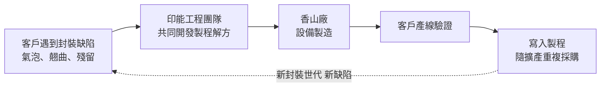
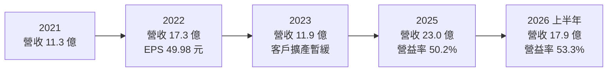
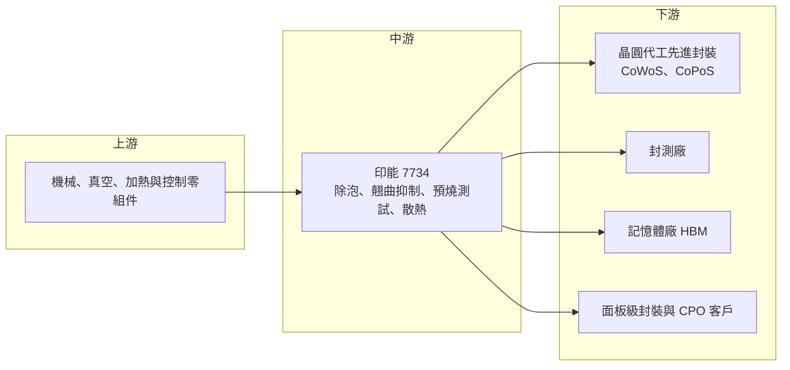

# 7734 印能科技

> 上櫃｜[[產業索引-半導體業|半導體業]]｜上市（櫃）日期 2025/02/26

# 第一章：企業模式與商業藍圖

> [!info] 撰寫說明
> 本文由 Claude 依公開資料整理，架構比照 [[2330台積電]] 的四章研究，資料截至 2026-10-08。財務數字來源：櫃買中心開放資料快照（基本資料、2026 年第二季資產負債與綜合損益）、Goodinfo 年度經營績效與股利政策、數位時代、工商時報、聯合新聞網、優分析、民報；產業描述為整理性內容，尚未逐條比對原始文件。#待校對

在評估單一個股的長期投資價值時，首要步驟是拆解企業的底層獲利邏輯。本章針對印能科技（股票代號：7734，以下簡稱印能）的商業模式進行定性分析，說明一家專做「解決封裝缺陷」的小型設備商，如何因為 AI 晶片的先進封裝需求，成為毛利率超過六成的利基設備公司。

## 一、核心定位：解決先進封裝缺陷的製程設備商

印能成立於 2007 年，總部與工廠位於新竹市香山區，2025 年 2 月以每股 1,250 元承銷價在櫃買中心上櫃，董事長暨總經理為洪誌宏。依數位時代報導，印能成立當年就推出第一代設備，至今已迭代到第四代產品，累計出貨設備超過 2,500 套。

印能賣的不是封裝主流程的設備（例如打線機、貼片機），而是「修補問題」的設備。先進封裝把多顆晶片與中介層、載板堆疊在一起，過程中容易出現三種缺陷：材料之間殘留氣泡（[[Void]]）、封裝體受熱後彎曲變形（[[翹曲]]）、以及助焊劑殘留。這些缺陷會讓晶片在使用中失效，而封裝越大、層數越多，問題就越嚴重。工商時報報導，印能把自己的技術聚焦在殘留、翹曲、金屬溶解與散熱四大問題。聯合新聞網引述的產業看法指出，大型封裝廠良率每下滑 1 個百分點，年化損失可能達數億元，這正是客戶願意為印能設備付出高價的原因。

## 二、終端應用板塊：先進封裝約占八成

依數位時代報導（2025 年上櫃前業績發表會），印能營收約八成來自先進封裝，內外銷比例約為 4：6；台灣以先進封裝為主，海外市場包括北美、中國、韓國、東南亞與歐洲。各產品線的營收比重未公開，因此本文不畫圓餅圖。主要產品如下：

* **VTS 除泡設備：** 主力產品，以壓力與真空方式消除封裝材料中的氣泡。聯合新聞網報導的 EvoRTS+PRO 方案，進一步把真空除泡與助焊劑去除整合到同一製程，適合大尺寸晶粒封裝。
* **WSS 翹曲抑制系統：** 在加熱與冷卻過程中控制封裝體變形。AI 晶片的封裝尺寸越來越大，翹曲問題越明顯，這類設備的需求也隨之增加。
* **BMAC 高功率預燒測試機：** 以高溫高壓測試晶片可靠度，優分析報導現階段最高支援 4,000 瓦，鎖定伺服器應用。
* **散熱與自動化：** 包括伺服器機櫃的氣冷與兩相式冷卻技術（研發與測試中），以及自動搬運系統。

依工商時報與優分析報導，印能的第三代設備用於 [[HBM]] 製程，第四代設備可處理更大的晶片尺寸並已進入矽光子（[[CPO]]）封裝應用；不過 2025 年時出貨仍以第二代為主，第三、四代合計約占營收兩成。

## 三、資本轉化邏輯：小而深的製程解方

印能的商業模式是「先解決問題、再賣設備」。依數位時代報導，洪誌宏把競爭對手形容為「客戶的工程師」，意思是印能真正要說服的，是客戶內部原本想自己解決問題的工程團隊；公司也強調不做市場上已量產的產品。工商時報報導中，一家矽光子客戶在嘗試超過 20 種方案仍無法解決助焊劑殘留後，才找上印能。

一旦印能的設備被寫入某個封裝製程，客戶每擴充一條相同的產線，就會重複採購相同的設備。這也是印能營收與晶圓代工、封測龍頭的先進封裝資本支出高度連動的原因。2024 年初新竹香山新廠落成，數位時代報導可滿足未來 2 至 3 年的產能需求。

## 四、企業長期藍圖

* **跟著封裝世代前進：** 印能參與 [[CoWoS]]、[[CoPoS]]、CoWoP 與 CPO 等先進封裝的供應鏈與開發專案。民報報導，印能於 2025 年 8 月被列入 [[2330台積電]] CoPoS 首波供應名單。面板級封裝的尺寸更大，翹曲與氣泡問題更嚴重，對印能的設備需求可能更高（推估）。
* **從封裝延伸到測試與散熱：** 預燒測試機與伺服器散熱技術，是印能把「解決高功率晶片可靠度問題」的能力延伸到封裝以外的嘗試。
* **海外市場：** 加入德鑫貳聯盟擴充北美服務能量，並看好中國因無法取得先進製程而轉向先進封裝，帶動當地封測廠需求。

# 第二章：護城河深度與競爭優勢

本章分析印能在先進封裝設備市場的護城河，以及它與日韓同業的競爭位置。

## 一、護城河的核心組成要素

* **製程知識與客戶共同開發：** 氣泡與翹曲的成因與材料、溫度、壓力曲線高度相關，每個客戶的封裝結構都不同。印能近二十年累積的製程資料庫與客戶共同開發經驗，讓它能更快找到解方。這種隱性知識比單純的機台設計更難複製。
* **專利與世代迭代：** 依數位時代報導，印能累計 61 項專利，其中 48 項已獲核准，並已推出第四代產品。持續迭代讓它能跟上客戶的封裝尺寸放大。
* **寫入製程的轉換成本：** 先進封裝產線一旦驗證通過，換設備就得重新驗證良率，客戶不會輕易更換。這讓印能在客戶擴產時能持續拿到重複訂單。

## 二、全球主要競爭對手格局

| 對手 | 定位 | 對印能的威脅 |
|---|---|---|
| ILSIN、Vision、Osung、Suhwoo（韓國） | 壓力除泡與熱處理設備商 | 依數位時代報導列為主要競爭者，在韓系記憶體與封測客戶具地利 |
| SanyuRec（日本） | 封裝熱處理與除泡設備 | 依數位時代報導列為競爭者，在日系客戶具優勢 |
| 客戶內部工程團隊 | 晶圓代工與封測廠自行開發製程 | 若客戶找到不需額外設備的製程解法，需求可能消失 |
| 大型封裝設備商 | 例如提供回焊、貼合設備的國際大廠 | 可能把除泡或翹曲控制功能整合進主流程設備（推估） |

## 三、優勢轉化：哪些市場守得住、哪些守不住

* **守得住：** 已寫入台灣先進封裝產線的除泡與翹曲抑制設備。這些客戶的擴產帶來重複訂單，而印能的在地服務與共同開發經驗是日韓同業難以取代的。
* **守不住：** 規格標準化後的一般除泡設備。當某個封裝世代成熟，製程參數固定，客戶可能轉向價格較低的供應商，或要求降價。
* **觀察重點：** 第四代設備的驗證能否轉為大量出貨；CoPoS 等面板級封裝能否成為新的成長來源；以及北美、中國與韓國的海外營收占比能否提高，降低對單一客戶擴產節奏的依賴。

# 第三章：財務體質與盈利規模

資料日期：2026-10-08。數字取自櫃買中心開放資料、Goodinfo 年度經營績效與股利政策、數位時代與財經媒體報導，表格是撰寫當時的快照；最新月營收、毛利率、累計 EPS 由自動排程寫在本筆記的屬性欄位（月營收、毛利率、累計EPS 等）。#待校對

財務報表是檢驗護城河是否真實存在的最終標準。本章用多年度三率、ROE、現金流與資本報酬，檢視印能的獲利品質。

## 一、獲利能力的基石：三率

| 年度 | 營收（新台幣） | [[毛利率]] | [[營業利益率]] | EPS（元） | [[ROE]] |
|---|---|---|---|---|---|
| 2021 | 11.3 億 | 68.5% | 51.8% | 29.88 | 44.8% |
| 2022 | 17.3 億 | 65.5% | 46.2% | 49.98 | 57.5% |
| 2023 | 11.9 億 | 67.4% | 49.1% | 31.72 | 27.9% |
| 2024 | 18.0 億 | 63.2% | 47.5% | 44.53 | 33.1% |
| 2025 | 23.0 億 | 66.3% | 50.2% | 33.50 | 19.2% |
| 2026 上半年 | 17.9 億 | 66.3% | 53.3% | 28.72 | 未查得 |

註：各年度股本不同（2021 年約 1.05 億元、2025 年約 2.8 億元），EPS 不可直接比較。2026 上半年取自櫃買中心開放資料。

* **[[毛利率]]：** 五年來毛利率穩定在 63% 到 69% 之間，即使營收在 2023 年下滑三成，毛利率仍維持 67.4%。對設備公司來說，這是極高且穩定的水準，反映印能賣的是製程解方而不是標準機台，定價權強。
* **[[營業利益率]]：** 長期約 46% 到 53%，費用率低，營收成長時獲利成長更快。
* **營收波動：** 2022 年到 2023 年營收由 17.3 億元降到 11.9 億元，說明設備業營收跟著客戶擴產節奏起伏，而不是穩定成長。
* **長期指標：** 2021 至 2025 年營收年複合成長率約 19.4%（推算）；近 5 年平均 ROE 約 36.5%（推算）。

## 二、[[ROE]]：資本效率

印能 2025 年 ROE 降到 19.2%，主要是因為上櫃時以高價募資，股東權益大幅增加。2026 年第二季底股東權益約 67.2 億元，其中資本公積約 38.5 億元，流動資產約 76.0 億元，負債約 19.2 億元。帳上大量現金壓低了 ROE，但本業的獲利能力並未下降，2026 年上半年營業利益率反而提高到 53.3%。公司並曾執行庫藏股，2026 年第二季底持有庫藏股 25 萬股。

## 三、資本支出與自由現金流

* **[[CapEx]]：** 設備組裝屬輕資產，2024 年初香山新廠落成後，近期沒有大型擴廠計畫（具體金額未查得）。非流動資產約 10.4 億元，僅占總資產約 12%。
* **[[自由現金流]]：** 高毛利與低資本支出，使印能具備產生自由現金流的條件，但設備業有預收款與存貨的季節性波動，多年度自由現金流數字未查得。
* **股利：** 依 Goodinfo，2023、2024、2025 年度現金股利分別為 14.75 元、21.72 元、19.85 元，2024 年度另配股票股利 2.565 元。對照當年 EPS，現金配發率約 47% 到 59%（推算），保留一部分盈餘支應研發與海外擴張。

## 四、[[ROIC]] 與 [[WACC]]：價值創造利差

* **ROIC（推算）：** 以 2025 年營業利益約 11.55 億元（營收 23.0 億 × 50.2%）× (1 − 20%) ≈ 9.24 億元作為稅後營業利益；投入資本以 2026 年第二季股東權益 67.2 億元加非流動負債 3.8 億元（作為有息負債的上限近似）≈ 71.0 億元。ROIC ≈ 13.0%。以 2026 年上半年營業利益 9.53 億元年化計算，ROIC 約 21.5%。若扣除帳上大量現金，只計算營運實際使用的資本，ROIC 會遠高於此數字（推估）。
* **WACC（推算）：** 無風險利率取約 1.75%，市場風險溢酬 6%，β 取先進封裝設備同業常見的較高值 1.4（未查得本身的 β），股東權益成本約 10.15%。印能幾乎沒有有息負債，WACC 約 10%。
* **解讀：** 即使把上櫃募得的現金全部算進投入資本，ROIC 仍略高於 WACC；以營運資本計算則明顯高於 WACC。這代表印能的本業是高度創造價值的生意。長期的關鍵在於資本配置：大量現金若長期閒置，會持續拉低整體報酬率，經營層如何運用現金（研發、併購、配息或買回）值得觀察。

# 第四章：總體風險與地緣政治

任何企業都無法脫離宏觀環境獨立存在。本章分析印能長期必須面對的地緣政治、產業週期與營運風險。

## 一、地緣政治

* **客戶集中在台灣先進封裝：** 印能最大的成長動能來自台灣先進封裝產能擴充，若主要客戶把先進封裝產能移往美國或其他地區，印能需要跟著到海外提供服務。加入德鑫貳聯盟擴充北美服務，就是為此準備。
* **中國市場：** 優分析報導印能看好中國封測廠轉向先進封裝帶來的需求，但若美國擴大對中國先進封裝設備的出口管制，這部分業務可能受限。

## 二、產業週期與市場結構

* **AI 資本支出週期：** 印能的營收與 AI 晶片的先進封裝擴產高度連動。2023 年營收下滑三成，說明客戶擴產一旦暫停，設備訂單就會明顯減少。AI 投資若進入放緩期，印能的營收可能出現較大波動。
* **客戶集中：** 先進封裝產能集中在少數晶圓代工與封測龍頭，客戶集中度高（具體數字未查得），單一客戶的擴產節奏對營收影響很大。

## 三、營運環境的隱性風險

* **司法調查：** 民報 2025 年 11 月報導，檢調於 2025 年 11 月 7 日到印能搜索，報導未說明案情；公司表示依法配合調查，並稱對公司財務無重大影響。調查結果未查得。由於董事長兼任總經理，經營高度集中於創辦人，若案情涉及經營層，可能影響公司治理與客戶信任，屬需要追蹤的事項。
* **人才與技術流失：** 印能的價值在於製程知識，關鍵工程師流失或技術外洩，會直接削弱護城河。
* **產品世代轉換：** 第三、四代設備的放量速度若不如預期，營收仍將依賴舊世代產品，面臨價格壓力。

## 四、科技或法規演進

先進封裝的技術路線變化快速：從 CoWoS 到面板級的 CoPoS、從凸塊接合到混合鍵合（[[Hybrid Bonding]]）。若未來主流封裝製程改變了氣泡與翹曲的成因，例如混合鍵合不使用助焊劑，部分除泡與助焊劑去除設備的需求可能下降。反過來說，封裝尺寸持續放大、功耗持續提高，翹曲與散熱問題只會更嚴重。印能能否持續預判下一代封裝的缺陷問題並提早布局，是它能否維持高毛利的根本。

# 專有名詞解析

## 半導體

- **[[先進封裝]]**：把多顆晶片以中介層、混合鍵合等方式高密度整合的封裝技術，例如 CoWoS、SoIC。
- **[[CoWoS]]**：台積電的 2.5D 先進封裝技術，把運算晶片與 HBM 並排放在矽中介層上，是 AI 晶片的主流封裝。
- **[[CoPoS]]**：以方形面板取代圓形晶圓作為中介層載體的封裝技術，可放置更多晶片、提高面積利用率。
- **[[HBM]]**：高頻寬記憶體，把多層 DRAM 垂直堆疊，提供 AI 晶片所需的大量資料傳輸頻寬。
- **[[CPO]]**：共同封裝光學，把光學元件與交換器晶片封裝在一起，以降低資料中心傳輸耗電。
- **[[Hybrid Bonding]]**：混合鍵合，以銅對銅直接接合兩片晶圓或晶片，不需凸塊，可大幅提高連接密度。
- **[[Void]]**：封裝材料中殘留的氣泡或空洞，會降低散熱與機械強度，造成晶片失效。
- **[[翹曲]]**：封裝體在受熱與冷卻時因材料膨脹係數不同而彎曲變形，封裝越大越嚴重。
- **[[助焊劑]]**：焊接時用來清除金屬表面氧化物的化學品，殘留會影響可靠度，必須清除。
- **[[預燒測試]]**：Burn-in，以高溫高壓長時間運轉晶片，提早篩出早期失效的產品。

## 金融

- **[[ROIC]]**：投入資本報酬率，衡量公司每投入一元營運資本能產生多少稅後營業利益。
- **[[WACC]]**：加權平均資金成本，股東與債權人要求報酬的加權平均，是 ROIC 要超越的門檻。
- **[[庫藏股]]**：公司買回自家股票，可用於轉讓員工或註銷，也是運用閒置現金的方式之一。

# 核心供應鏈

## 1. 上游：零組件
- 機械、真空、加熱與控制零組件供應商（具體名稱未查得）

## 2. 中游：印能本身
- 新竹香山廠（2024 年初落成）；德鑫貳聯盟（北美服務）

## 3. 下游：先進封裝客戶
- 晶圓代工：[[2330台積電]]（2025 年 8 月列入 CoPoS 首波供應名單，民報）、[[INTC英特爾]] 供應鏈（數位時代）
- 封測廠與記憶體 HBM 客戶（未具名）
- 北美科技大廠（優分析，未具名）

## 4. 同業
- 韓國 ILSIN、Vision、Osung、Suhwoo；日本 SanyuRec

延伸閱讀：[[台積電供應鏈]]

## 最新新聞
<!-- news:start（自動產生，請勿手動編輯此範圍） -->
- 2026-10-05 🏛️ 重訊 15:22｜(更正)公告本公司取得私募有價證券｜[觀測站](https://mops.twse.com.tw/mops/#/web/t05st01)

完整紀錄：[[7734印能科技 新聞]]
<!-- news:end -->

## 相關連結
- [公開資訊觀測站](https://mopsov.twse.com.tw/mops/web/t05st03?step=1&firstin=1&co_id=7734)
- [Goodinfo](https://goodinfo.tw/tw/StockDetail.asp?STOCK_ID=7734)
- [Yahoo 股市](https://tw.stock.yahoo.com/quote/7734)
- [鉅亨網新聞](https://www.cnyes.com/twstock/7734/news)
