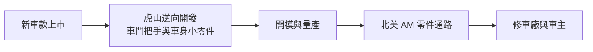
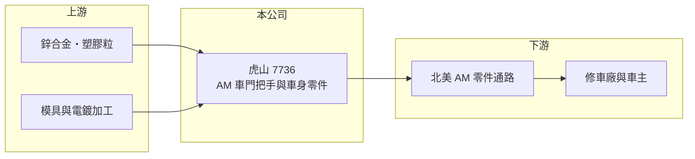

# 7736 虎山

> 上市｜[[產業索引-汽車工業|汽車工業]]｜上市（櫃）日期 2025/03/18

# 第一章：企業模式與商業藍圖

> [!info] 撰寫說明
> 本文由 Claude 依公開資料整理，架構比照 [[2330台積電]] 的四章研究，資料截至 2026-10-08。財務數字來源：Goodinfo 年度經營績效頁、nStock 公司概況、科技新報 2024 至 2025 年報導標題、證交所開放資料（基本資料、2026 年第二季資產負債與綜合損益、股利）。公開資料有限，產品細項與營收比重未查得；產業描述為整理性內容，尚未逐條比對原始文件。#待校對

在評估單一個股的長期投資價值時，首要步驟是拆解企業的底層獲利邏輯。本章說明虎山實業（股票代號：7736，以下簡稱虎山）如何以「車門把手」這個小零件，在北美汽車售後市場取得高市占率。

## 一、核心定位：全球 AM 車門把手大廠

虎山成立於 1983 年，2025 年 3 月在證交所上市，實收資本額 7.6 億元，董事長為陳映志。依公司登記，主要業務為「製造及銷售各式汽車零件」；依科技新報 2024 至 2025 年的報導，虎山是全球[[售後維修市場]]（AM）的車門把手大廠，在北美 AM 車門把手市場的市占率約七成。

車門把手看起來是不起眼的小零件，但它是車輛中使用頻率最高、也最容易損壞或在碰撞中受損的外觀件之一。每一款車的把手外型、內部連桿與鎖具結構都不同，副廠件必須做到外觀與安裝尺寸完全相容，才能被修車廠接受。這讓 AM 車門把手成為一個「品項極多、單價不高、但需要長期累積模具」的利基市場。虎山另外也生產其他車身與內裝小零件（細項未查得）。

## 二、市場板塊：北美為主

虎山的產品比重與地區比重在本次查得的資料中沒有完整數字。依科技新報報導標題，北美是虎山最主要的市場，公司在 2025 年上市時把「因應美國關稅、布局美國」列為重點策略。北美 AM 零件市場的特性是需求穩定、通路集中在大型零件經銷商與連鎖通路，供應商以品項覆蓋率決勝負。

## 三、資本轉化邏輯：模具累積與通路覆蓋

* **模具即資產：** 和 [[6605帝寶]] 的車燈、[[7732金興精密]] 的散熱風扇一樣，虎山的核心資產是累積多年的模具與料號。每款車上市後開發對應零件，只要車輛仍在路上行駛，這套模具就能持續帶來訂單。
* **高毛利的利基市場：** 虎山 2020 至 2024 年毛利率長期在 36% 至 42% 之間，高於多數汽車零件廠。小零件、品項多、單筆訂單量小，大型零件廠不願投入，讓專業業者可以維持較好的價格。

## 四、企業長期藍圖

依公開報導，虎山的長期方向是擴大產品線、持續開發新車款料號，以及因應美國關稅政策布局美國（具體投資內容未查得，待校對）。上市募得的資金讓公司財務結構更為穩健，2026 年第二季底負債比約 22%（證交所開放資料）。

# 第二章：護城河深度與競爭優勢

本章分析虎山在 AM 車門把手市場的競爭優勢，以及小眾利基市場的天花板。

## 一、護城河的核心組成要素

* **市占率與品項覆蓋：** 北美 AM 車門把手約七成的市占率（科技新報，2024 年），代表虎山已經是通路商的首選供應商。對通路商而言，集中向品項最齊全的供應商採購最有效率，這種地位一旦建立很難被撼動。
* **利基市場的規模門檻：** 車門把手市場總規模不大，新進者要投入大量模具開發，才能分到有限的市場，投資報酬吸引力低，這本身就是一道門檻。
* **長期通路關係：** 與北美零件通路合作多年，交期與品質紀錄是新供應商難以短期複製的條件。

## 二、主要競爭對手格局

| 對手 | 定位 | 與虎山的比較 |
|---|---|---|
| 中國 AM 車身零件廠 | 價格低 | 受美國關稅限制，在北美的價格優勢下降 |
| 原廠零件（OES） | 車廠原廠件 | 價格高，虎山以副廠件價格優勢競爭 |
| 台灣 AM 零件同業（[[6605帝寶]]、[[1522堤維西]]、[[1524耿鼎]] 等） | 車燈、鈑金等其他品項 | 產品不同，但共享北美 AM 通路與景氣 |

## 三、優勢轉化：守得住、守不住與觀察重點

* **守得住：** 北美 AM 車門把手的領先地位，這是多年模具與通路累積的結果。
* **守不住：** 市場規模的天花板。市占率已經很高，未來成長必須靠擴大產品線或開拓新市場，而不是在原市場繼續搶占率。
* **觀察重點：** 第一，新產品線的開發成果；第二，美國關稅政策與美國布局的效果；第三，電動車與新車款的電子式、隱藏式門把普及後，AM 副廠件的開發難度是否提高。

# 第三章：財務體質與盈利規模

資料日期：2026-10-08。數字取自 Goodinfo 年度經營績效頁、nStock 與證交所開放資料，表格是撰寫當時的快照；最新月營收、毛利率、累計 EPS 由自動排程寫在本筆記的屬性欄位（月營收、毛利率、累計EPS 等）。#待校對

財務報表是檢驗護城河是否真實存在的最終標準。本章用多年度的三率、ROE 與資本報酬，檢視虎山的獲利品質。

## 一、獲利能力的基石：三率

| 年度 | 營收（新台幣） | [[毛利率]] | [[營業利益率]] | EPS（元） | [[ROE]] |
|---|---|---|---|---|---|
| 2020 | 10.7 億 | 39.1% | 28.2% | 4.05 | 15.7% |
| 2021 | 12.3 億 | 41.6% | 32.2% | 5.59 | 19.8% |
| 2022 | 11.4 億 | 39.4% | 26.5% | 6.17 | 18.7% |
| 2023 | 11.6 億 | 36.6% | 23.0% | 4.34 | 12.9% |
| 2024 | 13.6 億 | 39.3% | 24.7% | 7.19 | 18.6% |
| 2025 | 16.6 億 | 30.3% | 18.3% | 5.04 | 11.6% |
| 2026 上半年 | 7.22 億 | 28.26% | 16.71% | 2.42 | 未查得 |

* **高毛利的利基特性：** 2020 至 2024 年毛利率約 37% 至 42%，營業利益率 23% 至 32%，在汽車零件業屬於很高的水準，反映利基市場的定價能力。
* **2025 年之後毛利率下滑：** 2025 年營收成長到 16.6 億元，但毛利率降到 30.3%，2026 年上半年再降到約 28%。可能原因包括產品組合變化、美國關稅成本、匯率與上市後的費用增加（推估），這是觀察虎山定價能力是否鬆動的關鍵。
* **業外收益：** 2026 年上半年稅後純益率 25.38%，遠高於營業利益率 16.71%（證交所營益分析），業外收入約 0.88 億元，可能來自匯兌或利息收入（推估），評估本業時應以營業利益為準。
* **營收成長：** 2021 至 2025 年營收從 12.3 億元成長到 16.6 億元，年複合成長率約 7.8%（推算）；但 2026 年 1 至 9 月累計營收約 10.42 億元，年減約 18.5%（nStock），短期動能轉弱。

## 二、[[ROE]]：資本效率

2021 至 2025 年平均 ROE 約 16.3%（推算），是相當好的資本效率。2025 年 ROE 降到 11.6%，除了獲利下滑，也因為上市募資使股東權益擴大。2026 年第二季底權益約 35.0 億元、負債約 10.0 億元（證交所開放資料），財務結構保守。

## 三、資本支出、自由現金流與股利

虎山的資本支出以模具開發為主，具體金額與自由現金流未查得。股利方面，2025 年度配發現金股利 3.8 元，以 EPS 5.04 元計算配發率約 75%（推算），Goodinfo 統計平均現金股利約 3.14 元，配息政策偏向大方。

## 四、[[ROIC]] 與 [[WACC]]：價值創造利差

**ROIC 推算：** 2025 年營業利益約 3.04 億元（營收 16.6 億元 × 營業利益率 18.3%），扣除 20% 稅率後約 2.43 億元。2026 年第二季底權益約 35.0 億元，負債約 10.0 億元，假設其中約三成為有息負債（推估約 3 億元），投入資本約 38 億元，ROIC 約 6.4%（推算）。上市前資本基礎較小，2021 至 2024 年的 ROIC 很可能在 15% 以上（推算，依 ROE 水準回推）。

**WACC 推算：** 假設台灣 10 年期公債殖利率 1.75%、市場風險溢酬 6%、β 取汽車零件業常見值 0.9，股東權益成本約 7.15%。負債約占投入資本 8%，稅後負債成本約 2.0%，WACC 約 6.7%（推算）。

**結論：** 上市前虎山 ROIC 明顯高於資金成本，是典型的高報酬利基企業；上市後權益大增、毛利率下滑，以帳面資本計算的 ROIC 已接近 WACC。權益中有部分是上市募得的現金，扣除後本業 ROIC 仍高於資金成本（推估）。關鍵在於毛利率能否回到三成以上，以及募得資金能否投入有報酬的新產品線。

# 第四章：總體風險與地緣政治

任何企業都無法脫離宏觀環境獨立存在。本章分析虎山長期必須面對的貿易、產業結構、營運與科技風險。

## 一、地緣政治與貿易

* **美國關稅：** 北美是虎山最主要市場，美國進口零件關稅直接影響售價與毛利。公司上市時即把布局美國列為策略，代表關稅已被視為長期結構風險。
* **匯率：** 營收以美元計價，新台幣升值會壓縮毛利，也會造成匯兌損益波動。

## 二、產業週期與市場結構

* **AM 需求穩定但成長有限：** 車門把手需求來自碰撞維修與老車損壞，與新車銷售關聯低，需求穩定；但市場規模本身有限，虎山已有高市占率，成長空間需要靠新產品。
* **通路庫存：** 北美通路商的庫存調整會讓月營收出現明顯波動，2026 年營收年減就是一例。

## 三、營運環境的隱性風險

* **產品與市場集中：** 營收高度集中在單一品類與單一地區，任一環節出問題影響都很大。
* **原廠設計專利：** 車廠可能以外觀設計專利限制副廠件，影響可開發的車款範圍。
* **上市後的資本配置：** 募得資金若長期閒置或投入報酬較低的項目，會持續壓低 ROE。

## 四、科技演進

電動車普及帶來「隱藏式」或電子式車門把手，例如以馬達驅動彈出、以感應開門的設計。這類把手結構複雜、含電子元件，副廠件開發難度與單價都提高。對虎山而言，這既是提高產品單價的機會，也是技術門檻的挑戰；能否跟上電子化車門把手，是十年尺度上的關鍵。

# 專有名詞解析

## 應用

- **[[隱藏式門把]]**：平時與車身齊平、需要時才彈出的車門把手，多見於電動車，常以馬達驅動。

## 金融

- **[[ROIC]]**：投入資本報酬率，稅後營業利益除以股東權益與有息負債的合計，衡量本業對所有資金提供者的報酬。
- **[[WACC]]**：加權平均資金成本，依股東權益與負債的比重加權計算的資金成本，ROIC 高於它才代表創造價值。

## 產業

- **[[售後維修市場]]**：新車出廠後的維修、保養與改裝零件市場，簡稱 AM，品項多、需求穩定。
- **[[OES]]**：原廠授權維修零件，由車廠通路銷售，價格通常高於副廠件。

# 核心供應鏈

## 1. 上游：材料與加工
- 鋅合金、工程塑膠等材料（推估，待校對）
- 模具、電鍍與表面處理加工

## 2. 中游：虎山本身與同業
- 台灣 AM 零件族群：[[6605帝寶]]、[[1522堤維西]]、[[7732金興精密]]、[[1524耿鼎]]

## 3. 下游：通路與終端
- 北美汽車零件經銷商與連鎖通路
- 碰撞維修廠、保險理賠與車主

## 最新新聞
<!-- news:start -->
<!-- news:end -->

## 相關連結
- [公開資訊觀測站](https://mopsov.twse.com.tw/mops/web/t05st03?step=1&firstin=1&co_id=7736)
- [Goodinfo](https://goodinfo.tw/tw/StockDetail.asp?STOCK_ID=7736)
- [Yahoo 股市](https://tw.stock.yahoo.com/quote/7736)
- [鉅亨網新聞](https://www.cnyes.com/twstock/7736/news)
