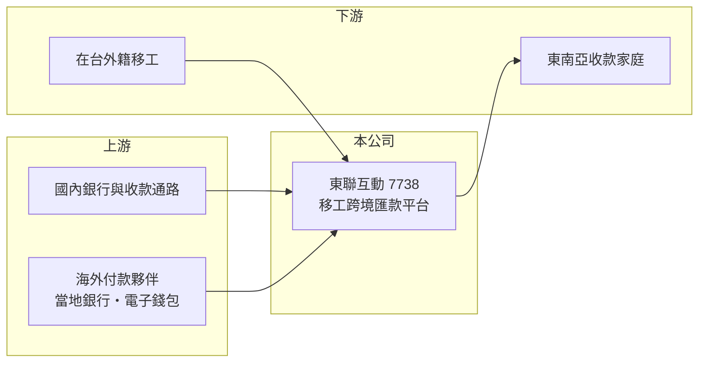

# 7738 東聯互動

> 上櫃｜[[產業索引-數位雲端|數位雲端]]｜上市（櫃）日期 2025/10/16

# 第一章：企業模式與商業藍圖

> [!info] 撰寫說明
> 精簡版，由 Claude 依公開資料整理，架構比照 [[2330台積電]]，資料截至 2026-10-08。來源：櫃買中心開放資料（基本資料、2026 年上半年綜合損益與資產負債、每月營收、本益比殖利率）、Goodinfo 年度經營績效（2022 至 2025 年）、nStock 公司簡介（主要營業項目、上櫃日期、股利）、優分析、科技新報與聯合新聞網 2025 年上櫃前報導標題。服務內容、合作通路與營收結構的公開資料有限。#待校對

東聯互動成立於 2016 年，主要營業項目是「提供臺灣外籍工作者跨境金流服務」，也就是協助在台移工把薪資匯回母國，2025 年 10 月上櫃，是台灣少數以移工[[跨境匯款]]為主業的上櫃公司。

- **核心業務：** 台灣有大量來自印尼、越南、菲律賓與泰國的移工，每月需要把薪資匯回家鄉。傳統管道是銀行匯款或地下匯兌，前者手續繁瑣、營業時間受限，後者有法律與資金安全風險。東聯互動以線上平台與通路提供合法、低額度的[[小額匯兌]]服務，收入來自每筆匯款的手續費與匯率價差（收入組成比例未查得）。
- **營收結構：** 本次查得的來源沒有公布國別或通路別的營收比重。從上櫃前報導標題來看，公司的定位是「鎖定外籍移工小額匯兌跨境金流」，並規劃拓展海外市場。營收由 2022 年的 1.64 億元成長到 2025 年的 5.65 億元，主要來自匯款筆數與金額的成長（推估）。
- **營運據點：** 公司登記於新北市土城區，服務對象是在台移工，匯款目的地主要是東南亞國家（各國比重未查得）。這類業務需要在匯入國有合作的付款通路，例如當地銀行、電子錢包或現金取款點，通路覆蓋面決定服務的便利性。
- **長期方向：** 長期方向是擴大移工客群的金流服務，並依上櫃前報導規劃拓展海外市場。台灣在 2023 年前後建立移工匯兌公司的專法管理制度（法規細節待校對），讓原本的地下匯兌逐步轉向合法業者，這是業者長期成長的結構性背景。

# 第二章：護城河深度與競爭優勢

東聯互動的護城河來自金融監理執照的門檻、移工社群的口碑與海外付款通路，屬窄護城河，但目前公開資訊不足以完整評估。

- **競爭優勢：** 跨境匯款需要主管機關許可、[[洗錢防制]]系統與海外付款夥伴，新進者很難快速複製。移工族群高度依賴同鄉口碑與社群推薦，一旦習慣某個匯款管道，除非費率差距明顯，否則不常更換，這讓先進者享有用戶黏著度。
- **主要對手：** 對手包括銀行的跨境匯款服務、其他取得許可的移工匯兌業者、國際匯款平台（如 Western Union、Wise），以及仍然存在的地下匯兌。地下匯兌常以較好的匯率吸引客戶，是合法業者最直接的價格競爭。
- **觀察重點：** 長期要看在台移工人數的變化、合法管道對地下匯兌的替代速度，以及公司能否把匯款用戶延伸到儲值、繳費、保險等其他金融服務，讓單一客戶的價值提高。

# 第三章：財務體質與盈利規模

資料日期：2026-10-08，表格是撰寫當時的快照；最新月營收、毛利率、累計 EPS 由自動排程寫在本筆記的屬性欄位（月營收、毛利率、累計EPS 等）。#待校對

東聯互動近三年營收與獲利快速成長，但財報結構特殊，營業利益高於營業毛利，閱讀數字時需要特別注意。

| 年度 | 營收（億元） | [[毛利率]] | [[營業利益率]] | EPS（元） | [[ROE]] |
|---|---|---|---|---|---|
| 2021 | 未查得 | 未查得 | 未查得 | 未查得 | 未查得 |
| 2022 | 1.64 | 29.5% | 19.9% | 1.02 | 5.25% |
| 2023 | 3.41 | 42.6% | 30.0% | 3.01 | 12.2% |
| 2024 | 4.34 | 49.0% | 74.3% | 9.51 | 24.9% |
| 2025 | 5.65 | 55.1% | 85.7% | 14.61 | 22.6% |
| 2026 上半年 | 3.06 | 55.4% | 69.3% | 5.94 | 未查得 |

註：2022 至 2025 年取自 Goodinfo，2026 年上半年取自櫃買中心開放資料（營業毛利 1.70 億元、營業利益 2.12 億元、稅後淨利 1.62 億元）。2024 年起營業利益高於營業毛利，代表營業利益中含有金額可觀的「其他收益」項目，推估與匯兌相關收益的會計分類有關，實際內容需以財報附註為準。

- **長期指標：** 2022 至 2025 年營收從 1.64 億元成長到 5.65 億元，年複合成長率約 51%（推算）；2022 至 2025 年平均 ROE 約 16%（推算）。最近一次現金股利每股 10 元，以 2025 年 EPS 14.61 元計算配息率約 68%。
- **[[ROIC]] 與 [[WACC]]：** 2025 年營業利益約 4.84 億元（5.65 億元 × 85.7%），稅後營業利益約 3.87 億元；2026 年 6 月底股東權益 18.86 億元，負債 6.30 億元幾乎全為流動負債，推估多為待匯付的客戶款項，有息負債視為接近零，ROIC 約 20%（推算）。WACC 約 7.75%（推算：無風險利率 1.75%、市場風險溢酬 6%、β 取金融科技常見值 1.0，無負債）。ROIC 明顯高於 WACC，代表目前模式創造價值；但若營業利益中的其他收益屬於波動性高的項目，實際本業利差可能較小。
- **財務特色：** 2026 年 6 月底總資產 25.2 億元、負債比率約 25%，每股淨值 68.93 元。匯款業務先收客戶款、再於海外撥付，帳上會有大量在途資金，現金部位與流動負債會隨匯款量同步變動。

# 第四章：總體風險與地緣政治

東聯互動的風險集中在法規、移工政策、匯率與洗錢防制。

- **產業週期：** 業務量取決於在台移工人數與薪資水準，與台灣製造業、看護需求及勞動政策高度相關；農曆年、開齋節等節慶前匯款量較高，季節性明顯。
- **營運風險：** 收入結構中可能包含匯率價差，新台幣與東南亞貨幣的匯率波動會影響獲利，且營業利益含有大額其他收益，年度間可能起伏。服務對象集中在單一族群與少數匯入國，任何一國的通路或政策變動都會造成影響。
- **其他風險：** 跨境匯款受金管會與央行監理，洗錢防制、實名認證與資安要求持續提高，違規可能面臨罰款或停業；地下匯兌與數位錢包的價格競爭，以及海外合作通路的穩定度，也是長期風險。

# 專有名詞解析

## 金融

- **[[跨境匯款]]**：把資金從一國匯到另一國的服務，費用通常包含手續費與匯率價差。
- **[[小額匯兌]]**：針對單筆金額不高的個人匯款所設計的服務，在台灣主要服務外籍移工匯回母國的薪資。
- **[[洗錢防制]]**：要求金融業者確認客戶身分、監控可疑交易並申報，以防止非法資金流動的規範，英文縮寫 AML。
- **[[ROIC]]**：投入資本報酬率，稅後營業利益除以股東權益加有息負債，衡量本業運用資本的效率。
- **[[WACC]]**：加權平均資金成本，股東與債權人要求報酬率的加權平均，是 ROIC 要超越的門檻。

# 核心供應鏈

- 上游：國內合作銀行與收款通路、東南亞各國的付款合作夥伴（具體名單未查得）。
- 下游／客戶：在台外籍移工，以及在印尼、越南、菲律賓等國收款的家屬（各國比重未查得）。
- 同業：銀行跨境匯款、其他移工匯兌業者、Western Union、Wise 等國際匯款平台。

## 最新新聞
<!-- news:start（自動產生，請勿手動編輯此範圍） -->
- 2026-10-07 🏛️ 重訊 17:18｜公告本公司發行國內第一次無擔保轉換公司債完成訂價｜[觀測站](https://mops.twse.com.tw/mops/#/web/t05st01)
- 2026-10-07 🏛️ 重訊 17:17｜公告本公司國內第一次無擔保轉換公司債代收價款行庫 及存儲專戶行庫｜[觀測站](https://mops.twse.com.tw/mops/#/web/t05st01)

完整紀錄：[[7738東聯互動 新聞]]
<!-- news:end -->

## 相關連結
- [公開資訊觀測站](https://mopsov.twse.com.tw/mops/web/t05st03?step=1&firstin=1&co_id=7738)
- [Goodinfo](https://goodinfo.tw/tw/StockDetail.asp?STOCK_ID=7738)
- [Yahoo 股市](https://tw.stock.yahoo.com/quote/7738)
- [鉅亨網新聞](https://www.cnyes.com/twstock/7738/news)
