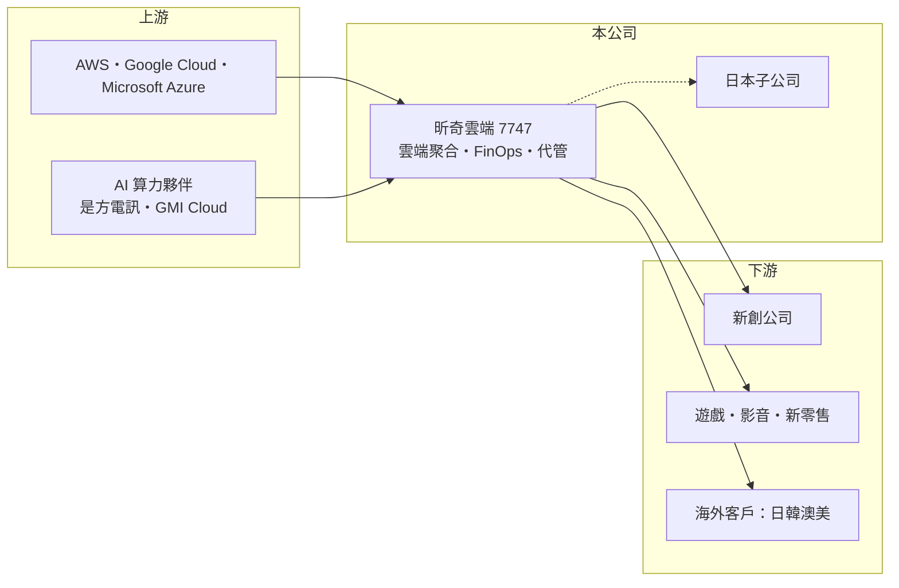

# 7747 昕奇雲端

> 上櫃｜[[產業索引-數位雲端|數位雲端]]｜上市（櫃）日期 2025/07/11

# 第一章：企業模式與商業藍圖

> [!info] 撰寫說明
> 精簡版，由 Claude 依公開資料整理，架構比照 [[2330台積電]]，資料截至 2026-10-08。來源：櫃買中心開放資料（基本資料、2026 年上半年綜合損益與資產負債、每月營收、本益比殖利率）、Goodinfo 年度經營績效（2022 至 2025 年）、優分析 2025 年上櫃前個股分析（業務模式、合作原廠、日本子公司、客戶策略）、Yahoo 股市與工商時報報導標題。原廠別營收比重未查得。#待校對

昕奇雲端成立於 2017 年，是 [[6123上奇]] 旗下的雲端服務子公司，身為 AWS、Google、Microsoft 的合作夥伴，以[[FinOps]]平台協助企業管理與節省雲端費用，客戶以新創公司為主，2025 年 7 月上櫃。

- **核心業務：** 昕奇的商業模式是「雲端聚合與雲共享」：替企業代購[[公有雲]]資源，透過整合帳單與合併用量取得較好的計價，再加上顧問諮詢、資安監控與 SaaS 服務；這種角色在業界稱為[[雲端代管服務商]]。和其他雲端代理商相比，昕奇特別強調雲端成本最佳化，幫客戶在不同方案間調整，降低每月帳單。
- **營收結構：** 公司未在本次查得的來源公布原廠別比重。依優分析整理，2025 年第一季雲端服務營收年增 44%，日本市場約占整體營收 13%；AWS 客戶的平均季度貢獻度創新高、客戶流失率下降。營收大部分是轉售雲端用量，因此毛利率只有 15% 至 20%。
- **營運據點：** 總部在台北市內湖區，2023 年成立日本子公司，2024 年開始貢獻營收、據稱半年即損益兩平；2025 年的成長重點放在南韓、澳洲與美國，日本與新加坡也是潛在重點市場。客戶以國內外新創為主，策略名稱為「A Friend to Startups」，涵蓋行動應用、影音遊戲、新零售與線上學習等產業。
- **長期方向：** 公司正投入 AI 雲算力生態系，與 [[6561是方]]、GMI Cloud 合作，並與興櫃公司凱鈿結盟。新創客戶成長時用雲量會倍增，若昕奇能在客戶早期就建立關係，將隨客戶一起長大，這是「新創之友」策略背後的長期邏輯。

# 第二章：護城河深度與競爭優勢

昕奇的護城河來自多原廠合作資格、新創客戶的早期綁定與 FinOps 工具，但轉售業務同質性高，屬窄護城河。

- **競爭優勢：** 同時是 AWS、Google、Microsoft 的合作夥伴，能替客戶在多雲之間比價與搭配，這是單一原廠代理商較難提供的。FinOps 平台累積了大量用量數據與計價經驗，客戶一旦把帳務集中在昕奇，更換服務商就要重新整理帳單與權限，形成轉換成本。
- **主要對手：** 國內同業包括 [[6997博弘]]、[[6689伊雲谷]]、[[6925意藍]] 的雲端代理業務，以及 [[6214精誠]] 等系統整合商；國際上有各大雲端原廠的直接銷售與全球型雲端代管業者。原廠若對成長快速的新創直接簽約，代理商的空間會縮小。
- **觀察重點：** 長期要看海外營收能否持續擴大，以及 AI 算力服務能否成為新的利潤來源；也要觀察毛利率能否止跌，因為 2022 年以來毛利率逐年下滑，代表轉售價格競爭加劇或服務收入比重下降。

# 第三章：財務體質與盈利規模

資料日期：2026-10-08，表格是撰寫當時的快照；最新月營收、毛利率、累計 EPS 由自動排程寫在本筆記的屬性欄位（月營收、毛利率、累計EPS 等）。#待校對

昕奇的營收穩定成長，但毛利率逐年下滑，ROE 在上櫃增資後由兩成降到一成多。

| 年度 | 營收（億元） | [[毛利率]] | [[營業利益率]] | EPS（元） | [[ROE]] |
|---|---|---|---|---|---|
| 2021 | 未查得 | 未查得 | 未查得 | 未查得 | 未查得 |
| 2022 | 8.76 | 19.6% | 9.43% | 3.24 | 18.1% |
| 2023 | 10.5 | 17.7% | 8.31% | 3.35 | 18.1% |
| 2024 | 14.3 | 16.1% | 8.41% | 4.07 | 20.9% |
| 2025 | 15.7 | 14.8% | 7.66% | 4.04 | 14.2% |
| 2026 上半年 | 8.74 | 15.7% | 10.2% | 2.74 | 未查得 |

註：2022 至 2025 年取自 Goodinfo，2026 年上半年取自櫃買中心開放資料（營業毛利 1.37 億元、營業利益 0.89 億元）。

- **長期指標：** 2022 至 2025 年營收年複合成長率約 21%（推算），平均 ROE 約 18%（推算）。最近一次現金股利每股 4 元，以 2025 年 EPS 4.04 元計算配息率接近 100%，屬高配息政策。2026 年上半年營業利益率回升到一成以上，費用控制改善。
- **[[ROIC]] 與 [[WACC]]：** 2025 年營業利益約 1.20 億元（15.7 億元 × 7.66%），稅後營業利益約 0.96 億元；2026 年 6 月底權益總計 9.95 億元，負債 4.61 億元幾乎全為應付原廠的流動負債，有息負債視為接近零，ROIC 約 10%（推算）。WACC 約 7.75%（推算：無風險利率 1.75%、市場風險溢酬 6%、β 取資訊服務同業常見值 1.0，無負債）。ROIC 高於 WACC 約 2 個百分點，利差不大；上櫃募得的現金若扣除，本業報酬會更高，但仍需提升毛利率來擴大利差。
- **財務特色：** 2026 年 6 月底負債比率約 32%，每股淨值 35.12 元；轉售模式先向客戶收款再付原廠，資本需求低，主要投入在人力與自建平台。

# 第四章：總體風險與地緣政治

昕奇的風險在於原廠政策、新創客戶的波動與毛利率下滑趨勢。

- **產業週期：** 新創客戶的用雲量隨募資環境起伏，創投資金緊縮時新創會大幅刪減雲端支出，甚至倒閉，造成營收與壞帳風險；反之，資金寬鬆時用量成長快。
- **營運風險：** 獲利依賴原廠的折扣與回饋制度，原廠調整合作夥伴分級或直接接觸大客戶，都會壓縮代理商利潤。毛利率由 2022 年的 19.6% 降到 2025 年的 14.8%，若持續下滑，營業利益將難以跟上營收成長。
- **其他風險：** 雲端費用多以美元計價，海外子公司另有日圓等匯率風險；母公司 [[6123上奇]] 的集團策略會影響資源分配；AI 算力合作屬新領域，投資回收期不確定。

# 專有名詞解析

## 應用

- **[[公有雲]]**：由雲端業者建置、多家企業共用並按用量付費的運算與儲存服務，例如 AWS、Azure、GCP。
- **[[FinOps]]**：雲端財務營運，持續監控與調整雲端用量與計價方案，讓企業的雲端支出最有效率。
- **[[雲端代管服務商]]**：替企業轉售雲端資源並負責架構設計、搬遷、帳務與維運的服務商，英文常稱 MSP。

## 金融

- **[[ROIC]]**：投入資本報酬率，稅後營業利益除以股東權益加有息負債，衡量本業運用資本的效率。
- **[[WACC]]**：加權平均資金成本，股東與債權人要求報酬率的加權平均，是 ROIC 要超越的門檻。

# 核心供應鏈

- 上游：[[AMZN亞馬遜]] AWS、[[GOOGL谷歌]] Google Cloud、[[MSFT微軟]] Azure；AI 算力合作夥伴 [[6561是方]]、GMI Cloud。母公司為 [[6123上奇]]。
- 下游／客戶：國內外新創公司，涵蓋行動應用、影音遊戲、新零售與線上學習（客戶名單未查得）。
- 同業：[[6997博弘]]、[[6689伊雲谷]]、[[6214精誠]]，以及雲端原廠直銷團隊。

## 最新新聞
<!-- news:start -->
<!-- news:end -->

## 相關連結
- [公開資訊觀測站](https://mopsov.twse.com.tw/mops/web/t05st03?step=1&firstin=1&co_id=7747)
- [Goodinfo](https://goodinfo.tw/tw/StockDetail.asp?STOCK_ID=7747)
- [Yahoo 股市](https://tw.stock.yahoo.com/quote/7747)
- [鉅亨網新聞](https://www.cnyes.com/twstock/7747/news)
