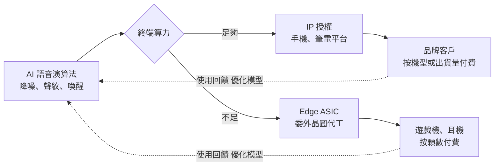
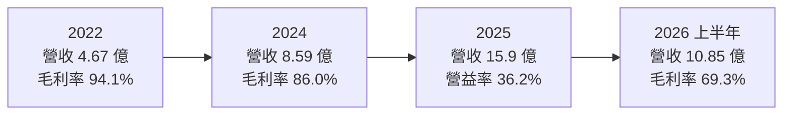
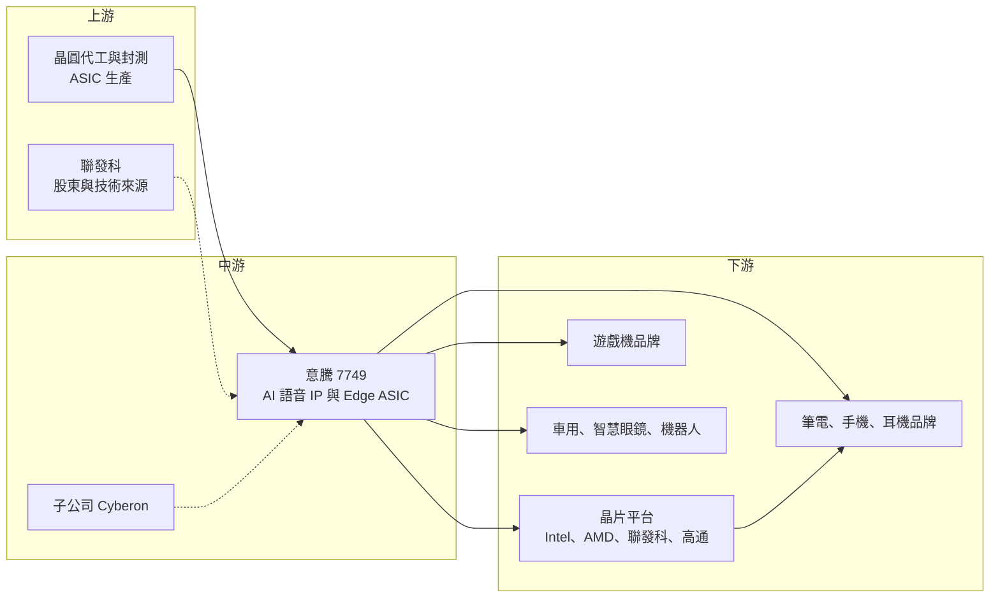

# 7749 意騰-KY

> 上市｜[[產業索引-半導體業|半導體業]]｜上市（櫃）日期 2025/06/13

# 第一章：企業模式與商業藍圖

> [!info] 撰寫說明
> 本文由 Claude 依公開資料整理，架構比照 [[2330台積電]] 的四章研究，資料截至 2026-10-08。財務數字來源：證交所開放資料快照（基本資料、2026 年第二季資產負債與綜合損益、股利）、Goodinfo 年度經營績效、富果法說會備忘錄（2025 年 8 月、2026 年 3 月）、證交所新上市公司介紹、工商時報、優分析；產業描述為整理性內容，尚未逐條比對原始文件。#待校對

在評估單一個股的長期投資價值時，首要步驟是拆解企業的底層獲利邏輯。本章針對意騰-KY（股票代號：7749，以下簡稱意騰）的商業模式進行定性分析，說明一家以 AI 語音演算法起家的公司，如何同時靠授權費與晶片銷售兩種方式賺錢。

## 一、核心定位：AI 語音處理的演算法與晶片供應商

依證交所新上市公司介紹，意騰成立於 2016 年，定位為專注 AI 邊緣運算解決方案的科技公司，2025 年 6 月以每股 330 元承銷價在台灣證券交易所上市，董事長暨總經理為顏志展。工商時報報導，[[2454聯發科]] 投資意騰並持股約 20%，雙方也在車用、智慧家庭與智慧零售的語音方案上合作；富果整理的 2025 年 8 月法說會內容則提到，意騰上市後延續與 [[6526達發]] 的合作模式。

意騰的核心技術是「讓機器聽得清楚」。它的技術聚焦在兩件事：人與人的語音通訊（例如通話時消除背景噪音、只保留說話者聲音）以及人與機器的語音互動（例如語音喚醒、語音指令辨識）。依證交所介紹，公司每年有數千萬台智慧裝置整合其語音方案，應用於真無線耳機、對講機、手機、筆電、遊戲機、會議電話、智慧家庭與車載系統。

## 二、終端應用板塊：兩種商業模式、多種終端

意騰沒有公開完整的營收比重，因此本文不畫圓餅圖。依富果整理的 2026 年 3 月法說會內容，意騰的商業模式分成兩個引擎：

* **AI 智財授權（[[IP]]）：** 當終端裝置的處理器算力足夠時（例如手機、筆電），意騰把語音演算法授權給品牌或晶片平台，按機型或出貨量收取授權費。這部分幾乎沒有生產成本，毛利率極高。
* **AI Edge ASIC 晶片：** 當終端裝置算力不足時（例如遊戲機手把、耳機），意騰提供內含自家演算法的專用晶片（[[ASIC]]）。晶片需要委託晶圓代工生產，毛利率低於授權，但每台裝置的營收金額較高。

工商時報報導，公司預期 2025 年 IP 與 ASIC 營收約各占一半。依產品線來看：

* **遊戲機：** 以 ASIC 為主，是 2025 年最主要的成長動能，富果整理指出全年成長約 150%。工商時報報導意騰打入任天堂 Switch 2 供應鏈，其 IG2200 晶片支援 GameChat 語音功能。遊戲機的銷售週期約 8 年，一旦打入可帶來長期出貨。
* **手機：** 以聲紋降噪技術打入中高階手機，2025 年成長約 140%，以 IP 授權為主。
* **筆電：** 導入全球前三大筆電品牌之一的全線機種，2025 年成長約 50%。
* **耳機與聲學周邊：** 同時有 IP 與 ASIC 兩種模式，2025 年成長約 60%。
* **子公司 Cyberon：** 富果整理提到子公司 Cyberon，以語音辨識 IP 授權為主。

## 三、資本轉化邏輯：演算法一次開發、多平台授權

意騰的獲利邏輯是「一次開發、多次銷售」。語音演算法的研發成本大多是工程師人力，開發完成後可以授權給不同平台、不同品牌，每多一個客戶的邊際成本很低。富果整理指出，意騰的演算法可部署在 Intel、AMD、聯發科、高通等平台，跨平台部署能力本身就是護城河的一部分。

ASIC 則是延伸商業模式的工具：在耳機、遊戲手把這類算力有限的裝置中，光有演算法不夠，必須搭配低功耗的專用晶片。透過 ASIC，意騰可以把演算法的價值轉成實體產品，擴大每台裝置的營收，代價是毛利率下降。2025 年毛利率由 86% 降到 76.1%，富果整理的原因正是 ASIC 占比提高。

2025 年 8 月意騰宣布取得聯發科的音訊編解碼器（[[Audio Codec]]）與 D 類放大器技術及相關資產，這讓它的產品線從「語音處理演算法」往「完整音訊晶片」延伸。

## 四、企業長期藍圖

* **人機語音互動的新終端：** 富果整理指出，智慧眼鏡預計 2026 年有台灣品牌客戶進入量產初期，日本與中國客戶評估中；車用已在中國與東南亞量產出貨，並承接日本一線車廠專案；機器人預計 2026 年進入量產初期，應用於商場客服、教育與陪伴照護。這些都是需要在吵雜環境中準確辨識說話者的場景。
* **結合 Edge LLM：** 公司以分區收音、AI 聲紋降噪加上裝置端的大型語言模型作為賣點，目標是成為裝置端語音 AI 的關鍵元件供應商。
* **股利政策：** 公司表示未來目標現金配息率不低於 50%（富果）。

# 第二章：護城河深度與競爭優勢

本章分析意騰在語音 AI 市場的護城河，以及它面對大型晶片平台與演算法公司時的競爭位置。

## 一、護城河的核心組成要素

* **底層 AI 語音模型：** 富果整理指出，公司認為技術護城河包括底層 AI 模型建構、跨平台 Edge AI 部署，以及與國際品牌的系統整合。在吵雜環境中鎖定特定說話者、避免誤喚醒，需要長期累積的聲學資料與模型訓練經驗。
* **跨平台與軟硬整合：** 同時提供 IP 與 ASIC，讓意騰能服務算力高低不同的裝置。對品牌客戶來說，同一套演算法可以從手機、筆電延伸到耳機與遊戲機，降低整合成本。
* **大客戶的設計導入：** 打入遊戲機主流平台與全球前三大筆電品牌，代表意騰的技術已通過國際品牌的嚴格驗證。這類客戶的產品週期長，一旦導入就有多年的出貨。
* **聯發科生態系：** 聯發科持股約 20%，並與意騰合作車用等語音方案，讓意騰能接觸聯發科平台的客戶。

## 二、全球主要競爭對手格局

| 對手 | 定位 | 對意騰的威脅 |
|---|---|---|
| [[QCOM高通]]、[[2454聯發科]] 等晶片平台 | 手機與耳機 SoC 內建語音處理 | 平台若自行開發同等演算法，授權需求會減少 |
| 歐美語音 AI 公司（如 Cerence、Sensory 等） | 車用語音助理與喚醒詞授權 | 在車用與語音辨識授權直接競爭（推估，來源未點名） |
| 歐美降噪演算法公司 | 通話降噪軟體授權 | 在筆電與會議系統搶相同客戶（推估） |
| 音訊晶片廠（如 Cirrus Logic、[[2379瑞昱]]） | 音訊編解碼與 DSP 晶片 | 在 ASIC 與音訊晶片市場競爭（推估） |

註：上表對手為產業常見的競爭者類型，來源未逐一點名，屬整理性推估。

## 三、優勢轉化：哪些市場守得住、哪些守不住

* **守得住：** 已導入的遊戲機平台與筆電全線機種。這些設計在產品週期內不太會更換，而遊戲機約 8 年的週期提供長期能見度。
* **守不住：** 一般耳機與消費性周邊的授權單價。這類市場競爭者多，客戶對價格敏感，而且晶片平台可能逐步把基本降噪功能內建。
* **觀察重點：** 遊戲機以外的 ASIC 能否找到第二個大量出貨的終端；智慧眼鏡、機器人與車用能否從量產初期走向大量出貨；以及取得聯發科音訊技術後，能否開發出更完整的音訊晶片。

# 第三章：財務體質與盈利規模

資料日期：2026-10-08。數字取自證交所開放資料、Goodinfo 年度經營績效與富果法說會備忘錄，表格是撰寫當時的快照；最新月營收、毛利率、累計 EPS 由自動排程寫在本筆記的屬性欄位（月營收、毛利率、累計EPS 等）。#待校對

財務報表是檢驗護城河是否真實存在的最終標準。本章用多年度三率、ROE、現金流與資本報酬，檢視意騰的獲利品質。

## 一、獲利能力的基石：三率

| 年度 | 營收（新台幣） | [[毛利率]] | [[營業利益率]] | EPS（元） | [[ROE]] |
|---|---|---|---|---|---|
| 2021 | 未查得 | 未查得 | 未查得 | 未查得 | 未查得 |
| 2022 | 4.67 億 | 94.1% | 19.8% | 5.74 | 93.7% |
| 2023 | 6.00 億 | 95.0% | 26.9% | 2.33 | 13.9% |
| 2024 | 8.59 億 | 86.0% | 26.8% | 7.17 | 22.2% |
| 2025 | 15.9 億 | 76.1% | 36.2% | 11.77 | 20.8% |
| 2026 上半年 | 10.85 億 | 69.3% | 36.2% | 7.57 | 未查得 |

註：2022 年 ROE 93.7% 是在上市前較小的股東權益下計算，不具長期代表性。2026 上半年取自證交所開放資料。

* **[[毛利率]]：** 毛利率由 95% 一路降到約 69%，這不是競爭惡化，而是商業模式改變：ASIC 晶片銷售占比提高，晶片有晶圓與封測成本，毛利率自然低於純授權。投資人應該把這種下降理解為「用毛利率換營收規模」。
* **[[營業利益率]]：** 毛利率雖下降，營業利益率卻由 2022 年的 19.8% 提升到 36.2%。原因是營收快速放大，研發費用的成長速度慢於營收，費用率由 2024 年的 59.2% 降到 2025 年的 39.9%（富果）。
* **長期指標：** 2022 至 2025 年營收年複合成長率約 50.4%（推算）；2022 至 2025 年平均 ROE 約 37.6%（推算），扣除 2022 年異常值後約 19%（推算）。

## 二、[[ROE]]：資本效率

意騰 2026 年第二季底股東權益約 37.0 億元，其中資本公積約 27.3 億元，主要來自上市募資；流動資產約 37.9 億元，負債僅約 8.0 億元。和多數剛上市的成長型公司一樣，帳上大量現金壓低了 ROE，但 2024 至 2025 年 ROE 仍維持在 20% 以上，顯示本業的資本效率很高。

## 三、資本支出與自由現金流

* **[[CapEx]]：** IP 授權與 Fabless 晶片設計都是輕資產模式，非流動資產約 7.2 億元，僅占總資產約 16%。2025 年取得聯發科音訊技術與資產，屬於以資本換取技術的投資，授權費用自 2025 年第四季開始攤提。
* **[[自由現金流]]：** 高毛利、低資本支出的結構，使意騰具備持續產生自由現金流的條件，多年度數字未查得。
* **股利：** 依證交所開放資料，2025 年度經股東會確認配發現金股利每股 9 元，對照 EPS 11.77 元，配發率約 76%（推算）；富果整理的 2026 年 3 月法說會備忘錄則寫擬配 7 元、配息率約 65%，兩者不一致，以證交所資料為準。公司目標現金配息率不低於 50%。

## 四、[[ROIC]] 與 [[WACC]]：價值創造利差

* **ROIC（推算）：** 以 2025 年營業利益 5.76 億元（富果）× (1 − 20%) ≈ 4.61 億元作為稅後營業利益；投入資本以 2026 年第二季股東權益 37.0 億元加非流動負債 0.41 億元（作為有息負債的上限近似）≈ 37.4 億元。ROIC ≈ 12.3%。以 2026 年上半年營業利益 3.92 億元年化計算，ROIC 約 16.8%。由於權益中大部分是現金，扣除現金後的營運 ROIC 會高出許多（推估）。
* **WACC（推算）：** 無風險利率取約 1.75%，市場風險溢酬 6%，β 取成長型 IC 設計同業常見值 1.3（未查得本身的 β），股東權益成本約 9.55%。意騰幾乎沒有有息負債，WACC 約 9.5%。
* **解讀：** 即使把上市募得的現金全部計入，ROIC 仍高於 WACC，而且以 2026 年上半年計算的利差正在擴大。這代表意騰的「演算法一次開發、多次授權」模式確實在創造價值。長期要觀察的是：隨著 ASIC 占比提高，資本需求（存貨、晶圓預付）會增加，ROIC 能否維持在 WACC 之上。

# 第四章：總體風險與地緣政治

任何企業都無法脫離宏觀環境獨立存在。本章分析意騰長期必須面對的地緣政治、產業週期與營運風險。

## 一、地緣政治

* **開曼註冊、台灣營運：** 意騰以開曼公司在台上市，營運據點在新竹竹北。客戶遍及北美、日本、中國，美中科技管制若擴大到 AI 演算法或邊緣 AI 晶片，可能影響對中國客戶的授權與出貨。
* **晶圓代工集中：** ASIC 委由具全球布局的代工夥伴生產（富果，未具名），若代工產能受地緣政治影響，ASIC 出貨會受衝擊。

## 二、產業週期與市場結構

* **遊戲機週期：** 遊戲機是 ASIC 的主要支柱，而遊戲機銷售有明顯的世代週期：新機上市前幾年出貨最強，之後逐年下滑。若沒有新的大量終端接棒，ASIC 營收可能在遊戲機週期後段走弱。
* **消費性電子景氣：** 手機、筆電、耳機都屬消費性電子，景氣下行時品牌會減少新機種，授權收入也會受影響。富果整理提到記憶體漲價對筆電的影響預估低於 3 個百分點。

## 三、營運環境的隱性風險

* **客戶集中：** 遊戲機與前三大筆電品牌是重要客戶，單一客戶的產品策略改變（例如改用自研方案）會明顯影響營收。客戶集中度數字未查得。
* **平台內建功能：** 晶片平台（手機與筆電 SoC）若把降噪與語音辨識直接內建，第三方演算法的授權空間可能縮小。
* **匯兌：** 富果整理指出 2025 年第二季曾有約 4,408 萬元的匯兌損失，營收以外幣計價為主，匯率波動會影響淨利。

## 四、科技或法規演進

生成式 AI 讓「語音」成為人與裝置互動的主要介面，智慧眼鏡、機器人與車用都需要在吵雜環境中準確聽懂使用者，這是意騰最大的長期機會。但同樣的趨勢也吸引大型科技公司投入，若大型語言模型本身具備強大的抗噪與說話者辨識能力，專用演算法的價值可能被稀釋。此外，語音資料涉及個人隱私，各國對語音資料蒐集與處理的法規若趨嚴，裝置端（Edge）處理反而可能更受青睞，這對主打邊緣運算的意騰是相對有利的方向。

# 專有名詞解析

## 半導體

- **[[IP]]**：矽智財，可重複授權的電路設計或演算法模組，客戶付授權金或權利金使用。
- **[[ASIC]]**：特殊應用積體電路，為特定用途設計的專用晶片，效能與功耗優於通用處理器。
- **[[Edge AI]]**：邊緣 AI，在終端裝置上直接執行 AI 運算，不需把資料傳到雲端，延遲低且保護隱私。
- **[[DSP]]**：數位訊號處理器，專門處理聲音、影像等連續訊號的處理器，語音降噪常在 DSP 上執行。
- **[[Audio Codec]]**：音訊編解碼器，負責類比聲音與數位訊號之間轉換的晶片。
- **[[Fabless]]**：無晶圓廠的 IC 設計公司，只負責設計，製造交給晶圓代工廠。

## 應用

- **[[聲紋降噪]]**：利用說話者聲音特徵辨識並保留目標聲音、過濾其他人聲與背景噪音的技術。
- **[[語音喚醒]]**：裝置在待機時持續聆聽特定關鍵詞，聽到後才啟動完整語音功能，需要低功耗與低誤觸率。
- **[[TWS]]**：真無線藍牙耳機，左右耳機之間沒有線材連接，降噪與通話品質是主要賣點。
- **[[LLM]]**：大型語言模型，能理解與生成自然語言的 AI 模型，裝置端版本可搭配語音互動使用。

## 金融

- **[[ROIC]]**：投入資本報酬率，衡量公司每投入一元營運資本能產生多少稅後營業利益。
- **[[WACC]]**：加權平均資金成本，股東與債權人要求報酬的加權平均，是 ROIC 要超越的門檻。

# 核心供應鏈

## 1. 上游：晶圓代工與技術來源
- ASIC 晶圓代工與封測（具全球布局的代工夥伴，名稱未查得）
- 技術與股東：[[2454聯發科]]（持股約 20%，2025 年出售音訊編解碼與 D 類放大器技術資產予意騰）；合作夥伴 [[6526達發]]

## 2. 中游：意騰本身
- 子公司 Cyberon（語音辨識 IP）

## 3. 下游：平台與品牌
- 可部署平台：[[INTC英特爾]]、[[AMD超微]]、[[2454聯發科]]、[[QCOM高通]]
- 遊戲機：任天堂 Switch 2 供應鏈（工商時報）
- 全球前三大筆電品牌之一、中高階手機品牌、日本消費電子品牌耳機

## 4. 同業
- 晶片平台內建語音方案、歐美語音 AI 與降噪演算法公司、音訊晶片廠

延伸閱讀：[[聯發科供應鏈]]

## 最新新聞
<!-- news:start -->
<!-- news:end -->

## 相關連結
- [公開資訊觀測站](https://mopsov.twse.com.tw/mops/web/t05st03?step=1&firstin=1&co_id=7749)
- [Goodinfo](https://goodinfo.tw/tw/StockDetail.asp?STOCK_ID=7749)
- [Yahoo 股市](https://tw.stock.yahoo.com/quote/7749)
- [鉅亨網新聞](https://www.cnyes.com/twstock/7749/news)
