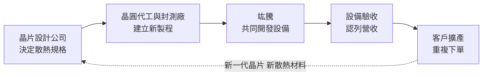
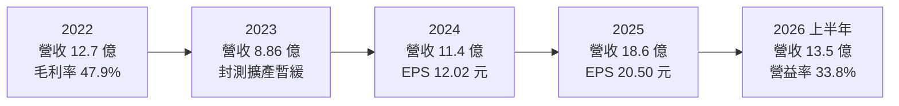
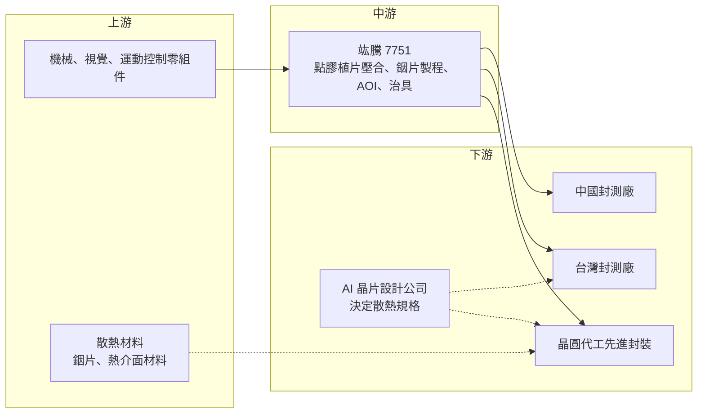

# 7751 竑騰

> 上櫃｜[[產業索引-半導體業|半導體業]]｜上市（櫃）日期 2025/08/26

# 第一章：企業模式與商業藍圖

> [!info] 撰寫說明
> 本文由 Claude 依公開資料整理，架構比照 [[2330台積電]] 的四章研究，資料截至 2026-10-08。財務數字來源：櫃買中心開放資料快照（基本資料、2026 年第二季資產負債與綜合損益）、Goodinfo 年度經營績效與股利政策、ETtoday、理財周刊、優分析；產業描述為整理性內容，尚未逐條比對原始文件。#待校對

在評估單一個股的長期投資價值時，首要步驟是拆解企業的底層獲利邏輯。本章針對竑騰科技（股票代號：7751，以下簡稱竑騰）的商業模式進行定性分析，說明一家高雄的封測自動化設備商，如何因為 AI 晶片散熱方式的改變，從一般設備廠轉型為先進封裝的關鍵設備供應商。

## 一、核心定位：封測後段的自動化與散熱製程設備

竑騰成立於 1994 年，總部與工廠位於高雄楠梓，2025 年 8 月在櫃買中心上櫃，董事長為王獻儀、總經理為徐嘉新。依 ETtoday 報導，公司自述深耕半導體封測產業逾 30 年，累積台灣、中國、日本、馬來西亞與美國專利 55 項。

竑騰的設備用在封裝的後段：當晶片完成封裝後，需要在晶片上方貼上熱介面材料（[[TIM]]）與均熱片（金屬蓋），讓晶片運作時產生的熱可以傳導出去，最後再以自動光學檢測（[[AOI]]）確認貼合品質。這些步驟聽起來簡單，但 AI 晶片面積大、功耗高，熱介面材料的厚度、平整度與氣泡都會影響散熱效率，進而影響晶片效能與壽命。竑騰的角色就是提供能精準、穩定完成這些步驟的自動化設備。

理財周刊報導指出，竑騰已從一般半導體設備廠轉型為 AI 封測與先進封裝自動化的重要供應商。

## 二、終端應用板塊：四類產品

竑騰沒有公開各產品的營收比重，因此本文不畫圓餅圖。依 ETtoday 與優分析報導，主要產品如下：

* **點膠植片壓合機：** 用於晶片、熱介面材料與均熱片的點膠、放置與熱壓製程。ETtoday 報導將其列為高毛利產品，並指出技術門檻高、競爭者少。
* **銦片（Metal TIM）製程設備：** [[銦片]]是以金屬銦製成的熱介面材料，導熱效果遠優於傳統的導熱膏或石墨片。竑騰提供從熱介面材料、散熱片貼合、框膠點膠、熱壓到 AOI 的全製程自動化。優分析報導，輝達 Rubin 平台功耗約 2,300 瓦，高於 GB300 的 1,400 瓦，因此改採導熱係數為石墨烯 2 至 3 倍的銦片散熱，帶動相關機台需求。
* **AOI 與 AI 視覺檢測設備：** 檢查貼合後是否有氣泡、偏移或缺陷。理財周刊報導公司正布局更高階的 AOI 與 AI 視覺檢測技術。
* **封裝治具：** 生產過程中固定與搬運封裝體的耗材型產品，也被列為高毛利產品。

此外，優分析報導竑騰已有 [[CoWoP]] 相關製程設備出貨給矽品。CoWoP 讓晶片直接與電路板結合，封裝尺寸放大後翹曲問題加劇，需要新的製程設備。

## 三、資本轉化邏輯：跟著封測廠擴產的設備生意

竑騰的營收來自封測廠的資本支出。它的商業模式有兩個特點。第一，設備規格往往由終端晶片設計公司的散熱需求決定，例如輝達決定改用銦片，封測廠就必須採購新的製程設備，而竑騰因為過去已有銦片貼合技術，可以搶先切入。第二，設備業以「客戶驗收」認列營收，櫃買中心的月營收備註也寫明「每月營收高低起伏屬常態」，因此單月或單季數字波動大，應以年度觀察。

ETtoday 報導，竑騰強調與國際設備商相比，具有在地化、即時化的客製化服務優勢，並與先進封裝客戶共同開發新材質的生產技術。這種共同開發模式，讓竑騰能在新製程確立的初期就成為指定設備商。

產能方面，理財周刊報導竑騰董事會通過以 4.6 億元透過第三地投資中國孫公司，預計在中國設廠以支應當地銷售需求。

## 四、企業長期藍圖

* **跟著 AI 晶片散熱升級：** AI 晶片功耗持續提高，散熱材料從導熱膏、石墨烯走向金屬銦，未來還可能出現新的材料與結構。竑騰的長期價值在於能否在每一次散熱材料轉換時，都成為最早的設備供應商。
* **從單機走向整線：** 銦片製程設備已涵蓋從貼合到檢測的全流程，若能把整線自動化能力複製到其他先進封裝製程，單一客戶的設備金額可望提高。
* **中國在地布局：** 中國封測廠受半導體自製化政策推動擴充 AI 與 [[HPC]] 產能，竑騰赴中國設廠是為了就近服務長電、華天、通富微電等客戶。
* **研發組織調整：** 理財周刊報導，董事會通過由原技術總監王裕賢出任技術長，強化技術路線與中長期產品開發。

# 第二章：護城河深度與競爭優勢

本章分析竑騰在封測自動化設備市場的護城河，以及這些優勢能否抵擋國際設備商與新進者。

## 一、護城河的核心組成要素

* **熱介面製程的先發優勢：** 竑騰在銦片成為 AI 晶片主流散熱材料之前，就已具備銦片貼合技術。當輝達新平台改採銦片時，它是少數能立即提供量產設備的供應商。先發優勢讓它可以參與客戶的製程定義，後進者則必須配合已經確立的規格。
* **一線封測客戶的長期關係：** ETtoday 報導，竑騰的長期客戶包括 [[2330台積電]]、[[3711日月光投控]]、矽品、[[6239力成]]，以及中國的長電紹興、華天與通富微電，已打入全球前七大封測業者供應鏈。這些客戶的設備驗證流程長，既有供應商具備明顯優勢。
* **客製化服務能力：** 封測製程的細節因客戶而異，設備需要大量客製化調整。在地設備商的工程師可以快速到廠支援，這是國際設備商較難做到的。

## 二、全球主要競爭對手格局

| 對手 | 定位 | 對竑騰的威脅 |
|---|---|---|
| 國際封裝設備商（如 ASMPT、Besi 等） | 全球封裝貼合與固晶設備大廠 | 具規模與全球服務網，可能把散熱貼合整合進產品線（推估，來源未點名） |
| 日系精密設備商 | 點膠、熱壓與檢測設備 | 在高精度設備具技術與品牌優勢（推估） |
| 台灣封測設備同業 | 如 [[3131弘塑]]、[[6640均華]]、[[3583辛耘]] 等 | 在台灣先進封裝擴產中爭取相同客戶的設備預算（推估） |
| 中國本土設備商 | 受自製化政策支持 | 在中國封測廠以價格與在地化競爭 |

註：ETtoday 報導僅提及竑騰相較「國際設備商」具在地服務優勢，未點名競爭者；上表為產業常見競爭者類型，屬整理性推估。

## 三、優勢轉化：哪些市場守得住、哪些守不住

* **守得住：** 已寫入客戶製程的銦片散熱與點膠植片壓合設備。在新一代 AI 平台的生命週期內，客戶擴產會重複採購相同設備。
* **守不住：** 散熱材料或結構改變時的先發地位。若下一代晶片改用其他散熱方式（例如直接液冷到晶片），竑騰必須重新爭取設備資格，既有優勢不一定能延續。
* **觀察重點：** 銦片製程是否從單一平台擴散成業界標準；CoWoP 等新封裝製程設備能否持續出貨；中國新廠的營運與當地需求能否支撐投資回報。

# 第三章：財務體質與盈利規模

資料日期：2026-10-08。數字取自櫃買中心開放資料、Goodinfo 年度經營績效與股利政策、財經媒體報導，表格是撰寫當時的快照；最新月營收、毛利率、累計 EPS 由自動排程寫在本筆記的屬性欄位（月營收、毛利率、累計EPS 等）。#待校對

財務報表是檢驗護城河是否真實存在的最終標準。本章用多年度三率、ROE、現金流與資本報酬，檢視竑騰的獲利品質。

## 一、獲利能力的基石：三率

| 年度 | 營收（新台幣） | [[毛利率]] | [[營業利益率]] | EPS（元） | [[ROE]] |
|---|---|---|---|---|---|
| 2021 | 未查得 | 未查得 | 未查得 | 未查得 | 未查得 |
| 2022 | 12.7 億 | 47.9% | 24.4% | 17.37 | 38.9% |
| 2023 | 8.86 億 | 49.6% | 21.5% | 6.65 | 15.6% |
| 2024 | 11.4 億 | 53.9% | 30.4% | 12.02 | 26.0% |
| 2025 | 18.6 億 | 55.5% | 34.8% | 20.50 | 28.3% |
| 2026 上半年 | 13.5 億 | 51.9% | 33.8% | 13.85 | 未查得 |

註：2022 年股本約 1.87 億元，2024 年後約 2.44 至 2.69 億元，EPS 不可直接比較。2026 上半年取自櫃買中心開放資料，毛利率與營業利益率以其營業毛利、營業利益除以營收推算。

* **[[毛利率]]：** 毛利率由 2022 年的 47.9% 提升到 2025 年的 55.5%，反映產品組合往高毛利的點膠植片壓合、AOI 與銦片製程設備移動。對設備公司來說，五成以上的毛利率代表產品具備相當的定價權。
* **[[營業利益率]]：** 由 21.5% 提升到 34.8%，營收放大後費用率下降，營運槓桿明顯。
* **營收波動：** 2023 年營收由 12.7 億元降到 8.86 億元，年減約三成，說明設備業營收高度跟隨封測廠的資本支出週期。
* **長期指標：** 2022 至 2025 年營收年複合成長率約 13.6%（推算）；2022 至 2025 年平均 ROE 約 27.2%（推算）。

## 二、[[ROE]]：資本效率

竑騰 2026 年第二季底股東權益約 23.7 億元，負債約 22.5 億元，負債比約 49%，其中流動負債約 21.8 億元。設備業常向客戶收取預收款（合約負債），這類負債不需付息，反而是客戶提供的營運資金；竑騰的高流動負債推估主要屬於這一類（負債細項未查得）。ROE 在 2024 至 2025 年維持在 26% 至 28%，即使上櫃後股東權益增加，資本效率仍然很高。

## 三、資本支出與自由現金流

* **[[CapEx]]：** 設備組裝屬輕資產，非流動資產僅約 2.9 億元，占總資產約 6%。近期最大的資本支出是透過第三地投資 4.6 億元在中國設廠。
* **[[自由現金流]]：** 設備業收取預收款的特性有利現金流，但出貨前的存貨與在製品也會占用資金。多年度自由現金流數字未查得。
* **股利：** 依 Goodinfo，2023、2024、2025 年度現金股利分別為 6 元、10 元、18 元，對照當年 EPS 6.65 元、12.02 元、20.50 元，配發率約 83% 到 90%（推算），屬高配息政策。

## 四、[[ROIC]] 與 [[WACC]]：價值創造利差

* **ROIC（推算）：** 以 2025 年營業利益約 6.47 億元（營收 18.6 億 × 34.8%）× (1 − 20%) ≈ 5.18 億元作為稅後營業利益；投入資本以 2026 年第二季股東權益 23.67 億元加非流動負債 0.68 億元（作為有息負債的上限近似）≈ 24.35 億元。ROIC ≈ 21.3%。以 2026 年上半年營業利益 4.56 億元年化計算，ROIC 約 30.0%。
* **WACC（推算）：** 無風險利率取約 1.75%，市場風險溢酬 6%，β 取先進封裝設備同業常見的較高值 1.4（未查得本身的 β），股東權益成本約 10.15%。竑騰的負債以不付息的營運負債為主，WACC 約 10%。
* **解讀：** ROIC 約 21% 到 30%，是 WACC 的兩到三倍，代表竑騰在目前的產品週期中大幅創造價值。不過設備業的 ROIC 會隨客戶擴產週期起伏，2023 年那樣的低谷年度，ROIC 可能明顯下降（2023 年 ROE 僅 15.6%）。長期能否維持高利差，取決於能否在每一代散熱與封裝技術轉換中持續拿到設備資格。

# 第四章：總體風險與地緣政治

任何企業都無法脫離宏觀環境獨立存在。本章分析竑騰長期必須面對的地緣政治、產業週期與營運風險。

## 一、地緣政治

* **中國客戶與中國設廠：** 竑騰的客戶包括長電、華天、通富微電等中國封測廠，並將在中國設廠。若美國擴大對中國 AI 與先進封裝的出口管制，中國業務可能受限；反之，中國半導體自製化也可能讓當地客戶轉向本土設備商。
* **客戶海外擴廠：** 台灣封測與晶圓代工客戶在美國、日本、東南亞擴廠，竑騰需要跟著提供海外服務，增加營運成本。

## 二、產業週期與市場結構

* **封測資本支出週期：** 2023 年營收年減約三成，是封測廠資本支出縮減的直接結果。AI 投資若放緩，竑騰的營收會受到同樣的衝擊。
* **單一平台依賴：** 優分析報導的兩大成長動能都與輝達新平台與先進封裝有關。若主要 AI 晶片的散熱或封裝路線改變，或 AI 晶片需求成長放緩，竑騰的成長動能會明顯減弱。
* **客戶集中：** 先進封裝產能集中在少數晶圓代工與封測龍頭，客戶集中度高（具體數字未查得）。

## 三、營運環境的隱性風險

* **營收認列時點：** 設備以客戶驗收認列營收，驗收延遲會使單季營收大幅波動，也可能使預估落空。
* **技術人才：** 客製化設備高度依賴工程團隊，技術長人事調整顯示公司正強化研發組織，關鍵人才流失會影響新製程開發。
* **中國新廠執行：** 4.6 億元的中國投資是公司上櫃後最大的單一資本支出，若當地需求或價格競爭不如預期，投資回報會受影響。

## 四、科技或法規演進

AI 晶片的散熱技術變化很快：從導熱膏、石墨烯到銦片，下一步可能是液冷直接接觸晶片、微流道散熱，或其他新材料。每一次技術轉換都是機會也是風險：竑騰若能持續與客戶共同開發，就能在新製程中保住位置；若錯過某一代轉換，既有設備的需求可能快速萎縮。此外，CoWoP、面板級封裝等新封裝形式讓封裝尺寸持續放大，貼合精度與翹曲控制的要求提高，對具備整線自動化能力的設備商相對有利。

# 專有名詞解析

## 半導體

- **[[先進封裝]]**：把多顆晶片以中介層、混合鍵合等方式高密度整合的封裝技術，例如 CoWoS、SoIC。
- **[[TIM]]**：熱介面材料，填在晶片與散熱片之間，填補微小空隙以提高導熱效率。
- **[[銦片]]**：以金屬銦製成的熱介面材料，導熱係數遠高於導熱膏與石墨片，用於高功耗 AI 晶片。
- **[[均熱片]]**：覆蓋在晶片上方的金屬蓋，把晶片局部熱點的熱量均勻擴散出去。
- **[[CoWoP]]**：晶片經中介層後直接接合到電路板、省去封裝載板的封裝方式，封裝尺寸大、翹曲控制難度高。
- **[[AOI]]**：自動光學檢測，以攝影機與影像演算法自動檢查產品外觀與貼合品質。
- **[[翹曲]]**：封裝體在受熱與冷卻時因材料膨脹係數不同而彎曲變形，封裝越大越嚴重。

## 應用

- **[[HPC]]**：高效能運算，泛指 AI 伺服器、資料中心等需要大量運算的應用。

## 金融

- **[[ROIC]]**：投入資本報酬率，衡量公司每投入一元營運資本能產生多少稅後營業利益。
- **[[WACC]]**：加權平均資金成本，股東與債權人要求報酬的加權平均，是 ROIC 要超越的門檻。

## 產業

- **[[合約負債]]**：客戶預先支付的貨款，在交貨或驗收前列為負債，不需付息，設備業常見。
- **[[驗收認列]]**：設備商在客戶完成機台驗收後才認列營收，因此營收時點取決於客戶驗收進度。

# 核心供應鏈

## 1. 上游：零組件與材料
- 機械、視覺與運動控制零組件供應商（具體名稱未查得）
- 散熱材料：銦片與熱介面材料（由封測客戶採購，具體供應商未查得）

## 2. 中游：竑騰本身
- 高雄楠梓總部與工廠；規劃中的中國孫公司工廠

## 3. 下游：封測與晶圓代工客戶
- 晶圓代工：[[2330台積電]]
- 台灣封測：[[3711日月光投控]]、矽品、[[6239力成]]
- 中國封測：長電紹興、華天、通富微電
- 終端規格制定者：[[NVDA輝達]]（優分析報導，間接受惠）

## 4. 同業
- 國際封裝設備商、[[3131弘塑]]、[[6640均華]]、[[3583辛耘]]、中國本土設備商

延伸閱讀：[[台積電供應鏈]]

## 最新新聞
<!-- news:start -->
<!-- news:end -->

## 相關連結
- [公開資訊觀測站](https://mopsov.twse.com.tw/mops/web/t05st03?step=1&firstin=1&co_id=7751)
- [Goodinfo](https://goodinfo.tw/tw/StockDetail.asp?STOCK_ID=7751)
- [Yahoo 股市](https://tw.stock.yahoo.com/quote/7751)
- [鉅亨網新聞](https://www.cnyes.com/twstock/7751/news)
