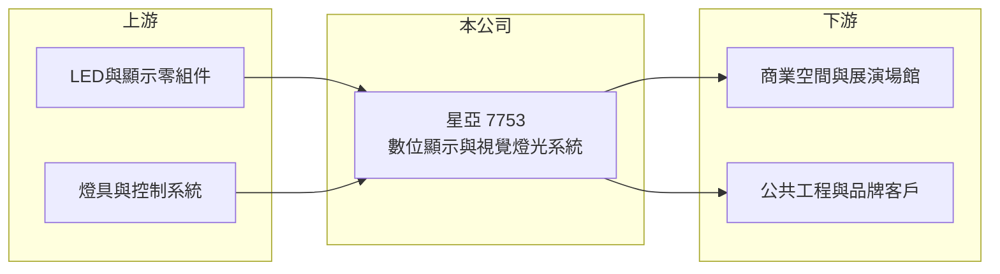

# 7753 星亞

> 上櫃｜[[產業索引-光電業|光電業]]｜上市（櫃）日期 2025/08/11

# 第一章：企業模式與商業藍圖

> [!info] 撰寫說明
> 精簡版，由 Claude 依公開資料整理，架構比照 [[2330台積電]]，資料截至 2026-10-07。來源：winvest.tw 星亞營收快訊（2026 年 6 至 8 月）。公開資料有限，產品別營收比重、客戶與營運據點未查到。#待校對

星亞視覺是 2025 年掛牌的年輕公司，做數位顯示與視覺燈光系統的設計、製造與售後服務。

- **核心業務：** 星亞成立於 2021 年 9 月，主要從事數位顯示系統、視覺燈光系統的研發設計、製造、銷售與售後服務，屬於[[系統整合]]型的光電公司。
- **營收結構：** 本次未查到顯示與燈光兩類業務的比重；2026 年 1 至 8 月累計營收 5.48 億元。
- **營運據點：** 營運與生產據點本次未查到，本文不推測。
- **長期方向：** 數位顯示與燈光系統多以專案形式交付，能否持續取得大型案場是成長關鍵（推估）。

# 第二章：護城河深度與競爭優勢

星亞的競爭力來自把顯示與燈光整合成完整系統並提供售後服務的能力（推估）。

- **競爭優勢：** 從設計、製造到售後一條龍，可承接需要客製化的[[數位看板]]與燈光工程，售後維護也帶來客戶黏著度（推估）。
- **主要對手：** 國內外 LED 顯示屏與燈光工程廠商，具體對手本次未查到。
- **觀察重點：** 專案接單與認列時點、下半年營收能否回到年增，以及獲利率能否維持。

# 第三章：財務體質與盈利規模

資料日期：2026-10-07，以下數字是撰寫當時的快照；最新月營收、毛利率、累計 EPS 由自動排程寫在本筆記的屬性欄位（月營收、毛利率、累計EPS 等）。#待校對

星亞營收規模不大，但每股獲利相對股本偏高。

- **營收規模：** 2026 年 6 月營收 8,405.6 萬元、年增 4.57%；7 月 6,095.5 萬元、年減 22.98%；8 月 6,963.4 萬元、年減 24.34%；1 至 8 月累計 5.48 億元，年減 8.66%。
- **獲利：** 2025 年全年 EPS 4.22 元；2026 年第二季 EPS 1.16 元，上半年累計 2.24 元、年增 12%。[[毛利率]]本次未查到。
- **財務特色：** 資本額約 2.50 億元、市值約 8.96 億元，股本小，獲利變動對 EPS 影響大。

# 第四章：總體風險與地緣政治

星亞的主要風險在於專案型營收的波動與掛牌時間短。

- **產業週期：** 數位顯示與燈光工程需求與商業空間、展演活動、公共建設等投資連動，景氣轉弱時專案可能延後。
- **營運風險：** 專案認列時點不平均，月營收波動大；下半年營收已連續年減，需留意全年獲利是否受影響。
- **其他風險：** LED 與顯示零組件價格、匯率，以及掛牌時間短、歷史財務資料有限。

# 專有名詞解析

## 應用

- **[[數位看板]]**：以 LED 或液晶螢幕播放廣告、資訊的電子看板，常見於零售、交通與公共空間。

## 金融

- **[[毛利率]]**：營業毛利占營收的比率，反映產品售價扣除直接成本後的獲利空間。

## 產業

- **[[系統整合]]**：把多家供應商的硬體、軟體與施工整合成完整解決方案交付給客戶的業務模式。

# 核心供應鏈

- 上游：LED與顯示零組件、燈具與控制系統供應商（推估）
- 下游／客戶：商業空間、展演場館、公共工程與品牌客戶（推估）
- 同業：國內外 LED 顯示屏與燈光工程商，名稱未查到

## 最新新聞
<!-- news:start -->
<!-- news:end -->

## 相關連結
- [公開資訊觀測站](https://mopsov.twse.com.tw/mops/web/t05st03?step=1&firstin=1&co_id=7753)
- [Goodinfo](https://goodinfo.tw/tw/StockDetail.asp?STOCK_ID=7753)
- [Yahoo 股市](https://tw.stock.yahoo.com/quote/7753)
- [鉅亨網新聞](https://www.cnyes.com/twstock/7753/news)
