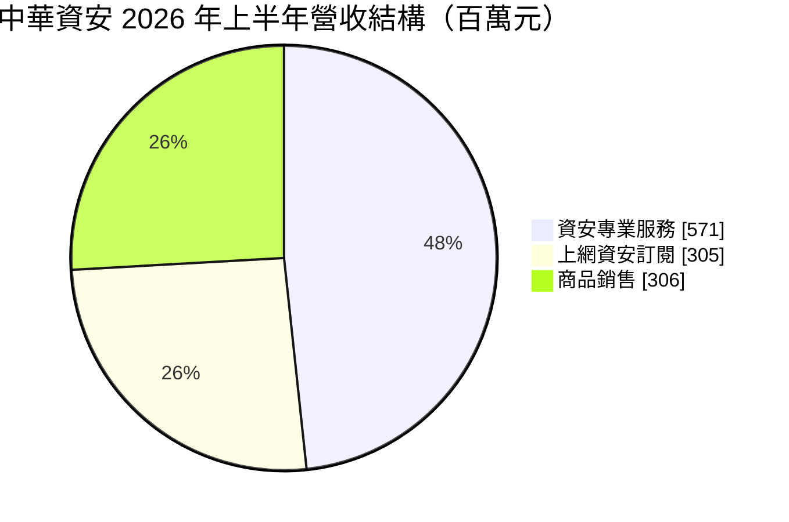
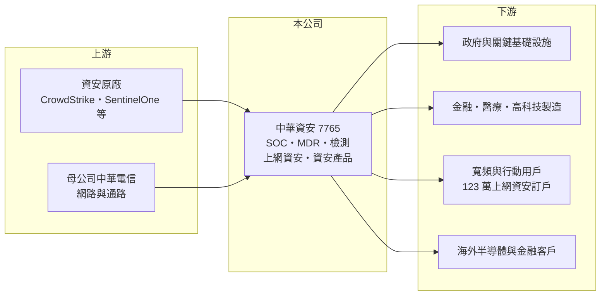

# 7765 中華資安

> 上市｜[[產業索引-數位雲端|數位雲端]]｜上市（櫃）日期 2025/09/08

# 第一章：企業模式與商業藍圖

> [!info] 撰寫說明
> 精簡版，由 Claude 依公開資料整理，架構比照 [[2330台積電]]，資料截至 2026-10-08。來源：證交所開放資料（基本資料、2026 年上半年綜合損益、營益分析、資產負債、股利、每月營收）、Goodinfo 年度經營績效（2021 至 2025 年）、富果研究 2026 年 8 月法說會摘要（2026 年上半年業務別營收、經常性收入、海外與策略）、數位時代與工商時報報導標題。中華電信持股比例與客戶產業比重未查得。#待校對

中華資安國際成立於 2017 年，由 [[2412中華電]] 的資安團隊分拆設立，是台灣規模最大的[[資安]]服務公司之一，提供資安監控、檢測、上網資安訂閱與資安產品，2025 年 9 月上市。

- **核心業務：** 中華資安的核心是「資安專業服務」：替政府與企業建置與營運[[資安監控中心]]（SOC）、提供 [[MDR]]、弱點檢測、滲透測試與紅隊演練。另一支柱是透過中華電信寬頻與行動網路銷售的上網資安訂閱服務，用戶超過 123 萬；此外也轉售國內外資安軟硬體並發展自有產品。
- **營收結構：** 2026 年上半年營收 11.82 億元，其中資安專業服務 5.71 億元、上網資安 3.05 億元、商品銷售 3.06 億元；[[經常性收入]]約 5.56 億元，約占總營收 47%。商品銷售年增 95%，主要來自大型專案驗收，屬一次性成分較高的收入。

- **營運據點：** 總部位於台北市中正區，客戶以國內政府、金融、醫療與高科技製造業為主；法說會指出政府營收占比下降，成長改由其他產業帶動。2026 年上半年海外營收約 0.25 億元，主要來自國外半導體與金融客戶，並透過馬來西亞夥伴拓展，與國際雲端業者洽談 MSSP 合作。
- **長期方向：** 管理層希望從資安服務公司轉型為「產品加服務」公司：用 AI 強化 SOC、紅隊與威脅獵捕，把服務經驗與威脅情資產品化，並跨入無人機、船舶、低軌衛星等 OT 資安領域，也不排除併購。自有產品 2026 年上半年營收約 0.22 億元，內部目標是年合約金額約 1 億元。

# 第二章：護城河深度與競爭優勢

中華資安的護城河來自中華電信的網路與客戶通路、政府與關鍵基礎設施的信任，以及大規模的資安人才與情資，屬於寬度中等的護城河。

- **競爭優勢：** 資安服務最重要的是信任與實戰經驗。中華資安承襲中華電信的國家級網路防護經驗，能看到全台網路流量中的攻擊樣態，威脅情資的廣度是中小型資安公司難以比擬的。上網資安訂閱則借助電信通路觸及百萬級用戶，這種通路優勢其他資安業者無法複製；數位時代報導其連續多年獲資安廠商評鑑最高評價。
- **主要對手：** 國內對手包括 [[6690安碁資訊]]、[[3029零壹]]、[[7714創泓科技]] 等資安服務與代理商，以及其他電信業者的資安部門如 [[3045台灣大]]、[[4904遠傳]]；國際上有 CrowdStrike、Palo Alto Networks 等原廠的託管服務，不過 CrowdStrike 與 SentinelOne 也是中華資安的合作夥伴。
- **觀察重點：** 長期要看自有產品能否放大、提高毛利率；政府以外產業的占比能否持續提升；以及海外與 OT 資安能否成為新的成長來源。集團關係帶來通路，但也代表部分營收依賴母公司體系（依賴程度未查得）。

# 第三章：財務體質與盈利規模

資料日期：2026-10-08，表格是撰寫當時的快照；最新月營收、毛利率、累計 EPS 由自動排程寫在本筆記的屬性欄位（月營收、毛利率、累計EPS 等）。#待校對

中華資安營收連年成長、毛利率逐步走高，ROE 長期維持三成以上，是資本效率很高的服務型公司。

| 年度 | 營收（億元） | [[毛利率]] | [[營業利益率]] | EPS（元） | [[ROE]] |
|---|---|---|---|---|---|
| 2021 | 11.4 | 36.5% | 18.3% | 5.40 | 38.0% |
| 2022 | 14.1 | 36.8% | 18.3% | 6.15 | 37.5% |
| 2023 | 17.0 | 38.9% | 20.2% | 7.80 | 38.6% |
| 2024 | 19.7 | 43.9% | 23.6% | 10.47 | 45.3% |
| 2025 | 20.5 | 46.9% | 25.9% | 11.47 | 29.5% |
| 2026 上半年 | 11.8 | 46.0% | 24.7% | 6.16 | 未查得 |

註：2021 至 2025 年取自 Goodinfo，2026 年上半年取自證交所營益分析與綜合損益開放資料。2025 年 ROE 下降，主因是上市前增資使股東權益擴大。

- **長期指標：** 2021 至 2025 年營收年複合成長率約 16%（推算），平均 ROE 約 38%（推算）。2025 年度現金股利每股約 9.67 元，以 EPS 11.47 元計算配息率約 84%，配息穩定且偏高。
- **[[ROIC]] 與 [[WACC]]：** 2025 年營業利益約 5.31 億元（20.5 億元 × 25.9%），稅後營業利益約 4.25 億元；2026 年 6 月底權益總計 19.15 億元，負債 11.87 億元多為合約負債與應付款，有息負債視為接近零，ROIC 約 22%（推算）。帳上現金與金融資產約 18.8 億元，若扣除，本業實際使用的資本很少，ROIC 會遠高於此。WACC 約 6.6%（推算：無風險利率 1.75%、市場風險溢酬 6%、β 取電信集團服務業常見值 0.8，無負債）。ROIC 高出 WACC 超過 15 個百分點，代表長期明顯創造價值。
- **財務特色：** 2026 年 6 月底總資產 31.0 億元、負債比率約 38%，每股淨值 47.06 元。服務型公司幾乎沒有重資產，主要成本是人力，營收成長時營業利益率能穩定提升。

# 第四章：總體風險與地緣政治

中華資安的風險來自人才、集團依賴與專案認列波動。

- **產業週期：** 資安需求受法規與攻擊事件驅動，長期向上且相對不受景氣影響；但商品銷售與大型專案的驗收時點不固定，單季營收可能大幅波動，2026 年下半年預計認列的 6 至 7 億元一次性訂單就是例子。
- **營運風險：** 資安服務高度依賴專業人才，人才流失或薪資上漲會直接壓縮利潤；部分業務透過中華電信通路銷售，集團策略與內部交易條件的變化會影響營收與利潤（影響程度未查得）。
- **其他風險：** 資安公司本身若發生重大資安事件或服務失誤，商譽損害遠大於一般企業；政府預算與資安法規的調整會影響政府標案；海外擴張與併購的整合風險也需留意。

# 專有名詞解析

## 應用

- **[[資安]]**：資訊安全，保護系統、網路與資料不被入侵、竄改或外洩的技術與服務。
- **[[資安監控中心]]**：全天候集中監看企業網路與系統日誌、偵測並回應資安事件的單位，英文縮寫 SOC。
- **[[MDR]]**：託管式偵測與回應服務，由資安業者 24 小時監控客戶環境並協助處理攻擊事件。

## 金融

- **[[經常性收入]]**：訂閱、維護等每期重複發生的收入，可預測性高於一次性專案收入。
- **[[ROIC]]**：投入資本報酬率，稅後營業利益除以股東權益加有息負債，衡量本業運用資本的效率。
- **[[WACC]]**：加權平均資金成本，股東與債權人要求報酬率的加權平均，是 ROIC 要超越的門檻。

# 核心供應鏈

- 上游：CrowdStrike、SentinelOne 等國際資安原廠；母公司 [[2412中華電]] 提供網路基礎與銷售通路。
- 下游／客戶：政府機關、金融、醫療與高科技製造業，以及透過電信通路訂閱上網資安的個人與企業用戶。
- 同業：[[6690安碁資訊]]、[[3029零壹]]、[[7714創泓科技]]、[[3045台灣大]]、[[4904遠傳]]。

## 最新新聞
<!-- news:start -->
<!-- news:end -->

## 相關連結
- [公開資訊觀測站](https://mopsov.twse.com.tw/mops/web/t05st03?step=1&firstin=1&co_id=7765)
- [Goodinfo](https://goodinfo.tw/tw/StockDetail.asp?STOCK_ID=7765)
- [Yahoo 股市](https://tw.stock.yahoo.com/quote/7765)
- [鉅亨網新聞](https://www.cnyes.com/twstock/7765/news)
