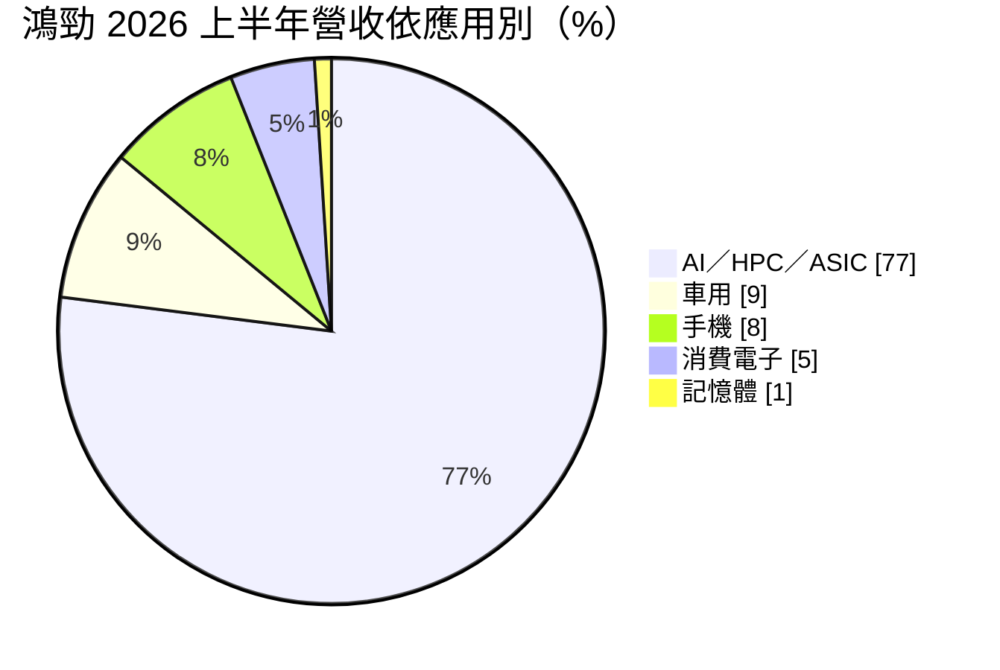
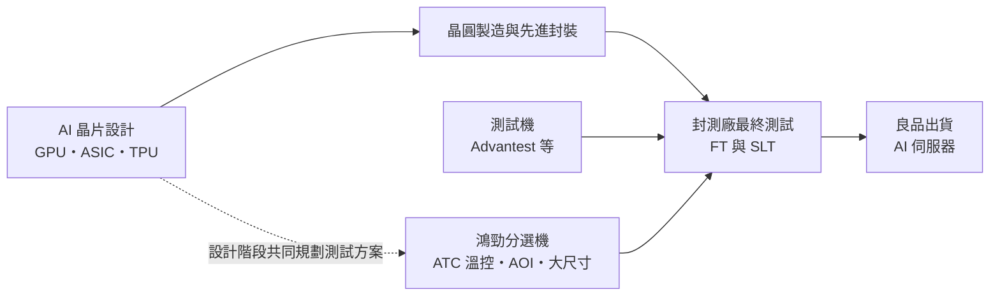
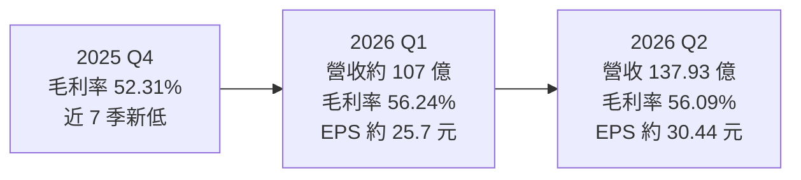
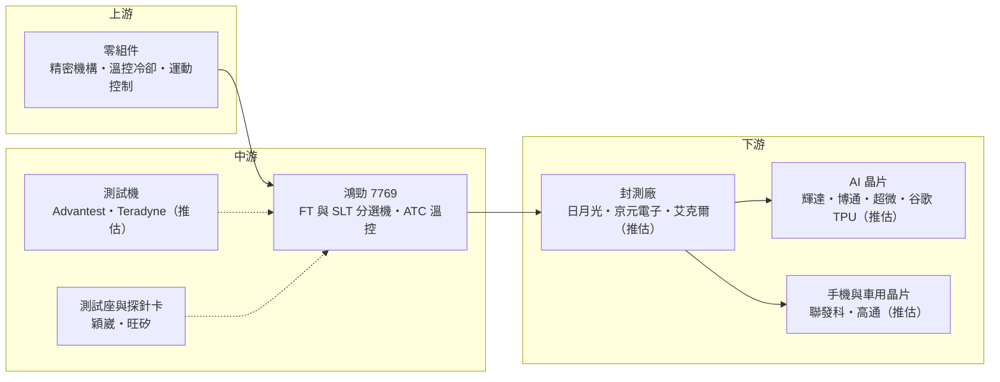

# 7769 鴻勁

> 上市｜[[產業索引-半導體業|半導體業]]｜上市（櫃）日期 2025/11/27

# 第一章：企業模式與商業藍圖

> [!info] 撰寫說明
> 本文由 Claude 依公開資料整理，架構比照 [[2330台積電]] 的四章研究，資料截至 2026-10-07。財務數字來源：工商時報 2026 年 7 月財報報導、經濟日報 2026 年 3 月報導、富果研究鴻勁法說會筆記（2026 年 3 月、7 月）、優分析上市前介紹；產業描述為整理性內容，尚未逐條比對原始文件。#待校對

在評估單一個股的長期投資價值時，首要步驟是拆解企業的底層獲利邏輯。本章針對鴻勁精密（股票代號：7769，以下簡稱鴻勁）的商業模式進行定性分析，說明測試分選機在晶片生產流程中的位置、為什麼溫控能力成為 AI 晶片測試的關鍵，以及鴻勁如何把這項技術轉成接近六成的毛利率。

## 一、核心定位：AI 晶片最終測試的分選與溫控龍頭

鴻勁成立於 2015 年 4 月，前身為 1999 年創立的鴻勁科技，2025 年 11 月 27 日以每股 1,495 元承銷價掛牌上市，是近年台股最受矚目的半導體設備新股之一。鴻勁總部在台灣，並在中國蘇州、美國與德國設有營運據點。

鴻勁的設備用在晶片封裝完成後的「最終測試」（[[FT]]）與「系統級測試」（[[SLT]]）階段。測試機（[[Tester]]）負責送出電訊號檢查晶片功能，而分選機（[[Handler]]）負責把晶片放進測試座、施加壓力、控制溫度，測完再依結果分類。AI GPU 與 [[ASIC]] 晶片功耗動輒上千瓦，測試時會產生大量熱能，若無法精準控溫，測試結果就不可靠。這帶來兩個商業意義：

* **溫控是 AI 測試的瓶頸：** 鴻勁的強項正是主動式溫控系統（[[ATC]]），能在測試過程中即時調整晶片溫度，這讓它成為多數 AI 晶片成品測試分選機的關鍵供應商。
* **功耗升級帶動單價升級：** 每一代 AI 晶片功耗提高，溫控規格就跟著升級，設備單價與毛利同步提升。

依優分析引用 2024 年 12 月 SEMI 統計，鴻勁在分選機及相關設備的全球市占率約 32%，為業界領導廠商。

## 二、產品板塊：AI 與 HPC 主導

依 2026 年上半年應用別，營收結構如下：

AI／[[HPC]]／ASIC 占比由 2025 年的 72% 提高到 77%。依 2026 年 3 月法說資料，出貨地以台灣占約 70%，終端客戶所在地則以美國 57%、中國 21% 為主。主要產品包括：

* **FT 與 SLT 測試分選機：** 主力產品，涵蓋 AI GPU、ASIC、手機 [[AP]]、車用晶片等多種應用。
* **主動式溫控系統（ATC）與水冷板：** 搭配分選機使用，從 3K 瓦升級到 10K 瓦，公司預期可帶動平均售價提升兩成以上。
* **[[AOI]] 檢測整合：** 把自動光學檢測整合進分選流程，公司表示可提高平均售價 10% 至 15%。
* **大尺寸封裝測試：** 支援 120×150mm 以上的大型封裝，配合 10K 瓦散熱，對應下一代 AI 晶片。
* **[[CPO]] 光電共測設備：** 公司預計 2026 年 10 月推出 Insertion 4 OE 光電共測設備，鎖定共同封裝光學的測試需求。

## 三、資本轉化邏輯：跟著 AI 晶片世代升級

* **產能已滿：** 鴻勁的產能在 2026 年底前已滿載。公司計畫 2027 年產能較 2026 年增加 50%，來源包括：新的德山廠（約 3,000 坪）增加約 15%、中國擴產增加約 20%、總部產線優化增加約 15%。
* **研發擴張：** 研發人員已擴充至約 800 人，公司表示 2025 至 2026 年研發費用將成長一倍。
* **規格驅動定價：** 從 3K 瓦到 10K 瓦的溫控、AOI 整合與大尺寸封裝支援，每一項升級都有明確的加價空間，這是毛利率能維持在 55% 以上的主因。

## 四、企業長期藍圖

* **跟著 AI 晶片功耗走：** AI 晶片功耗每一代都在提高，溫控規格從 3K 瓦走向 10K 瓦，鴻勁以溫控技術領先維持單價與毛利。
* **中國 SLT 市場：** 法說會提到鴻勁在中國 SLT 市場市占率約九成、年增超過 80%，中國 AI 晶片自主化帶動大量測試需求。
* **TPU 與 ASIC：** 公司預估 2027 年上半年 [[TPU]] 相關設備需求達三位數台，ASIC 擴大是重要成長來源。
* **CPO 與全自動化：** 光電共測與測試廠全自動化方案，是下一階段的產品延伸方向。

# 第二章：護城河深度與競爭優勢

在長期價值投資中，「護城河」指企業抵禦競爭、維持超額利潤的保護機制。本章分析鴻勁的護城河構成、在全球測試分選機市場的主要對手，以及中國市場對其優勢的考驗。

## 一、護城河的核心組成要素

鴻勁的護城河在台灣設備廠中屬於「較寬」的一類，由四個要素組成：

* **1. 溫控技術領先：** AI 晶片測試的關鍵在於高功耗下的精準控溫，鴻勁在 ATC 的技術與量產經驗領先，競爭對手短期難以複製。
* **2. 與 AI 晶片客戶共同開發：** 新一代 AI 晶片在設計階段就要決定測試方案，鴻勁參與客戶的測試規劃，取得早期定案優勢；測試流程一旦驗證，更換設備商的風險很高。
* **3. 高市占與規模：** 全球約 32% 的分選機市占率，讓鴻勁在零件採購、研發投入與客戶服務上具規模優勢。
* **4. 極高的獲利能力：** 2025 年[[毛利率]] 56.54%，2026 年上半年[[營業利益率]] 49.13%，在全球設備廠中都屬於罕見的高水準，代表定價能力強。

## 二、全球主要競爭對手格局

| 對手 | 定位 | 對鴻勁的威脅 |
|---|---|---|
| 愛德萬測試（Advantest） | 全球測試機龍頭，也提供分選機 | 可提供測試機與分選機整合方案 |
| Cohu（美國） | 分選機國際大廠 | 在車用與類比晶片測試分選具基礎 |
| 長川科技、金海通（中國） | 國產化政策支持 | 主攻中國市場，價格具競爭力 |
| [[6515穎崴]]、[[6223旺矽]] | 測試座、探針卡與溫控 | 多為互補，部分溫控環節可能重疊 |

## 三、優勢轉化：哪些市場守得住、哪些守不住

* **守得住：** 高功耗 AI GPU 與 ASIC 的 FT／SLT 分選，鴻勁的溫控技術與客戶關係是目前最強的；產能滿載到年底也顯示客戶依賴度高。
* **守不住：** 2025 年第四季毛利率一度降至 52.31%，公司說明是員工認股費用與中國業務占比提升，但也反映中國市場價格較低、競爭較激烈。若中國同業在中國 SLT 市場快速追上，鴻勁九成的市占可能被侵蝕。
* **觀察重點：** 10K 瓦溫控與大尺寸封裝測試的導入速度、CPO 光電共測設備能否如期在 2026 年第四季量產、毛利率能否維持在 55% 至 60% 的目標區間。

# 第三章：財務體質與盈利規模

資料日期：2026-10-07。數字取自工商時報、經濟日報與富果研究法說會筆記，表格是撰寫當時的快照；最新月營收、毛利率、累計 EPS 由自動排程寫在本筆記的屬性欄位（月營收、毛利率、累計EPS 等）。#待校對

財務報表是檢驗護城河是否真實存在的最終標準。本章用三率、ROE、現金流與資本報酬，檢視鴻勁在 AI 測試需求爆發期的獲利品質，以及一次性費用對毛利率的干擾。

## 一、獲利能力的基石：三率

| 項目 | 2025 全年 | 2026 Q1 | 2026 Q2 | 2026 上半年 |
|---|---|---|---|---|
| 營收（新台幣） | 302.7 億 | 約 107 億 | 137.93 億 | 245.18 億 |
| [[毛利率]] | 56.54% | 56.24% | 56.09% | 56.15% |
| [[營業利益率]] | 未查得 | 約 50%（推算） | 48.47% | 49.13% |
| EPS（元） | 75.71 | 約 25.7 | 約 30.44 | 56.14 |

* **資料出入：** 2025 年營收各來源略有出入，經濟日報為 302.7 億元，富果研究筆記為 322.7 億元，本文採用前者；以 2026 年上半年營收為 2025 年全年約八成推算，302.7 億元較為吻合。2025 年稅後淨利約 123.6 億元、年增約 1.3 倍。
* **2025 年第四季：** 毛利率 52.31%，為近 7 季新低，公司說明主因員工認股薪酬費用與中國業務占比提升。
* **2026 年第二季：** 營收季增 28.61%、年增 100%，營業利益 66.86 億元，稅後淨利 54.76 億元，EPS 約 30.44 元，連續四季創新高。第二季仍有一次性員工股票轉讓費用認列為營業成本。
* **2026 年上半年：** 營業利益 120.46 億元、年增 77.76%，稅後淨利約 101 億元。

## 二、[[ROE]]：資本效率

鴻勁屬於高毛利、輕資產的設備商，2025 年 EPS 75.71 元，加上上市募資後股本與淨值擴大，股東權益報酬率仍處於極高水準（推估，精確數字未查得）。上市後淨值增加會使 ROE 數字較上市前下降，但不代表獲利能力轉弱。

## 三、資本支出與自由現金流

* **[[CapEx]]：** 主要用於德山新廠、中國擴產與總部產線優化，具體金額未查得。研發費用 2025 至 2026 年倍增，是主要的費用成長來源。
* **[[自由現金流]]：** 高毛利與預收款項讓營運現金流充沛，足以支應擴產與高配息（推估）。
* **股利：** 2025 年度配息 65 元，其中盈餘配發現金 55 元、資本公積 10 元，以 EPS 75.71 元計算，盈餘配發率約七成以上。

## 四、[[ROIC]] 與 [[WACC]]：價值創造利差

營業利益率接近五成、固定資產相對輕，鴻勁的 ROIC 推估遠高於 WACC，是典型的高價值創造型企業（具體數值未查得）。2027 年產能增加 50% 會擴大投入資本，若新增產能能如預期被 AI 測試需求吸收，利差可望維持；反之，若 AI 資本支出降溫，新產能閒置會率先壓縮 ROIC。

# 第四章：總體風險與地緣政治

任何企業都無法脫離宏觀環境獨立存在。本章分析鴻勁未來必須面對的地緣政治、AI 資本支出週期、營運與技術演進風險。

## 一、地緣政治

* **美中兩邊的客戶：** 終端客戶以美國約 57%、中國約 21% 為主。美國若擴大對中國 AI 晶片與相關設備的出口管制，鴻勁在中國的 SLT 業務可能受限；反之，中國國產化政策也可能讓中國客戶轉向本土設備商。
* **美國 301 調查與關稅：** 2026 年 3 月經濟日報報導提到，美國 301 調查曾影響鴻勁股價，設備出口到美國可能面臨關稅成本。
* **台灣集中風險：** 出貨地約七成在台灣，客戶的 AI 晶片測試產能多在台灣封測廠，兩岸風險會同時影響鴻勁與其客戶。

## 二、產業週期與市場結構

* **AI 資本支出週期：** AI／HPC／ASIC 占營收近八成，若雲端業者削減 AI 投資，測試設備訂單會快速下滑；設備商位在供應鏈上游，[[長鞭效應]]明顯。
* **客戶集中：** 高度依賴少數 AI GPU 與 ASIC 大客戶的新晶片世代，客戶產品延遲會直接影響出貨。
* **匯率：** 以外幣計價為主，新台幣升值會壓縮營收與毛利。

## 三、營運環境的隱性風險

* **擴產執行：** 2027 年產能要增加 50%，涉及新廠、中國擴產與人才招募，執行不順可能錯失訂單。
* **一次性費用：** 員工認股與股票轉讓費用已連續影響 2025 年第四季與 2026 年第二季的毛利率，未來若持續發生，會影響獲利穩定度。
* **估值波動：** 股價屬千金股，市場預期高，任何毛利率或訂單變化都可能造成股價大幅波動。

## 四、科技或法規演進

AI 晶片的封裝尺寸、功耗與測試方式快速變化，若未來測試流程整合到晶圓級或封裝前段（例如更多在 [[CP]] 階段完成），FT 與 SLT 的重要性可能下降。CPO 光電共測是全新領域，技術標準尚未確立，能否成為主流方案仍有不確定性。

# 專有名詞解析

## 半導體

- **[[FT]]**：最終測試，晶片封裝完成後的功能與電性測試，確認成品可以出貨。
- **[[SLT]]**：系統級測試，把晶片放在模擬真實系統的環境中執行實際軟體，抓出 FT 測不到的問題。
- **[[CP]]**：晶圓針測，在晶圓切割封裝前用探針卡逐顆測試晶粒，先淘汰不良品。
- **[[Tester]]**：測試機，送出電訊號並判讀晶片回應的設備，國際大廠為 Advantest、Teradyne。
- **[[Handler]]**：分選機，負責把晶片送進測試座、施壓與控溫，測試後依結果分類的設備。
- **[[ATC]]**：主動式溫控，測試過程中即時加熱或冷卻晶片，讓高功耗晶片維持在指定溫度。
- **[[AOI]]**：自動光學檢測，以攝影機與影像演算法自動檢查外觀瑕疵。
- **[[ASIC]]**：特殊應用積體電路，為特定用途客製化設計的晶片，例如雲端業者自研的 AI 加速器。
- **[[TPU]]**：谷歌自研的張量處理器，屬於 AI 專用 ASIC，用於模型訓練與推論。
- **[[CPO]]**：共同封裝光學，把光收發元件與交換器或運算晶片封裝在一起，縮短電訊號距離、降低功耗。

## 應用

- **[[HPC]]**：高效能運算，泛指資料中心、AI 訓練與推論等需要大量運算的應用。
- **[[AP]]**：應用處理器，手機與平板的主晶片，整合 CPU、GPU 與數據機等功能。

## 金融

- **[[長鞭效應]]**：終端需求的小幅變動，沿供應鏈往上游傳遞時被逐級放大，造成上游庫存與訂單劇烈波動。

# 核心供應鏈

## 1. 上游：零組件
- 精密機構、溫控與冷卻元件、運動控制：國內外零組件供應商（具體名單未查得）

## 2. 中游：鴻勁本身與測試環節夥伴
- 測試機：Advantest、Teradyne（與分選機搭配使用，推估）
- 測試座與探針卡：[[6515穎崴]]、[[6223旺矽]]

## 3. 下游：封測廠與晶片客戶
- 封測廠：[[3711日月光投控]]、[[2449京元電子]]、[[AMKR艾克爾]]（推估）
- AI 晶片設計：[[NVDA輝達]]、[[AVGO博通]]、[[AMD超微]]、[[GOOGL谷歌]]（TPU）（推估）
- 手機與車用晶片：[[2454聯發科]]、[[QCOM高通]]（推估）

## 4. 同業與競爭者
- 國際：Advantest、Cohu
- 中國：長川科技、金海通

## 最新新聞
<!-- news:start（自動產生，請勿手動編輯此範圍） -->
- 2026-10-07 📰 媒體 19:50｜營收速報 - 鴻勁(7769)9月營收57.29億元年增率高達100.22％｜[鉅亨網](https://news.cnyes.com/news/id/6623960)
- 2026-10-07 🏛️ 重訊 17:25｜公告本公司受邀參加元大證券舉辦之美國海外路演(NDR)｜[觀測站](https://mops.twse.com.tw/mops/#/web/t05st01)

完整紀錄：[[7769鴻勁 新聞]]
<!-- news:end -->

## 相關連結
- [公開資訊觀測站](https://mopsov.twse.com.tw/mops/web/t05st03?step=1&firstin=1&co_id=7769)
- [Goodinfo](https://goodinfo.tw/tw/StockDetail.asp?STOCK_ID=7769)
- [Yahoo 股市](https://tw.stock.yahoo.com/quote/7769)
- [鉅亨網新聞](https://www.cnyes.com/twstock/7769/news)
