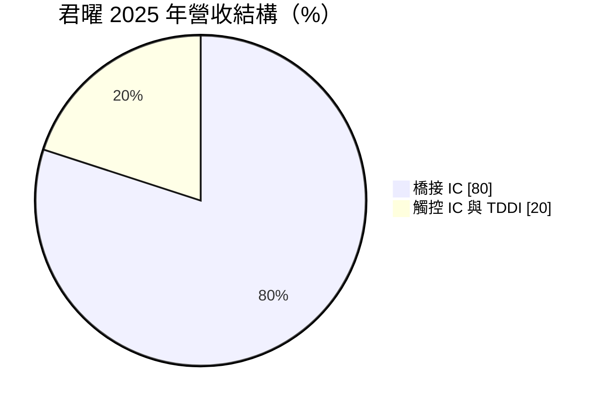
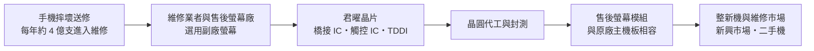
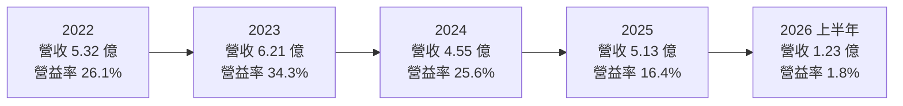
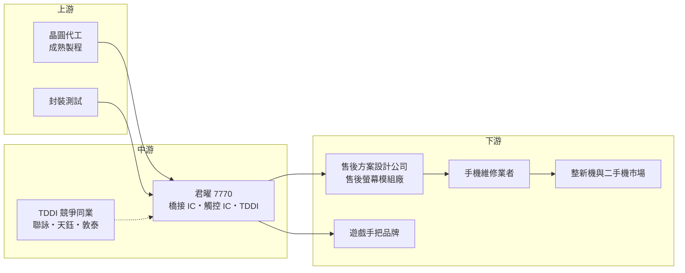

# 7770 君曜

> 上櫃｜[[產業索引-半導體業|半導體業]]｜上市（櫃）日期 2025/12/10

# 第一章：企業模式與商業藍圖

> [!info] 撰寫說明
> 本文由 Claude 依公開資料整理，架構比照 [[2330台積電]] 的四章研究，資料截至 2026-10-08。財務數字來源：櫃買中心開放資料（基本資料、綜合損益、資產負債、每月營收、本益比殖利率）、Goodinfo 台灣股市資訊網年度經營績效、優分析、經濟日報、科技新報轉載之今周刊報導；產業描述為整理性內容，尚未逐條比對原始文件。#待校對

在評估單一個股的長期投資價值時，首要步驟是拆解企業的底層獲利邏輯。本章針對君曜科技（股票代號：7770，以下簡稱君曜）的商業模式進行定性分析，說明一家員工不到 30 人的小型 IC 設計公司，如何在手機螢幕售後維修這個少有人注意的市場中，找到高毛利的利基。

## 一、核心定位：手機售後維修市場的螢幕橋接晶片供應商

君曜成立於 2010 年，總部位於新竹，2024 年 9 月登錄興櫃，2025 年 12 月 10 日以每股 58.4 元掛牌上櫃，屬於輕資產的 [[Fabless]] IC 設計公司。董事長林澤琦曾任職於 [[2454聯發科]] 電視晶片部門，依科技新報轉載的今周刊報導，他在 32 歲時與朋友湊出 1,000 萬元創業，初期主攻觸控 IC。

君曜現在的主力產品是手機螢幕用的「橋接晶片」。要理解這個產品，可以從手機維修的場景說起：手機螢幕摔破後，維修業者會換上一片新螢幕。原廠螢幕價格昂貴，很多維修業者與消費者會選擇價格較低的副廠螢幕，例如把原本的 OLED 螢幕換成較便宜的 LCD 螢幕。但不同螢幕的訊號介面與規格不同，直接接到原廠主機板上常會出現無法顯示、觸控失靈或畫面黑邊等問題。橋接晶片的工作，就是在螢幕與主機板之間「翻譯」影像與觸控訊號，讓不同廠牌、型號、規格的螢幕都能和原廠主機板正常運作。

依同一篇報導，君曜在全球手機售後維修市場的橋接晶片市占率達五成。這是一個典型的「小而美」利基市場：市場規模不足以吸引大型 IC 設計公司投入，但對熟悉手機介面技術的小團隊來說，利潤相當可觀。

## 二、終端應用板塊：橋接 IC 約八成

依優分析 2025 年 11 月報導，君曜 2025 年的營收結構如下：

* **橋接 IC（約 80%）：** 影像訊號處理橋接晶片，2019 年推出，是目前的營收主力。產品涵蓋 iPhone 與安卓手機的中高階傳輸介面。
* **觸控 IC 與 [[TDDI]]（約 20%）：** 高感度觸控 IC 用於低階智慧型手機的售後螢幕，也應用在國際遊戲大廠的遊戲手把上。TDDI（觸控與顯示驅動整合晶片）是新產品線，2025 年仍在試產階段，占比相當小。

市場規模方面，依優分析報導，法人推估售後螢幕市場一年約 4 億支，其中約 6,000 萬支需要使用橋接 IC；TDDI 的市場規模約為橋接 IC 市場的 10 倍。

## 三、資本轉化邏輯：小團隊的客製化 ASIC 模式

君曜的商業模式有三個關鍵。第一是「反向工程與相容性」：橋接晶片必須相容各家手機原廠主機板的介面規格，而原廠不會公開這些規格，君曜需要自行掌握 iPhone 與安卓手機的傳輸介面技術。每當新機型推出，就要開發對應的晶片，速度越快，越能搶到維修市場的先機。第二是「客製化 [[ASIC]] 設計」：依今周刊報導，君曜運用過去的微控制器設計經驗，設計成本可控的客製化晶片，而不是採用昂貴的通用方案。第三是「小團隊快速決策」：員工不到 30 人，可以快速調整規格回應市場變化，這是大型 IC 公司難以模仿的效率。

售後維修市場的需求來自幾個長期趨勢。依經濟日報報導，維修模式正從傳統的「拆舊料」轉為「以新換舊」，也就是直接使用新的副廠螢幕，而非拆解舊手機的零件；環保意識、新興市場智慧型手機普及，以及二手機與整新機市場的成長，都支撐橋接晶片的需求。

## 四、企業長期藍圖：三大關鍵晶片與 TDDI

* **完成「三大關鍵晶片」布局：** 依經濟日報報導，君曜的目標是在手機螢幕售後市場完成三大關鍵晶片的布局（橋接、觸控與 TDDI），並持續往中高階機種與整新機市場擴張。
* **橋接 IC 與 TDDI 套片：** 依優分析報導，公司規劃推出橋接 IC 與 TDDI 的套片組合，原本預計 2026 年第二季起放量，後續再推出兩者的整合型產品。TDDI 的市場規模約為橋接 IC 的 10 倍，若能成功切入，將大幅擴大君曜的可服務市場。
* **長期進軍品牌市場：** 公司表示長期目標是從售後市場進軍品牌市場，也就是讓手機品牌或螢幕廠在新機生產時採用君曜的晶片。這需要通過品牌廠嚴格的驗證，難度遠高於售後市場。

整體而言，君曜的長期藍圖是從橋接晶片這個高市占的小市場，擴展到 TDDI 這個大十倍、但競爭激烈得多的市場。這是一次「從利基走向主流」的嘗試，成敗將決定君曜能否擺脫小型利基公司的規模限制。

# 第二章：護城河深度與競爭優勢

在長期價值投資中，「護城河」指企業抵禦競爭、維持超額利潤的保護機制。本章分析君曜的護城河構成、主要競爭對手，以及這些優勢在擴展到 TDDI 市場時能守住多少。

## 一、君曜護城河的核心組成要素

* **1. 橋接晶片的技術與時間優勢：** 橋接晶片需要快速掌握新機型的介面規格，並在新機上市後盡快推出相容方案。君曜累積多年 iPhone 與安卓中高階介面的開發經驗，在這個市場取得約五成市占。後進者要追上，必須逐一累積各機型的相容性資料，需要時間。
* **2. 市場規模本身形成的保護：** 售後維修的橋接晶片市場規模有限，大型 IC 設計公司不值得投入；手機原廠又不會為副廠螢幕開發晶片。這種「大廠看不上、小廠做不來」的結構，是君曜能維持高毛利的重要原因。
* **3. 售後通路與客戶基礎：** 君曜與售後方案設計公司、螢幕模組廠合作多年，熟悉售後市場的通路與交易習慣。這些關係對新進者來說不容易建立。
* **4. 策略股東：** 依今周刊報導，[[2317鴻海]] 在 2015 年投資 3,000 萬元成為股東，並在多項產品中採用君曜晶片。

## 二、全球主要競爭對手格局

| 對手 | 定位 | 對君曜的威脅 |
|---|---|---|
| 售後市場其他橋接晶片業者 | 多為中國中小型 IC 設計公司（具體名單未查得） | 以價格競爭爭取售後螢幕廠訂單 |
| [[3034聯詠]] | 全球主要驅動 IC 與 TDDI 廠 | 君曜進入 TDDI 時的主要對手，規模與成本優勢大 |
| [[4961天鈺]]、[[3545敦泰]] | 中小尺寸驅動 IC 與 TDDI | 在中低階手機 TDDI 市場直接競爭 |
| 奇景光電（Himax）、集創北方 | 驅動 IC 與 TDDI | 集創北方受中國面板廠支持，價格積極 |

## 三、優勢轉化：哪些市場守得住、哪些守不住

* **守得住：** 中高階手機的售後橋接晶片。這個市場需要快速相容新機型，技術與時間門檻較高，君曜的市占與經驗是主要優勢。
* **較難守住：** 低階觸控 IC 與 TDDI。TDDI 市場雖然大，但已有聯詠、天鈺、敦泰、集創北方等規模大得多的對手，君曜在成本、晶圓產能與面板廠關係上都處於劣勢。君曜的機會在於「售後市場的 TDDI 加橋接套片」，也就是用既有的售後通路與橋接晶片優勢，帶動 TDDI 的銷售，而不是在新機市場與大廠正面競爭。
* **觀察重點：** 第一，2026 年營收明顯下滑後，橋接晶片的市占與需求是否穩定。第二，TDDI 套片的實際出貨與客戶接受度。第三，毛利率能否回到 40% 以上的歷史水準。

# 第三章：財務體質與盈利規模

資料日期：2026-10-08。數字取自櫃買中心開放資料與 Goodinfo 年度經營績效，表格是撰寫當時的快照；最新月營收、毛利率、累計 EPS 由自動排程寫在本筆記的屬性欄位（月營收、毛利率、累計EPS 等）。#待校對

財務報表是檢驗護城河是否真實存在的最終標準。本章用三率、[[ROE]]、現金流與資本報酬，檢視君曜的獲利品質。由於君曜在 2024 年才登錄興櫃，公開的年度資料只涵蓋 2022 年以後。

## 一、獲利能力的基石：三率

| 年度 | 營收（億元） | [[毛利率]] | [[營業利益率]] | EPS（元） | [[ROE]] |
|---|---|---|---|---|---|
| 2021 | 未查得 | 未查得 | 未查得 | 未查得 | 未查得 |
| 2022 | 5.32 | 40.8% | 26.1% | 6.08 | 137%（股本小，不具可比性） |
| 2023 | 6.21 | 48.1% | 34.3% | 7.36 | 77.3%（同上） |
| 2024 | 4.55 | 45.2% | 25.6% | 5.27 | 33.0% |
| 2025 | 5.13 | 35.1% | 16.4% | 3.00 | 15.0% |
| 2026 上半年 | 1.23 | 32.9% | 1.8% | 0.32 | 年化約 3.4%（推算） |

註：2022 至 2025 年取自 Goodinfo 年度經營績效（合併報表）；經濟日報報導的 2024 年 EPS 為 5.11 元，與 Goodinfo 的 5.27 元略有差異，可能是計算基準的股數不同。2026 上半年取自櫃買中心綜合損益開放資料。2026 上半年 ROE 以稅後淨利 0.097 億元除以 2026 年第二季底權益 5.68 億元，再乘以 2 年化推算。

* **高毛利的利基特性：** 2022 至 2024 年毛利率在 40% 至 48% 之間，營業利益率最高達 34.3%，代表橋接晶片這個利基市場確實具備高獲利能力。
* **毛利率與營業利益率下滑：** 2025 年毛利率降到 35.1%，優分析報導前三季毛利率年減 11 個百分點；營業利益率降到 16.4%。2026 年上半年營收只有 1.23 億元，營業利益率剩 1.8%。依櫃買中心每月營收資料，2026 年前八月營收約 1.71 億元，年減約 49%。公開報導未查得營收大幅下滑的具體原因，可能與售後市場需求、產品世代交替或新產品放量進度有關（推估），需要持續追蹤。
* **規模小、波動大：** 營收只有數億元，單一產品或客戶的變動就會對財務數字造成明顯影響。2022 至 2025 年營收的年複合成長率約 -1.2%（推算），長期仍在 5 億元上下波動。

## 二、[[ROE]]：資本效率

2022 至 2023 年的 ROE 高達 137% 與 77%，主要是因為當時股本很小（興櫃前實收資本額約 2.7 億元以下），不具長期可比性。2024 至 2025 年隨著增資與保留盈餘累積，ROE 回落到 33% 與 15%。2025 年 12 月上櫃前辦理現金增資發行 2,890 張新股，股東權益進一步擴大；2026 年第二季底權益約 5.68 億元，每股淨值約 18.9 元。在權益變大、獲利下滑的情況下，2026 年上半年 ROE 只剩年化約 3.4%（推算）。

## 三、資本支出與[[自由現金流]]

* **[[CapEx]] 很低：** 員工不到 30 人的 Fabless 公司，資本支出主要是研發設備與光罩，具體金額未查得。在獲利年度，自由現金流應為正（推估，依輕資產模式判斷）。
* **財務結構：** 2026 年第二季底總負債約 1.62 億元，流動資產約 6.44 億元，財務結構保守。
* **股利政策：** 依櫃買中心本益比殖利率資料，君曜最近一期每股現金股利為 2 元，以 2025 年 EPS 3.00 元計算，配息率約 67%（推算）。上櫃時間短，長期配息穩定度尚無法判斷。

## 四、[[ROIC]] 與 [[WACC]]：價值創造利差

* **ROIC（推算）：** 以 2025 年營收 5.13 億元乘以營業利益率 16.4%，營業利益約 0.84 億元，乘以（1－20% 稅率）得到稅後營業利益約 0.67 億元。投入資本以 2026 年第二季底權益 5.68 億元加上非流動負債 0.37 億元（有息負債未查得，以非流動負債作為上限近似）計算，約 6.05 億元，2025 年 ROIC 約 11%（推算）。以 2026 年上半年營業利益 0.023 億元年化計算，ROIC 只有約 0.6%（推算）。
* **WACC（推算）：** 用 CAPM 推估：無風險利率約 1.75%，市場風險溢酬 6%，β 值取小型新上櫃 IC 設計股常見的 1.3（假設值，未查得官方數字），股東權益成本約 1.75% + 1.3 × 6% = 9.55%。君曜幾乎沒有有息負債，WACC 約 9.5%（推算）。
* **價值創造判斷：** 2022 至 2024 年君曜的 ROIC 明顯高於 WACC（推估，依當時 25% 以上的營業利益率判斷），證明橋接晶片這個利基市場能創造超額報酬。2025 年 ROIC 約 11% 只略高於 WACC，2026 年上半年則明顯低於 WACC。君曜能否回到創造價值的軌道，取決於營收能否止跌回升，以及 TDDI 新產品能否帶來新的獲利來源。

# 第四章：總體風險與地緣政治

任何企業都無法脫離宏觀環境獨立存在。本章分析君曜未來必須面對的地緣政治、產業週期、營運與技術風險。

## 一、地緣政治風險

* **售後市場與中國供應鏈：** 手機售後螢幕的生產與交易高度集中在中國，君曜的客戶與通路也與中國供應鏈緊密相關（推估）。中國政策變化、貿易摩擦或出口管制，都可能影響售後螢幕的生產與流通。
* **新興市場需求：** 售後維修與整新機的主要需求來自新興市場，這些地區的經濟狀況與匯率波動，會影響消費者選擇維修而非換新機的意願。

## 二、產業週期與市場結構風險

* **手機市場的成熟與換機週期：** 全球智慧型手機出貨已經進入成熟期，售後維修市場的規模取決於手機保有量與摔機率。若消費者換機週期拉長，維修需求會增加；若手機耐用度提升（例如更強韌的螢幕玻璃），維修需求則可能下降。
* **市場規模天花板：** 橋接晶片市場每年約 6,000 萬支的需求（法人推估）是相對固定的天花板。君曜已有約五成市占，要在這個市場繼續大幅成長的空間有限，因此必須開拓 TDDI 等新市場。
* **TDDI 的價格競爭：** TDDI 市場規模大，但已有多家大型業者，中國廠商以低價競爭，君曜作為後進者，可能需要犧牲毛利率換取市占。

## 三、營運環境的隱性風險

* **原廠政策的不確定性：** 手機原廠可能透過軟體或硬體設計，限制副廠螢幕的使用，例如偵測非原廠零件並顯示警告或限制功能。若原廠加強這類限制，橋接晶片的開發難度與市場需求都會受影響。另一方面，歐盟與美國的維修權法規，則可能要求原廠開放維修，對售後市場是正面因素。
* **小團隊的人才風險：** 員工不到 30 人，關鍵研發人員的流動會直接影響產品開發。
* **營收集中：** 橋接晶片占營收約八成，產品集中度高。

## 四、科技演進風險

手機顯示技術持續演進，從 LCD 走向 OLED、LTPO 與更高刷新率的面板，傳輸介面也不斷升級。每一次技術轉換，都要求君曜開發新的橋接與觸控方案，這既是門檻（保護既有市場），也是負擔（需要持續研發投入）。長期而言，若手機原廠把更多功能整合進主晶片或面板，或者售後螢幕業者能直接取得與原廠相容的螢幕，橋接晶片的必要性可能降低。君曜往 TDDI 與品牌市場發展，就是為了降低對單一利基產品的依賴；這條路能否走通，是評估君曜長期價值的核心問題。

# 專有名詞解析

## 半導體

- **[[TDDI]]**：把觸控控制與顯示驅動整合在同一顆晶片的方案，可降低手機與平板的零件數與成本。
- **[[ASIC]]**：特殊應用積體電路，為特定客戶或用途量身設計的晶片。
- **[[Fabless]]**：只做晶片設計、不擁有晶圓廠的 IC 設計公司，製造委外給晶圓代工廠。
- **[[DDI]]**：顯示驅動 IC，負責控制面板每個像素的電壓，需要高壓製程。
- **[[橋接晶片]]**：在兩種不同介面或規格之間轉換訊號的晶片，讓不相容的元件可以互相連接。

## 應用

- **[[售後市場]]**：產品售出後的維修、零件更換與配件市場，與新機生產的前裝市場相對。
- **[[整新機]]**：經過檢測、維修與更換零件後重新銷售的二手手機。

## 金融

- **[[現金增資]]**：公司發行新股向投資人募集資金，會增加股本與股東權益。
- **[[配息率]]**：現金股利占每股盈餘的比例，反映公司把多少獲利回饋給股東。
- **[[自由現金流]]**：營業活動現金流減去資本支出，代表企業可自由用於配息、還債或併購的現金。

## 產業

- **[[維修權]]**：要求原廠開放維修資訊、零件與工具給消費者與第三方維修業者的法規與運動。
- **[[LTPO]]**：低溫多晶氧化物面板技術，可動態調整螢幕刷新率以節省電力，常見於高階手機。

# 核心供應鏈

## 1. 上游：晶圓代工與封測
- 晶圓代工與封測：具體合作夥伴未查得

## 2. 中游：君曜本身、股東與同業
- 策略股東：[[2317鴻海]]（2015 年入股）
- TDDI 與驅動 IC 同業：[[3034聯詠]]、[[4961天鈺]]、[[3545敦泰]]、奇景光電、集創北方

## 3. 下游：客戶群
- 售後螢幕方案設計公司與模組廠、手機維修業者、整新機業者（客戶名稱未公開）
- 國際遊戲大廠的遊戲手把（品牌未公開）

## 最新新聞
<!-- news:start -->
<!-- news:end -->

## 相關連結
- [公開資訊觀測站](https://mopsov.twse.com.tw/mops/web/t05st03?step=1&firstin=1&co_id=7770)
- [Goodinfo](https://goodinfo.tw/tw/StockDetail.asp?STOCK_ID=7770)
- [Yahoo 股市](https://tw.stock.yahoo.com/quote/7770)
- [鉅亨網新聞](https://www.cnyes.com/twstock/7770/news)
