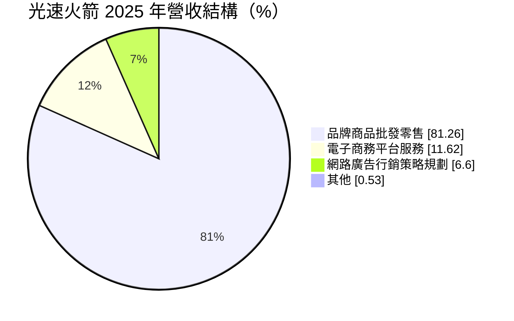
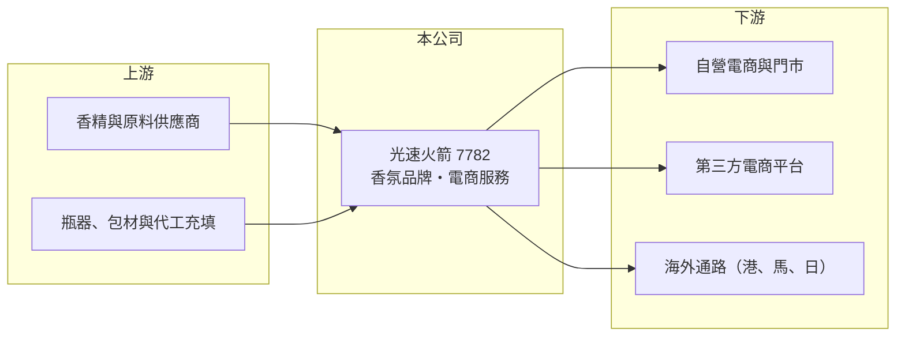

# 7782 光速火箭

> 上櫃｜[[產業索引-居家生活|居家生活]]｜上市（櫃）日期 2025/10/28

# 第一章：企業模式與商業藍圖

> [!info] 撰寫說明
> 精簡版，由 Claude 依公開資料整理，架構比照 [[2330台積電]]，資料截至 2026-10-08。來源：MoneyDJ 理財網財務比率年表（2021 至 2025 年）與個股基本資料（2025 年營收比重）、櫃買中心公開資料彙整的 2026 年第二季財報與股利資料、科技新報與經濟日報 2025 年報導標題。公開資料有限，品牌名稱、門市與海外通路細節未逐條查證。#待校對

光速火箭是 2025 年 10 月上櫃的台灣香氛品牌公司，被媒體稱為「台灣香水第一股」，從電商選品起家，後來發展出自有香水品牌與實體門市。

- **核心業務：** 公司 2016 年成立，兩位創辦人從電商選品與網路行銷出身，之後建立自有香水與香氛品牌，透過自營電商、實體門市與海外通路的[[全通路]]模式銷售。香水是典型的品牌消費品，產品成本占售價比重低，獲利關鍵在於品牌認知與行銷效率，因此公司的核心能力是[[自有品牌]]經營與數位行銷。
- **營收結構：** 依 MoneyDJ 資料，2025 年品牌商品批發零售占 81.26%，電子商務平台服務占 11.62%，網路廣告行銷策略規劃占 6.60%，其他占 0.53%。品牌商品是主體，電商代營運與廣告服務則是創業時期留下的事業，也替公司累積了數位行銷的經驗。

- **營運據點：** 總部位於新北市新莊。依 2025 年媒體報導標題，公司在台灣建立約 22 間門市，並拓展香港、馬來西亞與日本市場，年銷售超過 20 萬瓶。
- **長期方向：** 公司上櫃時的策略是強攻海外通路，把台灣香氛品牌推向國際。長期成長取決於品牌能否在海外市場建立認知，以及從單一香水擴展到身體保養、居家香氛等相關品項。

# 第二章：護城河深度與競爭優勢

光速火箭的優勢在於品牌與數位行銷能力，這類護城河需要持續投入才能維持。

- **競爭優勢：** 毛利率長期在 64% 至 70%，說明消費者願意為品牌支付溢價，這是代工型公司做不到的。創辦團隊熟悉電商流量操作與社群行銷，能以較低成本測試新品與觸及年輕客群。
- **主要對手：** 香水市場的主要競爭者是國際精品與香氛集團，以及日韓、歐美的平價香氛品牌；通路端則與 [[5904寶雅]]、百貨專櫃與 [[8454富邦媒]] 等電商平台上的進口品牌直接比較。台灣本土同類上市公司很少，可對照的美妝個人用品業者如 [[1731美吾華]]。
- **觀察重點：** 營收在 2022 至 2025 年大致停在 7 億元左右，成長已趨緩。長期要看海外營收比重能否提升、新品是否持續暢銷，以及行銷費用占營收的比例是否下降。

# 第三章：財務體質與盈利規模

資料日期：2026-10-08，表格是撰寫當時的快照；最新月營收、毛利率、累計 EPS 由自動排程寫在本筆記的屬性欄位（月營收、毛利率、累計EPS 等）。#待校對

光速火箭毛利率高但費用率也高，營業利益率從 2021 年的 17.9% 降到 2025 年的 8.6%。

| 年度 | 營收（億元） | [[毛利率]] | [[營業利益率]] | EPS（元） | [[ROE]] |
|---|---|---|---|---|---|
| 2021 | 約 6.3（推算） | 67.65% | 17.89% | 16.70 | 未查得 |
| 2022 | 約 7.1（推算） | 68.41% | 10.64% | 4.47 | 30.11% |
| 2023 | 約 6.8（推算） | 63.99% | 6.68% | 1.01 | 7.97% |
| 2024 | 約 7.2（推算） | 69.67% | 9.95% | 3.10 | 18.50% |
| 2025 | 約 7.0（推算） | 68.49% | 8.59% | 2.13 | 9.76% |

註：2025 年營收以每股營業額 30.32 元乘以約 2,321 萬股推算，其他年度依 MoneyDJ 營收成長率回推。2021 年股本遠小於現在，EPS 16.70 元不能與後續年度直接比較。

- **長期指標：** 2021 至 2025 年營收年複合成長率約 2.9%（推算），2022 至 2025 年平均 ROE 約 16.6%（推算）。最新一年度現金股利約 2.01 元，約為 2025 年 EPS 的 94%，配息率高。自由現金流資料本次未查得。
- **[[ROIC]] 與 [[WACC]]：** 2025 年稅後營業利益約 0.48 億元（營收約 7.0 億元 × 營業利益率 8.59% × 0.8），投入資本約 6.6 億元（2026 年第二季股東權益約 4.6 億元，加上以總負債約 3.8 億元的一半推估、含門市租約的有息負債約 1.9 億元），ROIC 約 7.4%（推算）。WACC 約 6.1%（推算：無風險利率 1.75%、市場風險溢酬 6%、β 取上市時間短的小型消費股常見值 1.0，股東權益成本 7.75%；稅前負債成本 2.5%、稅率 20%；權益比重約 71%）。ROIC 略高於 WACC，代表品牌有創造價值，但利差不大，需要靠營收成長與費用控制擴大。
- **財務特色：** 品牌公司不需重資本設備，資本支出主要是門市裝修與存貨，因此高配息是可行的。負債比率在 30% 至 52% 之間波動，2025 年為 44.9%，負債多為營運性質。

# 第四章：總體風險與地緣政治

光速火箭的風險來自消費品牌的流行性與行銷成本，以及海外擴張的執行難度。

- **產業週期：** 香水屬於可選消費，景氣差時消費者會延後購買或轉向平價品，但單價不高，受景氣影響小於精品與耐久財。真正的週期是品牌與香調的流行週期，暢銷品熱度退去後需要新品接棒。
- **營運風險：** 營收規模只有約 7 億元，單一產品或通路的表現就會左右全年獲利。電商與社群平台的廣告成本持續上升，若無法提升自有流量，行銷費用會吃掉高毛利。
- **其他風險：** 香精原料多仰賴進口，匯率與原料價格會影響成本；海外市場的法規、通路費用與在地競爭都需要時間磨合；上櫃時間短，長期經營紀錄仍有限。

# 專有名詞解析

## 金融

- **[[ROIC]]**：投入資本報酬率，稅後營業利益除以股東權益加有息負債，衡量本業運用資本的效率。
- **[[WACC]]**：加權平均資金成本，股東與債權人要求報酬率的加權平均，是 ROIC 要超越的門檻。

## 產業

- **[[自有品牌]]**：公司以自己的品牌設計與銷售商品，掌握定價與通路，毛利率通常高於代工。
- **[[全通路]]**：整合實體門市、自營電商與第三方平台的銷售模式，讓消費者在任一管道都能購買與取貨。

# 核心供應鏈

- 上游：香精、酒精、玻璃瓶、包材與充填代工廠（供應商名稱未查得）。
- 下游／客戶：台灣消費者（透過門市與電商）、海外經銷與零售通路；全通路銷售是主要模式。
- 同業：國際香水與香氛品牌、[[1731美吾華]]；通路端的 [[5904寶雅]]、[[8454富邦媒]]。

## 最新新聞
<!-- news:start -->
<!-- news:end -->

## 相關連結
- [公開資訊觀測站](https://mopsov.twse.com.tw/mops/web/t05st03?step=1&firstin=1&co_id=7782)
- [Goodinfo](https://goodinfo.tw/tw/StockDetail.asp?STOCK_ID=7782)
- [Yahoo 股市](https://tw.stock.yahoo.com/quote/7782)
- [鉅亨網新聞](https://www.cnyes.com/twstock/7782/news)
