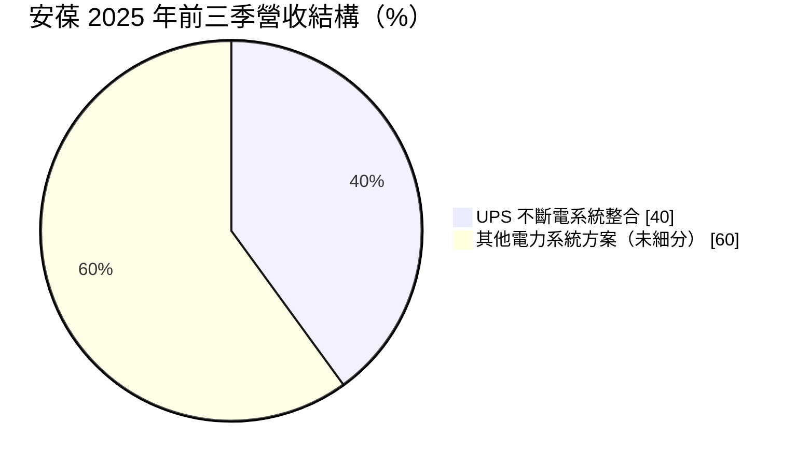
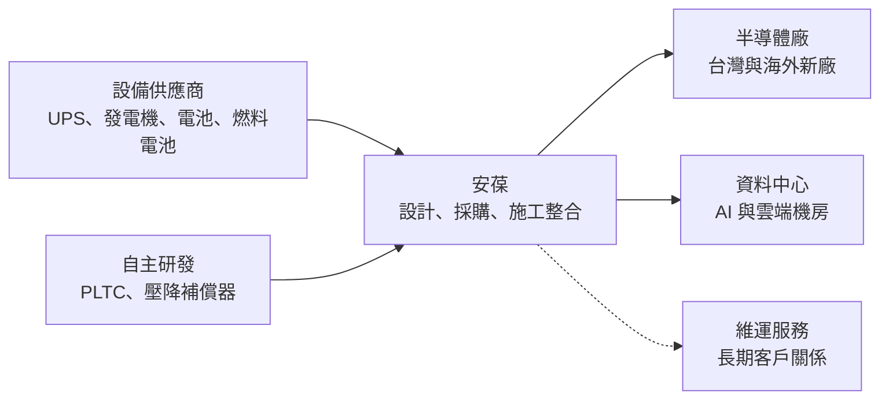
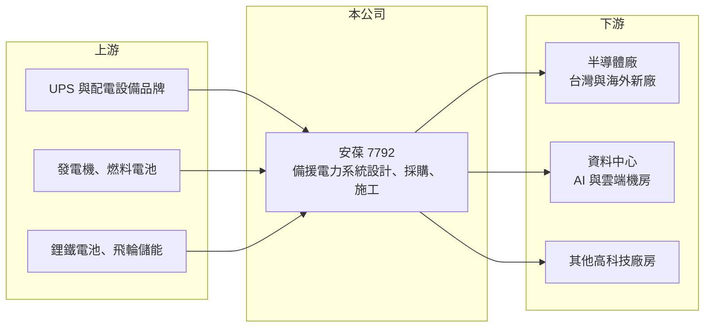

# 7792 安葆

> 上櫃｜[[產業索引-其他電子業|其他電子業]]｜上市（櫃）日期 2026/01/28

# 第一章：企業模式與商業藍圖

> [!info] 撰寫說明
> 本文由 Claude 依公開資料整理，架構比照 [[2330台積電]] 的四章研究，資料截至 2026-10-08。財務數字來源：Goodinfo 台灣股市資訊網年度經營績效、富果研究法說會整理（2026 年 8 月）、優分析報導、櫃買中心開放資料（本筆記 _data 快照）；公司 2026 年 1 月才掛牌，公開資料有限，產業描述為整理性內容，尚未逐條比對原始文件。#待校對

在評估單一個股的長期投資價值時，首要步驟是拆解企業的底層獲利邏輯。本章說明安葆（股票代號：7792）如何以「備援電力系統整合」切入半導體與資料中心的建廠需求，以及它想從工程公司轉型為能源服務商的長期方向。

## 一、核心定位：高科技廠房的電力系統整合商

安葆成立於 1994 年，總部位於新北新店，2026 年 1 月在櫃買中心掛牌，董事長兼總經理為陳志復。依 2026 年 8 月法說，安葆是全方位電力系統整合商，替客戶設計、採購並施工客製化的電力備援系統，也就是[[統包工程]]（EPC）模式，營運據點包括台灣、中國、新加坡、美國與德國。

半導體廠與資料中心對電力品質的要求極高：晶圓廠只要電壓瞬間下降，整批正在加工的晶圓就可能報廢；資料中心斷電則會造成服務中斷。因此這些廠房必須建置[[UPS]]不斷電系統、發電機與儲能設備，形成多層的電力保護。安葆的工作，就是把這些設備整合成一套可靠的系統。

公司的產品組合分為四大方案：

* **創能：** 氫燃料電池、燃氣發電機、地熱發電與柴油發電機，負責在市電中斷時自行發電。
* **儲能：** 動態與靜態 UPS、飛輪儲能裝置、鋰鐵電池櫃，負責在市電中斷到發電機啟動之間的空檔供電。
* **節能與淨能：** 自主研發的 PLTC 不斷電負載轉移系統、壓降補償器與雙燃料混燒套件，用來改善電力品質與降低能耗。

## 二、終端應用板塊：UPS 整合是最大業務

依法說資料，UPS 不斷電系統整合業務占營收比重 2024 年為 34%、2025 年前三季為 40%，其他業務別比重未揭露。

* **半導體廠：** 安葆與半導體客戶合作超過 25 年，並跟著客戶到海外建廠。半導體是台灣資本支出最大的產業，客戶每蓋一座新廠，都需要一整套備援電力系統。
* **資料中心：** 法說提到 PLTC 系統已被台灣半導體與資料中心客戶廣泛採用。AI 資料中心的用電密度遠高於傳統機房，備援電力的規模也跟著放大。

## 三、資本轉化邏輯：跟著客戶建廠的專案型生意

安葆的營收來自一個個工程專案，屬於專案型生意。客戶決定建廠後，安葆依廠房規模設計電力系統、採購設備並施工，完工後依進度認列營收。這種模式有幾個特點：

* **營收跟著客戶資本支出走：** 客戶擴廠密集時營收快速成長，擴廠放緩時營收也會下滑。依 2026 年 1 月報導，安葆在手訂單能見度已到 2028 年，代表目前正處於客戶擴產的上升期。
* **毛利率不高但資本需求低：** 統包工程的毛利率通常在 10% 至 20%，安葆近年在 12% 至 16% 之間。工程公司主要投入是人力與營運資金，不需要大型廠房，因此即使毛利率不高，ROE 仍可以維持在不錯的水準。
* **自研產品提高附加價值：** PLTC 等自主研發產品讓安葆不只是設備代理與施工，而能提供差異化的技術方案，這是提高毛利率的關鍵。

## 四、企業長期藍圖：從備援電力走向主用電力

法說提出三階段目標：短期成為標準化與模組化的電力系統專家；中期建構在地型多元能源[[微電網]]；長期把業務從「備援電力」延伸到「主用電力」，並推動「Power as a Service」（電力即服務）的商業模式。

這個藍圖的意義在於，備援電力只在建廠時賺一次工程錢，而主用電力與電力服務可以按用電量長期收費，營收會更穩定。在 AI 資料中心與半導體廠用電需求暴增、電網供電吃緊的情況下，廠房自行發電的需求正在增加，這是安葆長期轉型的機會。資本配置方面，依櫃買中心資料，最近一次年度現金股利約 8 元，配息率約九成（推算）。

# 第二章：護城河深度與競爭優勢

在長期價值投資中，「護城河」指企業抵禦競爭、維持超額利潤的保護機制。本章分析安葆在高科技廠房電力整合市場的護城河、主要競爭對手，以及工程公司模式的優缺點。

## 一、護城河的核心組成要素

安葆的護城河屬於「窄護城河」，主要來自客戶關係與實績。

* **1. 長期客戶信任：** 電力系統出錯的代價極高，半導體廠選擇供應商時最看重過去的實績。安葆與半導體客戶合作超過 25 年，又有海外建廠經驗，這是新進者很難在短時間建立的資格。
* **2. 系統整合的專業知識：** 備援電力需要把 UPS、發電機、儲能與廠房配電整合在一起，並在毫秒內完成切換。這類整合能力來自大量專案經驗，不是單買設備就能做到。
* **3. 自研產品：** PLTC 不斷電負載轉移系統等自主研發產品，讓安葆在報價時可以提供別人沒有的方案，也增加客戶更換供應商的成本。

## 二、全球主要競爭對手格局

| 對手 | 定位 | 對安葆的威脅 |
|---|---|---|
| 國際電力設備大廠（如 Schneider、Eaton、ABB、Vertiv） | UPS 與配電設備品牌，部分也做系統整合 | 設備與品牌實力強，可直接接案（推估） |
| [[2308台達電]] | UPS 與資料中心電源方案 | 在資料中心市場競爭（推估） |
| 台灣機電與廠務工程公司（如 [[2404漢唐]]、[[6139亞翔]]） | 高科技廠房整體機電工程 | 可能將電力系統納入整體工程發包（推估） |

## 三、優勢轉化：守得住／守不住／觀察重點

* **守得住：** 長期合作的半導體客戶，特別是需要跟著到海外建廠的專案。這些客戶重視可靠度與服務延續性，不會只因價格更換供應商。
* **守不住的風險：** 一般資料中心或標準化的 UPS 專案，設備品牌商與大型機電公司都能承接，價格競爭較激烈，毛利率會被壓縮。
* **觀察重點：** 長期可以觀察三個指標：自研產品與服務占營收比重能否提高；海外專案的獲利率是否與台灣相當；以及微電網與電力服務能否形成長期經常性收入。

# 第三章：財務體質與盈利規模

資料日期：2026-10-08。數字取自 Goodinfo 年度經營績效、富果研究法說整理與櫃買中心開放資料快照，表格是撰寫當時的快照；最新月營收、毛利率、累計 EPS 由自動排程寫在本筆記的屬性欄位（月營收、毛利率、累計EPS 等）。#待校對

財務報表是檢驗護城河是否真實存在的最終標準。本章用多年度的三率、ROE 與資本報酬，檢視安葆作為工程公司的獲利品質。

## 一、獲利能力的基石：三率

| 年度 | 營收（新台幣） | [[毛利率]] | [[營業利益率]] | EPS（元） | [[ROE]] |
|---|---|---|---|---|---|
| 2021 | 未查得 | 未查得 | 未查得 | 未查得 | 未查得 |
| 2022 | 48.3 億 | 12.3% | 7.7% | 9.72 | 26.4% |
| 2023 | 47.5 億 | 16.0% | 11.4% | 13.41 | 32.9% |
| 2024 | 45.9 億 | 15.1% | 10.1% | 9.75 | 16.4% |
| 2025 | 59.9 億 | 13.8% | 8.5% | 8.72 | 14.3% |

註：EPS 為各年度原始數字，掛牌前後股本變動，跨年度比較時需留意稀釋效果。

* **[[毛利率]]：** 四年在 12% 至 16% 之間，符合統包工程的特性。毛利率高低主要取決於專案組合，自研產品與複雜專案比重高時毛利率較好。2026 年上半年毛利率約 19.7%（推算），是近年高點。
* **[[營業利益率]]：** 長期約 8% 至 11%，工程公司的管理費用相對穩定，營收放大時營業利益率會改善。
* **長期指標：** 2022 至 2025 年營收年複合成長率約 7.4%（推算），四年平均 ROE 約 22.5%（推算）。2024 年起 ROE 下滑，主要是掛牌前增資使股東權益增加（推估）。2026 年上半年營收 31.8 億元、EPS 6.85 元。

## 二、[[ROE]]：資本效率

工程公司的 ROE 通常不錯，因為它不需要大量固定資產，而且常可向客戶預收工程款。2026 年第二季底，安葆總資產約 61.8 億元、總負債約 28.6 億元、股東權益約 33.2 億元，負債中可能有相當比例是預收工程款等[[合約負債]]（推估，明細未查得），而不是銀行借款。這種結構讓安葆能用客戶的錢推動專案，ROE 自然較高。

## 三、資本支出與自由現金流

* **[[CapEx]]：** 專案型工程公司的資本支出很小，具體數字未查得。
* **[[自由現金流]]：** 工程款的收付時點會讓營業現金流在年度間大幅波動：預收款多的年份現金流很好，專案集中驗收或墊付設備款時現金流較差。逐年數字未查得，但從持續配發高額現金股利來看，長期應大致為正（推估）。

## 四、[[ROIC]] 與 [[WACC]]：價值創造利差

有息負債金額未查得，投入資本以股東權益近似。以 2026 年上半年年化估算，營業利益約 4.22 億元，年化約 8.4 億元，扣除 20% 稅率後約 6.7 億元；除以股東權益 33.2 億元，ROIC 約 20%（推算）。以 2025 年全年 ROE 14.3% 為參考，ROIC 推估約落在 14% 至 20% 之間。

WACC 以 CAPM 推估：台灣 10 年期公債約 1.5% 至 2%，市場風險溢酬約 6%，β 未查得個股數值，採工程與電力設備股常見的 1.0 至 1.2（假設），股東權益成本約 7.5% 至 9.2%。有息負債不多，WACC 約 8% 至 9%（推算）。

比較兩者，安葆的 ROIC 明顯高於 WACC，代表它的工程整合生意在客戶擴廠期能創造價值。不過工程業的 ROIC 高度依賴接單量，當半導體與資料中心擴產週期反轉時，營收下滑會讓利差快速縮小，判斷時應以完整景氣循環的平均值為準。

# 第四章：總體風險與地緣政治

任何企業都無法脫離宏觀環境獨立存在。本章分析安葆長期必須面對的產業週期、營運與政策風險。

## 一、地緣政治

* **跟著客戶出海：** 半導體客戶到美國、德國、日本等地建廠，安葆需要在當地取得施工資格、聘用人力並適應法規。海外專案的成本與工期風險高於台灣，若控管不佳可能侵蝕獲利。
* **中國據點：** 安葆在中國設有據點，美中科技競爭可能影響當地半導體客戶的擴產計畫。

## 二、產業週期與市場結構

* **客戶集中於半導體：** 營收高度依賴半導體客戶的建廠計畫，屬於典型的資本支出循環產業。客戶一旦縮減擴產，新接訂單會明顯減少，影響可能延續一至兩年。
* **資料中心需求：** AI 資料中心擴張是近年新的成長來源，但雲端業者的資本支出也有週期，過度集中在單一題材會放大波動。

## 三、營運環境的隱性風險

* **專案執行與成本超支：** 統包工程以固定價格承攬時，設備漲價、工期延誤或設計變更都可能讓專案虧損。
* **人力與工安：** 工程現場需要大量技術人力，缺工與工資上漲是長期壓力，工安事故也可能影響商譽。
* **設備供應：** 安葆的系統大量採用外購的 UPS、發電機與電池，若國際設備供應吃緊，交期與成本都會受影響。

## 四、科技或法規演進

* **能源轉型：** 氫燃料電池、儲能與微電網技術快速演進，若安葆在新技術上落後，長期「主用電力」的轉型目標將難以達成。
* **電業法規：** 廠房自行發電、售電與微電網涉及電業法與環保法規，政策開放程度會決定「電力即服務」模式能否落地。

# 專有名詞解析

## 金融

- **[[合約負債]]**：客戶已預付、但公司尚未完成履約的款項，在資產負債表上列為負債，工程業常見。
- **[[ROIC]]**：投入資本報酬率，稅後營業利益除以投入資本，衡量本業運用資金創造報酬的能力。
- **[[WACC]]**：加權平均資金成本，股東與債權人要求報酬率的加權平均，是 ROIC 要超過的門檻。

## 產業

- **[[統包工程]]**：由單一承包商負責設計、採購與施工的工程模式，英文常稱 EPC。
- **[[UPS]]**：不斷電系統，在市電中斷或電壓異常時，利用電池或飛輪等儲能裝置持續供電。
- **[[微電網]]**：在特定區域內整合發電、儲能與用電設備的小型電網，可與主電網併聯或獨立運作。
- **[[在手訂單]]**：已簽約但尚未完成或認列營收的訂單金額，是工程與設備業衡量未來營收能見度的指標。

# 核心供應鏈

## 1. 上游：電力設備
- UPS、發電機、燃料電池、鋰鐵電池與飛輪儲能設備，供應商公司未揭露

## 2. 本公司：安葆
- 方案：創能（燃料電池、發電機、地熱）、儲能（動態與靜態 UPS、飛輪、電池櫃）、節能與淨能（PLTC、壓降補償器、雙燃料混燒套件）

## 3. 下游：客戶
- 半導體廠：合作超過 25 年的半導體客戶（名稱未揭露），含海外建廠專案
- 資料中心：台灣資料中心客戶（名稱未揭露）

## 4. 同業
- 國際：Schneider、Eaton、ABB、Vertiv（推估）
- 台灣：[[2308台達電]]、[[2404漢唐]]、[[6139亞翔]]（推估，部分業務重疊）

## 最新新聞
<!-- news:start -->
<!-- news:end -->

## 相關連結
- [公開資訊觀測站](https://mopsov.twse.com.tw/mops/web/t05st03?step=1&firstin=1&co_id=7792)
- [Goodinfo](https://goodinfo.tw/tw/StockDetail.asp?STOCK_ID=7792)
- [Yahoo 股市](https://tw.stock.yahoo.com/quote/7792)
- [鉅亨網新聞](https://www.cnyes.com/twstock/7792/news)
