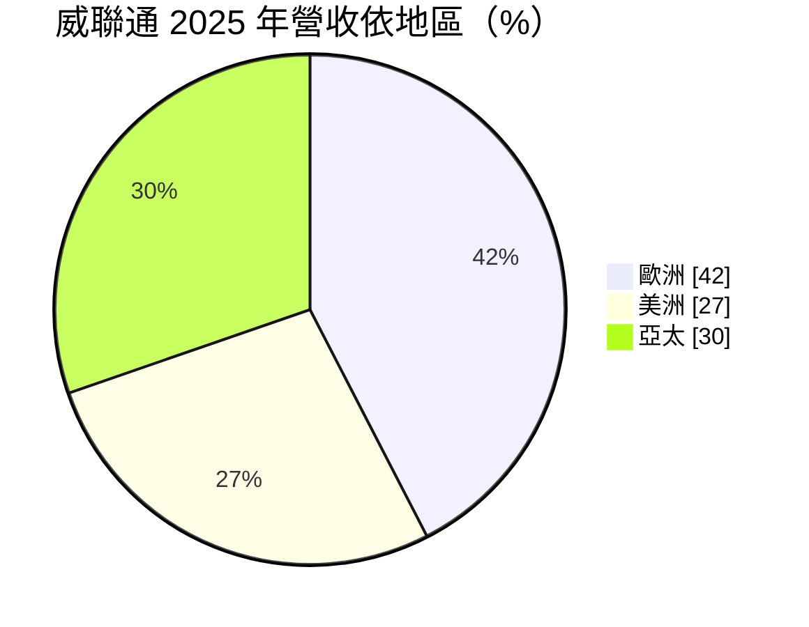
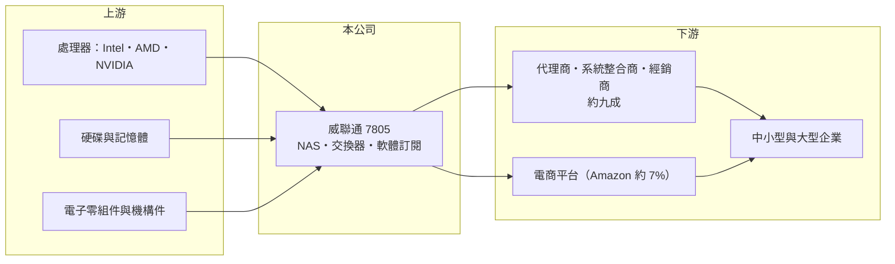

# 7805 威聯通

> 上櫃｜[[產業索引-數位雲端|數位雲端]]｜上市（櫃）日期 2025/12/22

# 第一章：企業模式與商業藍圖

> [!info] 撰寫說明
> 精簡版，由 Claude 依公開資料整理，架構比照 [[2330台積電]]，資料截至 2026-10-08。來源：櫃買中心開放資料（基本資料、2026 年上半年綜合損益與資產負債、每月營收、本益比殖利率）、Goodinfo 年度經營績效（2022 至 2025 年）、富果研究 2026 年 4 月法說會摘要（產品、客戶類型、地區營收、通路、研發、股利）、優分析與經濟日報上櫃報導標題。#待校對

威聯通科技（QNAP）成立於 2004 年，是全球主要的 [[NAS]]（網路附加儲存）[[自有品牌]]之一，從硬體設計、作業系統到應用軟體都自行開發，產品銷往全球，2025 年 12 月上櫃。

- **核心業務：** 威聯通設計並銷售 NAS 伺服器，產品涵蓋機架型、全快閃、桌上型與可攜型，搭配自有作業系統與軟體市集，讓企業與個人可以在自己的機房集中儲存、備份與分享資料。周邊產品包括交換器、SD-WAN 路由器、擴充櫃與擴充卡，加值服務則有 myQNAPcloud 雲端空間與軟體訂閱。
- **營收結構：** 產品重心已由消費級轉向企業級，2025 年中小型與大型企業級 NAS 占營收近 90%，2024 年為 81%。依地區分，2025 年歐洲約 42%、美洲約 27%、亞太約 30%；客戶分散，最大客戶 Amazon 約占營收 7%。

- **營運據點：** 總部位於新北市汐止區，全球約 1,000 名員工，其中研發工程師超過 400 位，並擁有自有工廠以管控品質與供應鏈。銷售以代理商、系統整合商與經銷商為主，占比接近九成；自營電商直銷 2025 年才開始建置，占比不到一成。
- **長期方向：** 新成長動能是橫向擴展儲存（[[Scale-out]]）與 [[Edge AI]] NAS，公司目標 2026 年 Scale-out 營收 3 至 5 億元、2027 年 AI 相關產品占營收 10% 以上，並與 [[NVDA輝達]]、[[AMD超微]]、[[INTC英特爾]] 合作整合 NPU 或 GPU。概念是讓企業在地端就能用自己的資料跑 AI，而不必全部上雲。

# 第二章：護城河深度與競爭優勢

威聯通的護城河來自二十年累積的 NAS 作業系統與軟體生態、全球通路，以及企業客戶的資料轉換成本，屬於寬度中等的護城河。

- **競爭優勢：** NAS 的價值不在硬體本身，而在作業系統、備份、虛擬化與數百個應用軟體構成的生態，這需要長期研發投入，新進者很難追上。企業一旦把資料與備份流程建在某個品牌上，移轉要承擔停機與資料風險，因此續購同品牌的比例高。毛利率長期接近六成，說明產品具有品牌與軟體溢價。
- **主要對手：** 最主要的對手是同為台灣廠商、未上市的群暉（Synology），兩家長期占據全球中小企業 NAS 市場的前兩名；其他對手包括 Western Digital、Seagate、華芸等，以及 Dell、NetApp 等企業儲存大廠與公有雲儲存服務。
- **觀察重點：** 長期要看企業級產品比重能否持續提升、Scale-out 與 Edge AI 產品能否打進更大型的企業儲存市場，以及直銷通路的建置能否提高毛利；也要看面對公有雲儲存的替代時，地端儲存的需求能否維持。

# 第三章：財務體質與盈利規模

資料日期：2026-10-08，表格是撰寫當時的快照；最新月營收、毛利率、累計 EPS 由自動排程寫在本筆記的屬性欄位（月營收、毛利率、累計EPS 等）。#待校對

威聯通營收成長溫和，但 2023 年起營業利益率回到兩成以上，2026 年上半年進一步提升，獲利結構明顯改善。

| 年度 | 營收（億元） | [[毛利率]] | [[營業利益率]] | EPS（元） | [[ROE]] |
|---|---|---|---|---|---|
| 2021 | 未查得 | 未查得 | 未查得 | 未查得 | 未查得 |
| 2022 | 56.5 | 44.7% | 5.49% | 3.10 | 5.61% |
| 2023 | 58.9 | 62.8% | 23.1% | 9.16 | 15.4% |
| 2024 | 59.1 | 57.3% | 18.6% | 17.58 | 16.0% |
| 2025 | 62.5 | 56.6% | 22.1% | 44.56 | 19.6% |
| 2026 上半年 | 34.5 | 59.9% | 28.2% | 23.21 | 未查得 |

註：2022 至 2025 年取自 Goodinfo，2026 年上半年取自櫃買中心開放資料（營業毛利 20.68 億元、營業利益 9.73 億元）。2025 年 EPS 已追溯調整分割減資後股本，與更早年度的 EPS 不能直接比較；2022 年獲利偏低的原因本次未查得。

- **長期指標：** 2022 至 2025 年營收年複合成長率約 3%（推算），平均 ROE 約 14%（推算）。2025 年度董事會決議配發現金股利 38 元與股票股利 2 元，以 EPS 44.56 元計算現金配息率約 85%。2026 年 1 月全球調漲售價以轉嫁記憶體等成本上漲，上半年毛利率反而提升。
- **[[ROIC]] 與 [[WACC]]：** 2025 年營業利益約 13.8 億元（62.5 億元 × 22.1%），稅後營業利益約 11.0 億元；2026 年 6 月底股東權益 77.2 億元，負債 35.7 億元多為流動的應付帳款與營運負債，有息負債視為接近零，ROIC 約 14%（推算）。WACC 約 8.4%（推算：無風險利率 1.75%、市場風險溢酬 6%、β 取硬體品牌同業常見值 1.1，無負債）。ROIC 高於 WACC 約 6 個百分點，代表近年持續創造價值；2022 年營業利益率僅 5.49%，當年 ROIC 應低於 WACC（推算），顯示獲利仍有波動。
- **財務特色：** 2026 年 6 月底總資產 112.9 億元、負債比率約 32%，每股淨值 233.07 元。自有品牌加軟體的模式毛利率高、資本支出相對低，能支撐高配息。

# 第四章：總體風險與地緣政治

威聯通的風險來自零組件成本、資安事件、匯率與公有雲替代。

- **產業週期：** NAS 屬企業 IT 支出，景氣轉弱時中小企業會延後採購；硬碟與記憶體價格的循環會影響產品成本與終端售價，記憶體漲價時需要調價轉嫁，否則毛利率會被壓縮。
- **營運風險：** NAS 直接連上網路、存放企業資料，一直是勒索軟體攻擊的目標，若產品漏洞被大規模利用，將嚴重傷害品牌信任；與群暉的長期競爭也使產品更新與價格必須持續跟進。
- **其他風險：** 營收七成在歐美，歐元、美元匯率變動會影響以新台幣計算的營收與毛利；美國關稅與各國資安規範（如歐盟對聯網產品的資安要求）會增加合規成本；長期來看，公有雲儲存可能替代部分地端需求。

# 專有名詞解析

## 應用

- **[[Scale-out]]**：橫向擴展架構，以增加節點的方式擴充儲存容量與效能，不必更換整台設備。
- **[[Edge AI]]**：在終端或地端設備上直接執行 AI 運算，不必把資料傳到雲端，延遲低且較能保護資料。

## 金融

- **[[ROIC]]**：投入資本報酬率，稅後營業利益除以股東權益加有息負債，衡量本業運用資本的效率。
- **[[WACC]]**：加權平均資金成本，股東與債權人要求報酬率的加權平均，是 ROIC 要超越的門檻。

## 產業

- **[[NAS]]**：網路附加儲存，連接在區域網路上、供多人存取與備份檔案的儲存伺服器。
- **[[自有品牌]]**：以自己的品牌設計與銷售產品，而非替他人代工，掌握定價與通路但需負擔行銷費用。

# 核心供應鏈

- 上游：[[INTC英特爾]]、[[AMD超微]]、[[NVDA輝達]] 的處理器與加速晶片，硬碟與記憶體供應商，以及電子零組件。
- 下游／客戶：全球代理商、系統整合商與經銷商，[[AMZN亞馬遜]] 電商平台，最終使用者以中小型與大型企業為主。
- 同業：群暉（Synology）、Western Digital、Seagate、Dell、NetApp。

## 最新新聞
<!-- news:start -->
<!-- news:end -->

## 相關連結
- [公開資訊觀測站](https://mopsov.twse.com.tw/mops/web/t05st03?step=1&firstin=1&co_id=7805)
- [Goodinfo](https://goodinfo.tw/tw/StockDetail.asp?STOCK_ID=7805)
- [Yahoo 股市](https://tw.stock.yahoo.com/quote/7805)
- [鉅亨網新聞](https://www.cnyes.com/twstock/7805/news)
