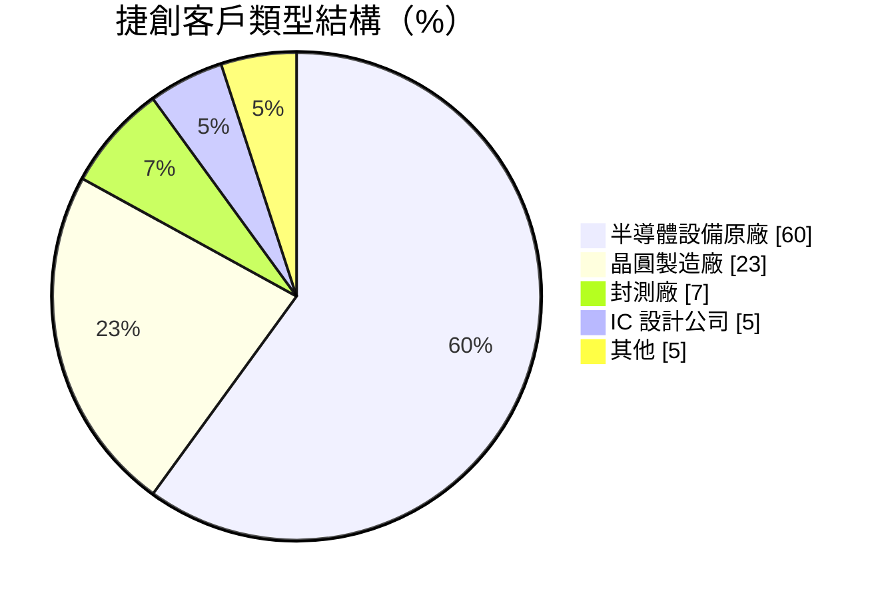
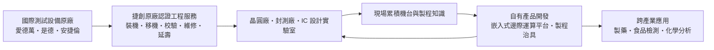
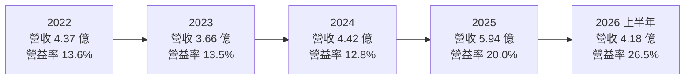
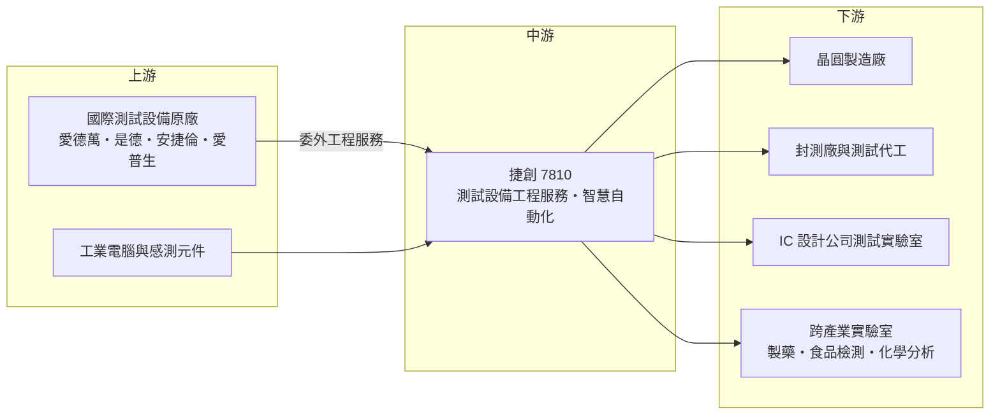

# 7810 捷創科技

> 上櫃｜[[產業索引-半導體業|半導體業]]｜上市（櫃）日期 2025/12/23

# 第一章：企業模式與商業藍圖

> [!info] 撰寫說明
> 本文由 Claude 依公開資料整理，架構比照 [[2330台積電]] 的四章研究，資料截至 2026-10-08。財務數字來源：櫃買中心開放資料（基本資料、綜合損益、資產負債、每月營收、本益比殖利率）、Goodinfo 台灣股市資訊網年度經營績效、工商時報 2026 年 3 月報導、優分析、ETtoday 財經雲；產業描述為整理性內容，尚未逐條比對原始文件。#待校對

在評估單一個股的長期投資價值時，首要步驟是拆解企業的底層獲利邏輯。本章針對捷創科技（股票代號：7810，以下簡稱捷創）的商業模式進行定性分析，說明一家替國際測試設備大廠提供在地工程服務的公司，如何從「替別人修機台」延伸到「自己開發智慧工廠產品」。

## 一、核心定位：國際測試設備原廠的在地工程夥伴

捷創成立於 2004 年，總部位於新竹，2025 年 12 月 23 日以每股 85 元轉上櫃，董事長暨總經理為林益民。公司的定位是「半導體測試設備工程技術服務商」，業務分成兩大塊：設備整合服務，以及自有的智慧自動化產品。

要理解捷創的角色，可以從半導體測試設備的生命週期說起。晶片在出廠前要經過大量測試，使用的是[[ATE]]（自動測試設備）等精密儀器，主要由日本愛德萬（Advantest）、美國是德科技（Keysight）等國際大廠製造。這些設備從裝機、移機、定期校驗、故障維修到延長使用壽命，都需要有經驗的工程師在客戶現場處理。國際原廠在台灣的工程人力有限，於是會把部分工作委託給通過原廠認證的在地工程服務公司，捷創就是其中之一。

依優分析與 ETtoday 報導，捷創自 2012 年起陸續取得各國際半導體設備原廠的認證，主要合作對象包括愛德萬、是德科技、安捷倫（Agilent）與愛普生（Seiko Epson），也與國內晶圓製造、封裝與測試大廠合作多年。服務範圍涵蓋台灣、亞洲與歐美。

## 二、終端應用板塊：服務為主、自有產品比重上升

依優分析報導，捷創的客戶結構如下：

* **半導體設備原廠（約 60%）：** 國際測試設備大廠委託捷創執行裝機、校驗與維修，這是最大宗的收入來源，也是捷創與原廠深度綁定的證明。
* **晶圓製造廠（約 23%）：** 晶圓廠直接委託的設備服務，以及自有自動化產品的導入。
* **封測廠與 IC 設計公司（合計約 12%）：** 測試廠與 IC 設計公司的測試實驗室，同樣需要設備維護與自動化方案。

依業務別，工商時報 2026 年 3 月報導指出，設備服務與維修（含代理）與自有產品的營收比重約為 75% 比 25%；優分析報導 2024 年的比重約為 83% 比 17%。公司目標在兩到三年後調整為約 60% 比 40%，長期朝自有產品占一半的方向邁進。

## 三、資本轉化邏輯：工程服務帶動自有產品

捷創的商業模式是「服務帶產品」。第一層是工程服務：依照工時與服務合約收費，收入穩定但成長受限於工程師人數，毛利率也受人力成本影響。第二層是自有產品：工程師長期在客戶現場服務，最了解機台在哪裡容易出問題、客戶需要哪些數據，捷創據此開發自有的嵌入式邊際運算平台（Jtron Embedded Edge Platform，JEEP）與製程治具。

依工商時報與 ETtoday 報導，這個平台可以收集機台與環境參數、遠端監控設備狀態、提示更換耗材或零件以便事前預防，並協助半導體客戶整合 SECS/GEM 通訊協定，自動擷取、回報與上傳晶圓廠的製程資訊。這類產品是[[智慧製造]]與[[預測性維護]]的基礎元件，同一套平台也可以應用在製藥、食品安全檢測、化學分析等其他產業的實驗室。

自有產品的毛利率通常高於人力密集的工程服務，因此自有產品比重提高，是捷創毛利率從 2023 年的 44.4% 提升到 2025 年的 50.9%、2026 年上半年的 54.2% 的主要原因之一（公司在報導中也表示產品組合優化有助毛利率表現）。

## 四、企業長期藍圖：提高自有產品比重、跟著先進封測成長

* **自有產品比重往 40% 至 50% 提升：** 這是捷創最明確的長期目標，目的是把公司從「人力服務公司」轉型為「服務加產品公司」，提高毛利率與營收的可擴展性。
* **受惠 AI 與先進封裝測試：** 公司看好 AI 與高效能運算（[[HPC]]）推動測試設備與自動化需求。AI 晶片的測試時間更長、測試設備更多，封測產能擴充會帶動裝機需求，並墊高未來校驗與維修的基期。
* **拓展新客群與新應用：** 除了深耕既有原廠客戶，公司也計畫把自動化平台推廣到半導體以外的產業。

整體而言，捷創的長期價值建立在兩個基礎上：一是測試設備裝機量隨半導體產業成長而增加，帶動服務需求；二是自有產品能否在半導體與跨產業市場取得規模。

# 第二章：護城河深度與競爭優勢

在長期價值投資中，「護城河」指企業抵禦競爭、維持超額利潤的保護機制。本章分析捷創的護城河構成、主要競爭對手，以及這些優勢能守住多少。

## 一、捷創護城河的核心組成要素

* **1. 國際原廠認證：** 測試設備價格昂貴、結構精密，原廠只會把裝機與維修工作交給通過認證的服務商，避免設備損壞或影響保固。捷創自 2012 年起陸續取得多家國際原廠認證，這是新進者短期內難以取得的資格。
* **2. 現場累積的工程知識：** 工程師長期在晶圓廠、封測廠現場服務，累積大量不同機型、不同製程環境的維修經驗。這些經驗不僅讓服務品質更穩定，也是開發自有產品的知識來源。
* **3. 客戶現場的信任關係：** 晶圓廠與封測廠的無塵室對外部人員進出有嚴格管制，長期合作的服務商已經熟悉客戶的流程與安全規範，客戶更換服務商的成本與風險都不低。
* **4. 自有產品的整合能力：** 結合原廠設備知識與軟硬體研發能力，捷創可以提供跨品牌、跨機台的資料整合方案，這是單一設備原廠不一定願意做的事。

## 二、全球主要競爭對手格局

| 對手類型 | 定位 | 對捷創的威脅 |
|---|---|---|
| 國際設備原廠自有服務團隊 | 愛德萬、是德等原廠直接派駐工程師 | 原廠若擴充在地人力，可能減少委外比例 |
| 其他第三方設備工程服務商 | 台灣與亞洲的設備維修與整合服務公司（具體名單未查得） | 在價格與人力上競爭 |
| 工廠自動化與 MES 軟體業者 | 提供設備連網、資料擷取與製程監控方案 | 在自有產品市場與捷創的平台競爭 |
| 測試設備相關台灣廠商，例如 [[2360致茂]] | 自有測試設備品牌，附帶服務 | 在特定測試應用與服務上部分重疊 |

## 三、優勢轉化：哪些市場守得住、哪些守不住

* **守得住：** 國際測試設備原廠在台灣的委外工程服務。原廠認證、現場經驗與客戶信任共同構成門檻，加上台灣是全球測試設備最密集的地區之一，這塊基本盤相對穩固。
* **較難守住：** 服務收入的定價權。工程服務的價格取決於人力成本與原廠的委外策略，原廠在議價上有主導權；若原廠調整委外政策或擴編自有團隊，捷創的服務量可能受影響。客戶結構中原廠占六成，集中度不低。
* **觀察重點：** 第一，自有產品比重能否如期從 25% 提升到 40%。第二，邊際運算平台在半導體以外產業的實際導入情形。第三，AI 測試需求帶動的裝機潮能否延續，並轉化為長期的校驗與維修合約。

# 第三章：財務體質與盈利規模

資料日期：2026-10-08。數字取自櫃買中心開放資料、Goodinfo 年度經營績效與工商時報報導，表格是撰寫當時的快照；最新月營收、毛利率、累計 EPS 由自動排程寫在本筆記的屬性欄位（月營收、毛利率、累計EPS 等）。#待校對

財務報表是檢驗護城河是否真實存在的最終標準。本章用三率、[[ROE]]、現金流與資本報酬，檢視捷創的獲利品質。由於捷創 2025 年底才轉上櫃，公開的年度資料只涵蓋 2022 年以後。

## 一、獲利能力的基石：三率

| 年度 | 營收（億元） | [[毛利率]] | [[營業利益率]] | EPS（元） | [[ROE]] |
|---|---|---|---|---|---|
| 2021 | 未查得 | 未查得 | 未查得 | 未查得 | 未查得 |
| 2022 | 4.37 | 46.7% | 13.6% | 5.94 | 22.8% |
| 2023 | 3.66 | 44.4% | 13.5% | 5.00 | 16.7% |
| 2024 | 4.42 | 46.4% | 12.8% | 4.41 | 13.4% |
| 2025 | 5.94 | 50.9% | 20.0% | 6.25 | 14.4% |
| 2026 上半年 | 4.18 | 54.2% | 26.5% | 5.12 | 年化約 22%（推算） |

註：2022 至 2025 年取自 Goodinfo 年度經營績效（合併報表），2025 年數字與工商時報報導的營收 5.94 億元、毛利率 50.89%、營益率 20.05%、EPS 6.25 元一致。2026 上半年取自櫃買中心綜合損益開放資料。2026 上半年 ROE 以稅後淨利 1.04 億元除以 2026 年第二季底權益 9.49 億元，再乘以 2 年化推算。

* **營收穩定成長：** 2022 至 2025 年營收從 4.37 億元成長到 5.94 億元，三年年複合成長率約 10.8%（推算）。2023 年半導體庫存調整時營收下滑到 3.66 億元，但營業利益率仍維持 13.5%，顯示服務收入在景氣低迷時具備一定韌性。2026 年前八月營收約 5.79 億元，年增約 79%（櫃買中心每月營收資料），反映 AI 帶動的測試設備裝機需求。
* **[[毛利率]]逐年提升：** 毛利率從 2023 年的 44.4% 提升到 2026 年上半年的 54.2%，主要來自自有產品比重提高與產品組合優化。
* **[[營業利益率]]的營運槓桿：** 2022 至 2024 年營業利益率約 13%，2025 年跳升到 20.0%，2026 年上半年達 26.5%。工程人力與管理費用相對固定，營收成長時營業利益率擴張得更快，這是[[營運槓桿]]的效果。

## 二、[[ROE]]：資本效率

以 2022 至 2025 年計算，捷創近四年平均 ROE 約 16.8%（推算）。ROE 從 2022 年的 22.8% 降到 2024 年的 13.4%，主要原因是股東權益隨增資與保留盈餘擴大；2025 年轉上櫃前後辦理增資，2026 年第二季底權益約 9.49 億元，其中資本公積約 5.46 億元，每股淨值約 46.9 元。2026 年上半年獲利大增，ROE 年化約 22%（推算）。

## 三、資本支出與[[自由現金流]]

* **[[CapEx]] 低：** 捷創以工程服務與軟硬體開發為主，不需要大型廠房或生產設備，資本支出主要是儀器、測試工具與辦公設備，具體金額未查得。輕資產模式下，自由現金流在獲利年度應為正（推估）。
* **財務結構：** 2026 年第二季底總負債約 3.29 億元，其中非流動負債只有約 0.14 億元，流動資產約 11.0 億元，財務結構保守。
* **股利政策：** 依工商時報報導，董事會擬配發 2025 年度現金股利每股 5 元，其中盈餘配發 4.5 元、資本公積配發 0.5 元，配發率由前一年的 90.7% 降到約 80%。長期維持八成以上的配發率，代表公司傾向把獲利回饋給股東。

## 四、[[ROIC]] 與 [[WACC]]：價值創造利差

* **ROIC（推算）：** 依工商時報報導，2025 年營業利益約 1.19 億元，乘以（1－20% 稅率）得到稅後營業利益約 0.95 億元。投入資本以 2026 年第二季底權益 9.49 億元加上非流動負債 0.14 億元（有息負債未查得，以非流動負債作為上限近似）計算，約 9.63 億元，2025 年 ROIC 約 9.9%（推算）。以 2026 年上半年營業利益 1.11 億元年化計算，稅後營業利益約 1.77 億元，ROIC 約 18.4%（推算）。上櫃增資後帳上現金較多，若只計算營運資產，實際報酬率更高。
* **WACC（推算）：** 用 CAPM 推估：無風險利率約 1.75%，市場風險溢酬 6%，β 值取中小型半導體設備服務股常見的 1.2（假設值，未查得官方數字），股東權益成本約 1.75% + 1.2 × 6% = 8.95%。捷創幾乎沒有有息負債，WACC 約 9%（推算）。
* **價值創造判斷：** 2025 年 ROIC 約 9.9% 略高於 WACC 約 9%；2026 年上半年 ROIC 約 18.4%，利差擴大到約 9 個百分點（推算）。這代表捷創的服務加產品模式在規模擴大後，確實具備創造價值的能力。不過上櫃時間短、歷史資料有限，需要觀察在下一次半導體景氣低谷時，ROIC 能否維持在 WACC 以上。

# 第四章：總體風險與地緣政治

任何企業都無法脫離宏觀環境獨立存在。本章分析捷創未來必須面對的地緣政治、產業週期、營運與技術風險。

## 一、地緣政治風險

* **半導體供應鏈移轉：** 台灣晶圓廠與封測廠往美國、日本與東南亞擴廠，測試設備的裝機需求也會部分移往海外。捷創若要跟著客戶出海，需要在當地建立工程團隊，面臨人力成本與管理挑戰；若不跟進，則可能失去部分新增需求。
* **美國出口管制：** 先進測試設備與服務受到出口管制規範，對特定地區客戶的服務可能受限，原廠也會要求服務商遵守相同規範。
* **台灣集中風險：** 主要客戶與服務據點集中在台灣，面臨一般性的地緣與天災風險。

## 二、產業週期與市場結構風險

* **設備投資循環：** 裝機與移機服務直接受晶圓廠與封測廠的資本支出影響，半導體景氣下滑時，新設備的採購與裝機會減少。不過校驗、維修與延壽服務屬於維護性需求，波動較小，可以部分緩衝景氣循環。
* **原廠委外策略：** 國際原廠是捷創最大的客戶類型，原廠的委外政策、在台人力配置與服務商分配，直接影響捷創的服務量。
* **AI 需求的持續性：** 2025 至 2026 年的成長很大一部分來自 AI 與 HPC 帶動的測試設備擴充，若 AI 投資放緩，裝機需求也會跟著減速。

## 三、營運環境的隱性風險

* **工程人才：** 工程服務高度依賴有經驗的工程師，台灣半導體產業人才競爭激烈，薪資上升會壓縮服務毛利，人員流動也會影響服務品質。
* **客戶集中：** 設備原廠占營收約六成，前幾大原廠的業務變動影響很大。
* **新產品市場化：** 自有產品要推廣到半導體以外的產業，需要建立新的銷售通路與客戶支援能力，對規模不大的公司是一大挑戰。

## 四、科技演進風險

測試設備正朝更高腳數、更高功率、更長測試時間發展，AI 晶片與先進封裝的測試流程也更加複雜，這會增加對專業工程服務的需求，但也要求工程團隊持續學習新機型與新技術。在自有產品方面，工廠自動化與設備連網正在走向標準化與雲端化，大型自動化廠商與軟體公司也積極布局。捷創的邊際運算平台若能維持「懂半導體設備」的差異化，並建立跨產業的應用案例，就能在智慧製造市場中站穩一席之地；反之，若平台功能被通用型產品取代，自有產品比重的目標就難以達成。

# 專有名詞解析

## 半導體

- **[[ATE]]**：自動測試設備，用來測試晶片功能與效能的精密儀器，主要供應商為愛德萬與泰瑞達。
- **[[Final Test]]**：晶片封裝完成後的最終測試，確認成品功能正常後才出貨。
- **[[測試代工]]**：專門替 IC 設計公司或晶圓廠執行晶圓測試與成品測試的服務業者，例如京元電子。

## 應用

- **[[HPC]]**：高效能運算，泛指資料中心、AI 訓練與科學運算等需要大量算力的應用。

## 金融

- **[[營運槓桿]]**：固定成本占比高的公司，營收小幅變動會造成營業利益大幅變動的現象。
- **[[資本公積]]**：股東投入資本超過面額的部分，例如溢價增資，可依法用於配發現金。
- **[[配發率]]**：現金股利占每股盈餘的比例，反映公司把多少獲利回饋給股東。

## 產業

- **[[SECS GEM]]**：半導體設備與工廠主機系統之間的標準通訊協定，用於自動擷取設備狀態與製程資料。
- **[[智慧製造]]**：運用感測、連網與資料分析提升生產效率與品質的製造方式。
- **[[預測性維護]]**：透過監測設備數據，在故障發生前預先更換零件或保養的維護方式。
- **[[邊緣運算]]**：在靠近資料產生端的設備上直接處理資料，而非全部送到雲端，可降低延遲與頻寬負擔。
- **[[MES]]**：製造執行系統，管理工廠生產排程、設備狀態與品質資料的軟體系統。

# 核心供應鏈

## 1. 上游：設備原廠與零組件
- 測試設備原廠（同時也是主要客戶）：愛德萬（Advantest）、是德科技（Keysight）、安捷倫（Agilent）、愛普生（Seiko Epson）
- 自有產品所需的工業電腦與感測元件（供應商未查得）

## 2. 中游：捷創本身與測試生態系相關業者
- 測試設備與測試介面相關台灣廠商：[[2360致茂]]、[[7769鴻勁]]、[[6515穎崴]]

## 3. 下游：客戶群
- 晶圓製造廠、封測廠與測試代工（台灣大廠如 [[3711日月光投控]]、[[2449京元電子]] 屬於產業典型客戶類型，捷創未公開具體客戶名單）
- IC 設計公司測試實驗室、跨產業實驗室

## 最新新聞
<!-- news:start -->
<!-- news:end -->

## 相關連結
- [公開資訊觀測站](https://mopsov.twse.com.tw/mops/web/t05st03?step=1&firstin=1&co_id=7810)
- [Goodinfo](https://goodinfo.tw/tw/StockDetail.asp?STOCK_ID=7810)
- [Yahoo 股市](https://tw.stock.yahoo.com/quote/7810)
- [鉅亨網新聞](https://www.cnyes.com/twstock/7810/news)
