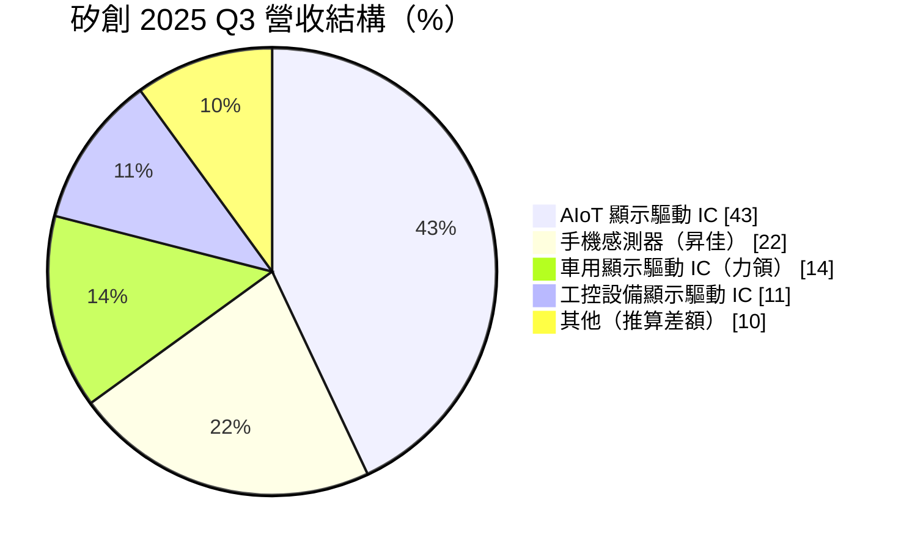
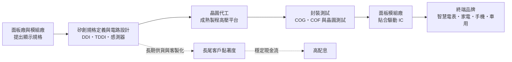
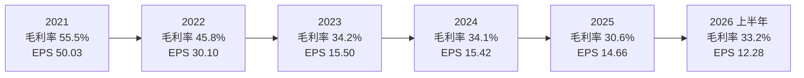
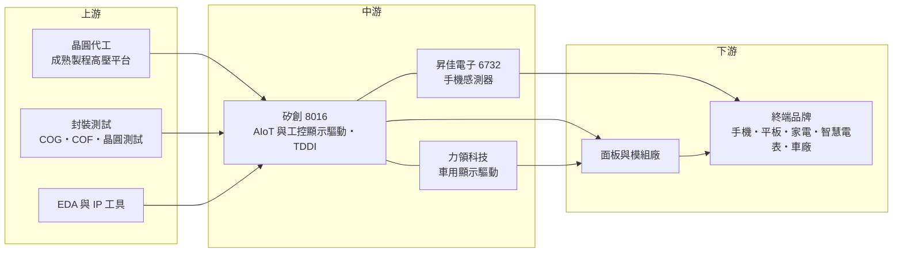

# 8016 矽創

> 上市｜[[產業索引-半導體業|半導體業]]｜上市（櫃）日期 2003/12/25

# 第一章：企業模式與商業藍圖

> [!info] 撰寫說明
> 本文由 Claude 依公開資料整理，架構比照 [[2330台積電]] 的四章研究，資料截至 2026-10-08。財務數字來源：證交所開放資料（基本資料、綜合損益、資產負債、營益分析、股利）、Goodinfo 台灣股市資訊網年度經營績效、富果研究 2025 年第三季法說會整理、經濟日報、科技新報；產業描述為整理性內容，尚未逐條比對原始文件。#待校對

在評估單一個股的長期投資價值時，首要步驟是拆解企業的底層獲利邏輯。本章針對矽創電子（股票代號：8016，以下簡稱矽創）的商業模式進行定性分析，說明它如何從中小尺寸面板驅動 IC 起家，逐步發展成「顯示驅動＋感測＋車用」三條產品線並行的 IC 設計集團。

## 一、核心定位：專攻長尾市場的中小尺寸顯示驅動 IC 設計公司

矽創成立於 1992 年，2003 年在證交所上市，總部位於新竹縣竹北市，是典型的 [[Fabless]] IC 設計公司：自己負責晶片設計、規格定義與客戶支援，晶圓製造與封裝測試則全部委外。公司最核心的產品是顯示驅動 IC（[[DDI]]），也就是負責控制面板上每一個像素電壓的晶片。

和 [[3034聯詠]] 這類以電視、筆電、手機大尺寸或高解析度面板為主的大廠不同，矽創長期把重心放在「中小尺寸、長尾型」的顯示應用，例如智慧電表、工業量測儀器、家電面板、穿戴裝置與各類物聯網終端。這類市場單一案子的出貨量不大，但型號極多、生命週期長，需要供應商針對不同面板規格客製化並長期供貨。大廠通常不願意為少量訂單投入工程資源，這就成為矽創可以深耕的利基。

矽創也透過子公司把觸角延伸到相鄰市場。依 2025 年第三季法說會資料，子公司昇佳電子（[[6732昇佳電子]]，矽創持股約 46%）負責手機用的光學、MEMS 與電容式感測器；子公司力領科技負責車用儀表、抬頭顯示器（[[HUD]]）與中控觸控顯示的驅動晶片。母公司本身則聚焦 AIoT 與工控顯示驅動，以及近年力推的零電容 [[TDDI]]（觸控與顯示驅動整合晶片）。

## 二、終端應用板塊：AIoT 顯示驅動為最大宗

依富果研究整理的 2025 年第三季法說會資料，矽創營收依產品與應用可分為四大塊：

* **AIoT 顯示驅動 IC（約 43%）：** 這是最大、成長最快的部門，從 2025 年第一季的 31% 提升到第三季的 43%。其中零電容 TDDI 約占該部門的 39%，換算約占公司總營收 16%。零電容設計可以讓客戶省去外部電容、打件與測試成本，在價格敏感的中低階平板與物聯網裝置上特別有吸引力。
* **手機感測器（約 22%）：** 由昇佳電子負責，產品包括環境光與近接感測、[[SAR 感測器]]、高度計等，主要客戶是安卓一線手機品牌。這塊業務讓矽創能分享手機規格升級的紅利，但也直接面對中國供應商的價格競爭。
* **車用顯示驅動 IC（約 14%）：** 由力領科技負責，產品用於數位儀表板、抬頭顯示器與中控螢幕。法說會提到，中國車廠約占車用營收一半，日系機車品牌也正在導入數位儀表。
* **工控設備顯示驅動 IC（約 11%）：** 應用在智慧電表、工業量測與商用控制設備，屬於典型的長尾市場，上半年為旺季、下半年較淡。

圓餅圖中的「其他」是四大部門加總後的差額，由本文推算，法說會資料並未單獨說明內容。

## 三、資本轉化邏輯：輕資產的規格客製化模式

矽創的獲利模式可以用三個環節理解。第一是「規格客製化」：驅動 IC 必須和面板的尺寸、解析度、介面規格精確匹配，矽創的工程團隊與面板模組廠一起定義規格，這個過程本身就形成客戶黏著。第二是「輕資產製造」：晶圓製造與封測全部委外，公司不需要負擔晶圓廠的龐大折舊，資本支出主要是研發、光罩與測試設備。第三是「長生命週期」：工控與電表類產品一旦導入，往往可以連續供貨多年，讓營收的基本盤相對穩定。

這種模式的代價是毛利率受晶圓代工價格影響很大。2021 年全球晶圓產能短缺時，驅動 IC 報價大漲，矽創毛利率一度衝到 55.5%；當產能恢復寬鬆、報價回落，毛利率又回到 30% 至 34% 區間。換句話說，矽創賺的是「設計與服務的價值」，但景氣好壞仍會透過晶圓成本與報價放大到獲利上。

## 四、企業長期藍圖：零電容 TDDI、車用新規格與高階感測

依 2025 年第三季法說會，矽創的長期策略有三個方向。

* **以零電容技術擴大 TDDI 與 AIoT 版圖：** 矽創在 TDDI 市場屬於後進者，策略不是單純比價格，而是用「省去外部電容」的系統成本優勢切入，從平板、物聯網裝置延伸到工控與車用 TDDI。公司預期車用 TDDI 在 2025 年底前進入量產。
* **車用從儀表延伸到 HUD 與電子後視鏡：** 新規格儀表板與 HUD 在 2025 年下半年小量出貨，公司預期隨新車款逐步放量。車用晶片驗證期長，一旦導入可以供貨多年，是矽創拉長營收週期的重要布局。
* **感測器往高階、高毛利產品移動：** 昇佳電子在 2025 年把 SAR 感測器與高度計導入手機品牌，並預計 2026 年初交付韓系客戶的高階耳機光感測產品，目的在於避開中國同業的低價競爭。

從組織結構看，矽創採取「母公司加上多家專業子公司」的集團模式，每個子公司聚焦一個應用領域、各自累積客戶與技術。這種安排讓集團可以同時布局多個市場，但也代表投資人在評估矽創時，需要同時追蹤子公司的經營狀況與持股比例。

# 第二章：護城河深度與競爭優勢

在長期價值投資中，「護城河」指企業抵禦競爭、維持超額利潤的保護機制。本章分析矽創的護城河構成、全球主要競爭對手，以及這些優勢在面對中國同業與國際大廠時能守住多少。

## 一、矽創護城河的核心組成要素

矽創的護城河屬於「窄而分散」的類型，不是靠單一壟斷技術，而是靠長尾市場的累積與集團分工。

* **1. 長尾市場的服務門檻：** 智慧電表、工業量測、家電面板這類應用，型號多、單量小、要求長期供貨。大型驅動 IC 廠為了效率通常專注在大客戶，矽創則願意投入工程資源服務數量眾多的中小客戶。這種「別人不想做、做了又要做很久」的市場，是矽創毛利率能長期維持在 30% 以上的重要原因。
* **2. 規格綁定帶來的轉換成本：** 驅動 IC 和面板模組的設計高度綁定，客戶一旦採用矽創的方案完成面板設計與驗證，要換供應商就得重新設計、重新測試。在工控與車用市場，這個驗證過程動輒一到兩年，使得既有供應商有明顯優勢。
* **3. 零電容 TDDI 的系統成本優勢：** 傳統 TDDI 需要搭配外部電容，矽創的零電容設計讓客戶省下零件、打件與測試成本。在價格敏感的平板與物聯網市場，這種「幫客戶省整體成本」的設計比單純降價更具說服力。
* **4. 集團化的產品組合：** 顯示驅動、感測器與車用驅動分屬不同子公司，各自有不同的景氣循環。當某一個市場轉弱時，其他市場可以部分抵銷衝擊，使集團整體營收的波動比單一產品公司小。

## 二、全球主要競爭對手格局

| 對手 | 定位 | 對矽創的威脅 |
|---|---|---|
| [[3034聯詠]] | 全球前段班驅動 IC 廠，涵蓋電視、筆電、手機與 TDDI | 規模與晶圓議價力大，在 TDDI 與車用顯示直接競爭 |
| 奇景光電（Himax） | 驅動 IC 與車用 TDDI 領先者 | 車用 TDDI 起步早、客戶基礎深 |
| [[4961天鈺]] | 鴻海集團驅動 IC 廠，中小尺寸與電子紙驅動 | 中小尺寸與工控面板直接重疊 |
| [[3545敦泰]] | 觸控與 TDDI 起家 | 在平板與手機 TDDI 市場競爭 |
| 集創北方等中國驅動 IC 廠 | 受中國面板廠就近支持、價格積極 | 壓低中低階 TDDI 與 AIoT 驅動 IC 報價 |
| 中國感測器廠商 | 手機光學與近接感測 | 以價格競爭壓縮昇佳毛利 |

## 三、優勢轉化：哪些市場守得住、哪些守不住

* **守得住：** 工控、智慧電表與車用顯示驅動。這些市場重視長期供貨、穩定品質與客製化服務，驗證週期長，客戶不會為了些微價差輕易換供應商。矽創在這些領域累積了數十年的客戶名單，是最穩固的基本盤。
* **較難守住：** 中低階平板與手機的 TDDI，以及手機用的一般型光學感測器。這兩個市場的客戶以價格為主要考量，中國同業又有在地面板廠支持。法說會也坦承，矽創在 TDDI 屬於後進者，為了爭取市占可能承受價格壓力；2025 年第三季毛利率從前一年同期的 33% 降到 29%，原因之一就是中國市場的感測器價格競爭。
* **觀察重點：** 第一，零電容 TDDI 能否從平板擴展到車用與工控，若能進入驗證週期長的市場，就能從「價格戰產品」轉為「長期供貨產品」。第二，車用新規格儀表與 HUD 的放量速度。第三，昇佳的高階感測器（耳機光感測、SAR、高度計）能否拉高感測器部門的毛利率。這三點決定矽創能否擺脫中低階驅動 IC 的價格循環。

# 第三章：財務體質與盈利規模

資料日期：2026-10-08。數字取自證交所開放資料、Goodinfo 年度經營績效與公司法說會整理，表格是撰寫當時的快照；最新月營收、毛利率、累計 EPS 由自動排程寫在本筆記的屬性欄位（月營收、毛利率、累計EPS 等）。#待校對

財務報表是檢驗護城河是否真實存在的最終標準。本章用三率、[[ROE]]、現金流與資本報酬，檢視矽創在驅動 IC 景氣循環中的獲利品質。

## 一、獲利能力的基石：三率

| 年度 | 營收（億元） | [[毛利率]] | [[營業利益率]] | EPS（元） | [[ROE]] |
|---|---|---|---|---|---|
| 2020 | 138 | 34.7% | 17.3% | 11.53 | 27.2% |
| 2021 | 223 | 55.5% | 36.7% | 50.03 | 57.8% |
| 2022 | 180 | 45.8% | 26.3% | 30.10 | 28.2% |
| 2023 | 167 | 34.2% | 15.0% | 15.50 | 16.5% |
| 2024 | 178 | 34.1% | 14.0% | 15.42 | 15.9% |
| 2025 | 190 | 30.6% | 11.2% | 14.66 | 13.6% |
| 2026 上半年 | 115.81 | 33.2% | 14.2% | 12.28 | 年化約 22%（推算） |

註：2020 至 2025 年取自 Goodinfo 年度經營績效（合併報表）；2026 上半年取自證交所綜合損益與營益分析開放資料。2026 上半年 ROE 以歸屬母公司淨利（EPS 乘以扣除庫藏股後的流通股數推算，約 14.4 億元）除以 2026 年第二季底歸屬母公司權益 132.1 億元，再乘以 2 年化推算。

* **[[毛利率]]呈現「一次高峰、長期回歸」：** 2021 年晶圓產能短缺時，驅動 IC 報價大漲，矽創毛利率衝到 55.5%，屬於非常態的景氣高峰。之後隨著產能恢復寬鬆，毛利率在 2023 至 2024 年回到 34% 左右，這比較接近公司長期的正常水準。2025 年再降到 30.6%，主要原因是新台幣匯率波動、中國感測器價格競爭，以及 TDDI 為了搶市占而犧牲部分毛利。
* **[[營業利益率]]受研發費用支撐：** 矽創屬於研發密集的設計公司，研發人力與光罩費用相對固定。當營收持平、毛利率下滑時，營業利益率會下降得更快，2025 年只剩 11.2%。2026 年上半年營收明顯成長，營業利益率就回升到 14.2%，這是典型的[[營運槓桿]]效果。
* **業外與子公司：** 2026 年上半年稅後淨利率 15.0% 高於營業利益率 14.2%，代表有正向的業外收益（利息與投資收益）。由於昇佳等子公司並非 100% 持股，合併淨利中有一部分屬於[[非控制權益]]，評估母公司股東實際能分到的獲利時應以 EPS 為準。

## 二、[[ROE]]：資本效率

矽創的 ROE 在 2021 年景氣高峰時達到 57.8%，之後一路回落到 2025 年的 13.6%。以 2021 至 2025 年計算，近五年平均 ROE 約 26.4%；若排除 2021 年的極端高點，2022 至 2025 年平均約 18.6%（推算）。ROE 下滑有兩個原因：一是毛利率從高峰回歸正常，二是高峰期累積的獲利讓股東權益變大，但並沒有對應等比例的新增高報酬投資。以 2026 年第二季底來看，歸屬母公司權益約 132.1 億元，每股淨值約 112 元。

營收成長方面，2019 年營收 138 億元、2025 年 190 億元，六年的年複合成長率約 5.5%（推算）；若從 2021 年高點 223 億元算到 2025 年，則是每年約 -3.9%（推算）。這說明矽創的營收長期在成長，但 2021 年的高峰是異常值，不宜當作比較基準。

## 三、資本支出與[[自由現金流]]

* **[[CapEx]] 低：** 作為 Fabless 公司，矽創的資本支出主要是研發辦公室、測試設備與光罩，遠低於營業現金流（具體金額未查得）。因此在多數年度，矽創都能產生正的自由現金流（推估，依輕資產模式與長期穩定配息判斷）。
* **股利政策：** 依證交所股利資料，矽創 2025 年度盈餘分配的現金股利為每股 11.5 元，以 2025 年 EPS 14.66 元計算，配息率約 78%（推算）。Goodinfo 顯示的長期平均現金股利約 6.35 元。高配息率搭配低資本支出，代表矽創把大部分獲利回饋給股東，而非大規模擴張。
* **財務結構：** 2026 年第二季底總負債約 79.8 億元，其中非流動負債只有約 4.9 億元，大部分是應付帳款等營運性負債，財務槓桿很低。

## 四、[[ROIC]] 與 [[WACC]]：價值創造利差

* **ROIC（推算）：** 以 2025 年營收 190 億元乘以營業利益率 11.2%，營業利益約 21.3 億元，乘以（1－20% 稅率）得到稅後營業利益約 17.0 億元。投入資本以 2026 年第二季底權益總計 173.5 億元（含非控制權益）加上非流動負債 4.9 億元（矽創的有息負債資料未查得，以非流動負債作為上限近似）計算，約 178.4 億元。2025 年 ROIC 約 17.0 ÷ 178.4 ≈ 9.5%（推算）。若用 2026 年上半年營業利益 16.42 億元年化計算，稅後營業利益約 26.3 億元，ROIC 約 14.7%（推算）。由於帳上有大量現金與金融資產，若只計算實際投入營運的資本，報酬率會更高。
* **WACC（推算）：** 用資本資產定價模型（CAPM）推估。無風險利率取台灣 10 年期公債約 1.75%，市場風險溢酬取 6%，β 值取中大型 IC 設計股常見的 1.1（假設值，未查得官方數字），股東權益成本約為 1.75% + 1.1 × 6% ≈ 8.4%。矽創幾乎沒有有息負債，WACC 約等於股東權益成本，約 8% 至 8.5%（推算）。
* **價值創造判斷：** 2025 年 ROIC 約 9.5% 只略高於 WACC 約 8.4%，利差大約 1 個百分點，是近年最薄的一年；2021 至 2022 年的景氣高峰期，ROIC 則遠高於 WACC（推估）。2026 年上半年隨營收與營業利益率回升，利差擴大到約 6 個百分點（推算）。整體而言，矽創長期仍是創造價值的公司，但利差大小高度取決於驅動 IC 的景氣與毛利率，能否在下一個低谷維持 ROIC 高於 WACC，是觀察護城河是否真正存在的關鍵。

# 第四章：總體風險與地緣政治

任何企業都無法脫離宏觀環境獨立存在。本章分析矽創未來必須面對的地緣政治、產業週期、營運與技術風險。

## 一、地緣政治風險

* **中國市場的高度依賴：** 矽創的面板模組廠、手機品牌與車廠客戶有相當比例在中國，法說會提到中國車廠約占車用營收一半。這代表中國經濟景氣、在地化採購政策與中美貿易摩擦，都會直接影響矽創的訂單。若中國政策要求本土車廠或面板廠優先採用國產晶片，矽創的車用與 TDDI 業務會首當其衝。
* **關稅與供應鏈移轉：** 終端產品出口到美國時面臨關稅，品牌客戶可能把組裝移往東南亞或印度。矽創本身不設工廠，受衝擊較小，但需要跟著客戶調整供貨與技術支援的據點。
* **台灣生產集中：** 驅動 IC 主要在台灣的晶圓廠與封測廠生產，與其他台灣半導體公司一樣，面臨兩岸情勢升溫時的供應鏈風險。

## 二、產業週期與市場結構風險

* **驅動 IC 的強循環特性：** 2021 年至 2025 年的財務數據已經清楚說明，驅動 IC 的報價與毛利率會隨晶圓產能鬆緊大幅波動。晶圓產能短缺時，驅動 IC 是最先缺貨、最先漲價的品項之一；產能過剩時，也是最先降價的品項之一。投資人不宜把景氣高峰的獲利當作長期常態。
* **[[長鞭效應]]與庫存調整：** 消費性電子與手機需求轉弱時，面板模組廠會先停止拉貨，再把庫存調整壓力往上游傳遞，驅動 IC 廠的營收往往比終端需求下滑得更劇烈。
* **中國同業擴張：** 中國驅動 IC 與感測器廠商在政策支持下快速擴張，使中低階產品的價格長期承壓。矽創必須持續往高規格、長生命週期的產品移動，才能維持毛利率。

## 三、營運環境的隱性風險

* **晶圓產能與代工價格：** 顯示驅動 IC 需要高壓製程，多半使用 8 吋與 12 吋成熟製程產能。成熟製程代工廠若漲價或優先供應給其他產品，矽創的成本與交期都會受影響。
* **子公司經營與持股結構：** 昇佳與力領等子公司各自經營，若子公司獲利下滑或需要增資，會影響集團整體表現；而部分獲利屬於非控制權益，也讓母公司股東實際享有的獲利低於合併數字。
* **匯率：** 營收以美元計價為主，新台幣升值時會壓縮以台幣計算的毛利率，2025 年第三季法說會就提到匯率是毛利率下滑原因之一。

## 四、科技演進風險

顯示技術持續演進，從 LCD 走向 OLED、Mini LED 與 Micro LED，每一次技術轉換都會改變驅動 IC 的規格與競爭格局。矽創目前的主力在中小尺寸 LCD 與 TDDI，若 AIoT 與工控終端快速轉向 OLED 或電子紙等新型顯示，矽創需要及時推出對應產品，否則既有客戶可能轉向擁有完整技術的大廠。另一方面，車用電子對功能安全與可靠度的要求不斷提高，車用驅動 IC 需要持續投入驗證與認證成本。矽創若能把零電容與長尾客製化的能力延伸到新顯示技術，就能延續護城河；反之，技術轉換期也可能是被競爭者取代的時點。

# 專有名詞解析

## 半導體

- **[[DDI]]**：顯示驅動 IC，負責控制面板每個像素的電壓，需要高壓製程，聯詠、奇景、矽創為主要設計公司。
- **[[TDDI]]**：把觸控控制與顯示驅動整合在同一顆晶片的方案，可降低手機與平板的零件數與成本。
- **[[Fabless]]**：只做晶片設計、不擁有晶圓廠的 IC 設計公司，製造委外給晶圓代工廠。
- **[[SAR 感測器]]**：偵測人體與手機天線距離的感測器，讓手機在靠近人體時降低發射功率，以符合電磁波法規。
- **[[COG]]**：Chip on Glass，把驅動 IC 直接貼合在面板玻璃上的封裝方式，常見於中小尺寸面板。

## 應用

- **[[AIoT]]**：人工智慧與物聯網的結合，泛指具備連網與智慧判斷能力的終端裝置，例如智慧家電與智慧電表。
- **[[智慧電表]]**：具備數位顯示與通訊功能的電表，可遠端回傳用電資料，是工控顯示驅動 IC 的典型長尾應用。
- **[[HUD]]**：抬頭顯示器，把車速、導航等資訊投射在擋風玻璃或透明面板上，讓駕駛不必低頭看儀表。
- **[[車規驗證]]**：車用晶片須通過 AEC-Q100 等可靠度測試與車廠認證，流程常需 2 至 3 年，因此轉換成本高。

## 金融

- **[[營運槓桿]]**：固定成本占比高的公司，營收小幅變動會造成營業利益大幅變動的現象。
- **[[非控制權益]]**：合併報表中屬於子公司其他股東的權益與獲利，母公司股東實際享有的部分需扣除這一塊。
- **[[配息率]]**：現金股利占每股盈餘的比例，反映公司把多少獲利回饋給股東。
- **[[自由現金流]]**：營業活動現金流減去資本支出，代表企業可自由用於配息、還債或併購的現金。
- **[[長鞭效應]]**：終端需求的小幅變動，沿供應鏈往上游傳遞時被逐級放大，造成上游庫存與訂單劇烈波動。

# 核心供應鏈

## 1. 上游：晶圓代工、封測與設計工具
- 晶圓代工：顯示驅動 IC 需要成熟製程的高壓平台，具體代工夥伴未查得，台灣主要成熟製程代工廠包括 [[2303聯電]]、[[5347世界先進]]、[[6770力積電]]、[[2330台積電]]
- 設計工具：[[SNPS新思科技]]、[[CDNS益華電腦]]

## 2. 中游：矽創本身與集團子公司
- 手機光學、MEMS 與電容式感測器：[[6732昇佳電子]]（矽創持股約 46%）
- 車用儀表、HUD 與中控顯示驅動：力領科技（子公司）

## 3. 中游：主要競爭同業
- 驅動 IC 與 TDDI：[[3034聯詠]]、[[4961天鈺]]、[[3545敦泰]]、奇景光電、集創北方

## 4. 下游：客戶與終端
- 面板與模組廠、安卓一線手機品牌、中國車廠與日系機車品牌、智慧電表與工業儀器廠（客戶名稱多未公開）

## 最新新聞
<!-- news:start -->
<!-- news:end -->

## 相關連結
- [公開資訊觀測站](https://mopsov.twse.com.tw/mops/web/t05st03?step=1&firstin=1&co_id=8016)
- [Goodinfo](https://goodinfo.tw/tw/StockDetail.asp?STOCK_ID=8016)
- [Yahoo 股市](https://tw.stock.yahoo.com/quote/8016)
- [鉅亨網新聞](https://www.cnyes.com/twstock/8016/news)
