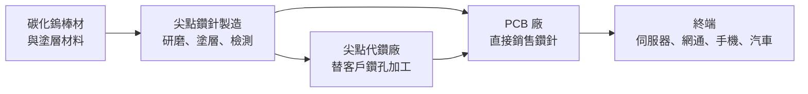
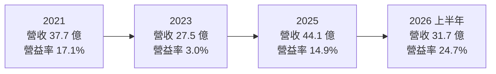
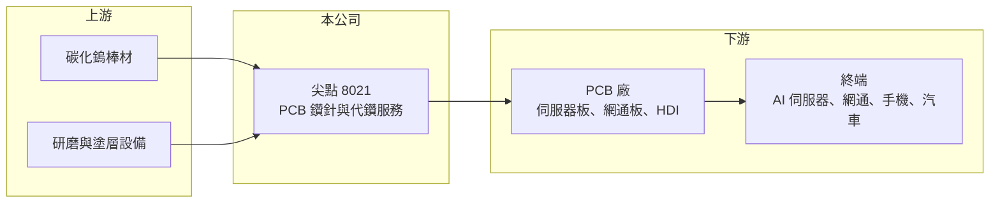

# 8021 尖點

> 上市｜[[產業索引-其他電子業|其他電子業]]｜上市（櫃）日期 2008/01/21

# 第一章：企業模式與商業藍圖

> [!info] 撰寫說明
> 本文由 Claude 依公開資料整理，架構比照 [[2330台積電]] 的四章研究，資料截至 2026-10-08。財務數字來源：Goodinfo 台灣股市資訊網年度經營績效、優分析 2025 年法說報導、證交所開放資料（本筆記 _data 快照）；產品比重、客戶與海外據點公開資料有限，產業描述為整理性內容，尚未逐條比對原始文件。#待校對

在評估單一個股的長期投資價值時，首要步驟是拆解企業的底層獲利邏輯。本章說明尖點科技（股票代號：8021，以下簡稱尖點）的鑽針與代鑽生意如何跟著[[PCB]]產業起伏，以及 AI 伺服器板為什麼讓這門耗材生意出現結構性變化。

## 一、核心定位：PCB 鑽針與代鑽服務廠

尖點成立於 1996 年，總部位於新北樹林，2008 年在證交所上市。公司的主要業務有兩項：

* **PCB 鑽針：** 印刷電路板需要鑽出大量小孔，讓上下層線路導通或插入零件。鑽針是用碳化鎢等硬質材料製成的微小刀具，直徑常在零點幾毫米，屬於消耗品，鑽到一定孔數就必須更換。
* **代鑽服務：** 部分 PCB 廠會把鑽孔製程外包，由尖點用自己的鑽孔機台替客戶加工。代鑽讓尖點更貼近客戶產線，也能直接掌握鑽針使用的狀況。

鑽針的商業特性在於「用量跟著鑽孔數走」。PCB 產量越大、層數越多、板子越厚，需要的孔數與鑽針數量就越多，因此尖點的營收與 PCB 產業景氣高度連動。依 2025 年法說報導，尖點鑽針月產能由 3,100 萬支提升到 3,500 萬支，新產能在 2026 年第一季全數到位。

## 二、終端應用：AI 伺服器板改變鑽針需求

產品別與應用別營收比重未查得。從產業結構看，PCB 的終端應用包括伺服器與網通、手機、電腦、汽車與消費電子。近年最重要的變化是 [[AI伺服器]]：

* **層數與板厚增加：** AI 伺服器與高速交換器的電路板層數常超過 20 層、板子更厚，鑽一個孔要穿過更多層材料，鑽針壽命縮短、用量增加。
* **材料更硬：** 高速傳輸需要低損耗的基板材料與玻纖布，這些材料較難鑽，對鑽針的品質與塗層要求更高，也讓高階鑽針的單價提高。

這兩個因素使鑽針從「跟著 PCB 產量成長」變成「成長速度高於 PCB 產量」，是 2025 年起尖點營收與毛利率同步走高的主要原因。

## 三、資本轉化邏輯：精密加工的耗材生意

鑽針製造屬於精密研磨加工，核心在於刃口設計、研磨精度與塗層技術。產能擴充需要購置大量精密研磨機台，資本支出不小，但產品是重複購買的耗材，客戶一旦採用，訂單會持續發生。

* **耗材的重複購買：** PCB 廠每天都在消耗鑽針，只要產線開著，就需要補貨。這讓尖點的營收比設備商穩定，但仍會隨 PCB 稼動率起伏。
* **規模經濟：** 鑽針單價低、數量大，產能利用率對毛利率影響很大。2023 年 PCB 景氣低迷時毛利率降到 22%，2025 年需求回升後回到 31%，2026 年上半年接近 40%。

## 四、企業長期藍圖：擴產與高階化

* **持續擴產（2025 至 2026 年）：** 2025 年下半年啟動擴產，月產能提升到 3,500 萬支，2026 年仍在規劃新的擴產計畫。擴產方向集中在 AI 伺服器等高階板所需的鑽針。
* **資本配置習慣：** 依證交所資料，2025 年度配發現金股利 2.0 元，現金股利總額約 2.9 億元，約為當年淨利 3.89 億元的 75%（推算）。公司章程規定股東紅利不低於可分配盈餘的 20%。

# 第二章：護城河深度與競爭優勢

在長期價值投資中，「護城河」指企業抵禦競爭、維持超額利潤的保護機制。本章分析尖點在全球鑽針市場的位置、主要競爭對手，以及它在 AI 板需求下能否維持優勢。

## 一、護城河的核心組成要素

尖點的護城河屬於「窄護城河」，來源是製程技術與客戶認證。

* **1. 精密研磨與塗層技術：** 微小鑽針的品質決定孔位精度與孔壁品質，直接影響 PCB 良率。高階鑽針需要長期累積的研磨與塗層經驗，新進者不容易達到穩定品質。
* **2. 客戶認證：** PCB 廠更換鑽針供應商時，要重新測試鑽孔品質與壽命，特別是高階伺服器板的認證時間更長。一旦通過認證，供應關係通常較穩定。
* **3. 代鑽服務的綁定：** 代鑽讓尖點直接參與客戶的生產流程，能即時回饋鑽針改良需求，也提高客戶的轉換成本。

## 二、全球主要競爭對手格局

| 對手 | 定位 | 對尖點的威脅 |
|---|---|---|
| 鼎泰高科（中國） | 全球規模最大的 PCB 鑽針廠之一 | 產能大、成本低，價格競爭力強（推估） |
| 金洲精工（中國） | 中國主要鑽針廠 | 在中國 PCB 市場直接競爭（推估） |
| Union Tool（日本） | 日系高階鑽針廠 | 在高階鑽針品質上領先（推估） |

## 三、優勢轉化：守得住／守不住／觀察重點

* **守得住：** 高階伺服器與網通板用的鑽針。這類產品要求高、認證時間長，價格不是唯一考量，台灣 PCB 廠也偏好在地供應商，有利尖點維持毛利率。
* **守不住的風險：** 一般消費電子用的標準鑽針。中國同業規模大、成本低，景氣下行時價格競爭會壓縮毛利率，2023 年尖點出現虧損就是例子。
* **觀察重點：** 長期可以觀察三個指標：毛利率能否在景氣正常年度維持 30% 以上；高階鑽針占營收比重的變化；以及新產能投產後，產能利用率能否維持高檔。

# 第三章：財務體質與盈利規模

資料日期：2026-10-08。數字取自 Goodinfo 年度經營績效、優分析法說報導與證交所開放資料快照，表格是撰寫當時的快照；最新月營收、毛利率、累計 EPS 由自動排程寫在本筆記的屬性欄位（月營收、毛利率、累計EPS 等）。#待校對

財務報表是檢驗護城河是否真實存在的最終標準。本章用多年度的三率、ROE 與資本報酬，檢視尖點在 PCB 景氣循環中的獲利品質。

## 一、獲利能力的基石：三率

| 年度 | 營收（新台幣） | [[毛利率]] | [[營業利益率]] | EPS（元） | [[ROE]] |
|---|---|---|---|---|---|
| 2018 | 32.8 億 | 27.7% | 10.0% | 1.69 | 5.5% |
| 2019 | 30.1 億 | 28.6% | 10.2% | 1.34 | 4.4% |
| 2020 | 29.7 億 | 32.6% | 15.7% | 1.98 | 6.5% |
| 2021 | 37.7 億 | 32.7% | 17.1% | 3.14 | 9.8% |
| 2022 | 35.1 億 | 30.3% | 14.4% | 2.34 | 7.0% |
| 2023 | 27.5 億 | 22.4% | 3.0% | -0.25 | -0.8% |
| 2024 | 35.4 億 | 26.2% | 7.9% | 1.45 | 4.2% |
| 2025 | 44.1 億 | 30.9% | 14.9% | 2.75 | 8.6% |

* **[[毛利率]]：** 長期在 22% 至 33% 之間，隨 PCB 景氣與產能利用率波動。2026 年上半年達 39.6%，反映 AI 伺服器板帶動高階鑽針需求與產能滿載。
* **[[營業利益率]]：** 從 2023 年的 3% 到 2026 年上半年的 24.7%，波動幅度遠大於毛利率，是典型的[[營運槓桿]]：產能利用率高時，固定成本攤提效果明顯。
* **長期指標：** 2020 至 2025 年營收年複合成長率約 8.2%（推算）；2021 至 2025 年五年平均 ROE 約 5.8%（推算），在多數年份偏低。2026 年上半年營收 31.7 億元、EPS 3.25 元，半年就超過 2025 年全年的 2.75 元。

## 二、[[ROE]]：資本效率

尖點過去八年 ROE 多在 4% 至 10% 之間，偏低的原因是股東權益規模大，而鑽針業在多數年份的獲利率不高。2026 年第二季底股東權益約 69.0 億元、總負債約 41.1 億元，股東權益較 2025 年明顯增加，原因未查得（待校對）。ROE 能否持續提升，取決於 AI 帶來的高毛利能否在未來景氣循環中維持。

## 三、資本支出與自由現金流

* **[[CapEx]]：** 鑽針擴產需要大量精密研磨機台，代鑽也需要鑽孔機台，屬於中度資本密集。2025 至 2026 年連續擴產，資本支出處於較高水準，具體金額未查得。
* **[[自由現金流]]：** 景氣好時營業現金流充沛，但擴產期的資本支出會吃掉相當部分。公司長期持續配發現金股利，Goodinfo 統計平均現金股利約 1.02 元，顯示自由現金流長期大致為正（推估，逐年數字未查得）。

## 四、[[ROIC]] 與 [[WACC]]：價值創造利差

有息負債金額未查得，先以股東權益近似投入資本。以 2025 年為例，營業利益約 6.57 億元（營收 44.1 億元 × 營業利益率 14.9%），扣除 20% 稅率後約 5.26 億元；以淨利 3.89 億元與 ROE 8.6% 回推，平均股東權益約 45 億元，ROIC 約 11.6%（推算，為上限值，若計入有息負債會更低）。2023 年營業利益率只有 3%，ROIC 約 1% 至 2%（推算）。

WACC 以 CAPM 推估：台灣 10 年期公債約 1.5% 至 2%，市場風險溢酬約 6%，β 未查得個股數值，採 PCB 相關電子股常見的 1.1 至 1.3（假設），股東權益成本約 8.1% 至 9.8%。假設有息負債占投入資本約 20%、稅前利率 2.5%，WACC 約 7% 至 8%（推算）。

比較兩者，尖點在 2023 年等景氣低谷年度的 ROIC 明顯低於 WACC，在 2021 年與 2025 年後的景氣高峰期才高於 WACC。整個循環平均下來，過去的利差大致接近零。AI 伺服器板帶來的高階化若能讓毛利率長期維持在 30% 以上，尖點才有機會跨過長期創造價值的門檻。

# 第四章：總體風險與地緣政治

任何企業都無法脫離宏觀環境獨立存在。本章分析尖點長期必須面對的產業週期、營運與地緣政治風險。

## 一、地緣政治

* **PCB 產能移轉：** 全球 PCB 產能大量集中在中國，近年因關稅與供應鏈分散，台灣 PCB 廠陸續到泰國、越南等東南亞設廠。鑽針與代鑽需要貼近客戶，尖點能否跟上客戶的海外布局，會影響長期市占率。海外據點細節未查得。
* **中國同業競爭：** 中國鑽針廠有政策與規模支持，若積極拓展海外市場，價格競爭會加劇。

## 二、產業週期與市場結構

* **PCB 景氣循環：** 鑽針需求直接跟著 PCB 產量走，PCB 又跟著伺服器、手機、電腦等終端需求走，景氣反轉時鑽針需求會快速下滑，屬於典型的[[長鞭效應]]。2023 年營收年減約兩成並出現虧損，就是循環下行的結果。
* **AI 集中度：** 近年成長高度依賴 AI 伺服器板，若雲端業者放緩資本支出，高階鑽針的需求與價格都會受影響。

## 三、營運環境的隱性風險

* **[[原物料]]成本：** 鑽針的主要材料是碳化鎢，鎢價波動會影響成本，若無法轉嫁，毛利率會被壓縮。
* **擴產後的產能過剩：** 全球鑽針廠同時擴產，若 AI 需求成長不如預期，產業可能出現供過於求。
* **匯率：** 外銷與外幣計價交易會受新台幣匯率影響。

## 四、科技或法規演進

* **雷射鑽孔替代：** 高密度板的微小盲孔多採雷射鑽孔，若未來更多孔改用雷射加工，機械鑽針的使用範圍可能縮小。不過伺服器厚板的通孔仍以機械鑽孔為主，短期影響有限。
* **材料演進：** 新一代低損耗基板與玻纖材料更硬，鑽針技術必須持續升級，研發落後會失去高階市場。

# 專有名詞解析

## 應用

- **[[AI伺服器]]**：搭載 GPU 或 AI 加速晶片的伺服器，用於模型訓練與推論，對電路板層數與材料要求高。

## 金融

- **[[營運槓桿]]**：費用固定比例高時，營收小幅變動會造成獲利大幅變動的現象。
- **[[ROIC]]**：投入資本報酬率，稅後營業利益除以投入資本，衡量本業運用資金創造報酬的能力。
- **[[WACC]]**：加權平均資金成本，股東與債權人要求報酬率的加權平均，是 ROIC 要超過的門檻。
- **[[長鞭效應]]**：終端需求的小幅變動，沿供應鏈往上游傳遞時被逐級放大，造成上游庫存與訂單劇烈波動。

## 產業

- **[[PCB]]**：印刷電路板，承載並連接電子零件的基板，幾乎所有電子產品都需要。
- **[[原物料]]**：生產所需的基礎材料，價格波動會直接影響製造業的成本與毛利率。

# 核心供應鏈

## 1. 上游：材料與設備
- 碳化鎢棒材、塗層材料、精密研磨機台，供應商公司未揭露

## 2. 本公司：尖點
- 產品：PCB 鑽針（月產能 3,500 萬支）、代鑽服務

## 3. 下游：PCB 廠（推估，公司未揭露客戶名單）
- [[2368金像電]]、[[3037欣興]]、[[3044健鼎]]、[[2313華通]]、[[4958臻鼎-KY]]

## 4. 同業
- 中國：鼎泰高科、金洲精工
- 日本：Union Tool

## 最新新聞
<!-- news:start（自動產生，請勿手動編輯此範圍） -->
- 2026-10-07 📰 媒體 17:50｜營收速報 - 尖點(8021)9月營收8.30億元年增率高達98.33％｜[鉅亨網](https://news.cnyes.com/news/id/6623808)
- 2026-10-07 📰 媒體 15:49｜尖點9月、Q3營收同創高 前三季近55億元也締新猷｜[鉅亨網](https://news.cnyes.com/news/id/6623639)
- 2026-10-05 📰 媒體 17:56｜尖點前8月賺回逾半個股本 EPS達5.14元 現增案明除權交易｜[鉅亨網](https://news.cnyes.com/news/id/6621796)
- 2026-10-05 📰 媒體 17:00｜尖點8月獲利年增3倍，AI高階PCB升級推升鑽針用量、擴產動能延續｜[鉅亨網](https://news.cnyes.com/news/id/6621788)

完整紀錄：[[8021尖點 新聞]]
<!-- news:end -->

## 相關連結
- [公開資訊觀測站](https://mopsov.twse.com.tw/mops/web/t05st03?step=1&firstin=1&co_id=8021)
- [Goodinfo](https://goodinfo.tw/tw/StockDetail.asp?STOCK_ID=8021)
- [Yahoo 股市](https://tw.stock.yahoo.com/quote/8021)
- [鉅亨網新聞](https://www.cnyes.com/twstock/8021/news)
