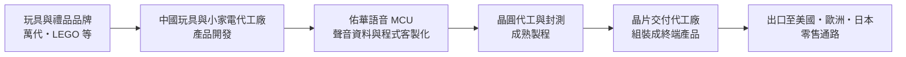
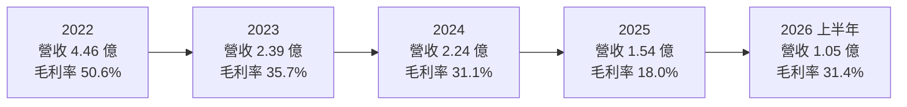
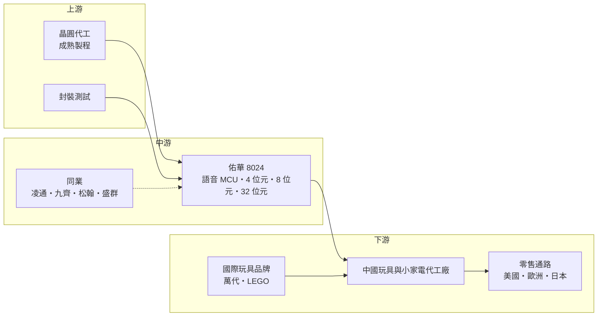

# 8024 佑華

> 上櫃｜[[產業索引-半導體業|半導體業]]｜上市（櫃）日期 2006/09/25

# 第一章：企業模式與商業藍圖

> [!info] 撰寫說明
> 本文由 Claude 依公開資料整理，架構比照 [[2330台積電]] 的四章研究，資料截至 2026-10-08。財務數字來源：櫃買中心開放資料（基本資料、綜合損益、資產負債、每月營收、本益比殖利率）、Goodinfo 台灣股市資訊網年度經營績效、富果研究 2025 年 11 月法說會整理、nStock；產業描述為整理性內容，尚未逐條比對原始文件。#待校對

在評估單一個股的長期投資價值時，首要步驟是拆解企業的底層獲利邏輯。本章針對佑華微電子（股票代號：8024，以下簡稱佑華）的商業模式進行定性分析，說明一家以玩具與禮品語音晶片為主的小型 IC 設計公司，如何在消費性市場的長期萎縮與中國同業競爭下尋找出路。

## 一、核心定位：玩具與消費性產品的語音微控制器供應商

佑華成立於 1992 年，2006 年在櫃買中心上櫃，總部位於新竹，董事長為林振興，屬於 [[Fabless]] IC 設計公司。公司的核心產品是內建語音與音樂播放功能的微控制器（[[MCU]]），也就是一般常說的[[語音IC]]。這類晶片被放在會說話的玩具、音樂賀卡、互動式禮品、小家電與遙控玩具裡，負責播放聲音、控制燈光或處理簡單的按鍵與感測訊號。

語音 IC 是 IC 設計產業中技術門檻相對較低、單價也較低的產品，一顆晶片的售價往往只有幾元到幾十元新台幣。它的競爭關鍵不在先進製程，而在於「客戶開發一款新玩具時，能不能用最短的時間、最低的成本把聲音和功能做出來」。因此，語音 IC 公司的價值很大一部分來自開發工具、聲音資料處理能力，以及與玩具設計公司和代工廠的長期合作關係。

依富果研究整理的 2025 年 11 月法說會，佑華的客戶包括日本萬代（Bandai）與歐洲的 LEGO 等國際玩具品牌，過去也和迪士尼合作過（目前合作量較少），小家電方面曾與九陽豆漿機合作。這些品牌通常透過中國的玩具與小家電代工廠採購佑華的晶片。

## 二、終端應用板塊：語音與音樂相關 IC 為主

佑華並未公開各產品線的營收百分比，因此本文不繪製營收結構圓餅圖。依 2025 年 11 月法說會，產品線可分為三類：

* **4 位元 MCU：** 功能較基礎，整合液晶顯示驅動、語音與音樂播放，主要用於互動式玩具與禮品。這是佑華營收的大宗。
* **8 位元 MCU：** 整合類比數位轉換器（[[ADC]]）與脈波寬度調變等功能，應用在小家電、安全系統與遙控玩具。家電應用集中在這條產品線，但占整體營收比例不高。
* **32 位元語音處理器：** 公司的高階產品，處理速度達 48 MIPS，可以減少外部零件，應用在小型機器人、物聯網裝置、四軸飛行器與嬰兒哭聲偵測器等較複雜的產品。

法說會指出，營收主要來自語音與音樂相關的 IC，以 4 位元與 8 位元產品為大宗。換句話說，佑華的營收仍高度集中在最成熟、最價格敏感的低階產品。

## 三、資本轉化邏輯：小量多樣的客製化語音方案

佑華的商業模式可以分成三步。第一，玩具品牌與代工廠在開發新產品時，選定佑華的晶片平台，並把聲音內容與功能程式交給佑華或在佑華的開發工具上完成。第二，佑華委託晶圓代工廠製造晶片；傳統做法是把聲音與程式直接寫進唯讀記憶體（[[Mask ROM]]）的光罩裡，每一款玩具都對應一個專屬的晶片版本。第三，晶片交給中國的代工廠組裝成玩具或家電，再出口到美國、歐洲與日本。

這個模式有兩個特點。第一是「小量多樣」：每一款玩具的生命週期可能只有一兩季，訂單量不大，但款式很多，需要快速反應。第二是「間接出口」：佑華的晶片雖然賣給中國代工廠，但終端產品大多出口到美國等市場，因此美中貿易關係會間接影響佑華的訂單。法說會提到，2025 年中美關稅戰導致客戶延後下單，正是這種結構的直接後果。

## 四、企業長期藍圖：從唯讀晶片轉向可燒錄晶片

依 2025 年 11 月法說會，佑華的轉型方向是產品技術的換代。

* **從 Mask ROM 轉向 OTP 與 Flash：** 產業趨勢已經從唯讀記憶體轉向可燒錄式記憶體（[[OTP]] 與 [[NOR Flash]] 等）。唯讀晶片的聲音內容在製造時就固定了，客戶每次修改都要重做光罩、重新投片；可燒錄晶片則可以在晶片生產完成後，再用電子方式寫入聲音與程式，交貨更彈性、開發週期更短，也適合少量多樣的訂單。佑華正加速開發可燒錄式 IC，以追上市場主流。
* **提升 32 位元產品比重：** 小型機器人、物聯網與智慧家電對處理能力的要求提高，32 位元語音處理器是佑華切入較高單價市場的主要產品。公司也強調提供友善的開發環境，協助客戶縮短開發時程。
* **等待外部環境穩定：** 公司在法說會表示，關稅政策趨於穩定後，部分客戶庫存已去化完畢，訂單微幅回流，但回升力道尚不明顯，公司沒有提供具體財務預測。

整體而言，佑華的長期藍圖是在既有玩具與禮品客戶基礎上，以可燒錄晶片與 32 位元產品提升競爭力。但這個轉型起步較晚，同業已經先行布局，能否成功仍需時間驗證。

# 第二章：護城河深度與競爭優勢

在長期價值投資中，「護城河」指企業抵禦競爭、維持超額利潤的保護機制。本章分析佑華的護城河構成、主要競爭對手，以及在消費性語音 IC 市場長期萎縮下能守住多少。

## 一、佑華護城河的核心組成要素

佑華的護城河很窄，而且近年正在被侵蝕。可以辨識的要素包括：

* **1. 國際玩具品牌的長期合作：** 與萬代、LEGO 等品牌的合作關係，代表佑華的晶片品質與交期通過了國際品牌的要求。玩具品牌對安全與品質有嚴格規範，供應商一旦通過驗證，在同一系列產品上通常會持續採用。
* **2. 聲音處理與開發工具：** 語音 IC 的使用者多半是玩具設計師而非專業工程師，好用的開發工具與聲音壓縮技術，可以讓客戶更快完成產品。這種「讓客戶好上手」的能力是小型語音 IC 公司的主要競爭力。
* **3. 小量多樣的服務彈性：** 玩具產業款式多、生命週期短，需要供應商快速提供客製化版本。佑華長期服務這類客戶，累積了處理小量訂單的流程經驗。

然而，這些優勢都不難被複製。語音 IC 的技術門檻低，中國同業在成本與在地服務上更具優勢，而佑華在可燒錄晶片的布局又落後於同業，這是近年營收與獲利大幅下滑的根本原因。

## 二、全球主要競爭對手格局

| 對手 | 定位 | 對佑華的威脅 |
|---|---|---|
| [[4952凌通]] | 台灣語音 IC 與消費性 MCU 大廠 | 產品線完整、規模大，在玩具與消費性市場直接競爭 |
| [[6494九齊]] | 台灣 OTP 與 Flash 型 MCU、語音 IC | 在可燒錄 MCU 市場領先，正是佑華轉型的方向 |
| [[5471松翰]] | 台灣語音、影像與 MCU 晶片 | 在語音與消費性 MCU 重疊 |
| [[6202盛群]] | 台灣 8 位元與 32 位元 MCU 大廠 | 在家電與工業 MCU 市場有規模與品牌優勢 |
| 中國語音 IC 與 MCU 廠商 | 貼近中國玩具與家電代工廠 | 價格與在地服務優勢明顯，壓低整體報價 |

## 三、優勢轉化：哪些市場守得住、哪些守不住

* **較有機會守住：** 與國際玩具品牌長期合作的特定產品系列。這些客戶重視品質與一致性，不會只因價格就輕易更換已驗證的供應商。
* **很難守住：** 一般禮品、白牌玩具與價格導向的小家電市場。這些市場的客戶以價格為主要考量，中國同業可以提供更低的報價與更即時的在地支援。佑華毛利率從 2022 年的 50.6% 降到 2025 年的 18.0%，反映的正是價格競爭與營收規模縮小的雙重壓力。
* **觀察重點：** 第一，可燒錄 IC 的開發進度與客戶導入情形。第二，32 位元語音處理器能否在機器人、物聯網等新應用取得訂單。第三，營收能否止跌回升到足以支撐研發費用的規模；2026 年前八月營收約 1.40 億元，年增約 26.5%（櫃買中心每月營收資料），回升方向值得持續觀察，但絕對規模仍小。

# 第三章：財務體質與盈利規模

資料日期：2026-10-08。數字取自櫃買中心開放資料與 Goodinfo 年度經營績效，表格是撰寫當時的快照；最新月營收、毛利率、累計 EPS 由自動排程寫在本筆記的屬性欄位（月營收、毛利率、累計EPS 等）。#待校對

財務報表是檢驗護城河是否真實存在的最終標準。本章用三率、[[ROE]]、現金流與資本報酬，檢視佑華在消費性語音 IC 市場萎縮下的財務狀況。

## 一、獲利能力的基石：三率

| 年度 | 營收（億元） | [[毛利率]] | [[營業利益率]] | EPS（元） | [[ROE]] |
|---|---|---|---|---|---|
| 2020 | 4.37 | 28.2% | -6.4% | -0.84 | -6.2% |
| 2021 | 5.36 | 45.4% | 15.8% | 1.68 | 11.9% |
| 2022 | 4.46 | 50.6% | 11.9% | 2.20 | 14.3% |
| 2023 | 2.39 | 35.7% | -23.0% | -0.86 | -6.0% |
| 2024 | 2.24 | 31.1% | -33.1% | -1.15 | -9.2% |
| 2025 | 1.54 | 18.0% | -73.9% | -2.55 | -23.9% |
| 2026 上半年 | 1.05 | 31.4% | -37.5% | -0.75 | 年化約 -17%（推算） |

註：2020 至 2025 年取自 Goodinfo 年度經營績效（合併報表）；2026 上半年取自櫃買中心綜合損益開放資料。2026 上半年 ROE 以稅後淨損 0.34 億元除以 2026 年第二季底權益總計 3.92 億元，再乘以 2 年化推算。

* **營收持續萎縮：** 2021 年營收 5.36 億元是近年高點，之後連續四年下滑，2025 年只剩 1.54 億元。2020 至 2025 年營收五年年複合成長率約 -18.8%（推算）。2021 至 2022 年的高峰，部分來自疫情期間的居家消費與晶片短缺時的備貨需求，之後隨庫存調整與中國經濟放緩快速回落。
* **[[毛利率]]波動劇烈：** 毛利率從 2022 年的 50.6% 一路降到 2025 年的 18.0%。除了價格競爭，營收規模太小時，固定的製造與測試成本也會壓低毛利率；2025 年也可能包含存貨跌價等一次性因素（推估，細項未查得）。2026 年上半年毛利率回到 31.4%。
* **[[營業利益率]]深度虧損：** 研發與管理費用相對固定，營收從 5 億元降到 1.5 億元後，費用無法被攤薄，營業利益率在 2025 年跌到 -73.9%。這是小型 IC 設計公司在營收萎縮時最典型的困境。

## 二、[[ROE]]：資本效率

以 2021 至 2025 年計算，佑華近五年平均 ROE 約 -2.6%（推算），2023 年起連續三年虧損，2025 年 ROE 為 -23.9%。連年虧損使股東權益持續縮水：2026 年第二季底權益總計約 3.92 億元，已低於股本 4.52 億元，保留盈餘約 -0.58 億元，每股淨值約 8.69 元。

## 三、資本支出與[[自由現金流]]

* **[[CapEx]] 低：** 作為 Fabless 公司，資本支出主要是研發設備與光罩，具體金額未查得。
* **財務結構：** 2026 年第二季底總負債只有約 0.38 億元，流動資產約 3.01 億元，財務結構保守，短期沒有償債壓力。帳上的流動資產是公司度過虧損期的主要緩衝。
* **股利：** 依櫃買中心資料，佑華最近一年度未配發現金股利。nStock 顯示近五年平均現金股利約 0.68 元，主要來自 2021 至 2022 年獲利期間的分配。
* **自由現金流：** 未查得歷年現金流量表。推估在連年營業虧損下，2023 至 2025 年營業現金流為負或偏低（推估）。

## 四、[[ROIC]] 與 [[WACC]]：價值創造利差

* **ROIC（推算）：** 2026 年上半年營業利益約 -0.39 億元，年化約 -0.79 億元。投入資本以權益總計 3.92 億元加上非流動負債 0.13 億元（有息負債未查得，以非流動負債作為上限近似）計算，約 4.05 億元。ROIC 約 -0.79 ÷ 4.05 ≈ -19%（推算，虧損時不計稅盾）。2025 年全年營業虧損約 1.14 億元（營收 1.54 億元乘以 -73.9%），ROIC 更低。
* **WACC（推算）：** 用 CAPM 推估：無風險利率約 1.75%，市場風險溢酬 6%，β 值取小型消費性 IC 設計股常見的 1.2（假設值，未查得官方數字），股東權益成本約 8.95%。佑華沒有明顯的有息負債，WACC 約 9%（推算）。
* **價值創造判斷：** 佑華的 ROIC 遠低於 WACC，目前處於明顯消耗股東價值的狀態。在 2021 至 2022 年營業利益率 12% 至 16% 的期間，ROIC 曾經高於資金成本（推估），說明在營收達到 4 億至 5 億元的規模時，商業模式本身可以獲利。關鍵在於可燒錄晶片與 32 位元產品能否把營收帶回這個水準；在此之前，投資人應把佑華視為轉型中的公司，而非穩定的價值型標的。

# 第四章：總體風險與地緣政治

任何企業都無法脫離宏觀環境獨立存在。本章分析佑華未來必須面對的地緣政治、產業週期、營運與技術風險。

## 一、地緣政治風險

* **中美貿易與關稅：** 佑華的晶片賣給中國代工廠，代工廠組裝成玩具與家電後出口到美國。法說會明確指出，中美關稅戰導致客戶延後下單。只要美中貿易關係出現波動，佑華的訂單就會直接受影響。
* **代工廠外移：** 為了規避關稅，玩具與小家電代工廠可能逐步把產能移往越南、印尼或印度。佑華需要跟著客戶在新的生產地建立銷售與技術支援，否則可能失去訂單。
* **中國經濟景氣：** 法說會也提到中國經濟持續不景氣，影響玩具與小家電的內需市場。

## 二、產業週期與市場結構風險

* **消費性電子的長期萎縮：** 實體玩具與電子禮品面臨手機、平板與數位娛樂的長期替代，傳統語音玩具的市場規模難有大幅成長。
* **季節性與庫存循環：** 玩具產業有明顯的耶誕節旺季，訂單集中在下半年前段；若零售商庫存過高，隔年的拉貨就會減少，形成[[長鞭效應]]。
* **價格競爭：** 中國語音 IC 與 MCU 廠商眾多，低階產品的價格長期承壓。

## 三、營運環境的隱性風險

* **規模不足與持續虧損：** 營收只有 1 億至 2 億元，研發與管理費用的負擔相對沉重。若虧損持續，股東權益會繼續縮水，影響公司投入新產品開發的能力。
* **客戶集中：** 主要客戶為少數國際玩具品牌，單一品牌的產品線調整或供應商轉換，對營收的影響很大。
* **晶圓代工產能與成本：** 語音 IC 使用成熟製程，若成熟製程產能吃緊或漲價，小型公司在議價上處於弱勢。

## 四、科技演進風險

語音 IC 正從「固定內容播放」走向「智慧互動」。可燒錄記憶體已經成為產業主流，佑華的轉型起步較晚，需要追趕同業。更長期的挑戰來自 AI：生成式 AI 讓玩具與家電可以進行自然語音對話，這需要更強的處理器、連網能力與雲端服務，遠超過傳統 4 位元與 8 位元語音 IC 的能力範圍。若市場主流轉向 AI 互動玩具，傳統語音 IC 的角色可能被整合型的 32 位元 MCU 或連網晶片取代。佑華的 32 位元語音處理器是面對這個趨勢的起點，但能否在功能、開發工具與成本上與同業競爭，將決定公司能否在下一個十年保有一席之地。

# 專有名詞解析

## 半導體

- **[[MCU]]**：微控制器，整合處理器、記憶體與周邊介面的小型晶片，用於家電、玩具與工業控制。
- **[[語音IC]]**：內建聲音資料與播放電路的晶片，常用於會說話的玩具、賀卡與家電提示音。
- **[[Mask ROM]]**：在晶片製造時就以光罩寫入固定內容的唯讀記憶體，成本低但無法修改。
- **[[OTP]]**：一次性可程式化記憶體，晶片出廠後可由客戶寫入一次內容，交貨彈性高於 Mask ROM。
- **[[NOR Flash]]**：可重複寫入的非揮發性記憶體，常用來儲存程式碼與聲音資料。
- **[[ADC]]**：類比數位轉換器，把溫度、聲音、電壓等類比訊號轉換成數位資料。
- **[[Fabless]]**：只做晶片設計、不擁有晶圓廠的 IC 設計公司，製造委外給晶圓代工廠。
- **[[成熟製程]]**：一般指 28 奈米及更大線寬的製程，技術成熟、設備多已折舊，主要用於電源、驅動、車用與物聯網晶片。

## 應用

- **[[IoT]]**：物聯網，讓各種裝置透過網路連線並交換資料的應用。

## 金融

- **[[營運槓桿]]**：固定成本占比高的公司，營收小幅變動會造成營業利益大幅變動的現象。
- **[[每股淨值]]**：股東權益除以流通股數，代表每股在帳面上對應的資產價值。
- **[[自由現金流]]**：營業活動現金流減去資本支出，代表企業可自由用於配息、還債或併購的現金。
- **[[長鞭效應]]**：終端需求的小幅變動，沿供應鏈往上游傳遞時被逐級放大，造成上游庫存與訂單劇烈波動。

## 產業

- **[[少量多樣]]**：產品款式多、每款數量少的生產型態，需要供應商有快速反應與客製化能力。

# 核心供應鏈

## 1. 上游：晶圓代工與封測
- 晶圓代工與封測：具體合作夥伴未查得，語音 IC 多使用成熟製程

## 2. 中游：佑華本身與同業
- 語音 IC 與消費性 MCU 同業：[[4952凌通]]、[[6494九齊]]、[[5471松翰]]、[[6202盛群]]、中國語音 IC 廠商

## 3. 下游：客戶與終端
- 國際玩具品牌：萬代（Bandai）、LEGO；過去合作：迪士尼
- 小家電：九陽（過去合作）
- 中國玩具與小家電代工廠，終端產品出口至美國、歐洲與日本

## 最新新聞
<!-- news:start -->
<!-- news:end -->

## 相關連結
- [公開資訊觀測站](https://mopsov.twse.com.tw/mops/web/t05st03?step=1&firstin=1&co_id=8024)
- [Goodinfo](https://goodinfo.tw/tw/StockDetail.asp?STOCK_ID=8024)
- [Yahoo 股市](https://tw.stock.yahoo.com/quote/8024)
- [鉅亨網新聞](https://www.cnyes.com/twstock/8024/news)
