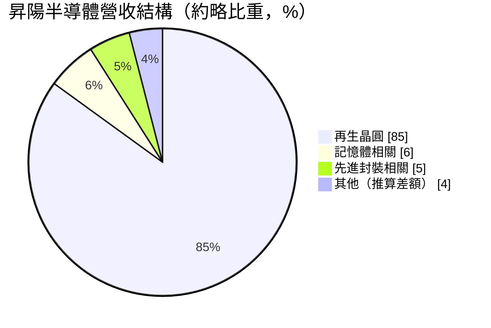
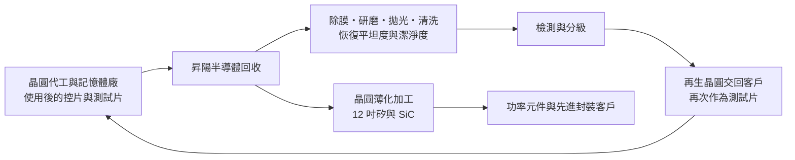
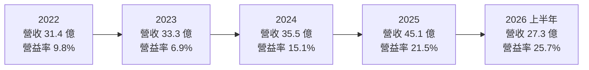
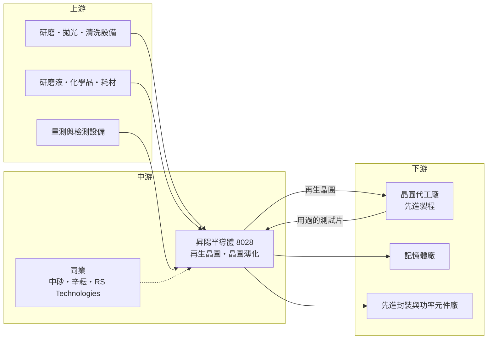

# 8028 昇陽半導體

> 上市｜[[產業索引-半導體業|半導體業]]｜上市（櫃）日期 2018/07/10

# 第一章：企業模式與商業藍圖

> [!info] 撰寫說明
> 本文由 Claude 依公開資料整理，架構比照 [[2330台積電]] 的四章研究，資料截至 2026-10-08。財務數字來源：證交所開放資料（基本資料、綜合損益、資產負債、營益分析、股利）、Goodinfo 台灣股市資訊網年度經營績效、優分析、工商時報（2026 年 4 月、6 月）、理財周刊；產業描述為整理性內容，尚未逐條比對原始文件。#待校對

在評估單一個股的長期投資價值時，首要步驟是拆解企業的底層獲利邏輯。本章針對昇陽國際半導體（股票代號：8028，以下簡稱昇陽半導體）的商業模式進行定性分析，說明一家看似「回收舊晶圓」的公司，為何會隨著先進製程與 AI 擴產成為晶圓代工供應鏈中不可或缺的一環。

## 一、核心定位：晶圓廠的「測試晶圓再生工廠」

昇陽半導體成立於 1997 年，總部位於新竹科學園區，2018 年在證交所上市。公司的核心業務是[[再生晶圓]]，另一項業務是[[晶圓薄化]]加工。

要理解再生晶圓，得先知道晶圓廠每天需要大量「不做成產品」的晶圓。晶圓廠在正式生產前，必須用[[控片]]與[[測試片]]檢查機台是否正常、製程參數是否準確，例如確認薄膜厚度、蝕刻深度或微粒數量。這些測試晶圓用過一次後表面已經被鍍膜或刻蝕，但底下的矽基材仍然可以使用。昇陽半導體的工作，就是把這些用過的測試晶圓收回來，透過研磨、拋光與清洗去除表面的薄膜與缺陷，讓它恢復到可以再次使用的平坦度與潔淨度，再交還給晶圓廠。

這個商業模式的價值在於：一片全新的 12 吋矽晶圓價格遠高於再生加工費用，晶圓廠用再生晶圓取代全新測試片，可以大幅降低成本。製程越先進，需要的測試步驟越多，對測試晶圓的需求就越大，對再生晶圓的品質要求也越高。這讓昇陽半導體的成長直接連結到晶圓代工廠的先進製程擴產。

## 二、終端應用板塊：再生晶圓為絕對主力

依優分析整理的資料，昇陽半導體的營收結構大致如下（期間與計算基準原文未完整說明）：

* **再生晶圓（約 85%）：** 主要服務 12 吋晶圓代工廠的先進製程。2025 年 12 吋約當晶圓出貨量約 948.6 萬片，比 2024 年的約 686.9 萬片成長 38.1%（工商時報 2026 年 4 月報導）。
* **記憶體相關（約 5% 至 6%）：** 記憶體廠同樣需要測試晶圓，AI 帶動 [[HBM]] 與高階記憶體投片增加，這塊業務比重呈上升趨勢。
* **先進封裝相關（約 5%）：** [[先進封裝]]需要使用晶圓作為載具或中介層材料，晶圓薄化技術也可以應用在先進封裝流程中。

圓餅圖中的「其他」是三項加總後的差額，由本文推算。

依優分析報導，2023 與 2024 年單一客戶的營收占比約 70%，市場普遍推測這家客戶是全球最大的晶圓代工廠，但公司並未正式點名。這種高度集中的客戶結構，是理解昇陽半導體的關鍵：它的成長幾乎與這家客戶的先進製程擴產同步。

## 三、資本轉化邏輯：重資產的產能擴張模式

和一般 IC 設計公司不同，昇陽半導體是重資產的製造業。營收成長的前提是擴充產能：需要廠房、研磨與拋光機台、清洗設備與檢測儀器，而且每一階段擴產都要提前兩到三年規劃。這讓公司的經營呈現「先投資、後收成」的節奏。

產能演進方面，依優分析與工商時報報導，月產能從 2024 年約 65 萬片，提升到 2025 年約 80 萬至 85 萬片，2026 年目標約 95 萬片。中港廠區的 Fab 3A 月產能預計從 2025 年的 30 萬片提升到 2026 年的 60 萬片；新建的 Fab 3B 智慧廠設計月產能將超過 60 萬片，預計 2028 年全面量產。另外台中二廠在 2025 年動工，規劃 2027 年底小量試產、2028 年全面量產，並同步建置碳化矽（[[SiC]]）晶圓科技與研發中心。公司表示台灣既有廠區最大可擴充到月產能 200 萬片。

資金面上，2025 年董事會通過的資本支出為 43.79 億元，2026 年 1 月再新增投資 5.18 億元，Fab 3B 擴建約需 18.5 億元。這些金額相對於公司 2025 年 45.1 億元的營收來說非常龐大，代表公司正處於大規模擴產期。

## 四、企業長期藍圖：擴大再生市占、薄化成為第二成長曲線

* **再生晶圓擴大市占並智慧化：** 公司策略是在再生晶圓上擴大市占率，並透過 AI 與自動化提升良率與獲利能力。2026 年公司提出「4S」策略：規模技術（Scale）、獲利價值（Sales）、智慧製造（Smart）與營運安全（Safety）。
* **晶圓薄化成為第二成長曲線：** 擴展 12 吋晶圓薄化加工能力，因應 12 吋矽與碳化矽薄化晶圓的需求。薄化技術應用於功率元件與先進封裝，可以讓公司降低對單一再生晶圓業務的依賴。
* **跟隨客戶海外布局：** 依工商時報 2026 年 6 月報導，公司正在評估於美國設立產線，以因應客戶海外擴產可能帶來的長期需求。這是再生晶圓業者跟著主要客戶走向全球的典型路徑。

整體而言，昇陽半導體的長期藍圖是「跟著先進製程一起長大」：只要主要客戶持續擴充先進製程與先進封裝產能，測試晶圓的需求就會隨之增加，而昇陽半導體則透過持續擴產與技術升級，確保自己能承接這些需求。

# 第二章：護城河深度與競爭優勢

在長期價值投資中，「護城河」指企業抵禦競爭、維持超額利潤的保護機制。本章分析昇陽半導體的護城河構成、全球主要競爭對手，以及在大規模擴產期間這些優勢能守住多少。

## 一、昇陽半導體護城河的核心組成要素

* **1. 先進製程的認證門檻：** 先進製程對測試晶圓的平坦度、金屬殘留與微粒數量要求極高，再生晶圓供應商必須通過晶圓廠嚴格的認證，才能進入供應名單。認證過程耗時，而且一旦通過，晶圓廠不會輕易更換供應商，因為測試晶圓品質出問題會直接影響製程監控的準確性。
* **2. 與主要客戶的地緣與關係：** 再生晶圓需要頻繁地在晶圓廠與再生廠之間往返運送，距離越近、交期越短、物流成本越低。昇陽半導體的廠區位於台灣，緊鄰主要晶圓代工廠的生產基地，這種地理上的便利是海外競爭者難以取代的。
* **3. 規模與自動化：** 再生晶圓是規模經濟明顯的產業，產能越大、自動化程度越高，單片成本越低。公司持續擴產並導入智慧製造，目的就是用規模建立成本優勢。
* **4. 製程經驗的累積：** 不同製程留下的薄膜種類不同，去除方式與研磨參數需要長期累積經驗。處理越多先進製程的測試片，就越熟悉如何在不傷害矽基材的情況下恢復晶圓品質。

## 二、全球主要競爭對手格局

| 對手 | 定位 | 對昇陽半導體的威脅 |
|---|---|---|
| [[1560中砂]] | 台灣砂輪與鑽石碟大廠，再生晶圓約占營收四至五成，12 吋再生月產能約 40 萬片 | 同樣服務台灣晶圓代工廠，直接競爭市占 |
| [[3583辛耘]] | 再生晶圓與半導體濕製程設備 | 台灣同業，持續擴產再生晶圓 |
| RS Technologies | 日本上市公司，被稱為全球再生晶圓龍頭 | 全球規模與技術領先，在日本與中國有產能 |
| 晶圓廠自行再生或其他亞洲業者 | 部分晶圓廠內部處理或採用其他地區供應商 | 若客戶分散供應來源，會稀釋市占 |

## 三、優勢轉化：哪些市場守得住、哪些守不住

* **守得住：** 台灣先進製程的再生晶圓需求。這個市場的客戶就在昇陽半導體廠區附近，品質要求高、認證門檻高，昇陽半導體與中砂等少數台灣業者瓜分主要份額。只要主要客戶的先進製程持續擴產，這個基本盤就相對穩固。
* **較難守住：** 價格。由於客戶高度集中，主要客戶在議價上有很大的主導權；而且客戶為了供應鏈安全，通常會同時培養兩到三家再生晶圓供應商，避免依賴單一來源。這代表昇陽半導體的定價能力受到結構性限制。
* **觀察重點：** 第一，Fab 3A、Fab 3B 與台中二廠能否如期量產，並維持產能利用率。第二，前五大以外客戶與記憶體、先進封裝業務的比重能否提升，降低單一客戶依賴。第三，晶圓薄化（特別是碳化矽薄化）能否發展成有意義的第二成長曲線。第四，海外設廠的決策與投資規模。

# 第三章：財務體質與盈利規模

資料日期：2026-10-08。數字取自證交所開放資料、Goodinfo 年度經營績效與財經媒體整理，表格是撰寫當時的快照；最新月營收、毛利率、累計 EPS 由自動排程寫在本筆記的屬性欄位（月營收、毛利率、累計EPS 等）。#待校對

財務報表是檢驗護城河是否真實存在的最終標準。本章用三率、[[ROE]]、現金流與資本報酬，檢視昇陽半導體在擴產期的獲利品質。

## 一、獲利能力的基石：三率

| 年度 | 營收（億元） | [[毛利率]] | [[營業利益率]] | EPS（元） | [[ROE]] |
|---|---|---|---|---|---|
| 2020 | 22.7 | 23.6% | 6.5% | 1.02 | 4.8% |
| 2021 | 26.5 | 25.1% | 8.8% | 1.68 | 9.0% |
| 2022 | 31.4 | 26.5% | 9.8% | 2.17 | 11.8% |
| 2023 | 33.3 | 22.7% | 6.9% | 2.02 | 9.0% |
| 2024 | 35.5 | 28.8% | 15.1% | 2.85 | 12.2% |
| 2025 | 45.1 | 34.0% | 21.5% | 4.37 | 16.4% |
| 2026 上半年 | 27.30 | 37.7% | 25.7% | 3.32 | 年化約 19%（推算） |

註：2020 至 2025 年取自 Goodinfo 年度經營績效；2026 上半年取自證交所綜合損益與營益分析開放資料。2026 上半年 ROE 以稅後淨利 5.95 億元除以 2026 年第二季底權益總計 61.1 億元，再乘以 2 年化推算。

* **營收連續成長：** 2020 至 2025 年營收從 22.7 億元成長到 45.1 億元，五年年複合成長率約 14.7%（推算），優分析指出營收已連續五年創新高。成長動能來自先進製程擴產帶動的再生晶圓需求，以及公司自身的產能擴充。
* **[[毛利率]]與[[營業利益率]]明顯改善：** 2020 至 2023 年毛利率在 22% 至 27% 之間，2024 年起快速提升，2025 年達 34%、2026 年上半年達 37.7%。這是典型的重資產製造業營運槓桿：產能利用率提高、先進製程產品比重增加，而廠房與設備折舊相對固定，因此營收每增加一分，獲利增加更多。
* **2023 年的低點：** 2023 年半導體庫存調整期間，營收仍小幅成長，但營業利益率降到 6.9%，說明當客戶減少投片時，再生晶圓的需求與價格都會受到影響。

## 二、[[ROE]]：資本效率

以 2021 至 2025 年計算，昇陽半導體近五年平均 ROE 約 11.7%（推算），呈現逐年上升趨勢，2025 年達到 16.4%，2026 年上半年年化約 19%（推算）。ROE 的提升主要來自獲利率改善，而不是財務槓桿；不過公司在擴產期間增加了不少長期負債（見下節），未來 ROE 也會部分受到槓桿影響。

## 三、資本支出與[[自由現金流]]

* **[[CapEx]] 龐大：** 2025 年董事會通過資本支出 43.79 億元，相當於當年營收的九成以上；2026 年 1 月再新增 5.18 億元。這些投資用於 Fab 3A 擴充、Fab 3B 與台中二廠建設。
* **自由現金流在擴產期可能為負：** 以如此高的資本支出比例，2025 至 2027 年的自由現金流很可能為負或偏低（推估，具體現金流數字未查得），需要靠借款與籌資支應。工商時報提到公司近兩年透過籌資推動擴產。
* **財務結構變化：** 2026 年第二季底總負債約 78.5 億元，其中非流動負債約 54.0 億元，權益總計約 61.1 億元，負債已超過權益。非流動負債的組成（長期借款或可轉換公司債）未查得明細。這是擴產期的正常現象，但也代表公司對利率與現金流的敏感度提高。
* **股利政策：** 依證交所股利資料，2025 年度盈餘分配的現金股利為每股 2.8 元，以 2025 年 EPS 4.37 元計算，配息率約 64%（推算）。在大規模擴產期間仍維持六成以上配息率，代表公司兼顧股東回報，但也部分依賴外部資金支應擴產。

## 四、[[ROIC]] 與 [[WACC]]：價值創造利差

* **ROIC（推算）：** 以 2025 年營收 45.1 億元乘以營業利益率 21.5%，營業利益約 9.7 億元，乘以（1－20% 稅率）得到稅後營業利益約 7.76 億元。投入資本以 2026 年第二季底權益總計 61.1 億元加上非流動負債 54.0 億元（以非流動負債近似有息負債）計算，約 115.2 億元，2025 年 ROIC 約 6.7%（推算）。以 2026 年上半年營業利益 7.02 億元年化計算，稅後營業利益約 11.2 億元，ROIC 約 9.8%（推算）。需要注意的是，投入資本中有一大部分是尚未投產的在建工程，這些資本還沒有產生營收，因此擴產期的 ROIC 會被暫時壓低。
* **WACC（推算）：** 股東權益成本用 CAPM 推估：無風險利率約 1.75%，市場風險溢酬 6%，β 值取中小型半導體材料股常見的 1.2（假設值），股東權益成本約 1.75% + 1.2 × 6% = 8.95%。負債成本假設稅前 2.5%（假設值），稅後約 2.0%。若以帳面價值計算資本結構（權益約 53%、負債約 47%），WACC 約 5.7%；若以市值計算（證交所資料顯示股價淨值比約 8.4 倍，權益市值遠大於負債，權益比重約九成），WACC 約 8.3%（推算）。本文以市值權重的約 8% 作為主要參考。
* **價值創造判斷：** 2025 年 ROIC 約 6.7% 略低於市值權重 WACC 約 8%，2026 年上半年 ROIC 約 9.8% 已回到略高於 WACC 的水準（推算）。這代表昇陽半導體正處於「投資期壓低報酬、放量期回收」的轉折點。若新廠在 2027 至 2028 年如期量產並維持高利用率，ROIC 有機會明顯高於 WACC；反之，若需求不如預期，龐大的新資本就會成為拖累。

# 第四章：總體風險與地緣政治

任何企業都無法脫離宏觀環境獨立存在。本章分析昇陽半導體未來必須面對的地緣政治、產業週期、營運與技術風險。

## 一、地緣政治風險

* **跟隨主要客戶的全球布局：** 主要客戶正在美國、日本與歐洲擴建晶圓廠，海外晶圓廠同樣需要再生晶圓。若海外廠的再生晶圓由當地供應商承接，昇陽半導體能分到的海外需求有限；若要跟著客戶出海，則需要承擔高昂的建廠與營運成本。公司評估美國產線，就是在權衡這兩種風險。
* **台灣集中風險：** 公司所有產能都在台灣，與主要客戶同樣暴露在兩岸情勢與地震等天災風險之下。

## 二、產業週期與市場結構風險

* **晶圓廠投片的週期：** 再生晶圓需求與晶圓廠的投片量和製程開發數量直接相關。2023 年半導體庫存調整時，昇陽半導體的營業利益率就從近 10% 降到 6.9%。若 AI 投資循環轉弱、先進製程擴產放緩，再生晶圓需求也會減速。
* **產能過剩風險：** 昇陽半導體、中砂、辛耘與海外同業都在同一時期擴產，若多家業者的新產能在 2027 至 2028 年同時開出，而需求成長不如預期，可能出現價格競爭。
* **客戶集中度：** 單一客戶約占營收七成，這家客戶的擴產節奏、供應商分配策略與議價態度，幾乎決定了昇陽半導體的營運。

## 三、營運環境的隱性風險

* **擴產執行風險：** Fab 3B 與台中二廠預計 2027 至 2028 年量產，建廠延誤、設備交期拉長或認證進度落後，都會延後回收時間。
* **財務槓桿提高：** 負債已超過權益，若利率上升或營運現金流不如預期，財務壓力會增加。
* **水電與環保：** 再生晶圓製程需要大量用水與化學品清洗，台灣的水電供應與環保法規趨嚴，會影響擴產與營運成本。

## 四、科技演進風險

製程演進對再生晶圓是雙面刃。一方面，先進製程需要更多測試步驟，帶動測試晶圓需求；另一方面，晶圓廠也在發展更精準的線上量測與虛擬量測技術，若能減少對實體測試片的依賴，長期可能降低再生晶圓的使用量。此外，背面供電、[[Hybrid Bonding]] 等新製程需要更薄、更平的晶圓，對晶圓薄化技術是機會，但也要求公司持續投入新設備與研發。碳化矽薄化是另一個新方向，但碳化矽材料硬度高、加工難度大，市場也受電動車景氣影響，能否成為穩定的第二成長曲線仍需時間驗證。

# 專有名詞解析

## 半導體

- **[[再生晶圓]]**：把晶圓廠用過的測試晶圓去膜、研磨、拋光後恢復品質，再次作為測試用途的晶圓，可降低晶圓廠成本。
- **[[控片]]**：晶圓廠用來監控機台狀態與製程參數的晶圓，不會做成產品。
- **[[測試片]]**：用於設備調機、製程開發與參數驗證的晶圓，使用後可送去再生。
- **[[晶圓薄化]]**：以研磨等方式把晶圓磨薄的加工，用於功率元件、先進封裝與堆疊晶片。
- **[[SiC]]**：碳化矽，一種耐高壓、耐高溫的半導體材料，主要用於電動車與能源的功率元件。
- **[[先進封裝]]**：把多顆晶片以中介層、混合鍵合等方式高密度整合的封裝技術，例如 CoWoS、SoIC。
- **[[Hybrid Bonding]]**：混合鍵合，以銅對銅直接接合兩片晶圓或晶片，不需凸塊，可大幅提高連接密度。
- **[[HBM]]**：高頻寬記憶體，把多層 DRAM 垂直堆疊並與處理器緊鄰封裝，是 AI 加速器的關鍵元件。
- **[[成熟製程]]**：一般指 28 奈米及更大線寬的製程，技術成熟、設備多已折舊，主要用於電源、驅動、車用與物聯網晶片。

## 金融

- **[[CapEx]]**：資本支出，企業用於購買廠房、設備等長期資產的支出。
- **[[自由現金流]]**：營業活動現金流減去資本支出，代表企業可自由用於配息、還債或併購的現金。
- **[[營運槓桿]]**：固定成本占比高的公司，營收小幅變動會造成營業利益大幅變動的現象。
- **[[配息率]]**：現金股利占每股盈餘的比例，反映公司把多少獲利回饋給股東。
- **[[股價淨值比]]**：股價除以每股淨值，代表市場願意用帳面價值的幾倍買進公司。

# 核心供應鏈

## 1. 上游：設備、耗材與量測
- 研磨、拋光與清洗設備，研磨液與電子級化學品，量測與檢測設備（具體供應商未查得）

## 2. 中游：昇陽半導體本身與同業
- 再生晶圓同業：[[1560中砂]]、[[3583辛耘]]、RS Technologies

## 3. 下游：主要客戶群
- 晶圓代工廠：單一客戶約占營收七成，市場普遍推測為 [[2330台積電]]（公司未正式點名）
- 記憶體廠：受惠 AI 與 HBM 投片增加
- 先進封裝與功率元件廠：晶圓薄化與碳化矽薄化

延伸閱讀：[[台積電供應鏈]]

## 供應鏈關係
- 供應給 [[2330台積電]]：晶圓薄化與再生晶圓（台積電供應鏈 › 上游：矽晶圓、再生晶圓與研磨耗材）

## 最新新聞
<!-- news:start（自動產生，請勿手動編輯此範圍） -->
- 2026-10-08 📰 媒體 09:28｜昇陽半導體(8028) 個股概覽 ／ 個股 - 股市｜[CMoney](https://news.google.com/rss/articles/CBMiU0FVX3lxTE5lMGlXVWpmbzNlSm9oNWZCb0VtbmNXNUhFZkJBNUl2MUZ2MF9rWkx3RnhNMG8wanVkN2NTYzN1UGgxZGdlZ1FPS1hqM2lfSzBXaGlZ?oc=5)
- 2026-10-08 📰 媒體 07:39｜昇陽半 (8028)「估值模型重構」大戰｜[CMoney](https://news.google.com/rss/articles/CBMiWEFVX3lxTFB5WExKaGF5aFpLWmVhSDFrRTBOTlp5UGNRNWU5U3djRkVDLUNGV3R5RkJxX2RTRVk2Zk9YeFhROWRiaGZ6VHN3NGFaWGc5Tm94b2lEdjVCZmM?oc=5)
- 2026-10-07 📰 媒體 12:44｜討論牆 ／ 昇陽半導體(8028)Q2毛利率衝上37.89%歷史新高，全球市占率2026年看升至82%｜[LINE TODAY](https://news.google.com/rss/articles/CBMiZEFVX3lxTE0wendETEREYnhXVmhTWjJYcGs0cWRLZVRfZjZ0MlZ3aFFZWWVWQnpXdWpSLVgycWIzWFp4WFNWVlJpSWhTUWxhQllhb01iTTlpLV9nTEdOLU9FN2RqeXhXWDN5czE?oc=5)
- 2026-10-06 📰 媒體 17:23｜昇陽半導體9月營收月增1.3%｜[TechNews 科技新報](https://news.google.com/rss/articles/CBMifEFVX3lxTE5sZkhrNXBZak1zR0V1WHBxanF4am1QcHh5S2JxQ090MEk0RlVCdFp4cTJvbkVoOUw3OTRINERveTBReVJnLVRQZFd3LUJ4YWthUHNHaW1jSHM4ZUxJSm5ESEVQU010RDBEOFY4a3hoaVdmRUlrWHNBMjJYNEo?oc=5)
- 2026-10-06 📰 媒體 13:47｜昇陽半導體9月營收轉雙增；Q3季增7%、連五季創高｜[台視全球資訊網](https://news.google.com/rss/articles/CBMinAFBVV95cUxPbDcwNVA0UW04alhjbTZhdFJpblFfY0QtZE5vTXY2UngxZEZmeDJFMHhEQUVQMEk2MXpwZ0diX2RkR2dnYXNlYzVEOHRDOTQxWHhIMzhpbDVsa2dzOFRqQUcyM01Ib3pBOFp6R29ZdE0tS1ZLQ1FYLVczc25oRy1ZVjFNNFJhRjJCYlRTdlh0VVoyVzQ1c2o2Q0tYTWI?oc=5)

完整紀錄：[[8028昇陽半導體 新聞]]
<!-- news:end -->

## 相關連結
- [公開資訊觀測站](https://mopsov.twse.com.tw/mops/web/t05st03?step=1&firstin=1&co_id=8028)
- [Goodinfo](https://goodinfo.tw/tw/StockDetail.asp?STOCK_ID=8028)
- [Yahoo 股市](https://tw.stock.yahoo.com/quote/8028)
- [鉅亨網新聞](https://www.cnyes.com/twstock/8028/news)
