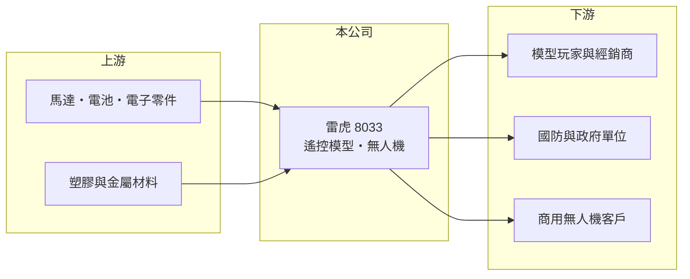

# 8033 雷虎

> 上市｜[[產業索引-其他業|其他業]]｜上市（櫃）日期 2007/06/21

# 第一章：企業模式與商業藍圖

> [!info] 撰寫說明
> 精簡版，由 Claude 依公開資料整理，架構比照 [[2330台積電]]，資料截至 2026-10-07。來源：nstock 公司概況頁、經濟日報財報新聞標題、蕃新聞軍工概念股報導標題。#待校對

雷虎是老牌遙控模型製造商，近年因[[無人機]]與軍工題材受到市場關注。

- **核心業務：** 製造與銷售無線電遙控飛機、直升機、車、船及零件引擎，並涉足醫療器材。
- **營收結構：** 以遙控模型與相關零組件為主，無人機相關業務是近年成長重點；各產品營收比重未查得。
- **營運據點：** 總部在台灣，產品主要外銷（推估）。
- **長期方向：** 從消費型遙控模型延伸到商用與國防用無人機，參與台灣[[非紅供應鏈]]無人機產業（推估）。

# 第二章：護城河深度與競爭優勢

雷虎的優勢在於長年累積的遙控與動力系統技術，但無人機產業競爭者眾。

- **競爭優勢：** 具備遙控飛行器、引擎與機構的整合經驗，是台灣少數有完整遙控載具產品線的上市公司。
- **主要對手：** 中國大疆等無人機大廠，以及台灣無人機國家隊成員如[[2634漢翔]]等軍工相關廠商。
- **觀察重點：** 國防與政府無人機標案的取得情形，以及無人機營收能否轉化為穩定獲利。

# 第三章：財務體質與盈利規模

資料日期：2026-10-07，以下數字是撰寫當時的快照；最新月營收、毛利率、累計 EPS 由自動排程寫在本筆記的屬性欄位（月營收、毛利率、累計EPS 等）。#待校對

雷虎營收成長，但本業獲利仍薄。

- **營收規模：** 2025 年全年營收 14.17 億元；2026 年 1 至 8 月累計 11.22 億元，年增 14.45%；8 月營收 1.76 億元，年增 74.96%。
- **獲利：** 2025 年全年 EPS 0.58 元；2026 年第二季 EPS 0.28 元，上半年累計 0.62 元。第二季[[毛利率]] 35.54%，但[[營業利益率]]僅 0.1%。
- **財務特色：** 第二季淨利率 9.86% 遠高於營業利益率，獲利主要來自業外收益；ROE 1.65%，資本效率偏低。市值約 288 億元，評價主要反映無人機題材。

# 第四章：總體風險與地緣政治

雷虎的風險在於題材與基本面的落差。

- **產業週期：** 消費型遙控模型屬於休閒商品，需求隨景氣波動；國防無人機需求則取決於政府預算。
- **營運風險：** 營業利益率接近零，若業外收益減少，獲利可能大幅下滑；無人機標案時程不確定。
- **其他風險：** 股價受軍工題材驅動，評價波動大；外銷比重高時有匯率風險，國防相關業務也受法規與出口管制影響。

# 專有名詞解析

## 金融

- **[[毛利率]]**：毛利除以營收，反映產品或服務本身的獲利能力。
- **[[營業利益率]]**：營業利益除以營收，反映本業扣除營業費用後的獲利能力。

## 產業

- **[[無人機]]**：以遙控或自主飛行的無人航空載具，應用於航拍、物流、農業與國防。
- **[[非紅供應鏈]]**：生產據點設在中國以外的供應鏈，用來分散地緣政治與關稅風險。

# 核心供應鏈

- 上游：馬達、電池、飛控電子零件與材料供應商（推估）
- 下游／客戶：模型玩家與海外經銷商、國防與政府單位、商用無人機客戶
- 同業：[[2634漢翔]]等軍工相關廠商、中國大疆

## 最新新聞
<!-- news:start（自動產生，請勿手動編輯此範圍） -->
- 2026-10-06 📰 媒體 09:54｜雷虎PD-136彈射試飛成功 下周進軍美國AUSA軍工展｜[鉅亨網](https://news.cnyes.com/news/id/6622345)

完整紀錄：[[8033雷虎 新聞]]
<!-- news:end -->

## 相關連結
- [公開資訊觀測站](https://mopsov.twse.com.tw/mops/web/t05st03?step=1&firstin=1&co_id=8033)
- [Goodinfo](https://goodinfo.tw/tw/StockDetail.asp?STOCK_ID=8033)
- [Yahoo 股市](https://tw.stock.yahoo.com/quote/8033)
- [鉅亨網新聞](https://www.cnyes.com/twstock/8033/news)
