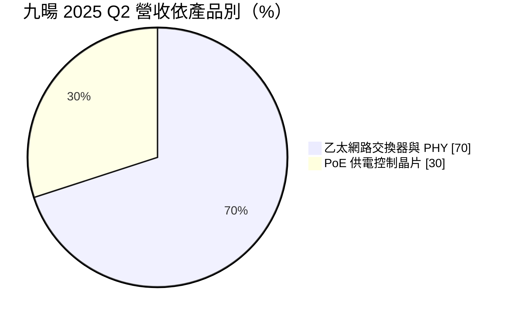
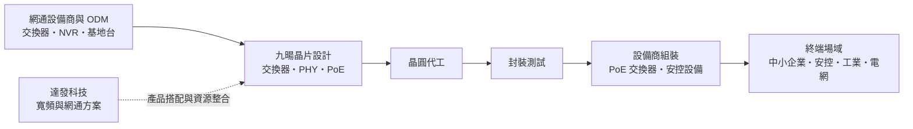
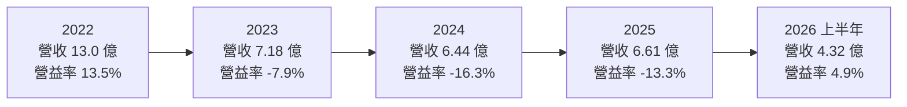
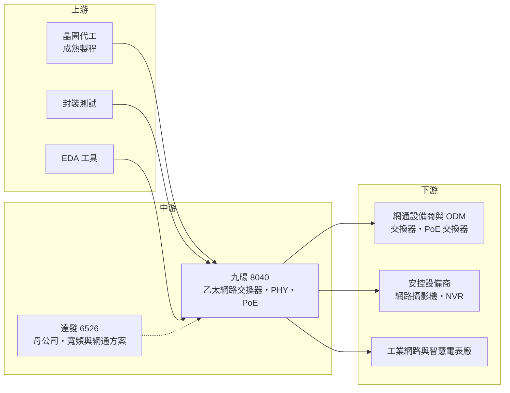

# 8040 九暘

> 上櫃｜[[產業索引-半導體業|半導體業]]｜上市（櫃）日期 2007/04/30

# 第一章：企業模式與商業藍圖

> [!info] 撰寫說明
> 本文由 Claude 依公開資料整理，架構比照 [[2330台積電]] 的四章研究，資料截至 2026-10-08。財務數字來源：櫃買中心開放資料（基本資料、綜合損益、資產負債、每月營收）、Goodinfo 台灣股市資訊網年度經營績效、富果研究九暘 2025 年 9 月法說會整理與達發 2026 年 8 月法說會整理；產業描述為整理性內容，尚未逐條比對原始文件。#待校對

在評估單一個股的長期投資價值時，首要步驟是拆解企業的底層獲利邏輯。本章針對九暘電子（股票代號：8040，以下簡稱九暘）的商業模式進行定性分析，說明一家長期在乙太網路晶片市場中處於邊緣位置的小型 IC 設計公司，為何在 [[6526達發]] 入主後重新調整定位，以及這次整合的長期意義。

## 一、核心定位：專攻 1G 以下乙太網路與 PoE 供電的利基型網通 IC 公司

九暘成立於 1997 年，2007 年在櫃買中心上櫃，總部位於新竹，是 [[Fabless]] IC 設計公司。公司產品分為兩大類：一是[[乙太網路]]交換器（Switch）與實體層（[[PHY]]）晶片，二是乙太網路供電（[[PoE]]）的供電端控制晶片。

乙太網路晶片是所有有線網路設備的基礎元件。交換器晶片負責在多個網路埠之間轉送資料，PHY 晶片負責把數位訊號轉換成可以在網路線上傳輸的電氣訊號。PoE 則是讓網路線同時傳送資料與電力的技術，例如網路攝影機、無線基地台、IP 電話只要接一條網路線就能供電與連網，不需要另外拉電源線。九暘的 PoE 產品涵蓋 15 瓦（AF）、30 瓦（AT）到 90 瓦（BT）等不同供電標準。

九暘的定位是「1G 以下的乙太網路與 PoE」，也就是中小企業網路、安全監控、工業自動化與[[智慧電表]]等不需要高速傳輸、但需要穩定與低成本的應用。這個市場的技術門檻不如資料中心高速網路，但需要長期供貨、穩定品質與完整的參考設計。

2024 年 7 月，[[6526達發]]（聯發科集團旗下的網通與音訊晶片公司）透過私募入股九暘，此後雙方在供應鏈管理與研發資源上加速整合。依富果研究整理的 2025 年 9 月法說會，九暘稱達發為母公司，並在達發入主後進行體質調整。

## 二、終端應用板塊：乙太網路約七成、PoE 約三成

依 2025 年 9 月法說會資料，九暘 2025 年第二季營收依產品別分布如下：

* **乙太網路交換器與 PHY（約 70%）：** 5 埠到 24 埠的交換器晶片與 PHY 晶片，用於中小企業交換器、安控錄影設備與工業網路設備。
* **PoE 供電控制晶片（約 30%）：** 比重從 2025 年第一季的 25% 提升到第二季的 30%。主要市場是中國與印度，應用在網路攝影機、無線基地台與 PoE 交換器。

依應用別，中小企業網路與安全監控是最大宗，其次是工業自動化與智慧電網（智慧電表）。這些應用的共同特點是生命週期長、對價格敏感、需要穩定供貨。

## 三、資本轉化邏輯：交換器加 PoE 的一站式方案

九暘的商業模式是典型的 Fabless：設計晶片、委外製造、賣給網通設備商。它的差異化在於能同時提供交換器晶片與 PoE 控制晶片，讓客戶在設計 PoE 交換器時，可以一次從同一家供應商取得「資料轉送」與「供電控制」兩個關鍵元件，並取得完整的參考設計。這種一站式方案能縮短客戶的開發時間，也提高轉換成本。

達發入主後，這個模式延伸為集團層級的搭配：達發的寬頻與網通方案搭配九暘的 PoE 晶片，提供更完整的系統解決方案。達發 2026 年 8 月法說會表示，這種市場協同效應已在客戶端展現成果。

不過，這個模式的弱點也很明顯：九暘規模小，營收在 2022 年最高時約 13 億元，2023 至 2025 年降到 6 億至 7 億元之間。研發費用相對固定，營收一旦下滑，就很容易陷入虧損。

## 四、企業長期藍圖：在達發集團內擴充產品線

依 2025 年 9 月法說會，九暘的長期策略如下。

* **三至五年擴充並升級產品線：** 達發入主後訂下的目標，重點包括開發成本效益更佳的交換器晶片、成本更優且特性更強的 PSE 控制器，以及符合美國能源部 DOE Level VII 能源效率標準的新產品。
* **聚焦 1G 以下乙太網路與 PoE：** 不追逐資料中心高速網路，而是在既有利基市場深耕，並與達發的產品搭配提供一站式方案。
* **市場規模目標：** 公司預估 2029 年可服務市場（SAM）將成長到 8 億美元，策略的初步成果預計在 2027 年顯現，2029 年取得更好的成績。
* **首要目標是損益兩平：** 公司表示首要目標是盡快損益兩平，但未提供明確時間點。2026 年上半年營業利益已轉為小幅正數（櫃買中心資料），代表體質調整開始出現成效。

從長期角度看，九暘的價值不只在於自身的產品，也在於它是達發集團網通版圖的一塊拼圖。投資人評估九暘時，需要同時考慮達發的集團策略與資源投入。

# 第二章：護城河深度與競爭優勢

在長期價值投資中，「護城河」指企業抵禦競爭、維持超額利潤的保護機制。本章分析九暘的護城河構成、主要競爭對手，以及在國際大廠與中國同業夾擊下能守住多少。

## 一、九暘護城河的核心組成要素

九暘的護城河相對淺，主要來自以下幾個方面。

* **1. 交換器加 PoE 的組合方案：** 同時提供交換器與 PoE 控制晶片的業者並不多，九暘可以讓客戶用一套方案完成 PoE 交換器設計，降低開發難度與料號管理成本。對中小型網通設備商來說，這種整合價值高於單純比價。
* **2. 長生命週期的工業與安控客戶：** 安控設備、工業網路與智慧電表的設計週期長，晶片一旦導入就會長期使用，形成一定的客戶黏著度。
* **3. 達發集團的資源支持：** 達發入主後，九暘可以借用集團的供應鏈議價力、研發資源與客戶通路。這對一家規模只有數億元營收的公司來說，是提升競爭力的重要後盾。
* **4. 法規與能效標準的認證：** PoE 產品需要符合 IEEE 標準與各國能效規範，例如美國 DOE 的能源效率等級。取得認證需要時間與測試投入，對新進者形成門檻。

## 二、全球主要競爭對手格局

| 對手 | 定位 | 對九暘的威脅 |
|---|---|---|
| [[2379瑞昱]] | 全球主要乙太網路交換器與 PHY 供應商 | 產品線完整、規模大、成本優勢明顯，主導中低階交換器市場 |
| [[AVGO博通]] | 企業與資料中心網路晶片龍頭 | 在高階交換器市場主導，部分產品向下延伸 |
| Microchip | 乙太網路與 PoE 晶片大廠 | PoE 控制器與工業乙太網路的國際品牌 |
| 德州儀器（TI） | 類比與 PoE 控制晶片 | PoE 控制器品牌與通路優勢 |
| 中國乙太網路晶片廠商 | 受在地化政策支持 | 以價格搶中國安控與交換器市場 |

## 三、優勢轉化：哪些市場守得住、哪些守不住

* **守得住：** PoE 控制晶片與工業、電網等長生命週期應用。PoE 比重從 25% 升到 30%，顯示這條產品線正在成長；工業與電網客戶重視穩定供貨與認證，不會輕易更換供應商。
* **較難守住：** 一般中小企業與消費性交換器晶片。這個市場由瑞昱主導，規模經濟與成本優勢明顯，中國廠商又以低價競爭。九暘在這個市場缺乏規模，價格競爭力有限，這也是 2023 至 2025 年營收下滑、連年虧損的主因之一。
* **觀察重點：** 第一，營業利益能否從 2026 年上半年的小幅獲利，穩定轉為持續獲利。第二，PoE 比重與新一代 PSE 控制器的出貨成長。第三，達發集團的資源整合能否帶來新客戶與新產品，特別是 2027 年公司自訂的「初步成果」時間點。

# 第三章：財務體質與盈利規模

資料日期：2026-10-08。數字取自櫃買中心開放資料與 Goodinfo 年度經營績效，表格是撰寫當時的快照；最新月營收、毛利率、累計 EPS 由自動排程寫在本筆記的屬性欄位（月營收、毛利率、累計EPS 等）。#待校對

財務報表是檢驗護城河是否真實存在的最終標準。本章用三率、[[ROE]]、現金流與資本報酬，檢視九暘在網通景氣循環與體質調整期的財務狀況。

## 一、獲利能力的基石：三率

| 年度 | 營收（億元） | [[毛利率]] | [[營業利益率]] | EPS（元） | [[ROE]] |
|---|---|---|---|---|---|
| 2020 | 8.32 | 30.1% | -3.5% | -1.71 | -15.5% |
| 2021 | 11.1 | 37.3% | 8.9% | 0.91 | 8.5% |
| 2022 | 13.0 | 40.7% | 13.5% | 2.22 | 18.3% |
| 2023 | 7.18 | 33.4% | -7.9% | -1.77 | -15.4% |
| 2024 | 6.44 | 34.8% | -16.3% | -1.38 | -7.2% |
| 2025 | 6.61 | 41.1% | -13.3% | -0.60 | -2.4% |
| 2026 上半年 | 4.32 | 43.9% | 4.9% | 0.38 | 年化約 2.9%（推算） |

註：2020 至 2025 年取自 Goodinfo 年度經營績效（合併報表）；2026 上半年取自櫃買中心綜合損益開放資料。2026 上半年 ROE 以稅後淨利 0.36 億元除以 2026 年第二季底權益總計 24.8 億元，再乘以 2 年化推算。

* **營收大幅波動：** 2022 年營收 13.0 億元是近年高點，2023 年驟降到 7.18 億元，跌幅約 45%。這反映 2021 至 2022 年網通晶片短缺時客戶超額備貨，2023 年進入庫存調整後需求急凍。2020 至 2025 年營收五年年複合成長率約 -4.5%（推算）。2026 年前八月營收約 6.03 億元，年增約 34.8%（櫃買中心每月營收資料），已經接近 2025 年全年水準。
* **[[毛利率]]持續改善：** 毛利率從 2023 年的 33.4% 提升到 2025 年的 41.1%、2026 年上半年的 43.9%，代表產品組合調整（PoE 比重提高）與定價策略發揮作用。
* **[[營業利益率]]受規模限制：** 毛利率改善了，但 2023 至 2025 年營業利益率仍為負，原因是營收規模太小，研發與管理費用無法被攤薄。2026 年上半年營收回升，營業利益率轉為 4.9%，是典型的[[營運槓桿]]效果。

## 二、[[ROE]]：資本效率

以 2021 至 2025 年計算，九暘近五年平均 ROE 約 0.4%（推算），長期資本效率偏低。2024 年達發私募入股後，股本增加到約 9.64 億元、資本公積約 15.4 億元，權益總計在 2026 年第二季底約 24.8 億元，但保留盈餘仍為負數（約 -0.22 億元）。換句話說，公司帳上有充足的資本，但本業獲利能力還不足以產生合理報酬。每股淨值約 25.7 元。

## 三、資本支出與[[自由現金流]]

* **[[CapEx]] 低：** 作為 Fabless 公司，九暘的資本支出主要是研發設備與光罩，具體金額未查得。
* **財務結構穩健：** 2026 年第二季底總負債只有約 1.95 億元，流動資產約 23.3 億元，財務非常保守。私募資金讓公司有足夠的現金支應產品開發，不需要借款。
* **股利：** 依櫃買中心本益比殖利率資料，九暘最近一年度未配發現金股利。在保留盈餘轉正之前，配息空間有限。
* **自由現金流：** 未查得歷年現金流量表。推估 2023 至 2025 年因營業虧損，營業現金流承壓（推估）。

## 四、[[ROIC]] 與 [[WACC]]：價值創造利差

* **ROIC（推算）：** 以 2026 年上半年營業利益 0.21 億元年化約 0.42 億元，乘以（1－20% 稅率）得到稅後營業利益約 0.34 億元。投入資本以權益總計 24.8 億元加上非流動負債 0.21 億元（有息負債未查得，以非流動負債作為上限近似）計算，約 25.0 億元，ROIC 約 1.4%（推算）。2023 至 2025 年營業虧損，ROIC 為負。帳上大量現金拉低了 ROIC，若只計算營運資產，報酬率會較高，但仍屬偏低水準。
* **WACC（推算）：** 用 CAPM 推估：無風險利率約 1.75%，市場風險溢酬 6%，β 值取中小型網通 IC 設計股常見的 1.2（假設值，未查得官方數字），股東權益成本約 1.75% + 1.2 × 6% = 8.95%。九暘幾乎沒有有息負債，WACC 約 9%（推算）。
* **價值創造判斷：** 九暘目前的 ROIC 約 1.4%，遠低於 WACC 約 9%，仍處於未創造價值的階段。在 2022 年營業利益率 13.5% 的高峰期，ROIC 曾經高於資金成本（推估），代表本業在規模足夠時具備獲利能力。九暘要長期創造價值，需要營收回到 10 億元以上的規模，並維持兩位數的營業利益率；這是否能在達發集團支持下達成，是 2027 至 2029 年的關鍵觀察點。

# 第四章：總體風險與地緣政治

任何企業都無法脫離宏觀環境獨立存在。本章分析九暘未來必須面對的地緣政治、產業週期、營運與技術風險。

## 一、地緣政治風險

* **中國與印度市場依賴：** PoE 產品主攻中國與印度。中國推動網通晶片國產化，安控與交換器設備商可能優先採用本土晶片；印度市場則受當地製造政策與進口關稅影響。
* **安控設備的出口限制：** 美國等國家對部分中國安控設備品牌實施限制，間接影響這些設備商對上游晶片的需求，也可能改變全球安控市場的供應鏈結構。
* **台灣生產集中：** 晶圓製造與封測主要在台灣與亞洲，面臨一般性的地緣風險。

## 二、產業週期與市場結構風險

* **網通晶片的庫存循環：** 2022 至 2023 年的營收劇烈下滑，清楚說明網通晶片容易受到客戶超額備貨與庫存調整的影響，也就是[[長鞭效應]]。
* **寡占市場的規模劣勢：** 乙太網路交換器晶片市場由瑞昱、博通等大廠主導，規模經濟明顯。小型業者若沒有獨特產品，很難在價格上競爭。
* **中國同業崛起：** 中國乙太網路晶片廠商在政策支持下快速發展，主攻本土安控與交換器市場，壓縮中低階產品的價格。

## 三、營運環境的隱性風險

* **對母公司的依賴：** 九暘的長期策略高度仰賴達發集團的資源與方向。若集團策略調整、資源重新分配，九暘的發展可能受影響；集團內部交易與分工的公平性，也是小股東需要關注的問題。
* **研發效率：** 公司把縮短開發時程列為重點，若新產品延誤，將錯過客戶的設計週期。
* **規模不足：** 營收規模小，任何單一客戶或專案的變動，都會對營收與獲利造成明顯影響。

## 四、科技演進風險

乙太網路持續往更高速度發展，企業網路正從 1G 走向 2.5G、5G 與 10G，Wi-Fi 7 基地台也需要更高速的有線回傳。九暘目前聚焦 1G 以下市場，若主要客戶群快速升級到多 G 速率，九暘需要及時推出對應產品，否則現有市場會逐漸萎縮。另一方面，PoE 技術朝更高功率（90 瓦以上）與更高能效發展，美國 DOE 等能效法規也逐步趨嚴，這對九暘既是機會也是挑戰：符合新標準的產品可以取得先機，但研發與認證成本也會增加。車用乙太網路與單對乙太網路（工業應用）是可能的延伸方向，但目前未查得九暘在這些領域的具體布局。

# 專有名詞解析

## 半導體

- **[[PHY]]**：實體層晶片，負責把數位資料轉換成可在網路線或光纖上傳輸的電氣或光訊號。
- **[[Fabless]]**：只做晶片設計、不擁有晶圓廠的 IC 設計公司，製造委外給晶圓代工廠。

## 應用

- **[[PoE]]**：乙太網路供電，透過同一條網路線同時傳送資料與電力，常用於網路攝影機與無線基地台。
- **[[安全監控]]**：以網路攝影機、錄影主機等設備進行影像監控的應用，是 PoE 最主要的市場之一。
- **[[智慧電表]]**：具備數位顯示與通訊功能的電表，可遠端回傳用電資料。
- **[[NVR]]**：網路影像錄影主機，接收並儲存多支網路攝影機的影像。

## 金融

- **[[營運槓桿]]**：固定成本占比高的公司，營收小幅變動會造成營業利益大幅變動的現象。
- **[[私募]]**：公司對特定對象發行新股籌資，常用於引進策略投資人。
- **[[自由現金流]]**：營業活動現金流減去資本支出，代表企業可自由用於配息、還債或併購的現金。
- **[[長鞭效應]]**：終端需求的小幅變動，沿供應鏈往上游傳遞時被逐級放大，造成上游庫存與訂單劇烈波動。

## 產業

- **[[乙太網路]]**：最普遍的有線區域網路技術，從 100M、1G 到 10G 以上都有不同規格。
- **[[單對乙太網路]]**：只用一對導線傳輸的乙太網路，適合工業與車用環境的長距離、低成本連線。
- **[[Wi-Fi 7]]**：最新一代無線網路標準，傳輸速度與延遲大幅改善，帶動基地台有線回傳升級。

# 核心供應鏈

## 1. 上游：晶圓代工、封測與設計工具
- 晶圓代工與封測：具體合作夥伴未查得
- 設計工具：[[SNPS新思科技]]、[[CDNS益華電腦]]

## 2. 中游：九暘本身與集團
- 母公司與產品搭配：[[6526達發]]（2024 年 7 月私募入股）
- 集團最終母公司：[[2454聯發科]]（達發為聯發科集團成員）

## 3. 中游：主要競爭同業
- 乙太網路交換器與 PHY：[[2379瑞昱]]、[[AVGO博通]]、Microchip、中國乙太網路晶片廠
- PoE 控制晶片：Microchip、德州儀器

## 4. 下游：客戶群
- 中小企業網通設備商、安控設備商、工業自動化與智慧電表廠（客戶名稱未公開；PoE 主要市場為中國與印度）

延伸閱讀：[[聯發科供應鏈]]

## 最新新聞
<!-- news:start -->
<!-- news:end -->

## 相關連結
- [公開資訊觀測站](https://mopsov.twse.com.tw/mops/web/t05st03?step=1&firstin=1&co_id=8040)
- [Goodinfo](https://goodinfo.tw/tw/StockDetail.asp?STOCK_ID=8040)
- [Yahoo 股市](https://tw.stock.yahoo.com/quote/8040)
- [鉅亨網新聞](https://www.cnyes.com/twstock/8040/news)
