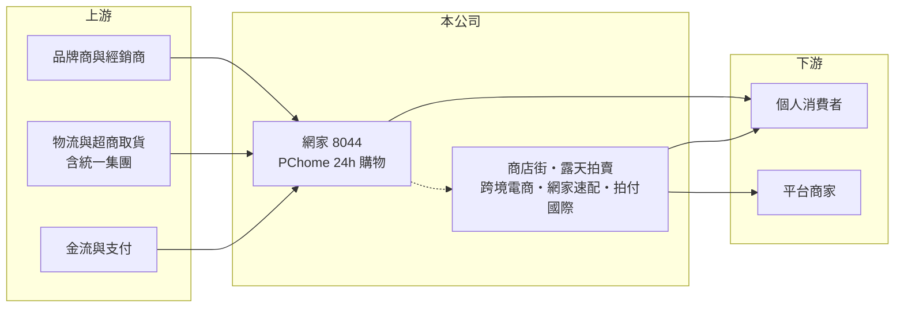

# 8044 網家

> 上櫃｜[[產業索引-數位雲端|數位雲端]]｜上市（櫃）日期 2005/01/24

# 第一章：企業模式與商業藍圖

> [!info] 撰寫說明
> 精簡版，由 Claude 依公開資料整理，架構比照 [[2330台積電]]，資料截至 2026-10-08。來源：櫃買中心開放資料（基本資料、2026 年上半年綜合損益與資產負債、每月營收、本益比殖利率）、Goodinfo 年度經營績效（2018 至 2025 年）、富果研究電商產業分析（事業結構、倉儲模式、市占變化，資料年份較早）、Yahoo 股市與旺得富報導標題。最新的事業別營收比重與股東結構未查得。#待校對

網路家庭（網家，PChome）成立於 1998 年，是台灣電子商務的先行者，以 PChome 24h 購物的 [[B2C]] 自營電商為核心，另經營商店街、露天拍賣、跨境電商、物流與支付等事業，2005 年上櫃。

- **核心業務：** 網家的主業是自營電商：先向品牌與經銷商採購商品，放進自有倉庫，消費者下單後由網家出貨，營收以商品售價全額認列。這種模式能掌握價格與出貨速度，但毛利率只有一成多，必須靠規模與物流效率賺錢。PChome 24h 購物早年以「24 小時到貨」建立口碑，3C 商品是傳統強項。
- **營收結構：** 依富果整理，PChome 24h 購物占營收超過九成；其他事業包括 PChome 全球購物（跨境電商）、商店街（[[B2B2C]] 平台）、露天拍賣（[[C2C]]）、物流公司網家速配，以及經營 Pi 錢包與 Pi 點數的拍付國際。2025 年合併營收 369 億元，比 2021 年高峰的 486 億元減少約四分之一。
- **營運據點：** 總部位於台北市大安區，倉儲以桃園的大型集中式倉庫為主（富果整理時為 7 座）。集中式倉儲在一般時期效率高，但購物節高峰容易壅塞；相較之下，[[8454富邦媒]] 建置 30 座以上的衛星倉並成立自有物流，配送速度與生鮮品項的彈性較佳，這是網家市占流失的重要原因之一。
- **長期方向：** 網家近年的方向是止血與重整：縮減虧損事業、改善物流與商品結構，並與統一集團合作（統一超商入股的時間與持股比例待校對）。若能結合 [[2912統一超]] 的門市取貨與物流網絡，有機會彌補最後一哩配送的弱點，這是轉型能否成功的關鍵。

# 第二章：護城河深度與競爭優勢

網家曾是台灣 B2C 電商龍頭，但護城河已明顯變窄，目前屬於規模型業者在轉型期的競爭位置。

- **競爭優勢：** 網家仍擁有長年累積的品牌知名度、3C 品類的採購規模與數百萬會員，以及露天拍賣、Pi 錢包等多元生態。富果整理指出，網家過去長期是台灣最大的 B2C 電商，B2C 市占率長期超過 20%，這些用戶基礎與供應商關係仍是轉型的資產。
- **主要對手：** 最主要的對手是 [[8454富邦媒]]（momo），依富果整理其電商市占率由 2017 年的 10.9% 升到 2019 年的 15.6%，同期網家降到約 12%；另外還有蝦皮購物、酷澎（Coupang）等外資平台，以補貼與快速到貨爭取用戶。電商產業有明顯的規模效應與[[網路效應]]，市占落後者的單位物流成本與議價能力都處於劣勢。
- **觀察重點：** 長期要看三件事：一是營業利益能否穩定轉正，2026 年上半年已見小幅營業利益；二是與統一集團的合作能否實質降低物流成本、提高到貨速度；三是露天、支付等子公司是否持續虧損或被調整。

# 第三章：財務體質與盈利規模

資料日期：2026-10-08，表格是撰寫當時的快照；最新月營收、毛利率、累計 EPS 由自動排程寫在本筆記的屬性欄位（月營收、毛利率、累計EPS 等）。#待校對

網家的財務數字反映電商競爭的結果：營收自 2021 年高峰下滑，2022 年起連續虧損，近兩年毛利率小幅改善。

| 年度 | 營收（億元） | [[毛利率]] | [[營業利益率]] | EPS（元） | [[ROE]] |
|---|---|---|---|---|---|
| 2021 | 486 | 11.4% | 0.50% | 0.84 | 1.06% |
| 2022 | 463 | 12.1% | 0.22% | -0.42 | 約 -0.5%（推估，來源未標正負號） |
| 2023 | 413 | 12.1% | -1.24% | -5.01 | -6.21% |
| 2024 | 376 | 13.0% | -0.94% | -4.08 | -5.17% |
| 2025 | 369 | 13.4% | -1.45% | -4.62 | -9.73% |
| 2026 上半年 | 189.5 | 15.6% | 0.63% | -1.06 | 未查得 |

註：2021 至 2025 年取自 Goodinfo，2026 年上半年取自櫃買中心開放資料（營業毛利 29.5 億元、營業利益 1.19 億元、歸屬母公司淨損 2.16 億元）。

- **長期指標：** 2020 至 2025 年營收從 439 億元降到 369 億元，年複合成長率約 -3.4%（推算）；2021 至 2025 年平均 ROE 約 -4%（推算）。本益比資料顯示目前現金股利為 0，虧損期間未配息。2026 年 1 至 8 月累計營收年增約 9%，營收止跌回升。
- **[[ROIC]] 與 [[WACC]]：** 2025 年營業損失約 5.4 億元（369 億元 × -1.45%），稅後營業利益約 -4.3 億元（依 20% 稅率換算）；投入資本約 124 億元（2026 年 6 月底權益總計 87.3 億元，加上以非流動負債約 75 億元的一半推估的有息負債約 37 億元，其中可能含倉儲租賃負債），ROIC 約 -3.4%（推算），2023 至 2025 年都是負值。WACC 約 6.5%（推算：無風險利率 1.75%、市場風險溢酬 6%、β 取電商同業常見值 1.1，權益成本 8.35%；稅前負債成本 2.5%、稅率 20%；權益比重約 70%）。ROIC 連續多年低於 WACC，代表目前的經營模式在消耗股東資本，轉型成效要以 ROIC 回到資金成本之上來檢驗。
- **財務特色：** 2026 年 6 月底總資產 322 億元、負債 235 億元，負債比率約 73%，其中包含應付供應商貨款與支付子公司的代收款項；歸屬母公司權益 65.2 億元，每股淨值 32.12 元，非控制權益約 22 億元，顯示子公司有外部股東參與。

# 第四章：總體風險與地緣政治

網家的風險集中在市場競爭、轉型執行與財務壓力。

- **產業週期：** 台灣電商滲透率仍在提升，但成長已由高速轉為穩定，平台之間進入以補貼、物流速度與會員經濟比拚的成熟期；消費景氣轉弱時，3C 等高單價商品需求首當其衝。
- **營運風險：** 自營電商毛利率只有一成多，物流與行銷費用稍有增加就會轉為虧損；外資平台資金雄厚、補貼積極，若價格戰延續，網家改善獲利的空間有限。轉型依賴與統一集團的合作，整合進度與實際效益仍待觀察。
- **其他風險：** 長期虧損侵蝕淨值，若持續可能需要增資或處分資產；個資外洩與詐騙問題會傷害電商信任並帶來法規責任；支付子公司受金管會監理，法規趨嚴會增加合規成本。

# 專有名詞解析

## 金融

- **[[ROIC]]**：投入資本報酬率，稅後營業利益除以股東權益加有息負債，衡量本業運用資本的效率。
- **[[WACC]]**：加權平均資金成本，股東與債權人要求報酬率的加權平均，是 ROIC 要超越的門檻。

## 產業

- **[[B2C]]**：企業對消費者的銷售模式，電商平台直接把商品賣給個人消費者。
- **[[B2B2C]]**：平台讓商家開店、再由商家賣給消費者的模式，平台收取租金或抽成。
- **[[C2C]]**：消費者對消費者的交易模式，例如拍賣平台讓個人之間買賣商品。
- **[[網路效應]]**：使用者越多，產品對每位使用者的價值越高，進而吸引更多使用者的正向循環。

# 核心供應鏈

- 上游：國內外品牌商與經銷商、物流業者與超商取貨通路（如 [[2912統一超]]）、金流與支付服務。
- 下游／客戶：個人消費者，以及在商店街、露天拍賣開店的商家。
- 同業：[[8454富邦媒]]、蝦皮購物、酷澎（Coupang）。

## 最新新聞
<!-- news:start -->
<!-- news:end -->

## 相關連結
- [公開資訊觀測站](https://mopsov.twse.com.tw/mops/web/t05st03?step=1&firstin=1&co_id=8044)
- [Goodinfo](https://goodinfo.tw/tw/StockDetail.asp?STOCK_ID=8044)
- [Yahoo 股市](https://tw.stock.yahoo.com/quote/8044)
- [鉅亨網新聞](https://www.cnyes.com/twstock/8044/news)
