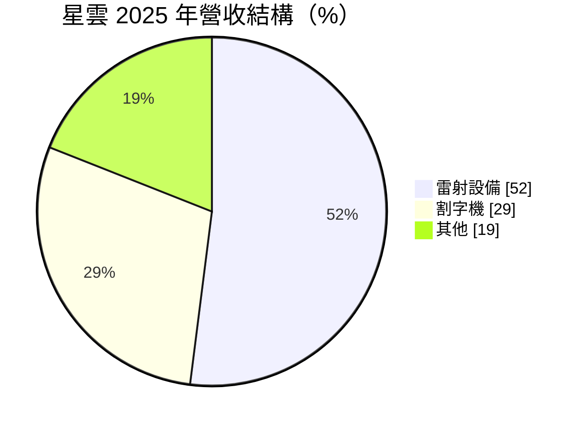
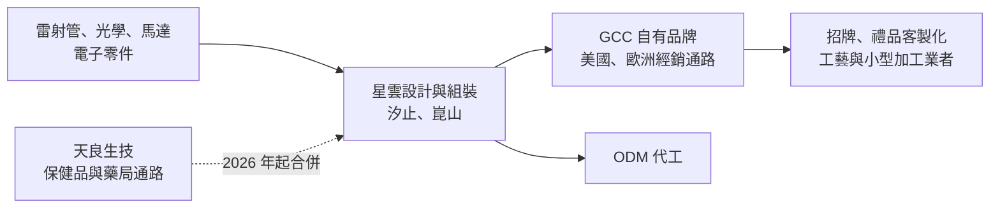
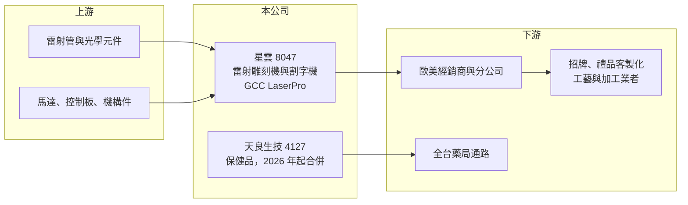

# 8047 星雲

> 上櫃｜[[產業索引-其他電子業|其他電子業]]｜上市（櫃）日期 2004/02/09

# 第一章：企業模式與商業藍圖

> [!info] 撰寫說明
> 本文由 Claude 依公開資料整理，架構比照 [[2330台積電]] 的四章研究，資料截至 2026-10-08。財務數字來源：Goodinfo 台灣股市資訊網年度經營績效、富果研究法說會整理（2026 年 4 月）、中央社（2025 年 10 月）與旺得富（2026 年 5 月）報導、櫃買中心開放資料（本筆記 _data 快照）；公司經營權與事業結構在 2025 至 2026 年大幅變動，公開資料有限，產業描述為整理性內容，尚未逐條比對原始文件。#待校對

在評估單一個股的長期投資價值時，首要步驟是拆解企業的底層獲利邏輯。本章說明星雲電腦（股票代號：8047，以下簡稱星雲）這家老牌雷射雕刻機廠的本業，以及 2025 年經營權易手後，它如何被新大股東改造成集團的投資與整合平台。

## 一、核心定位：自有品牌的雷射雕刻機與割字機廠

星雲成立於 1989 年，總部位於新北汐止，2004 年在櫃買中心掛牌。依中央社報導，星雲以電腦割字機起家，後來發展出雷射雕刻機，擁有自有品牌 GCC LaserPro，在商用雷射雕刻機市場有穩定的市占與品牌聲譽。產品用於序號標記、條碼、電路板識別、零件標籤與藝術雕刻等。

依 2026 年 4 月法說，星雲的業務包括：

* **雷射切割、雕刻與打標機：** 用雷射在木材、壓克力、皮革、金屬等材料上雕刻或切割，客戶多為廣告招牌、禮品客製化、工藝與小型加工業者。
* **電腦割字機：** 把電腦設計的文字或圖案切割在貼紙或反光膜上，主要用於招牌、車身貼紙與服飾轉印。
* **應用軟體：** 自行開發與設備配套的軟體與韌體，讓使用者從電腦直接輸出圖形到機台。

星雲同時經營自有品牌與 [[ODM]] 代工，生產基地在汐止與中國崑山，並在美國與歐洲設有分公司。

## 二、終端應用板塊：雷射設備過半

依法說，2025 年營收結構如下：

* **雷射設備（52%）：** 主要成長來源，產品從小型桌上型雷射雕刻機到自動化雷射設備。中國廠商的低價機種近年大量進入市場，對星雲的中低階產品造成壓力。
* **割字機（29%）：** 成熟產品，市場規模穩定但成長有限，主要靠既有品牌與通路維持。
* **其他（19%）：** 包括耗材、零件、維修與軟體等。

## 三、資本轉化邏輯：品牌設備加上集團資源

星雲本業屬於小批量、多機種的設備生意，品牌與通路是主要資產。過去十年營收在 4.6 億至 6.7 億元之間，規模偏小，研發與海外通路費用難以攤提，導致多數年份本業虧損。

## 四、企業長期藍圖：經營權易手與多角化

星雲近兩年最重要的變化是經營權與事業結構的改變，這些變化會影響它未來十年的樣貌：

* **2025 年經營權易手：** 依中央社報導，2025 年 10 月世紀民生（[[5314世紀]]）與信立化工（[[4303信立]]）以每股 16 元公開收購星雲 39.36% 至 60% 股權。新大股東表示，收購目的是補強集團在半導體前段製程設備、電子零組件與 PCB 雷射切割的布局，並把[[無人機]]零組件納入發展藍圖。
* **2026 年跨足保健品：** 依旺得富報導，2026 年 5 月星雲與世紀民生聯合公開收購天良生技 37.8% 股權，每股 32.71 元，總金額約 5.66 億元。天良生技通過衛福部 GDP 認證，與全台逾 3,000 家藥局合作。依月營收公告，天良已成為星雲的合併個體，使星雲的營收結構從純設備商轉為「雷射設備＋保健品」的[[多角化經營]]。
* **雷射技術方向：** 研發聚焦 PCB 雷射切割，以雷射微加工取代傳統刀具切割，並朝自動化雷射與系統整合方向發展。

這些轉變代表星雲的長期價值，將越來越取決於新大股東的資本配置能力，而不只是雷射雕刻機本業。

# 第二章：護城河深度與競爭優勢

在長期價值投資中，「護城河」指企業抵禦競爭、維持超額利潤的保護機制。本章分析星雲雷射設備本業的護城河與競爭格局，以及多角化後的不確定性。

## 一、護城河的核心組成要素

星雲的護城河較淺，主要來自品牌與通路。

* **1. GCC LaserPro 品牌：** 星雲經營自有品牌超過三十年，在歐美商用雷射雕刻機市場有一定知名度。對招牌與禮品業者而言，機台的穩定性與售後服務比價格更重要，品牌是吸引客戶的主要因素。
* **2. 海外通路與服務據點：** 美國與歐洲分公司提供銷售與維修，讓星雲能直接接觸終端客戶。設備業的售後服務需要長時間建立，是新進者的門檻。
* **3. 天良的藥局通路：** 合併天良後，星雲多了一個保健品通路資產。這與雷射本業沒有技術上的綜效，屬於財務性的多角化。

## 二、全球主要競爭對手格局

| 對手 | 定位 | 對星雲的威脅 |
|---|---|---|
| Trotec（奧地利）、Epilog、Universal Laser Systems（美國） | 歐美商用雷射雕刻機品牌 | 在高階市場品牌強（推估） |
| 中國雷射設備廠 | 低價桌上型與工業雷射機 | 以價格搶占中低階市場（推估） |
| Roland DG、Graphtec、Mimaki（日本） | 割字機與輸出設備品牌 | 在割字機市場直接競爭（推估） |

## 三、優勢轉化：守得住／守不住／觀察重點

* **守得住：** 重視服務與穩定度的歐美商用客戶，以及長期使用 GCC 機台的既有客戶，這是星雲維持 30% 以上毛利率的基礎。
* **守不住：** 中低階雷射雕刻機。中國廠商價格低、迭代快，近年消費級雷射雕刻機普及，壓縮了星雲在入門市場的空間。2022 年起本業連年虧損，反映的就是這種競爭壓力。
* **觀察重點：** 長期可以觀察三個指標：雷射本業能否轉虧為盈；PCB 雷射切割與自動化設備能否形成新營收；以及天良併入後，集團整體的資本報酬率能否改善。

# 第三章：財務體質與盈利規模

資料日期：2026-10-08。數字取自 Goodinfo 年度經營績效、富果研究法說整理與櫃買中心開放資料快照，表格是撰寫當時的快照；最新月營收、毛利率、累計 EPS 由自動排程寫在本筆記的屬性欄位（月營收、毛利率、累計EPS 等）。#待校對

財務報表是檢驗護城河是否真實存在的最終標準。本章用多年度的三率、ROE 與資本報酬，檢視星雲本業的獲利品質，以及多角化對財務結構的影響。

## 一、獲利能力的基石：三率

| 年度 | 營收（新台幣） | [[毛利率]] | [[營業利益率]] | EPS（元） | [[ROE]] |
|---|---|---|---|---|---|
| 2018 | 6.68 億 | 32.7% | -0.5% | -0.15 | -1.2% |
| 2019 | 6.28 億 | 30.8% | -3.5% | -0.50 | -4.1% |
| 2020 | 5.62 億 | 31.9% | -2.0% | 0.27 | 2.3% |
| 2021 | 6.51 億 | 31.1% | 1.0% | 0.43 | 3.7% |
| 2022 | 6.40 億 | 26.5% | -4.4% | -0.84 | -7.2% |
| 2023 | 4.98 億 | 26.8% | -11.6% | -1.39 | -12.7% |
| 2024 | 4.88 億 | 36.4% | -2.4% | -0.35 | -3.4% |
| 2025 | 4.62 億 | 34.1% | -7.5% | -0.78 | -7.8% |

* **[[毛利率]]：** 長期在 27% 至 36% 之間，以設備業來說不算低，代表品牌仍有定價能力。
* **[[營業利益率]]：** 八年中只有 2021 年小幅為正，其餘年份都是營業虧損。問題不在毛利，而在營收規模太小，撐不起研發、海外分公司與管理費用。
* **長期指標：** 2018 至 2025 年營收年複合成長率約 -5.1%（推算），2021 至 2025 年五年平均 ROE 約 -5.5%（推算）。Goodinfo 統計歷年平均現金股利約 0.11 元，2025 年度未配息。2026 年上半年合併天良後營收 2.60 億元，毛利率約 38.9%（推算），但仍為營業虧損，EPS -0.28 元。

## 二、[[ROE]]：資本效率

本業長期虧損，ROE 多數年份為負，資本效率偏低。2026 年第二季底合併資產約 24.7 億元、權益總額約 13.8 億元，但每股淨值只有 9.26 元，換算歸屬母公司的權益約 3.9 億元（推算）。差額主要是天良的[[非控制權益]]：星雲只持有天良部分股權，卻因取得控制力而合併全部報表，所以帳面規模放大很多，但真正屬於星雲股東的部分沒有那麼大。

## 三、資本支出與自由現金流

* **[[CapEx]]：** 設備組裝業的資本支出不高，具體數字未查得。2026 年收購天良股權屬於大額投資支出，資金來源包括股本增加（股本由約 3.46 億元增至約 4.17 億元）與其他籌資，細節未查得。
* **[[自由現金流]]：** 本業長期營業虧損，自由現金流難以長期為正（推估，逐年數字未查得）。

## 四、[[ROIC]] 與 [[WACC]]：價值創造利差

星雲本業多數年份營業虧損，ROIC 為負。以 2025 年為例，營業虧損約 3,459 萬元，股東權益約 4 億元（以淨損 3,239 萬元與 ROE -7.8% 回推），ROIC 約 -7%（推算）。即使在唯一營業獲利的 2021 年，營業利益率也只有 1%，ROIC 不到 1%（推算）。

WACC 以 CAPM 推估：台灣 10 年期公債約 1.5% 至 2%，市場風險溢酬約 6%，β 未查得個股數值，採中小型設備股常見的 0.9 至 1.1（假設），股東權益成本約 6.9% 至 8.6%。有息負債金額未查得，WACC 約 7% 至 8%（推算）。

比較兩者，星雲過去八年的 ROIC 長期低於 WACC，代表本業在毀損股東價值。2025 年經營權易手與 2026 年合併天良，是新大股東試圖改變這個結構的做法；但天良的報酬大部分要分給少數股東，星雲股東真正的報酬，要看本業轉虧與集團綜效能否兌現。

# 第四章：總體風險與地緣政治

任何企業都無法脫離宏觀環境獨立存在。本章分析星雲長期必須面對的產業、營運與公司治理風險。

## 一、地緣政治

* **美國市場與關稅：** 歐美是星雲雷射設備的主要市場，法說提到可由台灣直接出貨到美國。美國對中國製設備加徵關稅時，台灣出貨可能有利；但若關稅擴及台灣，成本與價格競爭力都會受影響。
* **崑山生產基地：** 中國生產據點面臨兩岸政策與供應鏈調整的風險。

## 二、產業週期與市場結構

* **中小企業設備需求：** 雷射雕刻機客戶多為小型加工與招牌業者，景氣轉差時這些客戶最先延後購買設備。
* **消費級雷射普及：** 低價消費級雷射雕刻機大量出現，入門市場的價格持續下滑，壓縮專業機種的成長空間。

## 三、營運環境的隱性風險

* **規模不足：** 年營收不到 7 億元，費用率偏高，是長期虧損的根本原因。
* **多角化整合風險：** 雷射設備與保健品是完全不同的產業，管理團隊需要同時經營兩種商業模式。若綜效不如預期，可能分散資源。
* **公司治理：** 新大股東以集團角度做資本配置，未來可能有更多關係人交易或轉投資，投資人需要關注交易條件是否公允。

## 四、科技或法規演進

* **雷射技術升級：** 光纖雷射、超快雷射等技術持續進步，星雲需要投入研發才能維持產品競爭力。
* **保健品法規：** 天良的保健品與藥品業務受衛福部法規管理，產品標示、廣告與認證規範變動都會影響營運。

# 專有名詞解析

## 應用

- **[[無人機]]**：不需駕駛員搭乘、可遠端或自動飛行的航空器，應用於空拍、物流、巡檢與國防。

## 金融

- **[[非控制權益]]**：子公司權益中不屬於母公司股東的部分，合併報表時列在權益項下。
- **[[ROIC]]**：投入資本報酬率，稅後營業利益除以投入資本，衡量本業運用資金創造報酬的能力。
- **[[WACC]]**：加權平均資金成本，股東與債權人要求報酬率的加權平均，是 ROIC 要超過的門檻。

## 產業

- **[[雷射加工]]**：以高能量雷射光束切割、雕刻、打標或鑽孔材料的加工方式，精度高且不需接觸工件。
- **[[ODM]]**：原廠委託設計，由代工廠負責設計與製造，再以客戶品牌出貨。
- **[[多角化經營]]**：企業跨足與本業不同的產業，以分散風險或尋找新成長來源。
- **[[保健食品]]**：具特定保健功效訴求的食品，台灣須依法規申請認證或遵守標示規範。

# 核心供應鏈

## 1. 上游：零組件
- 雷射管、光學元件、馬達與控制零件，供應商公司未揭露

## 2. 本公司與關係企業
- 星雲：雷射切割、雕刻與打標機，電腦割字機，配套軟體
- 子公司：[[4127天良]]（2026 年公開收購 37.8% 股權後合併）
- 主要股東：[[5314世紀]]、[[4303信立]]（2025 年公開收購取得）

## 3. 下游：客戶
- 歐美經銷商與終端加工業者、ODM 客戶
- 天良的藥局與保健品通路

## 4. 同業
- 雷射雕刻：Trotec、Epilog、Universal Laser Systems、中國雷射設備廠（推估）
- 割字機：Roland DG、Graphtec、Mimaki（推估）

## 最新新聞
<!-- news:start（自動產生，請勿手動編輯此範圍） -->
- 2026-10-08 📰 媒體 08:22｜營收速報 - 星雲(8047)9月營收8,792萬元年增率高達112.75％｜[鉅亨網](https://news.cnyes.com/news/id/6624508)

完整紀錄：[[8047星雲 新聞]]
<!-- news:end -->

## 相關連結
- [公開資訊觀測站](https://mopsov.twse.com.tw/mops/web/t05st03?step=1&firstin=1&co_id=8047)
- [Goodinfo](https://goodinfo.tw/tw/StockDetail.asp?STOCK_ID=8047)
- [Yahoo 股市](https://tw.stock.yahoo.com/quote/8047)
- [鉅亨網新聞](https://www.cnyes.com/twstock/8047/news)
