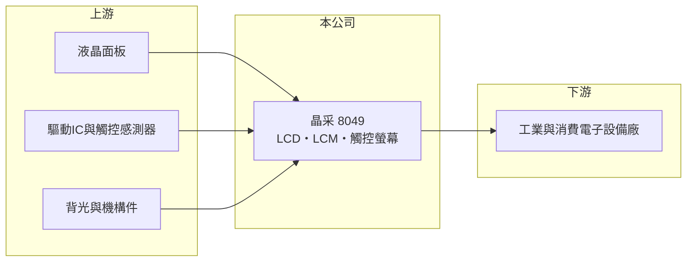

# 8049 晶采

> 上櫃｜[[產業索引-光電業|光電業]]｜上市（櫃）日期 2004/02/02

# 第一章：企業模式與商業藍圖

> [!info] 撰寫說明
> 精簡版，由 Claude 依公開資料整理，架構比照 [[2330台積電]]，資料截至 2026-10-07。來源：nstock.tw 晶采公司概況、winvest.tw 營收快訊。公開資料有限，產品別營收比重與主要客戶未查到。#待校對

晶采是總部在新北汐止的中小尺寸液晶顯示模組與觸控螢幕廠，近年獲利穩定並維持配息。

- **核心業務：** 晶采成立於 1998 年，產品包括[[LCD]]、[[LCM]]與[[觸控面板]]，營業項目也涵蓋資料儲存處理設備與電子零組件製造。
- **營收結構：** 本次未查到產品或應用別比重；2025 年全年營收 13.1 億元。
- **營運據點：** 總部位於新北市汐止區，生產據點本次未查到。
- **長期方向：** 公司以穩定獲利與配息為特色，2026 年營收與獲利同步成長，後續看能否維持較高的獲利率。

# 第二章：護城河深度與競爭優勢

晶采的競爭力在於中小尺寸客製化模組的長期經營與成本控制（推估）。

- **競爭優勢：** 2026 年第二季[[營業利益率]]接近兩成，在顯示模組廠中屬於偏高水準，顯示產品組合或費用控制有一定優勢。
- **主要對手：** 面板廠 [[3481群創]]、[[2409友達]]、[[6116彩晶]]，以及其他中小尺寸模組廠。
- **觀察重點：** 營收成長能否延續、毛利率能否維持三成以上，以及配息政策。

# 第三章：財務體質與盈利規模

資料日期：2026-10-07，以下數字是撰寫當時的快照；最新月營收、毛利率、累計 EPS 由自動排程寫在本筆記的屬性欄位（月營收、毛利率、累計EPS 等）。#待校對

晶采 2026 年營收小幅成長，第二季獲利明顯改善。

- **營收規模：** 2026 年 4 月營收 1.33 億元、年增 10.52%；8 月 1.26 億元、年增 18.28%；1 至 8 月累計 8.82 億元，年增 2.49%。2025 年全年營收 13.1 億元。
- **獲利：** 2026 年第二季 EPS 0.52 元，季增 18.18%、年增 67.74%；[[毛利率]] 31.41%，[[營業利益率]] 19.3%，淨利率 17.14%。
- **財務特色：** 資本額約 11.83 億元、市值約 28.86 億元；近五年平均現金股利 2.24 元，最近一次配發 1.4 元，以當時股價計算殖利率約 5.29%。

# 第四章：總體風險與地緣政治

晶采的風險主要來自顯示產業價格競爭與終端需求變化。

- **產業週期：** 中小尺寸顯示模組需求隨工業設備、消費電子與車用等終端景氣變動。
- **營運風險：** 營收規模不大，單一客戶或專案變動可能影響獲利；客戶集中度本次未查到。
- **其他風險：** 面板與驅動 IC 價格、新台幣匯率，以及中國模組廠的低價競爭。

# 專有名詞解析

## 應用

- **[[LCD]]**：液晶顯示器，以液晶控制背光通過量來顯示畫面，需搭配背光模組與偏光板。
- **[[LCM]]**：液晶顯示模組，把面板、背光、驅動 IC 與外框組裝成可直接裝機的顯示單元。

## 金融

- **[[營業利益率]]**：營業利益占營收的比率，反映扣除營業費用後本業的獲利能力。

## 產業

- **[[觸控面板]]**：能感應手指或觸控筆位置的面板，疊在顯示器上作為輸入介面。

# 核心供應鏈

- 上游：液晶面板廠、驅動IC與觸控感測器、背光與機構件供應商（推估）
- 下游／客戶：工業與消費電子設備廠（推估），名稱未揭露
- 同業：[[3481群創]]、[[2409友達]]、[[6116彩晶]] 與其他中小尺寸模組廠

## 最新新聞
<!-- news:start -->
<!-- news:end -->

## 相關連結
- [公開資訊觀測站](https://mopsov.twse.com.tw/mops/web/t05st03?step=1&firstin=1&co_id=8049)
- [Goodinfo](https://goodinfo.tw/tw/StockDetail.asp?STOCK_ID=8049)
- [Yahoo 股市](https://tw.stock.yahoo.com/quote/8049)
- [鉅亨網新聞](https://www.cnyes.com/twstock/8049/news)
