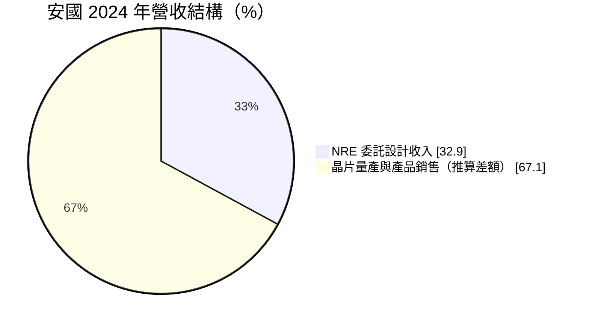
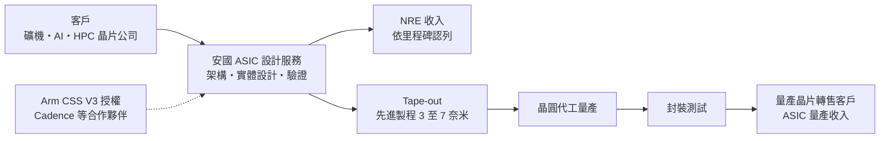
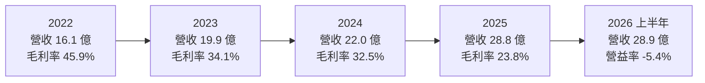
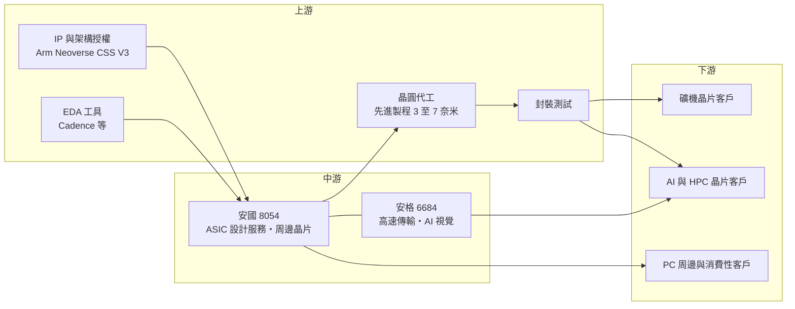

# 8054 安國

> 上櫃｜[[產業索引-半導體業|半導體業]]｜上市（櫃）日期 2004/11/08

# 第一章：企業模式與商業藍圖

> [!info] 撰寫說明
> 本文由 Claude 依公開資料整理，架構比照 [[2330台積電]] 的四章研究，資料截至 2026-10-08。財務數字來源：櫃買中心開放資料（基本資料、綜合損益、資產負債、每月營收）、Goodinfo 台灣股市資訊網年度經營績效、經濟日報與優分析 2025 年 12 月法說會報導、鉅亨網轉載之優分析報導；產業描述為整理性內容，尚未逐條比對原始文件。#待校對

在評估單一個股的長期投資價值時，首要步驟是拆解企業的底層獲利邏輯。本章針對安國國際科技（股票代號：8054，以下簡稱安國）的商業模式進行定性分析，說明一家以 USB 與讀卡機晶片起家的消費性 IC 公司，為何轉型成先進製程客製化晶片（[[ASIC]]）設計服務商，以及這個轉型目前走到哪一步。

## 一、核心定位：從標準型周邊晶片轉向先進製程 ASIC 設計服務

安國成立於 1999 年，2004 年在櫃買中心上櫃，總部位於台北南港，董事長為李宜平。公司早期以 PC 周邊晶片聞名，產品包括 USB 控制晶片、讀卡機晶片以及無線音訊晶片，屬於典型的消費性電子標準型 IC。這類產品的特點是規格公開、競爭者多、價格隨景氣大幅波動，長期毛利率與獲利都不穩定。

依鉅亨網轉載的優分析報導（2025 年 12 月），安國近年把經營重心轉向三件事：客製化晶片（ASIC）設計服務、矽智財（[[IP]]）授權，以及先進製程專案開發。換句話說，安國從「自己設計晶片、自己賣晶片」的標準產品公司，轉型成「替客戶設計晶片、按里程碑收費，並在量產後收取晶圓轉售收入」的設計服務公司。這和 [[3443創意]]、[[3661世芯-KY]] 的商業模式類似，但規模小得多。

這次轉型的關鍵事件有兩個。第一，2024 年底與星河完成簡易合併，整合設計服務團隊，公司認為這項合併推動了 2025 年 ASIC 設計服務的成長。第二，安國加入 [[ARM安謀]] 的 Arm Total Design 合作夥伴體系，取得 Arm Neoverse CSS V3 授權，具備整合 Arm 伺服器級 CPU 平台的能力。

此外，安國的合併報表包含子公司[[6684安格]]。安格以高速傳輸介面與 AI 視覺（無人機、自主移動機器人等）為主要業務，2025 年 12 月法說會表示已轉虧為盈。安國帳上約 17.6 億元的[[非控制權益]]（櫃買中心 2026 年第二季資料），主要反映安格等子公司其他股東的權益（推估）。

## 二、終端應用板塊：委託設計收入比重快速上升

安國未公開完整的產品營收比重。依優分析報導，委託設計收入（[[NRE]]）占營收比重從前幾年的約 12%，提高到 2024 年的 32.9%：

* **NRE 委託設計收入：** 客戶付費請安國完成晶片設計、驗證與[[Tape-out]]，依專案里程碑認列。報導指出安國已取得 4 奈米挖礦晶片設計案並於 2025 年完成 Tape-out，另接獲 3 奈米 AI 與高效能運算（[[HPC]]）晶片開發案。
* **ASIC 量產收入：** 晶片設計完成並進入量產後，安國代客戶向晶圓代工廠下單，再把晶片轉售給客戶。2025 年 11 月營收創單月新高，經濟日報報導原因是 ASIC 晶圓量產增加，加上 4 奈米專案開始貢獻 NRE。
* **既有產品線：** USB、讀卡機與音訊等周邊晶片仍有營收，但已不是公司的成長主軸。
* **子公司安格：** 高速傳輸介面與 AI 視覺方案。

## 三、資本轉化邏輯：設計服務的兩段式收入

設計服務公司的收入分成兩段。第一段是 NRE：客戶在晶片開發階段支付設計費，金額取決於專案複雜度，毛利率通常較高，但收入不穩定，完全看手上有多少專案、專案進度到哪個里程碑。第二段是量產：晶片成功量產後，設計服務公司負責向晶圓廠與封測廠下單，再把成品賣給客戶。量產收入規模大，但因為大部分成本是晶圓代工費用，毛利率通常偏低。

這可以解釋安國近年財務數字的變化：營收從 2020 年的 11.5 億元成長到 2025 年的 28.8 億元，2026 年前八月營收已達約 42.1 億元（櫃買中心每月營收資料），年增約 164%，但毛利率卻從 2021 年的 49.3% 一路降到 2026 年上半年的 16.2%。原因是收入結構從高毛利的自有產品，轉向低毛利的 ASIC 量產轉售。對設計服務公司來說，毛利率下降不一定代表經營惡化，關鍵在於營業利益能否轉正。

## 四、企業長期藍圖：自家 Arm CPU 與先進製程專案

* **自家 Arm 伺服器 CPU 平台：** 安國推出 Mobius100 八核心伺服器模擬平台，並於 2025 年 10 月在 OCP 全球高峰會展示 CSS V3 平台。經濟日報報導，公司規劃以 CSS V3 為基礎的 CPU 在 2026 年於 [[2330台積電]] 3 奈米製程投片，採用 Arm 小晶片系統架構（[[Chiplet]]），鎖定 AI 與 HPC 伺服器市場。
* **深耕先進製程設計服務：** 聚焦 3 奈米、4 奈米、7 奈米的高速運算專案，客群包含 CPU、AI 加速器與礦機晶片。
* **數位孿生與生態系合作：** 與 [[CDNS益華電腦]]、振生半導體合作提供數位孿生模擬服務，強化設計流程能力。
* **子公司安格的 AI 視覺：** 安格以「AI 之眼」為核心，與 NVIDIA Jetson、Thor 平台整合，切入無人機、自主移動機器人與 Physical AI 應用，並透過策略投資切入 AI 伺服器的高速傳輸市場。

整體而言，安國的長期藍圖是從消費性標準 IC 公司，轉型為以 Arm 伺服器平台與先進製程為核心的設計服務公司。這條路的天花板很高，但目前仍處於投入期，獲利能力尚未被證明。

# 第二章：護城河深度與競爭優勢

在長期價值投資中，「護城河」指企業抵禦競爭、維持超額利潤的保護機制。本章分析安國在轉型為 ASIC 設計服務後的護城河構成、主要競爭對手，以及這些優勢目前能守住多少。

## 一、安國護城河的核心組成要素

需要先說明的是，安國的護城河目前仍在建立中，尚未在財務數字上得到驗證。以下是公司正在累積的競爭要素：

* **1. Arm 生態系的認證與平台能力：** 加入 Arm Total Design 並取得 Neoverse CSS V3 授權，代表安國可以協助客戶快速打造 Arm 架構的伺服器 CPU。對想自製 CPU、但缺乏完整團隊的客戶來說，這種「現成平台加設計服務」的組合可以大幅縮短開發時間。
* **2. 先進製程的設計經驗：** 完成 4 奈米 Tape-out 並承接 3 奈米專案，代表安國累積了先進製程的實體設計與驗證經驗。先進製程設計的門檻很高，每完成一個專案，團隊的經驗就加深一層。
* **3. 專案的轉換成本：** ASIC 專案一旦進入開發，客戶很難中途更換設計服務夥伴；量產後，晶片的後續改版與世代延續通常也會交給同一家公司，形成一定的黏著度。
* **4. 小型公司的彈性：** 相較於大型設計服務公司偏好大客戶，安國可以服務規模較小、需求較特殊的客戶，例如礦機晶片與新創 AI 晶片公司。

## 二、全球主要競爭對手格局

| 對手 | 定位 | 對安國的威脅 |
|---|---|---|
| [[3443創意]] | 台積電轉投資的設計服務龍頭 | 與台積電關係緊密，承接大型 AI 與 HPC 專案 |
| [[3661世芯-KY]] | 先進製程 AI 與 HPC ASIC | 在大型雲端客戶 AI 晶片上已有量產實績 |
| [[3035智原]] | 聯電轉投資，成熟與先進製程設計服務 | 產品組合廣，Arm 平台合作也積極 |
| [[AVGO博通]]、[[MRVL邁威爾]] | 全球大型客製化晶片供應商 | 吃下最大型的雲端 AI ASIC 訂單 |
| [[5269祥碩]]、創惟 | 高速介面與 USB 控制晶片 | 在傳統 USB 周邊晶片市場競爭 |

## 三、優勢轉化：哪些市場守得住、哪些守不住

* **有機會守住：** 礦機晶片與中小型 AI、HPC 客戶的先進製程專案。這些客戶需要先進製程能力，但規模不足以讓大型設計服務公司優先服務，安國可以用彈性與 Arm 平台能力爭取。
* **很難守住：** 大型雲端業者的 AI ASIC。這個市場由博通、邁威爾、世芯與創意主導，它們擁有多年量產實績、龐大工程團隊與晶圓代工廠的產能支持，安國短期內難以撼動。另外，礦機晶片需求高度依賴加密貨幣價格，訂單波動很大，不適合作為長期的穩定收入來源。
* **觀察重點：** 第一，營業利益何時由虧轉盈，這是轉型成功與否最直接的證據。第二，自家 CSS V3 CPU 能否如期在 3 奈米投片並取得客戶採用。第三，客戶結構是否從礦機擴展到 AI 與伺服器客戶，降低單一應用的風險。第四，NRE 與量產收入的組合變化，以及量產轉售的毛利率能否穩定。

# 第三章：財務體質與盈利規模

資料日期：2026-10-08。數字取自櫃買中心開放資料與 Goodinfo 年度經營績效，表格是撰寫當時的快照；最新月營收、毛利率、累計 EPS 由自動排程寫在本筆記的屬性欄位（月營收、毛利率、累計EPS 等）。#待校對

財務報表是檢驗護城河是否真實存在的最終標準。本章用三率、[[ROE]]、現金流與資本報酬，檢視安國在轉型期的財務狀況。

## 一、獲利能力的基石：三率

| 年度 | 營收（億元） | [[毛利率]] | [[營業利益率]] | EPS（元） | [[ROE]] |
|---|---|---|---|---|---|
| 2020 | 11.5 | 41.0% | -3.5% | -0.60 | 未查得 |
| 2021 | 14.9 | 49.3% | 9.4% | 3.25 | 10.1% |
| 2022 | 16.1 | 45.9% | -1.6% | 0.57 | 2.8% |
| 2023 | 19.9 | 34.1% | -19.0% | -1.21 | -5.4% |
| 2024 | 22.0 | 32.5% | -24.1% | -2.29 | -7.3% |
| 2025 | 28.8 | 23.8% | -21.2% | -3.19 | -7.9% |
| 2026 上半年 | 28.89 | 16.2% | -5.4% | -0.23 | 年化約 -1.9%（推算） |

註：2020 至 2025 年取自 Goodinfo 年度經營績效（合併報表，2020 年 ROE 欄位顯示為 0，判斷為資料缺漏）；2026 上半年取自櫃買中心綜合損益開放資料。2026 上半年 ROE 以 EPS 乘以股本約 1.06 億股推算歸屬母公司淨損約 0.24 億元，除以 2026 年第二季底歸屬母公司權益 25.7 億元，再乘以 2 年化，僅供參考。

* **營收快速成長、毛利率持續下滑：** 2020 至 2025 年營收從 11.5 億元成長到 28.8 億元，五年年複合成長率約 20.1%（推算）；2026 年上半年營收 28.9 億元，已經接近 2025 年全年。但同期毛利率從 40% 以上降到 16.2%，這是 ASIC 量產轉售比重上升的結構性結果，不完全是競爭惡化。
* **[[營業利益率]]虧損收斂：** 2023 至 2025 年營業利益率都在 -19% 至 -24% 之間，代表轉型期的研發投入（先進製程設計人力、Arm 授權與 EDA 工具）遠超過毛利。2026 年上半年營業虧損率收斂到 -5.4%，是近四年最好的表現，代表營收規模擴大後，固定費用開始被攤薄。
* **業外收益：** 2026 年上半年營業虧損約 1.55 億元，但稅後淨損只有約 0.75 億元，差額來自業外收益或稅務影響（細項未查得）。

## 二、[[ROE]]：資本效率

以 2021 至 2025 年計算，安國近五年平均 ROE 約 -1.5%（推算），2023 年起連續三年為負。這段期間公司正在把資源從舊產品線移轉到 ASIC 設計服務，股東權益被虧損逐年侵蝕：2026 年第二季底歸屬母公司權益約 25.7 億元，保留盈餘已轉為小幅負數（約 -0.25 億元），每股淨值約 24.2 元。在營業利益轉正之前，ROE 很難回到正值。

## 三、資本支出與[[自由現金流]]

* **[[CapEx]]：** 設計服務公司的資本支出主要是 EDA 軟體授權、IP 授權（例如 Arm CSS）與測試設備，具體金額未查得。這類支出有些列為無形資產攤銷，會持續壓低帳面獲利。
* **營運資金：** 2026 年第二季底流動負債約 40.4 億元，遠高於 2025 年全年營收的一半。優分析報導提到安國的[[合約負債]]大增，代表客戶預付了設計費或量產貨款（推估流動負債中有相當部分屬於合約負債）。這對現金流是正面的，因為公司先收錢、後交貨；但也代表未來必須如期交付，否則會面臨退款或違約風險。
* **自由現金流：** 未查得歷年現金流量表數字。由於連年營業虧損，推估營業現金流在 2023 至 2025 年承壓，但客戶預付款可能部分抵銷（推估）。
* **股利：** 依櫃買中心本益比殖利率資料，安國最近一年度未配發現金股利。在轉型完成、恢復獲利之前，配息能力有限。

## 四、[[ROIC]] 與 [[WACC]]：價值創造利差

* **ROIC（推算）：** 2025 年營業利益約為營收 28.8 億元乘以 -21.2%，約 -6.1 億元，ROIC 為負。2026 年上半年營業利益約 -1.55 億元，年化後約 -3.1 億元；投入資本以 2026 年第二季底權益總計 43.4 億元加上非流動負債 0.6 億元計算，約 44.0 億元，ROIC 約 -3.1 × 0.8 ÷ 44.0 ≈ -5.6%（推算，虧損時不計稅盾，僅作量級參考）。
* **WACC（推算）：** 股東權益成本以 CAPM 推估：無風險利率約 1.75%，市場風險溢酬 6%，β 值取轉型期中小型 IC 設計股常見的 1.3（假設值，未查得官方數字），股東權益成本約 1.75% + 1.3 × 6% = 9.55%。安國的有息負債未查得，非流動負債很小，WACC 約 9% 至 9.5%（推算）。
* **價值創造判斷：** 目前 ROIC 為負，遠低於約 9.5% 的資金成本，代表安國在轉型期仍在消耗股東價值。這是轉型投資的必經階段，但投資人需要看到明確的轉折：營業利益轉正，並逐步讓 ROIC 回到 WACC 以上。以 2026 年上半年虧損大幅收斂的趨勢來看，轉折有機會出現，但仍需要更多季度的數據確認。

# 第四章：總體風險與地緣政治

任何企業都無法脫離宏觀環境獨立存在。本章分析安國未來必須面對的地緣政治、產業週期、營運與技術風險。

## 一、地緣政治風險

* **美國出口管制：** 先進製程 AI 與 HPC 晶片受到美國出口管制，若客戶位於受限制地區，或晶片性能超過管制門檻，專案可能無法在台積電投片或無法交貨。設計服務公司需要嚴格審查客戶與晶片用途，這會限制可承接的專案範圍。
* **礦機客戶的地區集中：** 礦機晶片產業的主要業者多數位於中國或與中國供應鏈相關，政策變化與出口管制都可能影響訂單。
* **台灣先進製程集中：** 安國的先進製程專案依賴台灣晶圓代工產能，與整體台灣半導體產業面臨相同的地緣風險。

## 二、產業週期與市場結構風險

* **礦機需求的高波動：** 礦機晶片需求與加密貨幣價格、挖礦獲利高度相關，價格大跌時訂單可能快速消失。若安國的量產收入過度集中在礦機專案，營收會劇烈起伏。
* **AI ASIC 的寡占結構：** 大型雲端客戶的 AI 晶片訂單集中在少數大廠手上，中小型設計服務公司要突破需要時間與實績。
* **消費性周邊晶片的萎縮：** 傳統 USB 與讀卡機晶片市場成熟、價格競爭激烈，難以提供成長動能。

## 三、營運環境的隱性風險

* **專案執行風險：** 先進製程設計成本極高，一次 Tape-out 失敗可能造成數億元的損失與時程延誤。設計服務公司的聲譽建立在「一次就成功」的紀錄上。
* **客戶集中與信用風險：** 中小型 AI 與礦機客戶的財務穩定性不如大型雲端業者，若客戶取消專案或無力支付量產貨款，安國可能承擔存貨與應收帳款風險。
* **子公司與集團結構：** 合併報表包含安格等子公司，非控制權益約占權益總計的四成，母公司股東實際享有的獲利與合併數字之間有明顯差距。

## 四、科技演進風險

ASIC 設計服務的技術門檻每一代都在提高。2 奈米以下製程、[[Chiplet]] 小晶片整合、先進封裝與高速介面，都要求設計服務公司持續投入人力與工具。安國選擇押注 Arm 伺服器 CPU 平台，好處是可以借用 Arm 的生態系與成熟架構，風險則是 Arm 伺服器 CPU 的市場接受度仍在擴大中，若客戶偏好 x86 或 [[RISC-V]] 等其他架構，或大型雲端業者全部自行設計，安國的平台價值會受到影響。另一方面，設計服務的人才競爭激烈，大型公司以高薪挖角，中小型公司要留住先進製程的資深工程師並不容易。

# 專有名詞解析

## 半導體

- **[[ASIC]]**：特殊應用積體電路，為特定客戶或用途量身設計的晶片，例如 AI 加速器與礦機晶片。
- **[[設計服務]]**：替客戶完成晶片設計、驗證與量產管理的商業模式，收入包含委託設計費與量產轉售。
- **[[NRE]]**：一次性工程費用，客戶支付給設計服務公司的開發費，依專案里程碑認列。
- **[[Tape-out]]**：晶片設計完成並交付光罩製作的里程碑，代表設計進入試產階段。
- **[[IP]]**：矽智財，可重複授權使用的電路設計模組，例如 CPU 核心、記憶體介面。
- **[[Chiplet]]**：小晶片架構，把大型晶片拆成多顆小晶片再以先進封裝整合，可提高良率與設計彈性。
- **[[RISC-V]]**：開放原始碼的處理器指令集架構，不需支付授權費，是 Arm 與 x86 之外的選擇。

## 應用

- **[[HPC]]**：高效能運算，泛指資料中心、AI 訓練與科學運算等需要大量算力的應用。
- **[[Physical AI]]**：讓 AI 透過機器人、無人機等實體裝置感知並與真實世界互動的應用。

## 金融

- **[[合約負債]]**：客戶已預付、但公司尚未交付商品或服務的款項，交付後才轉為營收。
- **[[非控制權益]]**：合併報表中屬於子公司其他股東的權益與獲利，母公司股東實際享有的部分需扣除這一塊。
- **[[營運槓桿]]**：固定成本占比高的公司，營收小幅變動會造成營業利益大幅變動的現象。
- **[[自由現金流]]**：營業活動現金流減去資本支出，代表企業可自由用於配息、還債或併購的現金。

# 核心供應鏈

## 1. 上游：IP、設計工具與製造夥伴
- CPU 架構授權：[[ARM安謀]]（Arm Total Design 合作夥伴、Neoverse CSS V3 授權）
- EDA 與數位孿生：[[CDNS益華電腦]]、振生半導體
- 晶圓代工：[[2330台積電]]（CSS V3 CPU 規劃以 3 奈米投片）

## 2. 中游：安國本身與子公司
- 高速傳輸介面與 AI 視覺：[[6684安格]]
- 視覺鏡頭合作（安格引進）：[[6560欣普羅]]

## 3. 中游：主要競爭同業
- ASIC 設計服務：[[3443創意]]、[[3661世芯-KY]]、[[3035智原]]、[[AVGO博通]]、[[MRVL邁威爾]]
- 周邊介面晶片：[[5269祥碩]]、創惟

## 4. 下游：客戶群
- 礦機晶片、AI 與 HPC 晶片公司（客戶名稱未公開）、PC 周邊品牌與模組廠

延伸閱讀：[[台積電供應鏈]]

## 最新新聞
<!-- news:start -->
<!-- news:end -->

## 相關連結
- [公開資訊觀測站](https://mopsov.twse.com.tw/mops/web/t05st03?step=1&firstin=1&co_id=8054)
- [Goodinfo](https://goodinfo.tw/tw/StockDetail.asp?STOCK_ID=8054)
- [Yahoo 股市](https://tw.stock.yahoo.com/quote/8054)
- [鉅亨網新聞](https://www.cnyes.com/twstock/8054/news)
