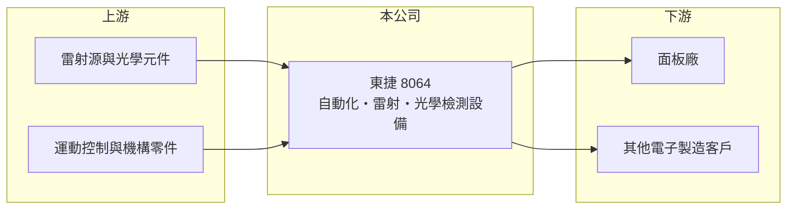

# 8064 東捷

> 上櫃｜[[產業索引-光電業|光電業]]｜上市（櫃）日期 2006/09/25

# 第一章：企業模式與商業藍圖

> [!info] 撰寫說明
> 精簡版，由 Claude 依公開資料整理，架構比照 [[2330台積電]]，資料截至 2026-10-07。來源：nstock.tw 東捷公司概況、winvest.tw 營收快訊。公開資料有限，產品別營收比重與主要客戶未查到。#待校對

東捷是位於南部科學園區的設備商，提供製程自動化、雷射應用與光學檢測設備。

- **核心業務：** 東捷成立於 1998 年，2003 年遷入南科，2006 年上櫃，主要製造與銷售[[自動化設備]]、[[雷射加工]]設備與[[AOI]]光學檢測設備。
- **營收結構：** 本次未查到產品或客戶別比重；2025 年全年營收 28.71 億元。
- **營運據點：** 公司設於台南南部科學園區，海外據點本次未查到。
- **長期方向：** 資料庫將其歸類為光電股，過去以顯示產業設備為主（推估）；市值遠高於營收規模，市場可能期待雷射與檢測技術延伸到新應用（推估）。

# 第二章：護城河深度與競爭優勢

設備商的護城河在於製程技術累積與客戶產線驗證。

- **競爭優勢：** 同時具備自動化、雷射與光學檢測三種能力，可提供整合型設備，而設備一旦通過客戶產線驗證，後續汰換門檻較高。
- **主要對手：** 國內外自動化與雷射設備商，具體對手本次未查到；資料庫列出的同業 [[3481群創]]、[[2409友達]]、[[6116彩晶]] 實際上較接近客戶群而非對手（推估）。
- **觀察重點：** 新應用接單進度、月營收是否回穩，以及市值與獲利之間的落差能否被業績填補。

# 第三章：財務體質與盈利規模

資料日期：2026-10-07，以下數字是撰寫當時的快照；最新月營收、毛利率、累計 EPS 由自動排程寫在本筆記的屬性欄位（月營收、毛利率、累計EPS 等）。#待校對

東捷 2026 年營收與去年同期接近持平，但獲利明顯下滑。

- **營收規模：** 2026 年 6 月營收 2.05 億元、年增 15.95%；8 月 1.46 億元、年減 43.5%；1 至 8 月累計 15.17 億元，年減 0.91%。2025 年全年營收 28.71 億元。
- **獲利：** 2025 年全年 EPS 1.36 元；2026 年第二季 EPS 0.18 元，季減 48.57%；[[毛利率]] 30.7%，[[營業利益率]] 6.24%。
- **財務特色：** 資本額約 18.48 億元，市值約 250.43 億元，股價淨值與本益比相對獲利偏高（推估）；近五年平均現金股利 1.01 元。

# 第四章：總體風險與地緣政治

東捷的風險在於設備業的接單循環，以及市場預期與實際獲利的落差。

- **產業週期：** 設備需求取決於客戶的[[CapEx]]，面板或其他客戶產業縮減投資時，訂單會明顯減少。
- **營運風險：** 設備認列集中在交機與驗收時點，月營收波動大；新應用若驗證延後，營收貢獻也會遞延。
- **其他風險：** 市值高度反映題材，若新事業進度不如預期，股價修正風險大；另有匯率與關鍵零組件供應風險。

# 專有名詞解析

## 半導體

- **[[AOI]]**：自動光學檢測，用相機拍攝產品並以影像演算法自動找出瑕疵，取代人工目檢。

## 金融

- **[[CapEx]]**：資本支出，企業購買土地、廠房與設備的支出。

## 產業

- **[[自動化設備]]**：在產線上自動搬運、組裝或加工的機台，可降低人力並提高良率。
- **[[雷射加工]]**：以高能量雷射光切割、鑽孔、剝離或標記材料，常用於面板與半導體製程。

# 核心供應鏈

- 上游：雷射源與光學元件、運動控制與機構零件供應商（推估）
- 下游／客戶：面板廠與其他電子製造客戶（推估），如 [[3481群創]]、[[2409友達]] 等面板業者
- 同業：國內外自動化、雷射與檢測設備商，名稱未查到

## 最新新聞
<!-- news:start -->
<!-- news:end -->

## 相關連結
- [公開資訊觀測站](https://mopsov.twse.com.tw/mops/web/t05st03?step=1&firstin=1&co_id=8064)
- [Goodinfo](https://goodinfo.tw/tw/StockDetail.asp?STOCK_ID=8064)
- [Yahoo 股市](https://tw.stock.yahoo.com/quote/8064)
- [鉅亨網新聞](https://www.cnyes.com/twstock/8064/news)
