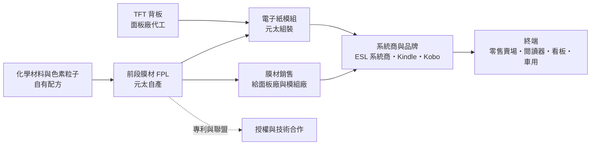
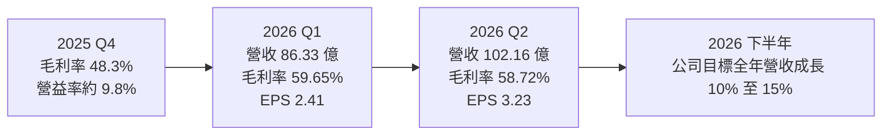
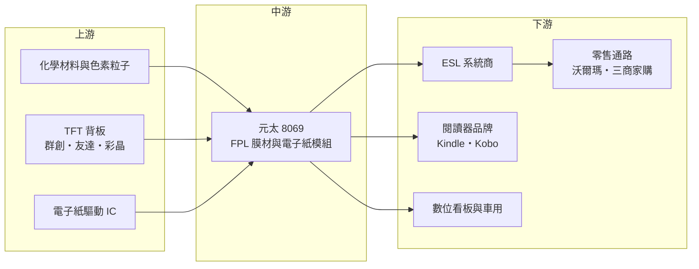

# 8069 元太

> 上櫃｜[[產業索引-光電業|光電業]]｜上市（櫃）日期 2004/03/30

# 第一章：企業模式與商業藍圖

> [!info] 撰寫說明
> 本文由 Claude 依公開資料整理，架構比照 [[2330台積電]] 的四章研究，資料截至 2026-10-07。財務數字來源：科技新報（元太 2026 年第一季與第二季法說會報導、2026 年 5 月股價報導）、旺得富／工商時報（2026 年 8 月財報與 10 月投顧報告）、優分析（2025 年財報分析與 2026 年下修營收目標報導）、nstock 公司資料；產業描述為整理性內容，尚未逐條比對原始文件。#待校對

在評估單一個股的長期投資價值時，首要步驟是拆解企業的底層獲利邏輯。本章針對元太科技（股票代號：8069，以下簡稱元太）的商業模式進行定性分析，說明一家以[[電子紙]]技術獨占全球市場的公司，如何把零售標籤、閱讀器與看板串成一條高毛利的價值鏈。

## 一、核心定位：全球最大的電子紙膜材與模組供應商

元太於 1992 年 6 月在新竹科學園區設立，原本是生產 TFT-LCD 面板的廠商，後來轉型專注電子紙。2009 年收購美國 E Ink Corporation、2012 年再收購 SiPix，取得[[電泳顯示]]的核心專利與材料技術，品牌也統一使用「E Ink」。目前資本額約 115.64 億元，是全球最大的電子紙製造商。

元太的定位有兩個關鍵：

* **掌握最上游的電子紙膜材：** 電子紙的核心是內含帶電色素粒子的「前段膜材」（Front Plane Laminate，[[FPL]]），元太自己生產這層膜材，再搭配 [[TFT背板]]組成模組，或把膜材賣給面板廠加工。全球主要電子紙產品幾乎都使用 E Ink 的膜材，形成高度集中的市場結構。
* **技術授權與平台化：** 元太建立電子紙產業聯盟，與面板廠、驅動 IC 廠、系統商合作開發產品，自己專注在膜材、色彩技術與模組設計。

## 二、終端應用／產品板塊：IoT 成為主引擎，消費性電子轉弱

元太公司把業務分成兩大類：消費性電子（CE）與物聯網（IoT）。各板塊的精確營收比重在本次查到的資料中未揭露，因此不畫圓餅圖，改以定性說明。

* **[[ESL]]（電子貨架標籤）：** 屬於 IoT 板塊，是近年最大的成長來源。2025 年出貨量約 5 億片，公司預估 2026 年超過 6 億片、成長 20% 以上。美國最大零售商沃爾瑪預計 2026 年底完成美國門市部署，墨西哥賣場與美國前十大零售商開始導入，英國零售商也陸續裝設；在台灣，三商家購全台超過 800 家門市導入近 300 萬片標籤。
* **數位看板（[[Signage]]）：** 同屬 IoT，用於零售廣告、交通站牌與戶外資訊。8 至 15 吋看板訂單已達百萬級規模，32 吋產品則不如預期；75 吋全彩電子紙看板號稱可比傳統看板節電超過 98%。
* **電子閱讀器與電子筆記本：** 屬於 CE 板塊，客戶包括 Amazon Kindle 與樂天 Kobo 等品牌。彩色電子紙（[[Kaleido]] 3）帶動產品升級，平均售價提高。但 2026 年記憶體價格大漲，壓縮閱讀器與筆記本的終端需求，公司預估 CE 業務下半年將出現雙位數衰退。
* **新應用：** BMW iX3 Flow Edition 概念車採用 E Ink Prism 電子紙做為車身外觀，並通過車規等級驗證，顯示電子紙開始進入車用與建築材料領域。

## 三、資本轉化邏輯（營運模式）：膜材獨占帶來的高毛利

* **高[[毛利率]]的來源：** 電子紙膜材技術門檻高、競爭者少，元太 2026 年上半年毛利率 59.15%，第一季更達 59.65%，接近 60%，遠高於一般面板與零組件廠。
* **營運槓桿：** 研發與管銷費用相對固定，營收增加時營業利益率擴張很快；反之，2025 年第四季營收季減 32.6%，毛利率降到 48.3%、營業利益率只剩約 9.8%，顯示產能閒置時固定成本的衝擊也很大。
* **季節性：** ESL 屬於專案型需求，常見「採購、安裝、暫停、重啟」的節奏，營收季度波動明顯。

## 四、企業長期藍圖：大尺寸、彩色化與新產線

* **新產線：** 第五條產線（H5）2026 年量產，良率改善讓各產品線的獲利同步提升；第六條產線（H6）預計 2027 年投產，目標是更大尺寸的電子紙。
* **觀音新廠：** 在桃園觀音投資興建新廠，強化大尺寸電子紙的製造能量。
* **[[CapEx]]：** 2026 年資本支出規劃 80 億元以上，是近年最高水準。
* **應用拓展：** 從 ESL 延伸到大尺寸看板、交通號誌、車用外觀與建材，讓營收來源從消費性電子轉向更穩定的企業與公共基礎設施需求。

# 第二章：護城河深度與競爭優勢

在長期價值投資中，「護城河」指企業抵禦競爭、維持超額利潤的保護機制。本章分析元太的護城河構成、主要競爭對手，以及這些優勢在顯示技術競爭中能守住多少。

## 一、元太護城河的核心組成要素

元太的護城河屬於「寬護城河」，主要由三項要素組成：

* **1. 專利與材料配方：** 透過收購 E Ink Corporation 與 SiPix，元太掌握電泳式電子紙的大量專利，以及色素粒子、微膠囊與膜材的配方。這些是化學與材料工程的累積，不是買設備就能複製。
* **2. 規模與生態系：** 電子紙產品需要搭配專用驅動 IC、波形演算法（控制粒子移動的電壓時序）與系統整合。元太與面板廠、驅動 IC 廠、ESL 系統商共同建立產業聯盟，新進者即使做出膜材，也要重新建立整套生態系。
* **3. 客戶轉換成本：** 大型零售商一次部署數百萬片標籤，系統、軟體與維修流程都綁定特定規格，中途更換供應商的成本與風險很高。

## 二、全球主要競爭對手格局

| 對手 | 定位 | 對元太的威脅 |
|---|---|---|
| [[3481群創]]、[[2409友達]]、[[6116彩晶]] | LCD 面板廠，也是電子紙 TFT 背板夥伴 | 以低功耗 LCD 或其他顯示技術競爭看板市場，同時是元太的合作夥伴 |
| 中國電子紙膜材新進者 | 政策扶植、主攻 ESL 與中低階應用 | 若技術成熟，可能以低價搶中國本土 ESL 市場（推估） |
| LCD 與 LED 數位看板 | 傳統數位看板方案 | 在動態影像與色彩表現上仍優於電子紙 |
| 紙本標籤與看板 | 零售業現行方案 | 歐洲零售媒體看板約九成仍為紙張，是替代對象也是阻力 |

群創、友達、彩晶被 nstock 列為元太的競爭業者，但實務上它們同時提供 TFT 背板，屬於競合關係。

## 三、優勢轉化：哪些市場守得住、哪些守不住

* **守得住：** ESL 與中小尺寸看板。這些應用重視低耗電、可在陽光下閱讀與長時間不需充電，電子紙的優勢明顯，元太的膜材幾乎沒有替代品。
* **守不住或成長受限：** 消費性電子閱讀器與筆記本。這是成熟市場，需求受記憶體成本與消費景氣影響，2026 年 8 月公司已把全年營收成長目標由 20% 至 25% 下修到 10% 至 15%，主因就是 CE 業務轉弱。
* **觀察重點：** ESL 新零售商的導入速度、8 至 15 吋看板能否複製 ESL 的規模化路徑、H5 與 H6 產線的良率與利用率，以及 32 吋以上大尺寸看板能否找到具經濟規模的應用。

# 第三章：財務體質與盈利規模

資料日期：2026-10-07。數字取自科技新報、工商時報與優分析整理的法說會資料，表格是撰寫當時的快照；最新月營收、毛利率、累計 EPS 由自動排程寫在本筆記的屬性欄位（月營收、毛利率、累計EPS 等）。#待校對

財務報表是檢驗護城河是否真實存在的最終標準。本章用三率、ROE、現金流與資本報酬，檢視元太高毛利結構的穩定度。

## 一、獲利能力的基石：三率

| 項目 | 2025 全年 | 2025 Q4 | 2026 Q1 | 2026 Q2 | 2026 上半年 |
|---|---|---|---|---|---|
| 營收（新台幣） | 361.16 億 | 未查得 | 86.33 億 | 102.16 億 | 188.49 億 |
| [[毛利率]] | 未查得 | 48.3% | 59.65% | 58.72% | 59.15% |
| [[營業利益率]] | 約 29.6%（推算） | 約 9.8% | 32.6% | 34.67% | 33.72% |
| 稅後淨利 | 105.15 億 | 未查得 | 27.8 億 | 37.33 億 | 65.17 億 |
| EPS（元） | 9.14 | 未查得 | 2.41 | 3.23 | 5.65 |

2025 年營業利益率以營業利益 106.74 億元除以營收 361.16 億元推算。

* **營收：** 2025 年營收 361.16 億元，年增 12.28%，為歷史次高；營業利益 106.74 億元、年增 40%，淨利 105.15 億元與 EPS 9.14 元皆創新高。
* **[[毛利率]]：** 2026 年上半年 59.15%，比去年同期增加 2.35 個百分點，反映 H5 產線良率改善與產品組合優化。
* **[[營業利益率]]：** 第二季 34.67%，比去年同期減少 4.88 個百分點，主要因營收年減約 4% 而費用持平。
* **業外：** 第二季淨利年增 25.6%，高於營業利益的年減 16%，差異來自匯兌利益等業外收入，屬於非經常性成分。
* **外部預估：** 工商時報 2026 年 10 月引述投顧報告，預估 2026 年 EPS 10.95 元、2027 年 12.88 元，屬券商推估。

## 二、[[ROE]]：資本效率

元太的高毛利率與高營業利益率，使其在獲利年度的 ROE 表現良好，但具體 ROE 數值本次未查得。以 2025 年淨利 105.15 億元對照資本額 115.64 億元，每股盈餘約 9 元，推估 ROE 落在雙位數區間（推估）。元太近五年平均現金股利約 4.61 元，依 nstock 資料，最新公告的現金股利為 5.89 元（對應期間與口徑請以公司公告為準）。

## 三、資本支出與[[自由現金流]]

* **[[CapEx]]：** 2026 年規劃 80 億元以上，用於 H5、H6 新產線與觀音新廠，金額約為 2025 年淨利的四分之三。
* **自由現金流：** 過去元太資本支出較低，自由現金流充沛；2026 至 2027 年進入擴產期，自由現金流將明顯縮小（推估）。新產能若因大尺寸需求不如預期而閒置，折舊會壓抑毛利率。

## 四、[[ROIC]] 與 [[WACC]]：價值創造利差

元太的投入資本主要是膜材與模組產線，高毛利率使 ROIC 在正常年度明顯高於資金成本（推估，具體數值未查得）。這波擴產是否創造價值，取決於新增產能能否維持接近 60% 的毛利率。如果大尺寸看板與 ESL 需求如預期成長，ROIC 與 WACC 的利差能維持；若擴產遇上需求放緩，如 2025 年第四季那樣的低利用率會使報酬率快速下滑。

# 第四章：總體風險與地緣政治

任何企業都無法脫離宏觀環境獨立存在。本章分析元太未來必須面對的地緣政治、產業週期、營運與技術風險。

## 一、地緣政治風險

* **美國關稅與客戶提前拉貨：** 2025 年第二季客戶趁關稅豁免期提前下單，第四季隨即進入庫存調整，顯示關稅政策會放大營收的季度波動。
* **中國競爭與供應鏈：** 部分模組與系統商在中國生產，美中貿易摩擦可能影響供應鏈布局；中國政府也可能扶植本土電子紙材料業者，壓縮元太在中國 ESL 市場的空間（推估）。
* **台灣集中風險：** 膜材主要產能與新廠都在台灣，面臨與其他台灣製造業相同的兩岸風險。

## 二、產業週期與市場結構風險

* **專案型需求的週期：** ESL 的需求取決於大型零售商的部署計畫，常見「採購、安裝、暫停、重啟」的節奏，一家大客戶完成部署後，營收可能出現斷層。
* **消費性電子週期：** 閱讀器與筆記本受記憶體成本與消費景氣影響，2026 年 CE 業務預估年減約 13%（投顧推估）。這類需求在供應鏈中容易出現[[長鞭效應]]。
* **匯率：** 營收以美元計價為主，新台幣升值會影響毛利率；近期業外的匯兌利益也可能反轉為損失。

## 三、營運環境的隱性風險

* **客戶集中：** 閱讀器市場由少數品牌主導，ESL 也集中在少數系統商與大型零售商，個別客戶的策略變化對營收影響大。
* **新產線執行：** H5、H6 與觀音新廠同時推進，若良率或大尺寸需求不如預期，將出現折舊大於貢獻的情況。
* **估值與預期：** 2026 年 10 月有投顧把目標價由 153 元調降至 142 元，反映市場對成長放緩的修正。

## 四、科技或法規演進風險

* **替代顯示技術：** 低功耗 LCD、反射式 LCD 或 [[Micro LED]] 若在耗電與成本上大幅改善，可能侵蝕電子紙在看板與標籤的優勢。
* **彩色化與刷新速度：** 電子紙在色彩飽和度與刷新速度上仍不如 LCD，若彩色技術進步不夠快，難以打入動態廣告市場。
* **專利到期：** 早期核心專利陸續到期後，新進者的進入障礙會降低，元太需要靠新一代彩色與大尺寸技術維持領先。
* **環保法規：** 歐洲推動減少紙張與節能，對電子紙有利；ESL 與看板的減碳效益（如三商家購案例年減碳排約 7,000 公噸）是元太的行銷利基。

# 專有名詞解析

## 應用

- **[[ESL]]**：電子貨架標籤，以電子紙取代紙本價格標籤，零售商可透過無線網路即時更新價格。
- **[[Signage]]**：數位看板，用於零售廣告、交通站牌、戶外資訊的顯示裝置，電子紙版本耗電遠低於 LCD 看板。

## 金融

- **[[毛利率]]**：毛利除以營收，代表產品扣除直接成本後的獲利空間。
- **[[營業利益率]]**：營業利益除以營收，反映本業扣除研發、管銷費用後的獲利能力。
- **[[CapEx]]**：資本支出，企業購置廠房、設備等長期資產的支出。
- **[[自由現金流]]**：營業活動現金流減去資本支出，代表企業可自由用於配息、還債或併購的現金。
- **[[長鞭效應]]**：終端需求的小幅變動，沿供應鏈往上游傳遞時被逐級放大，造成上游庫存與訂單劇烈波動。

## 產業

- **[[電子紙]]**：利用帶電色素粒子反射環境光來顯示的技術，只有更新畫面時耗電，畫面靜止時幾乎不耗電。
- **[[電泳顯示]]**：在液體中以電場推動帶電粒子移動來改變顏色的顯示方式，是電子紙最主要的技術原理。
- **[[FPL]]**：前段膜材，內含電子紙色素粒子的薄膜，是電子紙最核心的材料，由元太自行生產。
- **[[Kaleido]]**：E Ink 的彩色電子紙技術，在黑白電子紙上加彩色濾光層，用於彩色閱讀器。
- **[[Micro LED]]**：以微米等級 LED 直接構成像素的顯示技術，亮度與壽命佳但成本仍高。
- **[[TFT背板]]**：薄膜電晶體陣列基板，負責控制每個像素的電壓，電子紙與 LCD 都需要。

# 核心供應鏈

## 1. 上游：材料、背板與驅動 IC
- TFT 背板夥伴：[[3481群創]]、[[2409友達]]、[[6116彩晶]]
- 電子紙驅動 IC 與控制晶片：多家 IC 設計公司（個別名稱未查得）

## 2. 中游：元太本身
- 前段膜材 FPL 與電子紙模組：元太（含 E Ink Corporation、SiPix）

## 3. 下游：系統商與品牌客戶
- 電子閱讀器：[[AMZN亞馬遜]]（Kindle）、樂天 Kobo
- ESL 系統商：國際電子貨架標籤系統商（個別名稱未查得）
- 零售通路：沃爾瑪、三商家購等
- 車用與建材：BMW 概念車採用 E Ink Prism

## 最新新聞
<!-- news:start（自動產生，請勿手動編輯此範圍） -->
- 2026-10-06 🏛️ 重訊 17:03｜代重要子公司E Ink Corporation公告董事異動｜[觀測站](https://mops.twse.com.tw/mops/#/web/t05st01)

完整紀錄：[[8069元太 新聞]]
<!-- news:end -->

## 相關連結
- [公開資訊觀測站](https://mopsov.twse.com.tw/mops/web/t05st03?step=1&firstin=1&co_id=8069)
- [Goodinfo](https://goodinfo.tw/tw/StockDetail.asp?STOCK_ID=8069)
- [Yahoo 股市](https://tw.stock.yahoo.com/quote/8069)
- [鉅亨網新聞](https://www.cnyes.com/twstock/8069/news)
