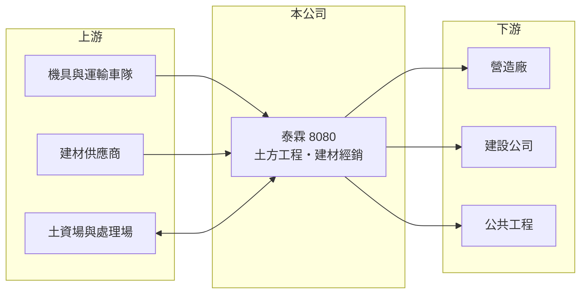

# 8080 泰霖

> 上櫃｜[[產業索引-建材營造業|建材營造業]]｜上市（櫃）日期 2021/04/07

# 第一章：企業模式與商業藍圖

> [!info] 撰寫說明
> 精簡版，由 Claude 依公開資料整理，架構比照 [[2330台積電]]，資料截至 2026-10-08。來源：櫃買中心開放資料（基本資料、資產負債、綜合損益、每月營收）、Goodinfo 年度經營績效、富邦 e 點通（MoneyDJ）公司基本資料。公開資料有限，主要工程案、客戶與公司沿革未查得。#待校對

本章說明泰霖（8080）以土方工程為主、建材經銷為輔的營建服務模式。

- **核心業務：** 泰霖事業成立於 1993 年，2004 年上櫃，董事長劉東嶽，實收資本額約 6.7 億元。依 MoneyDJ 2025 年營收比重，[[土方工程]]占 87.5%，建材經銷占 12.5%。土方工程是營建工程的前段工序，包括基地開挖、土石方運輸與處理，客戶通常是營造廠與建設公司。
- **營收結構：** 近年營收規模只有 1.6 至 4.5 億元，屬於規模很小的工程服務公司。土方工程按工程進度認列收入，營收會隨承接案件的多寡與工期大幅波動，2026 年 1 至 8 月累計營收約 0.63 億元，較前一年同期明顯減少。
- **資本結構變動：** 依 Goodinfo 資料，2021 年底每股淨值只有 0.44 元，2022 年回升到 8.02 元，當年 EPS 7.23 元，推估公司在這段期間經歷大額一次性收益與增資等資本重整（具體交易內容未查得）。這代表目前的泰霖與十年前的公司在業務與股東結構上可能已有很大差異。
- **長期方向：** 土方工程受惠於都市更新、公共建設與廠房興建帶來的開挖需求，但也面對土資場容量、運輸法規與環保要求日益嚴格的限制。泰霖的長期課題，是能否建立穩定的工程來源與處理場地，讓營收不再大起大落。

# 第二章：護城河深度與競爭優勢

本章分析泰霖在土方工程產業的競爭條件。

- **競爭優勢：** 土方工程的關鍵資源是合法的[[土資場]]與運輸車隊，能否取得土石方的去處，往往決定能否承接大型開挖案。泰霖若握有穩定的處理管道，就能在地區性市場取得一定地位，但公開資料未揭露其場地與車隊規模，優勢程度難以評估。
- **主要對手：** 土方工程市場高度分散，多為未上市的地區性工程行與營造廠自有團隊；建材經銷則面對大量中小型盤商。上市櫃公司中，營造廠如 [[2597潤弘]]、[[2539櫻花建]] 等多半把土方外包，是潛在客戶而非直接對手。
- **觀察重點：** 第一是營業利益率能否穩定為正，2023 至 2025 年在 -1.4% 至 2.5% 之間徘徊。第二是工程案源是否集中在少數客戶。第三是 2022 年資本重整後，大股東對公司未來業務方向的規劃。

# 第三章：財務體質與盈利規模

資料日期：2026-10-08，表格是撰寫當時的快照；最新月營收、毛利率、累計 EPS 由自動排程寫在本筆記的屬性欄位（月營收、毛利率、累計EPS 等）。#待校對

本章用多年度數字檢視泰霖的獲利能力與資本結構。

| 年度 | 營收（新台幣） | [[毛利率]] | [[營業利益率]] | EPS（元） | [[ROE]] |
|---|---|---|---|---|---|
| 2021 | 3.14 億 | 20.1% | 1.14% | -1.21 | -237%（淨值極低） |
| 2022 | 4.45 億 | 15.9% | 5.58% | 7.23 | 170%（淨值極低） |
| 2023 | 1.90 億 | 16.4% | 1.82% | 0.27 | 3.42% |
| 2024 | 1.61 億 | 14.2% | -1.44% | -0.48 | -5.48% |
| 2025 | 1.98 億 | 21.6% | 2.48% | 0.12 | 1.46% |

- **營收規模：** 營收從 2022 年的 4.45 億元回落到 2023 至 2025 年的 2 億元上下，規模小且波動大。依櫃買中心資料，2026 年上半年營收約 0.46 億元、每股虧損 0.03 元。
- **獲利：** 毛利率在 14% 至 22% 之間，但營業費用吃掉大部分毛利，營業利益率長期在 0 附近。2021 與 2022 年的 ROE 因淨值極低而失真，近五年平均 ROE 不具參考意義；2023 至 2025 年平均約 -0.2%（推算）。
- **財務特色：** 2026 年第二季歸屬母公司權益約 5.5 億元，每股淨值 8.24 元，總負債約 5.9 億元（流動 5.2 億、非流動 0.7 億），MoneyDJ 所列負債比例約 51%。近年未發放現金股利。
- **[[ROIC]] 與 [[WACC]]：** 2025 年營業利益約 490 萬元（1.98 億 × 2.48%），稅後約 390 萬元；投入資本以股東權益 5.5 億元加上假設的有息負債約 2.9 億元（總負債一半，實際數字未查得），約 8.4 億元，ROIC 約 0.5%（推算）。WACC 以 CAPM 推估：無風險利率 1.75%、市場風險溢酬 6%，MoneyDJ 的 β 為 0.26 不具代表性，改用小型營建股常見值 1.0，股東權益成本約 7.75%；負債成本 2.5%、稅後約 2.0%；股權權重約 66%，WACC 約 5.8%（推算）。ROIC 遠低於 WACC，代表目前的本業規模不足以涵蓋資金成本。

# 第四章：總體風險與地緣政治

本章整理泰霖長期必須面對的風險。

- **產業週期：** 土方工程需求跟著營建開工量走，房市與公共工程景氣轉弱時，開挖案件會同步減少。泰霖規模小，缺乏其他業務緩衝，景氣循環對營收的影響更直接。
- **營運風險：** 工程收入依案件認列，少數大案就可能決定全年營收；土石方運輸涉及車輛調度與工安，意外或違規可能帶來罰款與停工。公司規模小，管理層與大股東的策略變動對營運影響很大。
- **其他風險：** 土資場的設置與營運受地方政府嚴格管制，環保法規趨嚴會提高處理成本；油價與運輸成本上升會壓縮毛利；建材經銷則面對價格波動與應收帳款風險。

# 專有名詞解析

## 金融

- **[[ROIC]]**：投入資本報酬率，稅後營業利益除以投入資本，衡量本業運用資金創造報酬的能力。
- **[[WACC]]**：加權平均資金成本，股東與債權人要求報酬率的加權平均，ROIC 高於 WACC 才代表創造價值。

## 產業

- **[[土方工程]]**：營建前段的基地開挖、土石方運輸與回填工程，是建案與公共工程的第一道工序。
- **[[土資場]]**：營建剩餘土石方資源堆置處理場，處理建築工程挖出的土石，需地方政府許可。

# 核心供應鏈

- 上游：開挖機具、砂石車等運輸車隊，經銷的建材供應商，以及土石方去處的土資場（實際合作對象未查得）。
- 下游／客戶：營造廠、建設公司與公共工程主辦單位（實際客戶未查得）。
- 同業：地區性土方工程行與營造廠自有土方團隊，多數未上市。

## 最新新聞
<!-- news:start -->
<!-- news:end -->

## 相關連結
- [公開資訊觀測站](https://mopsov.twse.com.tw/mops/web/t05st03?step=1&firstin=1&co_id=8080)
- [Goodinfo](https://goodinfo.tw/tw/StockDetail.asp?STOCK_ID=8080)
- [Yahoo 股市](https://tw.stock.yahoo.com/quote/8080)
- [鉅亨網新聞](https://www.cnyes.com/twstock/8080/news)
