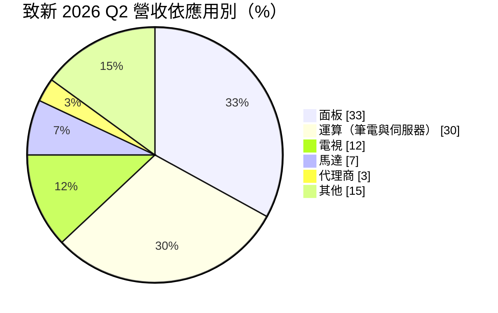
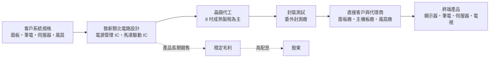
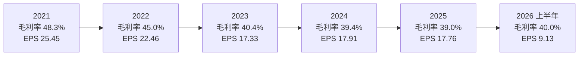
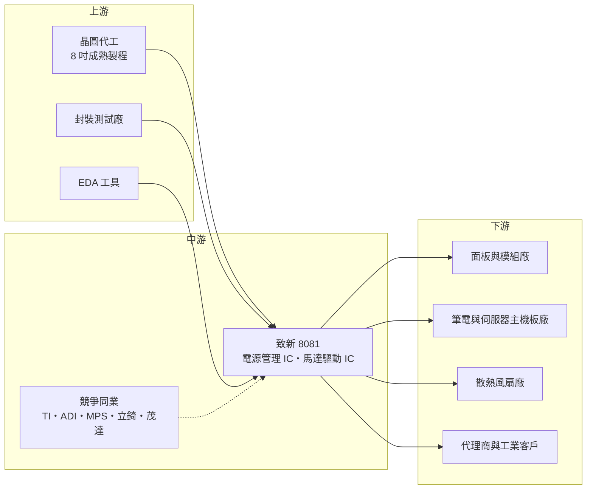

# 8081 致新

> 上市｜[[產業索引-半導體業|半導體業]]｜上市（櫃）日期 2008/12/30

# 第一章：企業模式與商業藍圖

> [!info] 撰寫說明
> 本文由 Claude 依公開資料整理，架構比照 [[2330台積電]] 的四章研究，資料截至 2026-10-08。財務數字來源：證交所開放資料（基本資料、綜合損益、資產負債、營益分析、股利）、Goodinfo 台灣股市資訊網年度經營績效、富果研究 2026 年 2 月與 8 月法說會整理、經濟日報、nStock；產業描述為整理性內容，尚未逐條比對原始文件。#待校對

在評估單一個股的長期投資價值時，首要步驟是拆解企業的底層獲利邏輯。本章針對致新科技（股票代號：8081，以下簡稱致新）的商業模式進行定性分析，說明一家台灣類比 IC 設計公司如何在德州儀器、亞德諾等國際巨頭主導的電源管理市場中，靠利基產品與高配息建立長期地位。

## 一、核心定位：專注類比電源管理的利基型 IC 設計公司

致新成立於 1996 年，設立於新竹科學園區，2008 年在證交所上市，董事長為吳錦川。公司屬於 [[Fabless]] 模式，專門設計「數位與類比混合」的積體電路，核心產品是[[電源管理IC]]與[[馬達驅動IC]]。電源管理 IC 的工作是把電池或電源供應器提供的電壓，轉換成晶片、面板、記憶體各自需要的精確電壓，幾乎每一台電子產品都需要好幾顆；馬達驅動 IC 則用來控制散熱風扇等小型馬達的轉速。

[[類比IC]]和數位晶片最大的差別在於，它的價值不在製程微縮，而在電路設計經驗與可靠度。一顆電源管理 IC 往往在市場上銷售五年、十年以上，客戶在乎的是穩定、省電與不出錯。這讓類比 IC 公司的產品生命週期遠長於數位晶片，也讓設計經驗的累積成為核心資產。

致新的策略定位很清楚：不和德州儀器（TI）、亞德諾（ADI）這類國際大廠正面比拚完整產品線，而是挑選大廠因毛利考量退出、或不願投入客製化的利基市場，例如面板用電源、筆電與伺服器的特定電源規格、散熱風扇馬達驅動等。依 2026 年 2 月法說會說法，公司刻意聚焦技術門檻較高的產品，以避開與中國同業的低階價格戰。

## 二、終端應用板塊：面板與運算為兩大支柱

依富果研究整理的 2026 年第二季法說會資料，致新營收依應用別分布如下：

* **面板（約 33%）：** 用於液晶面板的電源管理 IC，提供面板驅動電路所需的多組電壓。這是致新長期的核心市場，客戶是面板廠與模組廠。
* **運算（約 30%）：** 筆電與伺服器主機板上的電源 IC，包含供應處理器周邊、記憶體與各種介面晶片的電源轉換。公司正在開發的 [[DDR5]] 記憶體模組電源管理 IC（[[PMIC]]）也屬於這一塊。
* **電視（約 12%）：** 電視主機板與面板的電源 IC，比重隨電視市場淡旺季波動。
* **馬達（約 7%）：** 主要是散熱風扇的馬達驅動 IC。AI 伺服器的散熱需求提高，讓這塊業務有結構性成長空間。
* **代理商與其他（約 18%）：** 透過代理商銷售給中小客戶，以及工業、車用等其他應用。

和 2025 年第四季相比（面板 36%、運算 28%、電視 17%、馬達 5%），面板與電視比重下降、馬達與其他應用上升，反映公司正逐步把產品組合往非消費性領域移動。

## 三、資本轉化邏輯：以設計經驗換取長生命週期產品

致新的獲利模式有三個特點。第一，產品一旦被客戶設計進板子，通常會跟著該平台銷售多年，客戶沒有強烈動機更換已經驗證過的電源晶片，因此營收的基本盤相對穩定。第二，類比 IC 主要使用 8 吋與成熟製程，晶圓成本不高，但產能取得是關鍵；2026 年 8 月法說會上，公司直言晶圓產能已經是最重要的限制，重要性超過成本與售價。第三，公司不需要建廠，資本支出低，大部分獲利可以用現金股利發還股東。

在產能受限的環境下，致新的經營重點在 2026 年從「衝刺營業額」轉為「提升產品組合價值」，也就是把有限的晶圓產能優先分配給毛利率較高、技術含量較高的產品，提高每片晶圓創造的產值。這種做法讓毛利率在 2023 至 2026 年間維持在 38% 至 40% 左右的穩定區間。

## 四、企業長期藍圖：從消費性走向伺服器、車用與工業

* **伺服器與 AI 散熱：** 公司在 2026 年 2 月法說會指出，即使伺服器改用水冷，水泵本身也是馬達，熱交換器仍需風扇散熱，因此馬達驅動 IC 的需求會隨 AI 伺服器增加。伺服器主機板的電源需求也同步成長。
* **DDR5 PMIC：** DDR5 記憶體把電源管理晶片移到記憶體模組上，每條模組都需要一顆 PMIC。公司表示這個市場目前主要由外商占據，致新市占率仍低，是未來的重點開發項目。
* **車用與工業：** 公司把研發重心轉向車用、工業與伺服器等非消費性領域。法說會坦言這些市場導入速度較慢，但一旦切入，帶來的成長更穩定、更長期，也能拉開與中國同業的技術差距。
* **持續增加研發投入：** 在晶圓產能有限的情況下，公司持續增加研發人力與經費，用新產品與新客戶提升每片晶圓的價值，而不是追求出貨量。

整體而言，致新的長期藍圖不是靠規模擴張，而是靠產品組合升級，從以面板與電視為主的消費性電源公司，逐步轉型為涵蓋伺服器、車用與工業的類比 IC 供應商。

# 第二章：護城河深度與競爭優勢

在長期價值投資中，「護城河」指企業抵禦競爭、維持超額利潤的保護機制。本章分析致新的護城河構成、全球主要競爭對手，以及這些優勢在國際大廠與中國同業夾擊下能守住多少。

## 一、致新護城河的核心組成要素

* **1. 類比設計經驗的累積：** 類比電路設計高度依賴工程師的經驗，涉及雜訊、溫度、效率與可靠度的取捨，無法像數位電路一樣靠自動化工具快速完成。致新累積近三十年的產品與客戶經驗，這種「做過很多次、知道哪裡會出錯」的知識，是新進者短期內難以複製的。
* **2. 設計導入後的轉換成本：** 電源 IC 一旦被設計進面板或主機板，更換供應商就必須重新驗證整個系統的穩定性。對客戶來說，一顆電源 IC 只占產品成本的一小部分，但出問題時的代價很高，因此只要供應穩定、品質良好，客戶很少主動更換。
* **3. 利基市場的選擇：** 致新刻意挑選國際大廠因毛利考量退出的市場，例如 TI 不再積極經營的特定產品，以及需要客製化的面板電源。這些市場規模對大廠來說太小，對中國低價廠商來說技術門檻又偏高，讓致新可以維持約 40% 的毛利率。
* **4. 長期穩定的晶圓代工關係：** 在 8 吋產能長期吃緊的環境下，能否拿到晶圓本身就是競爭力。致新與台灣晶圓代工廠有長期合作關係，每年預先談定下一年的產能，這種關係是新進者難以取得的。

## 二、全球主要競爭對手格局

| 對手 | 定位 | 對致新的威脅 |
|---|---|---|
| 德州儀器（TI） | 全球最大類比 IC 廠，自有 12 吋晶圓廠 | 產品線完整、成本優勢大，可整包供應 |
| 亞德諾（ADI） | 高階類比與混合訊號 IC | 在工業與車用高階電源具品牌優勢 |
| 芯源系統（MPS） | 高效能 DC-DC 與伺服器電源 | 在伺服器與 AI 電源市場搶先布局 |
| 立錡（聯發科集團） | 台灣最大電源管理 IC 廠 | 在筆電、手機與消費性電源直接競爭 |
| [[6138茂達]] | 台灣電源管理與馬達驅動 IC 廠 | 筆電電源與風扇馬達驅動高度重疊 |
| [[6719力智]] | 筆電與伺服器電源 IC | 在運算類電源產品競爭 |
| 矽力杰等中國電源 IC 廠 | 受在地市場支持、價格積極 | 壓低消費性電源 IC 報價 |

## 三、優勢轉化：哪些市場守得住、哪些守不住

* **守得住：** 面板電源與風扇馬達驅動。這兩個市場致新經營多年，客戶關係深、產品經過長期驗證，加上需要客製化，大廠興趣不高、中國廠商又不容易取得面板廠信任。AI 伺服器帶動的散熱需求，讓馬達驅動成為可以長期成長的守成市場。
* **較難守住：** 通用型的消費性電源 IC，例如電視與一般家電用的 DC-DC 轉換器。這類產品技術門檻較低，中國同業可以快速複製並以低價搶單。致新電視比重從 2025 年第四季的 17% 降到 2026 年第二季的 12%，部分也反映公司主動降低對此類產品的依賴。
* **觀察重點：** 第一，DDR5 PMIC 能否從低市占提升到有意義的營收規模，這是致新切入記憶體與伺服器市場的關鍵產品。第二，車用與工業產品的比重能否逐年提升。第三，在晶圓產能受限、同業紛紛漲價的環境下，致新能否把成本上漲轉嫁給客戶，維持 40% 左右的毛利率。

# 第三章：財務體質與盈利規模

資料日期：2026-10-08。數字取自證交所開放資料、Goodinfo 年度經營績效與公司法說會整理，表格是撰寫當時的快照；最新月營收、毛利率、累計 EPS 由自動排程寫在本筆記的屬性欄位（月營收、毛利率、累計EPS 等）。#待校對

財務報表是檢驗護城河是否真實存在的最終標準。本章用三率、[[ROE]]、現金流與資本報酬，檢視致新在消費性電子景氣循環中的獲利品質。

## 一、獲利能力的基石：三率

| 年度 | 營收（億元） | [[毛利率]] | [[營業利益率]] | EPS（元） | [[ROE]] |
|---|---|---|---|---|---|
| 2020 | 74.1 | 37.8% | 18.3% | 12.24 | 21.7% |
| 2021 | 94.2 | 48.3% | 29.7% | 25.45 | 38.0% |
| 2022 | 84.2 | 45.0% | 25.1% | 22.46 | 28.0% |
| 2023 | 79.1 | 40.4% | 20.0% | 17.33 | 19.0% |
| 2024 | 82.5 | 39.4% | 19.2% | 17.91 | 18.0% |
| 2025 | 86.7 | 39.0% | 19.4% | 17.76 | 16.7% |
| 2026 上半年 | 43.49 | 40.0% | 18.9% | 9.13 | 年化約 19%（推算） |

註：2020 至 2025 年取自 Goodinfo 年度經營績效（合併報表）；2026 上半年取自證交所綜合損益與營益分析開放資料。2026 上半年 ROE 以 EPS 乘以扣除庫藏股後的流通股數推算歸屬母公司淨利約 7.8 億元，除以 2026 年第二季底歸屬母公司權益 81.2 億元，再乘以 2 年化。

* **[[毛利率]]極為穩定：** 除了 2021 至 2022 年晶片短缺帶來的漲價高峰，致新的毛利率在 2020 年與 2023 至 2026 年都落在 38% 至 40% 之間。這種穩定度在台灣 IC 設計公司中相當少見，代表公司的產品定價權與成本控制都很成熟，也反映利基市場策略的效果。
* **[[營業利益率]]長期約兩成：** 2023 年以來營業利益率穩定在 19% 至 20%，代表研發與管理費用的比例控制得宜。2021 年的 29.7% 屬於景氣高峰，不宜視為常態。
* **業外收益占比不低：** 2026 年上半年稅前純益率 21.0% 高於營業利益率 18.9%，業外收益（利息、投資與匯兌）有一定貢獻。公司在 2026 年 8 月法說會提到，因業外收支占比較高，依規定無法提供量化財測。評估本業時應以營業利益為準。

## 二、[[ROE]]：資本效率

以 2021 至 2025 年計算，致新近五年平均 ROE 約 23.9%；排除 2021 年高峰後，2022 至 2025 年平均約 20.4%（推算）。ROE 從 38% 逐步降到 16.7%，主要是因為股東權益逐年累積，而營收與獲利在高峰後回到持平。即使如此，在幾乎沒有財務槓桿的情況下仍能維持 15% 以上的 ROE，代表本業的資本報酬相當健康。

營收成長方面，2019 年營收 56.7 億元、2025 年 86.7 億元，六年的年複合成長率約 7.3%（推算）；若從 2020 年算起，五年年複合成長率約 3.2%（推算）。致新屬於「穩定、低成長、高配息」的類型，而非高成長公司。

## 三、資本支出與[[自由現金流]]

* **[[CapEx]] 低：** 致新是 Fabless 公司，資本支出主要是研發設備與測試設備，具體金額未查得。在輕資產模式下，營業現金流大部分可以轉為自由現金流（推估，依長期高配息判斷）。
* **股利政策：** 依證交所股利資料，致新 2025 年度盈餘分配的現金股利為每股 16 元，以 2025 年 EPS 17.76 元計算，配息率約 90%（推算）。nStock 資料顯示 2024 年度同樣配發 16 元、現金配發率約 89%，近五年平均現金股利約 15.2 元。長期維持近九成的配息率，是致新最鮮明的資本配置特色。
* **財務結構：** 2026 年第二季底總負債約 40.4 億元，其中非流動負債約 4.3 億元，權益總計約 97.5 億元（含[[非控制權益]]約 16.3 億元，代表合併報表中有非全資子公司，子公司名稱未查得）。財務結構保守，負債多為營運性質。

## 四、[[ROIC]] 與 [[WACC]]：價值創造利差

* **ROIC（推算）：** 以 2025 年營收 86.7 億元乘以營業利益率 19.4%，營業利益約 16.8 億元，乘以（1－20% 稅率）得到稅後營業利益約 13.5 億元。投入資本以 2026 年第二季底權益總計 97.5 億元加上非流動負債 4.3 億元（有息負債未查得，以非流動負債作為上限近似）計算，約 101.8 億元。2025 年 ROIC 約 13.5 ÷ 101.8 ≈ 13.2%（推算）。以 2026 年上半年營業利益 8.22 億元年化計算，ROIC 約 12.9%（推算）。帳上有大量現金，若只計算營運資產，實際報酬率更高。
* **WACC（推算）：** 用資本資產定價模型（CAPM）推估。無風險利率取台灣 10 年期公債約 1.75%，市場風險溢酬取 6%，β 值取成熟型類比 IC 公司常見的 1.0（假設值，未查得官方數字），股東權益成本約為 1.75% + 1.0 × 6% = 7.75%。致新幾乎沒有有息負債，WACC 約 7.5% 至 8%（推算）。
* **價值創造判斷：** 致新的 ROIC 約 13% 高於 WACC 約 7.75%，利差約 5 個百分點（推算），而且這個利差在 2023 至 2026 年景氣平淡期仍然維持，顯示公司在非景氣高峰時期也能持續創造價值。加上近九成的配息率，代表公司把超額報酬大部分直接交還給股東，而不是投入報酬率較低的擴張。

# 第四章：總體風險與地緣政治

任何企業都無法脫離宏觀環境獨立存在。本章分析致新未來必須面對的地緣政治、產業週期、營運與技術風險。

## 一、地緣政治風險

* **中國供應鏈與在地化：** 面板、電視與筆電的組裝大量集中在中國，致新的客戶與代理商也有相當比例位於中國。中國推動晶片國產化時，消費性電源 IC 是最容易被本土廠商替代的品項之一。
* **晶圓產能的地理分布：** 依 2026 年 6 月經濟日報報導，致新合作的晶圓代工產能多數位於台灣，部分應客戶要求配置於國外。客戶要求「台灣以外產能」的比例若持續提高，致新需要在海外取得足夠的 8 吋產能，這在 8 吋廠不再新建的環境下並不容易。
* **美國關稅：** 終端產品出口美國面臨關稅時，客戶可能重新配置生產地，間接影響致新的出貨結構。

## 二、產業週期與市場結構風險

* **消費性電子循環：** 面板、電視與筆電合計仍占營收七成以上，這些市場的需求與庫存循環會直接影響致新的出貨。消費性需求轉弱時，面板廠與主機板廠會先削減庫存，造成[[長鞭效應]]。
* **8 吋產能供給受限：** 2026 年 8 月法說會指出，市場上不會出現新的 8 吋廠，而多數電源管理 IC 改到 12 吋並不符合成本效益。這代表 8 吋產能長期吃緊，致新的成長上限部分取決於能拿到多少晶圓。另一方面，若 TI 與 ADI 把產品轉到自家 12 吋廠，可能釋出部分 8 吋產能，也可能以更低成本與致新競爭。
* **中國同業價格競爭：** 中國電源 IC 廠商數量眾多，在通用型產品上持續以低價搶市，消費性電源 IC 的價格長期承壓。

## 三、營運環境的隱性風險

* **成本轉嫁能力：** 晶圓代工與封測價格上漲時，致新需要與客戶協商漲價。公司在法說會表示，產品與客戶眾多，無法保證所有產品都能完全轉嫁成本。若漲價不順，毛利率會受壓縮。
* **封測產能與人力：** 法說會也提到後段封裝同樣產能滿載，且台灣封測廠面臨缺工問題，可能影響交期。
* **匯率與業外：** 業外收益占稅前獲利的比例不低，匯率與金融資產評價波動會讓 EPS 的變化大於本業。

## 四、科技演進風險

電源管理的技術趨勢正在改變。AI 伺服器把電源架構推向更高電壓與更高功率密度，例如 48V 供電與整合式電源模組，這些領域目前由 MPS、英飛凌、TI 等國際大廠主導，致新若要分享 AI 伺服器電源的成長，需要投入新的技術與驗證。另一方面，DDR5 PMIC 與車用電源都需要更嚴格的可靠度認證，研發與認證成本會持續增加。致新的優勢在於長期累積的類比設計經驗，但若主要市場從消費性電子轉向高功率伺服器與車用，公司必須證明它能在新戰場複製過去在面板電源上的成功。

# 專有名詞解析

## 半導體

- **[[電源管理IC]]**：把輸入電壓轉換成各晶片與元件所需電壓的晶片，幾乎所有電子產品都需要，屬於類比 IC 的最大品類。
- **[[類比IC]]**：處理電壓、電流等連續訊號的晶片，價值在於電路設計經驗與可靠度，產品生命週期長。
- **[[馬達驅動IC]]**：控制馬達轉速與方向的晶片，常用於散熱風扇、硬碟與家電。
- **[[PMIC]]**：電源管理積體電路，整合多組電壓轉換功能，DDR5 記憶體模組上需要專屬 PMIC。
- **[[DDR5]]**：第五代 DDR 記憶體規格，把電源管理晶片從主機板移到記憶體模組上，帶動模組用 PMIC 需求。
- **[[DC-DC 轉換器]]**：把一個直流電壓轉換成另一個直流電壓的電路，是電源管理 IC 最常見的形式。
- **[[Fabless]]**：只做晶片設計、不擁有晶圓廠的 IC 設計公司，製造委外給晶圓代工廠。
- **[[成熟製程]]**：一般指 28 奈米及更大線寬的製程，技術成熟、設備多已折舊，主要用於電源、驅動、車用與物聯網晶片。

## 應用

- **[[AI 伺服器]]**：搭載 GPU 或 AI 加速器的伺服器，耗電與散熱需求遠高於一般伺服器。

## 金融

- **[[配息率]]**：現金股利占每股盈餘的比例，反映公司把多少獲利回饋給股東。
- **[[非控制權益]]**：合併報表中屬於子公司其他股東的權益與獲利，母公司股東實際享有的部分需扣除這一塊。
- **[[自由現金流]]**：營業活動現金流減去資本支出，代表企業可自由用於配息、還債或併購的現金。
- **[[長鞭效應]]**：終端需求的小幅變動，沿供應鏈往上游傳遞時被逐級放大，造成上游庫存與訂單劇烈波動。

## 產業

- **[[8 吋晶圓]]**：直徑 200 毫米的晶圓，主要用於類比、電源與功率元件，全球已少有新建 8 吋廠。

# 核心供應鏈

## 1. 上游：晶圓代工、封測與設計工具
- 晶圓代工：以 8 吋成熟製程為主，多數產能位於台灣，具體代工夥伴未逐一查證；台灣主要成熟製程代工廠包括 [[2330台積電]]、[[5347世界先進]]、[[2303聯電]]、[[6770力積電]]
- 設計工具：[[SNPS新思科技]]、[[CDNS益華電腦]]

## 2. 中游：致新本身與競爭同業
- 國際類比大廠：德州儀器、亞德諾、芯源系統
- 台灣同業：立錡、[[6138茂達]]、[[6719力智]]

## 3. 下游：主要客戶群
- 面板與模組廠（面板電源）
- 筆電與伺服器主機板廠（運算電源、DDR5 PMIC 開發中）
- 散熱風扇廠（馬達驅動 IC）
- 代理商、工業與車用客戶（客戶名稱多未公開）

## 最新新聞
<!-- news:start -->
<!-- news:end -->

## 相關連結
- [公開資訊觀測站](https://mopsov.twse.com.tw/mops/web/t05st03?step=1&firstin=1&co_id=8081)
- [Goodinfo](https://goodinfo.tw/tw/StockDetail.asp?STOCK_ID=8081)
- [Yahoo 股市](https://tw.stock.yahoo.com/quote/8081)
- [鉅亨網新聞](https://www.cnyes.com/twstock/8081/news)
