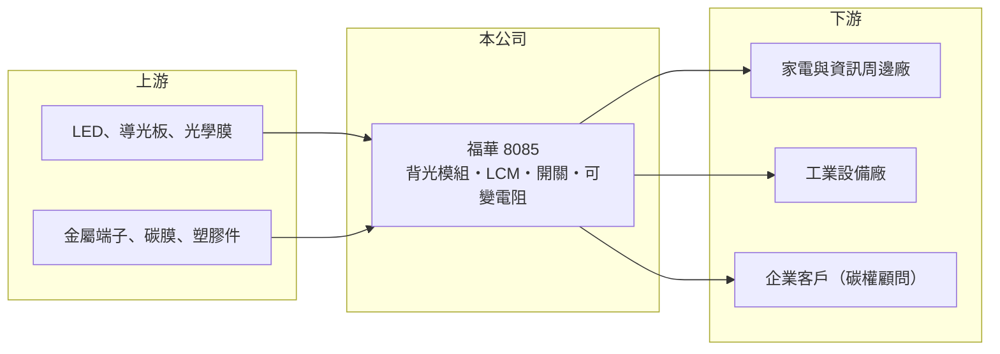

# 8085 福華

> 上櫃｜[[產業索引-其他電子業|其他電子業]]｜上市（櫃）日期 2004/03/01

# 第一章：企業模式與商業藍圖

> [!info] 撰寫說明
> 精簡版，由 Claude 依公開資料整理，架構比照 [[2330台積電]]，資料截至 2026-10-08。來源：nStock 福華公司概況、MoneyDJ 理財網財務比率年表（2021 至 2025 年）、winvest.tw 營收快訊。公開資料有限，產品比重與客戶未查得。#待校對

福華電子是一家規模不大的電子零組件公司，產品從顯示用的背光與液晶模組，延伸到開關、可變電阻與感測器，近年再加入碳權顧問等新業務。

- **核心業務：** 福華開發、製造與銷售[[背光模組]]及其材料、液晶顯示器模組，以及開關、可變電阻器、感測器與位元產生器等被動式機電元件。這些產品多半是家電、資訊周邊與工業設備裡的標準零件，單價不高，但需要穩定的品質與交期。
- **營收結構：** 公司未公開產品別比重，本文不做推估。從財報看，福華年營收約在 6 億至 9 億元之間，屬於小型零組件廠，產品線分散在顯示與機電元件兩大類。
- **營運據點：** 總部位於台北市中山北路，2004 年前後掛牌，資本額約 14 億元。生產基地的位置本次未查得。
- **長期方向：** 公司營業項目加入照明與資訊家電周邊產品銷售，以及碳權開發與碳中和諮詢顧問業務。這代表經營層試圖在傳統零組件之外找新收入來源，但新業務規模與獲利模式仍待觀察。

# 第二章：護城河深度與競爭優勢

福華所在的背光與機電元件市場技術成熟、競爭者眾多，公司缺乏明顯的規模或技術護城河。

- **競爭優勢：** 福華的優勢主要在多年累積的少量多樣接單能力與客戶關係，可以替中小型設備廠提供多種零件的一站式採購。不過這類優勢容易被同業複製，從長年毛利率在 0% 至 10% 之間徘徊可以看出，議價能力有限。
- **主要對手：** 背光模組與顯示模組方面，有台灣與中國大量的背光、[[LCM]] 廠；開關與可變電阻方面，有日系元件大廠與中國低價供應商。這些對手多數規模更大，能以量壓低成本。
- **觀察重點：** 長期來看，關鍵在新業務能否帶來比本業更高的毛利，以及公司能否把營業費用控制在毛利可以支撐的範圍內。若毛利率無法穩定回到兩位數，本業很難轉為獲利。

# 第三章：財務體質與盈利規模

資料日期：2026-10-08，表格是撰寫當時的快照；最新月營收、毛利率、累計 EPS 由自動排程寫在本筆記的屬性欄位（月營收、毛利率、累計EPS 等）。#待校對

福華過去五年多數年度本業虧損，只有 2022 年靠業外收益轉為獲利。

| 年度 | 營收（億元） | [[毛利率]] | [[營業利益率]] | EPS（元） | [[ROE]] |
|---|---|---|---|---|---|
| 2021 | 約 9.1（推算） | 10.52% | -2.36% | 0.24 | 2.28% |
| 2022 | 約 8.9（推算） | 9.19% | -3.26% | 1.23 | 10.82% |
| 2023 | 約 7.2（推算） | 0.08% | -21.31% | -1.00 | -8.34% |
| 2024 | 約 6.0（推算） | 4.63% | -31.43% | -0.86 | -7.07% |
| 2025 | 6.58 | 6.70% | -11.84% | -1.01 | -9.47% |

註：2025 年營收取自 nStock；2021 至 2024 年依 MoneyDJ 營收成長率由 2025 年回推。

- **長期指標：** 2021 至 2025 年營收年複合成長率約 -7.9%（推算），近 5 年平均 ROE 約 -2.4%（推算）。2022 年稅後淨利率 19.25% 遠高於營業利益率 -3.26%，代表當年獲利來自業外，不是本業改善。近五年平均現金股利僅約 0.06 元，配息不穩定。
- **[[ROIC]] 與 [[WACC]]：** 2025 年營業利益率 -11.84%，稅後營業利益為負，ROIC 約 -3%（推算：稅後營業利益約 -0.62 億元 ÷（股東權益約 12.7 億元＋有息負債以總負債一半推估約 7.0 億元））。WACC 以 CAPM 推估約 5.7%（推算：無風險利率 1.75%、市場風險溢酬 6%、β 取小型電子零組件常見值 1.0，股東權益成本 7.75%；稅前負債成本 2.5%、稅率 20%；權益比重約 64%）。ROIC 長期低於 WACC，代表本業目前沒有替股東創造價值。
- **財務特色：** 2025 年負債比率升到 52.58%、每股淨值由 12.37 元降到 9.04 元，連續虧損正在侵蝕淨值。

# 第四章：總體風險與地緣政治

福華的風險集中在本業長期虧損與淨值縮水。

- **產業週期：** 背光與顯示模組跟著家電、資訊產品的景氣循環，終端需求轉弱時，小型供應商通常最先被砍單。福華營收從 2021 年約 9 億元降到 2024 年約 6 億元，顯示它在下行週期中缺乏防守力。
- **營運風險：** 毛利率長期偏低，營業費用相對營收過高，營收只要小幅下滑就會擴大虧損。若虧損持續，淨值下降可能影響融資條件與再投資能力。
- **其他風險：** 新的碳權顧問業務屬於法規驅動的市場，收入取決於政府碳費與碳交易制度的推進速度，不確定性高。匯率與原物料價格也會影響零件成本。

# 專有名詞解析

## 應用

- **[[LCM]]**：液晶顯示模組，把面板、驅動 IC 與背光組裝在一起的半成品，供整機廠直接組裝。

## 金融

- **[[ROIC]]**：投入資本報酬率，稅後營業利益除以股東權益加有息負債，衡量本業運用資本的效率。
- **[[WACC]]**：加權平均資金成本，股東與債權人要求報酬率的加權平均，是 ROIC 要超越的門檻。

## 產業

- **[[背光模組]]**：液晶面板背後提供均勻光源的組件，由光源、導光板與光學膜組成。
- **[[少量多樣]]**：接單品項多、單一品項數量少的生產模式，重視彈性與交期，但難以靠規模降低成本。
- **[[碳費]]**：政府對排碳大戶依排放量收取的費用，台灣自 2025 年起開徵，帶動碳盤查與碳權顧問需求。

# 核心供應鏈

- 上游：LED、導光板、光學膜，以及金屬端子、碳膜與塑膠件供應商
- 下游／客戶：家電、資訊周邊與工業設備廠（客戶名稱未查得）
- 同業：台灣與中國背光模組及 LCM 廠、日系與中國的開關與可變電阻廠

## 最新新聞
<!-- news:start -->
<!-- news:end -->

## 相關連結
- [公開資訊觀測站](https://mopsov.twse.com.tw/mops/web/t05st03?step=1&firstin=1&co_id=8085)
- [Goodinfo](https://goodinfo.tw/tw/StockDetail.asp?STOCK_ID=8085)
- [Yahoo 股市](https://tw.stock.yahoo.com/quote/8085)
- [鉅亨網新聞](https://www.cnyes.com/twstock/8085/news)
