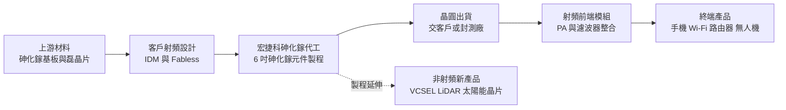
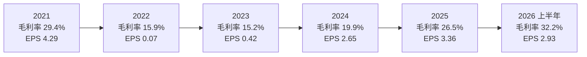
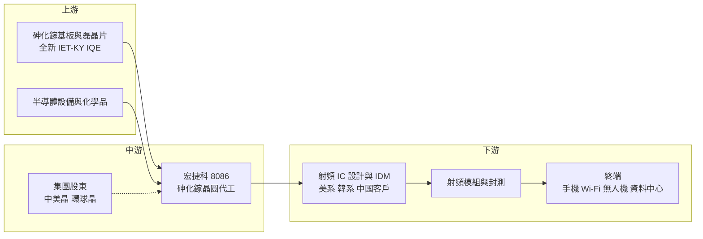

# 8086 宏捷科

> 上櫃｜[[產業索引-半導體業|半導體業]]｜上市（櫃）日期 2009/06/01

# 第一章：企業模式與商業藍圖

> [!info] 撰寫說明
> 本文由 Claude 依公開資料整理，架構比照 [[2330台積電]] 的四章研究，資料截至 2026-10-08。財務數字來源：櫃買中心開放資料（基本資料、綜合損益、資產負債、本益比殖利率）、Goodinfo 台灣股市資訊網年度經營績效、MoneyDJ 理財網（康和證券）公司基本資料、經濟日報 2026 年 4 月報導、優分析 2025 年 11 月與 2026 年 1 月報導、工商時報 2020 年 11 月與 2026 年 3 月報導、理財周刊；產業描述為整理性內容，尚未逐條比對原始文件。#待校對

在評估單一個股的長期投資價值時，首要步驟是拆解企業的底層獲利邏輯。本章針對宏捷科技（股票代號：8086，以下簡稱宏捷科）的商業模式進行定性分析，說明它如何以[[砷化鎵]]晶圓代工起家，在手機射頻元件的國際分工中取得位置，又如何試圖把同一套化合物半導體製程延伸到光通訊、光達與航太等新市場。

## 一、核心定位：以手機功率放大器為主的砷化鎵代工廠

宏捷科成立於 1998 年，2009 年在櫃買中心掛牌，工廠位於台南的南部科學園區。公司的本業是砷化鎵（GaAs）晶圓代工：客戶把射頻晶片的電路設計交給宏捷科，由宏捷科在砷化鎵晶圓上完成元件製造，再交回客戶或其封測廠。依 MoneyDJ 理財網的 2025 年營收分類，砷化鎵晶圓占營收 100%，業務高度單一。

砷化鎵和一般的矽晶圓不同，電子在材料中跑得較快、能承受較高頻率與功率，因此特別適合做手機與 Wi-Fi 裝置裡的功率放大器（[[PA]]）。PA 是[[射頻前端]]中負責把訊號放大後送到天線的元件，每支手機、每台路由器都需要好幾顆。宏捷科在這個產業鏈中扮演「純代工」的角色，與 [[3105穩懋]] 同屬台灣的砷化鎵代工廠，但規模較小。

宏捷科的股權結構在近年出現重要變化。依理財周刊報導，[[5483中美晶]] 集團持有宏捷科約 22.53% 股權，為最大法人股東；櫃買中心基本資料也顯示，現任董事長為中美晶集團的徐秀蘭。中美晶集團旗下有矽晶圓廠 [[6488環球晶]] 等半導體材料事業，宏捷科被納入這個集團後，在材料取得、客戶介紹與資本調度上可以獲得集團資源支援。這是影響宏捷科長期經營方向的結構性事件。

## 二、終端應用板塊：手機 PA 為本業、非射頻產品為新動能

宏捷科沒有在公開資料中揭露完整的應用別比重，以下依媒體報導整理其業務板塊，因此不繪製營收比重圓餅圖。

* **手機 PA：** 手機是宏捷科最主要的需求來源。依工商時報 2020 年 11 月報導，當時手機 PA 與 Wi-Fi 各約占營收一半，主要客戶為美系射頻大廠 Skyworks。近年客戶結構逐漸分散，經濟日報 2026 年 4 月報導提到的客戶包括韓系手機客戶、美系 Fabless 客戶，以及中國的晶片設計公司與手機品牌。
* **Wi-Fi 與網通：** 路由器、筆電與手機都內建 Wi-Fi 晶片，[[Wi-Fi]] 7 世代的規格需要更多 PA。法人指出 Wi-Fi 7 的 PA 用量約為 Wi-Fi 6 的 2 至 3 倍，這是宏捷科在手機之外最穩定的射頻需求。
* **非射頻新產品：** 宏捷科近年把砷化鎵製程延伸到光電與航太領域，包括用於資料中心光通訊的 [[VCSEL]] 與 800G 高速傳輸晶片、用於車用與機器人的 [[LiDAR]]（光達）、無人機與平流層平台使用的砷化鎵太陽能晶片、低軌衛星的相位陣列天線元件，以及[[濾波器]]與變容二極體（Varactor）。依優分析 2026 年 1 月報導，公司期望非射頻產品出貨比重在 2027 年突破雙位數。

## 三、資本轉化邏輯：重資產代工、利用率決定獲利

宏捷科的獲利模式可以從三個環節理解。第一，它是典型的重資產代工廠：晶圓廠的機台、無塵室與折舊都是固定成本，不論產量多少都要支付。依經濟日報 2026 年 4 月報導，公司 2026 年資本支出預估約 5 至 6 億元，但折舊約 7 至 8 億元，折舊金額本身就占年營收相當比例。

第二，固定成本高代表[[營運槓桿]]很大。當客戶下單踴躍、[[產能利用率]]提高時，增加的營收大部分直接轉成利潤；反之，當手機需求下滑、客戶去化庫存時，營收少一點，利潤就會大幅縮水。2022 年營收從 47.2 億元腰斬到 21.6 億元，營業利益率從 20.7% 直接掉到負 1.7%，就是這種槓桿反向運作的結果。

第三，產能規模決定上限。依 2020 年工商時報報導，宏捷科當時月產能約 1.3 至 1.5 萬片，並規劃逐年擴充。近年公司採取較保守的資本支出，2026 年報導指出短期內沒有大規模擴充機台，而是先升級無塵室空間，為未來 2 至 3 年的設備擴充預作準備，後續投資規模將視濾波器與 VCSEL 需求而定。

## 四、企業長期藍圖：從手機 PA 走向多元化合物半導體平台

宏捷科的長期策略可以歸納為兩條主線。

* **承接射頻產業的代工外包趨勢：** 傳統上，Skyworks、Qorvo 等美系射頻大廠以 [[IDM]] 模式自建砷化鎵廠。近年美系 IDM 逐步淡出中國安卓手機市場，中國的手機品牌與晶片設計公司轉向國產化與代工模式，需求往代工廠移動。優分析 2026 年 1 月報導引述公司主管的說法，這股趨勢同時提升了宏捷科的訂單量與產品組合。若射頻產業長期朝「設計與製造分工」發展，宏捷科這類純代工廠的市場空間會擴大。
* **把製程能力延伸到光電與航太：** 砷化鎵的特性除了做射頻元件，也適合做雷射、光感測與高效率太陽能晶片。宏捷科把同一座晶圓廠的製程平台延伸到 VCSEL、LiDAR、太陽能晶片與衛星天線元件，目的在於降低對手機單一市場的依賴。這些應用的單價與毛利通常高於一般手機 PA，但驗證期較長、規模仍小，能否在 2027 年後成為穩定的第二支柱，是觀察宏捷科轉型成敗的關鍵。

從資本配置的角度看，宏捷科在 2022 至 2023 年低谷期沒有大舉擴產，而是先等需求回溫；加入中美晶集團後，經營團隊也強調以現有產能提升產品組合。這種「先提高利用率與單價、再擴產」的保守作風，降低了景氣反轉時的折舊壓力，但也代表在需求爆發時，產能可能成為限制。

# 第二章：護城河深度與競爭優勢

在長期價值投資中，「護城河」指企業抵禦競爭、維持超額利潤的保護機制。本章分析宏捷科的護城河構成、全球主要競爭對手，以及這些優勢在射頻產業結構變化中能守住多少。

## 一、宏捷科護城河的核心組成要素

宏捷科屬於「窄護城河」的代工廠，優勢主要來自製程門檻與客戶驗證，而不是品牌或規模。

* **1. 化合物半導體的製程門檻：** 砷化鎵晶圓的製程和矽晶圓差異很大，晶圓較脆、尺寸較小（多為 6 吋），磊晶品質與製程參數直接影響 PA 的效率與發熱。這類技術需要多年量產經驗累積，新進者很難在短時間內達到穩定的[[良率]]。工商時報 2026 年 3 月報導中，公司也表示其製程與量產能力獲得客戶肯定、市占率持續擴大。
* **2. 客戶驗證帶來的轉換成本：** 手機 PA 必須通過客戶與手機品牌的多輪可靠度與效能驗證，一旦某個型號在宏捷科完成驗證並量產，客戶在該產品生命週期內很少更換代工廠。這讓宏捷科與主要客戶的關係具有一定黏著度。
* **3. 非美系、非中系的中立代工位置：** 在中美科技競爭下，中國客戶希望降低對美系 IDM 的依賴，美系與韓系客戶又希望產能不在中國。台灣的砷化鎵代工廠剛好落在兩者之間，可以同時服務雙方，這是近年訂單轉向宏捷科的重要背景。
* **4. 集團資源：** 加入中美晶集團後，宏捷科在材料供應、資金與客戶開發上可以獲得集團支援，這對規模較小的代工廠是一項補強。

## 二、全球主要競爭對手格局

| 對手 | 定位 | 對宏捷科的威脅 |
|---|---|---|
| [[3105穩懋]] | 全球最大砷化鎵代工廠，產能與客戶規模遠大於宏捷科 | 同業龍頭，議價力與技術廣度較強，大客戶優先配置 |
| Skyworks、Qorvo | 美系射頻 IDM，自有砷化鎵廠 | 既是潛在客戶也是競爭者，內部產能滿載時才委外 |
| 中國砷化鎵代工廠（如三安光電旗下事業） | 中國政策扶植的在地化產能 | 中國客戶國產化時可能優先採用本土代工 |
| [[2455全新]] | 砷化鎵磊晶片供應商 | 屬上游夥伴，非直接競爭，但掌握關鍵材料 |
| 光通訊 VCSEL 廠商 | Lumentum、Coherent 等 IDM | 在 VCSEL 與光通訊新應用上的領先者 |

## 三、優勢轉化：哪些市場守得住、哪些守不住

* **守得住：** 中高階手機與 Wi-Fi 7 的 PA 代工。這些產品的效能要求高，代工廠的製程穩定度與良率直接影響客戶產品的競爭力，客戶較重視品質與交期，不會只看價格。美系 IDM 淡出中國後釋出的代工需求，也是宏捷科可以持續承接的結構性訂單。
* **較難守住：** 低階手機 PA 與中國客戶的長期訂單。中國有政策支持的本土砷化鎵產能，當本土產能良率提升後，中國客戶可能轉回國內代工，宏捷科在中國市場的訂單有被取代的風險。另外，與穩懋相比，宏捷科規模較小，在大型客戶的產能分配與報價上處於相對弱勢。
* **觀察重點：** 第一，非射頻產品（VCSEL、LiDAR、太陽能晶片、衛星天線元件）的出貨比重能否在 2027 年如公司目標突破雙位數。第二，毛利率能否在景氣回升時穩定站上 30%，代表產品組合真正改善。第三，中國客戶國產化的速度，以及宏捷科能否同步爭取到韓系與美系客戶的新訂單。

# 第三章：財務體質與盈利規模

資料日期：2026-10-08。數字取自櫃買中心開放資料與 Goodinfo 年度經營績效，表格是撰寫當時的快照；最新月營收、毛利率、累計 EPS 由自動排程寫在本筆記的屬性欄位（月營收、毛利率、累計EPS 等）。#待校對

財務報表是檢驗護城河是否真實存在的最終標準。本章用三率、[[ROE]]、現金流與資本報酬，檢視宏捷科在射頻景氣循環中的獲利品質。

## 一、獲利能力的基石：三率

| 年度 | 營收（億元） | [[毛利率]] | [[營業利益率]] | EPS（元） | [[ROE]] |
|---|---|---|---|---|---|
| 2019 | 22.1 | 30.4% | 19.9% | 2.54 | 12.3% |
| 2020 | 35.4 | 30.4% | 21.9% | 3.75 | 11.7% |
| 2021 | 47.2 | 29.4% | 20.7% | 4.29 | 10.8% |
| 2022 | 21.6 | 15.9% | -1.7% | 0.07 | 0.2% |
| 2023 | 27.2 | 15.2% | 2.5% | 0.42 | 1.1% |
| 2024 | 44.6 | 19.9% | 11.8% | 2.65 | 6.8% |
| 2025 | 41.2 | 26.5% | 17.9% | 3.36 | 8.2% |
| 2026 上半年 | 25.21 | 32.2% | 24.8% | 2.93 | 年化約 13.6%（推算） |

註：2019 至 2025 年取自 Goodinfo 年度經營績效；2026 上半年取自櫃買中心綜合損益開放資料（營收 25.21 億元、營業毛利 8.13 億元、營業利益 6.24 億元），三率由本文計算。2026 上半年 ROE 以稅後淨利 5.75 億元乘以 2，除以 2026 年第二季底權益總計 84.78 億元推算。

* **[[毛利率]]隨利用率大幅擺盪：** 2019 至 2021 年手機與 Wi-Fi 需求強勁，毛利率維持在 30% 左右；2022 年手機市場庫存調整，營收腰斬、毛利率掉到 15.9%，2023 年也停留在 15% 左右。2024 年起需求回溫，毛利率逐年回升，2026 上半年達 32.2%，已超過 2019 至 2021 年的高峰水準，代表除了利用率回升外，產品組合（Wi-Fi 7、模組化產品、非射頻新品）也在改善。
* **[[營業利益率]]放大景氣變化：** 宏捷科的營業費用規模不大，2026 上半年營業費用只有約 1.89 億元，因此毛利率每提高一點，大部分會直接反映到營業利益率。2022 年營業利益率為負 1.7%，2026 上半年則達到 24.8%，兩者相差超過 26 個百分點，這是重資產代工廠典型的營運槓桿。
* **業外影響小：** 2026 上半年營業外收入約 0.42 億元，相對營業利益 6.24 億元比重不高，獲利主要來自本業，品質較單純。

## 二、[[ROE]]：資本效率

宏捷科的 ROE 長期偏低，2021 至 2025 年平均只有約 5.4%（推算），即使在 2019 至 2021 年的景氣高峰，ROE 也只有 11% 至 12%。原因在於股東權益規模較大：2026 年第二季底權益總計約 84.78 億元，其中資本公積約 41.41 億元，代表過去曾以較高價格辦理增資，股本與資本公積累積多，但獲利並未等比例放大。

營收方面，2019 年 22.1 億元成長到 2025 年 41.2 億元，六年的年複合成長率約 10.9%（推算）；不過若以 2021 年高點 47.2 億元比較，2025 年仍低於高峰，說明宏捷科的成長並非直線，而是隨手機景氣循環上下波動。

## 三、資本支出與[[自由現金流]]

* **[[CapEx]] 與折舊：** 依經濟日報 2026 年 4 月報導，宏捷科 2026 年資本支出預估約 5 至 6 億元，低於折舊的 7 至 8 億元。資本支出低於折舊，代表公司目前處於「回收過去投資」的階段，營業現金流扣除資本支出後的自由現金流理應為正（推估，未查得實際現金流量表數字）。
* **財務結構：** 2026 年第二季底負債總計約 23.08 億元，其中非流動負債約 4.65 億元，流動資產約 59.85 億元，財務槓桿低、流動性充足。
* **股利政策：** 依櫃買中心本益比殖利率資料，最近一年度現金股利為每股 1.68 元，以 2025 年 EPS 3.36 元計算，[[配息率]]約 50%（推算）。Goodinfo 顯示歷年平均現金股利約 0.97 元，低谷年度配息明顯減少，股利隨獲利波動而非固定發放。

## 四、[[ROIC]] 與 [[WACC]]：價值創造利差

* **ROIC（推算）：** 以 2025 年營收 41.2 億元乘以營業利益率 17.9%，營業利益約 7.37 億元，乘以（1－20% 稅率）得到稅後營業利益約 5.90 億元。投入資本以 2026 年第二季底權益總計 84.78 億元加上非流動負債 4.65 億元（有息負債明細未查得，以非流動負債作為上限近似）計算，約 89.43 億元。2025 年 ROIC 約 5.90 ÷ 89.43 ≈ 6.6%（推算）。若以 2026 上半年營業利益 6.24 億元年化，稅後營業利益約 9.98 億元，ROIC 約 11.2%（推算）。
* **WACC（推算）：** 用資本資產定價模型（CAPM）推估。無風險利率取台灣 10 年期公債約 1.75%，市場風險溢酬取 6%，β 值取 MoneyDJ 理財網頁面顯示的 1.18，股東權益成本約 1.75% + 1.18 × 6% ≈ 8.8%。稅前負債成本假設 2.5%、稅率 20%，稅後約 2.0%；以權益約 95%、負債約 5% 的資本結構加權，WACC 約 8.5%（推算）。
* **價值創造判斷：** 2025 年 ROIC 約 6.6% 低於 WACC 約 8.5%，代表以全年來看仍未完全賺回資金成本；2022 至 2023 年的低谷期 ROIC 接近零，更明顯低於 WACC（推估）。2026 上半年年化 ROIC 約 11.2%，才重新高於 WACC 約 2.7 個百分點。整體而言，宏捷科屬於「景氣高峰才創造價值、低谷期侵蝕價值」的循環型公司。要成為長期穩定創造價值的企業，關鍵在於非射頻產品能否拉高平均毛利率，並讓低谷期的利用率不再大幅下滑。

# 第四章：總體風險與地緣政治

任何企業都無法脫離宏觀環境獨立存在。本章分析宏捷科未來必須面對的地緣政治、產業週期、營運與技術風險。

## 一、地緣政治風險

* **中國國產化的雙面刃：** 美系 IDM 淡出中國後，中國客戶轉向代工模式，這在短期內帶給宏捷科新訂單。然而中國政策的長期目標是射頻供應鏈全面國產化，一旦中國本土砷化鎵代工廠的良率與產能追上，宏捷科在中國的訂單可能被逐步取代。投資人應把中國訂單視為「有期限的機會」，而非永久的基本盤。
* **出口管制與關稅：** 化合物半導體涉及國防與通訊應用，美國對中國的出口管制可能擴及相關技術與客戶。若宏捷科的中國客戶被列入管制名單，相關訂單將無法出貨。
* **台灣生產集中：** 宏捷科的產能集中在台南南科，與其他台灣半導體廠一樣面臨兩岸情勢升溫時的供應鏈風險，國際客戶可能要求分散產能。

## 二、產業週期與市場結構風險

* **手機景氣循環：** 手機是宏捷科最大的需求來源，全球手機出貨量的起伏會直接反映在訂單上。2022 年營收腰斬的經驗說明，即使沒有失去客戶，只要終端需求轉弱，代工廠的營收與獲利就會劇烈下滑。
* **[[長鞭效應]]：** 手機品牌、射頻模組廠與晶片設計公司都會在需求轉弱時同時去化庫存，訂單沿供應鏈往上游傳遞時被放大，代工廠往往是受衝擊最大的一環。
* **規模劣勢：** 砷化鎵代工市場集中，龍頭穩懋規模遠大於宏捷科。在景氣下行時，大客戶通常優先保住對龍頭的投片，規模較小的代工廠利用率下滑幅度可能更大。

## 三、營運環境的隱性風險

* **客戶集中：** 宏捷科的營收集中在少數射頻設計公司與手機供應鏈客戶，單一大客戶調整採購策略或轉單，都可能造成營收明顯波動。
* **折舊與擴產時機：** 公司規劃在未來 2 至 3 年視需求擴充設備，若擴產完成時正逢景氣反轉，新增折舊會壓縮毛利率。
* **匯率：** 營收以美元計價為主，新台幣升值會壓縮以台幣計算的營收與毛利率。

## 四、科技演進風險

射頻元件的材料與架構持續演進。高頻與高功率應用正逐步引入氮化鎵（[[GaN]]），部分 Wi-Fi 與低階 PA 也可能改用矽基製程（如 [[RFSOI]] 或 CMOS PA）降低成本。若手機 PA 長期由砷化鎵轉向其他材料，宏捷科必須同步建立新製程能力，否則既有產能的價值會下降。另一方面，宏捷科布局的 VCSEL、LiDAR 與太陽能晶片屬於新興應用，技術路線尚未定型，例如光通訊可能轉向[[矽光子]]、LiDAR 也有多種技術方案競爭。這些新業務能否成為穩定的營收來源，取決於宏捷科能否跟上技術變化並取得關鍵客戶驗證。

# 專有名詞解析

## 半導體

- **[[砷化鎵]]**：由鎵與砷組成的化合物半導體材料，電子移動速度快、耐高頻，常用來製作手機與 Wi-Fi 的功率放大器。
- **[[PA]]**：功率放大器，把射頻訊號放大後送到天線發射，是手機與無線網路裝置的關鍵元件。
- **[[射頻前端]]**：手機中處理無線訊號收發的元件組合，包括功率放大器、濾波器、開關與低雜訊放大器。
- **[[VCSEL]]**：垂直共振腔面射型雷射，從晶片表面發光的小型雷射，用於光通訊、臉部辨識與光達。
- **[[濾波器]]**：讓特定頻率訊號通過、阻擋其他頻率的射頻元件，手機需要大量濾波器處理多頻段訊號。
- **[[GaN]]**：氮化鎵，耐高電壓與高頻的化合物半導體，用於快充、基地台與高功率射頻元件。
- **[[RFSOI]]**：在絕緣層上覆矽晶圓製作射頻元件的製程，用於手機天線開關，也可能取代部分砷化鎵應用。
- **[[矽光子]]**：在矽晶片上製作光學元件，以光取代電傳輸資料，可降低 AI 資料中心的傳輸耗電。
- **[[IDM]]**：整合元件製造廠，從晶片設計、製造到封測都自己完成的半導體公司。
- **[[良率]]**：一片晶圓上合格晶片所占的比例，直接影響代工廠的成本與獲利。

## 應用

- **[[LiDAR]]**：光達，用雷射光測量距離並建立三維影像的感測器，應用於自駕車、機器人與無人機。
- **[[Wi-Fi]]**：無線區域網路通訊標準，新一代 Wi-Fi 7 支援更高頻寬，每台裝置需要更多功率放大器。

## 金融

- **[[營運槓桿]]**：固定成本占比高的公司，營收小幅變動會造成營業利益大幅變動的現象。
- **[[產能利用率]]**：實際投片量占總產能的比例，代工廠的毛利率高度取決於此數字。
- **[[配息率]]**：現金股利占每股盈餘的比例，反映公司把多少獲利回饋給股東。
- **[[長鞭效應]]**：終端需求的小幅變動，沿供應鏈往上游傳遞時被逐級放大，造成上游庫存與訂單劇烈波動。

# 核心供應鏈

## 1. 上游：基板、磊晶與設備
- 砷化鎵磊晶片：[[2455全新]]、[[4971IET-KY]]、英國 IQE（宏捷科實際採購對象未查得，此為產業主要供應商）
- 砷化鎵代工需要的曝光、蝕刻與薄膜設備，多來自國際設備廠

## 2. 中游：宏捷科本身與集團
- 砷化鎵晶圓代工：宏捷科
- 主要法人股東：[[5483中美晶]]（集團持股約 22.53%），集團內有矽晶圓廠 [[6488環球晶]]

## 3. 下游：客戶與終端
- 射頻 IC 設計與 IDM：Skyworks（2020 年報導中的主要客戶）、韓系手機客戶、美系 Fabless 客戶、中國晶片設計公司與手機品牌
- 終端應用：手機、Wi-Fi 路由器與筆電、無人機、資料中心光模組、車用與機器人光達、低軌衛星

## 4. 同業與競爭者
- 砷化鎵代工：[[3105穩懋]]、中國本土砷化鎵代工廠
- 射頻 IDM：Skyworks、Qorvo

## 最新新聞
<!-- news:start（自動產生，請勿手動編輯此範圍） -->
- 2026-10-05 📰 媒體 11:30｜穩懋(3105)股價噴出，宏捷科(8086)營收也年增32%！砷化鎵雙雄都在量增，為何獲利差這麼多？｜[鉅亨網](https://news.cnyes.com/news/id/6621597)

完整紀錄：[[8086宏捷科 新聞]]
<!-- news:end -->

## 相關連結
- [公開資訊觀測站](https://mopsov.twse.com.tw/mops/web/t05st03?step=1&firstin=1&co_id=8086)
- [Goodinfo](https://goodinfo.tw/tw/StockDetail.asp?STOCK_ID=8086)
- [Yahoo 股市](https://tw.stock.yahoo.com/quote/8086)
- [鉅亨網新聞](https://www.cnyes.com/twstock/8086/news)
