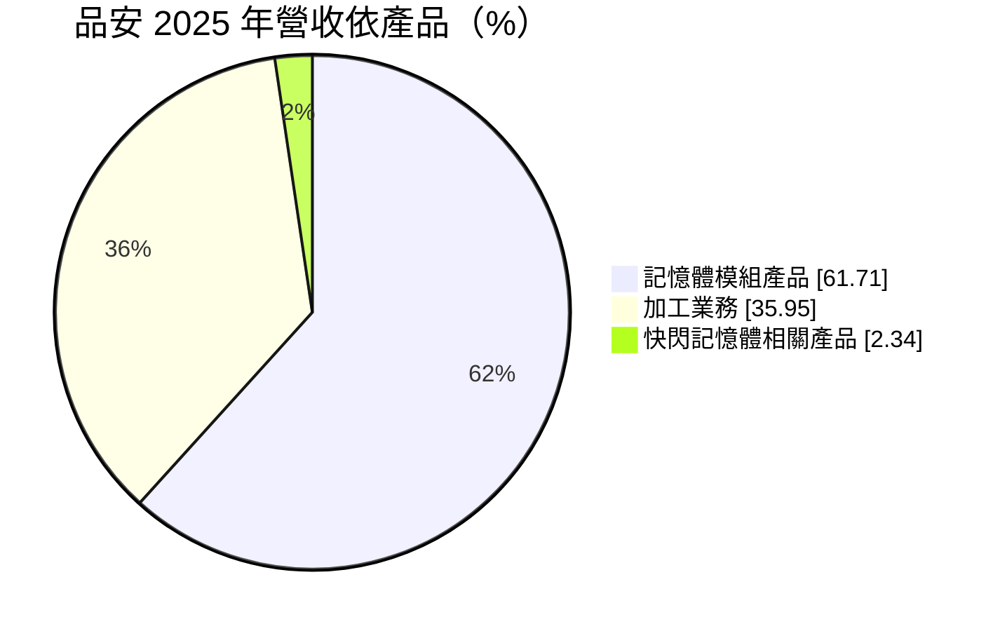
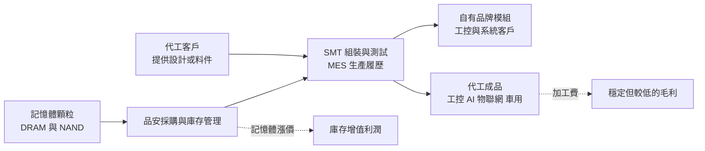
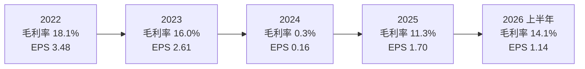
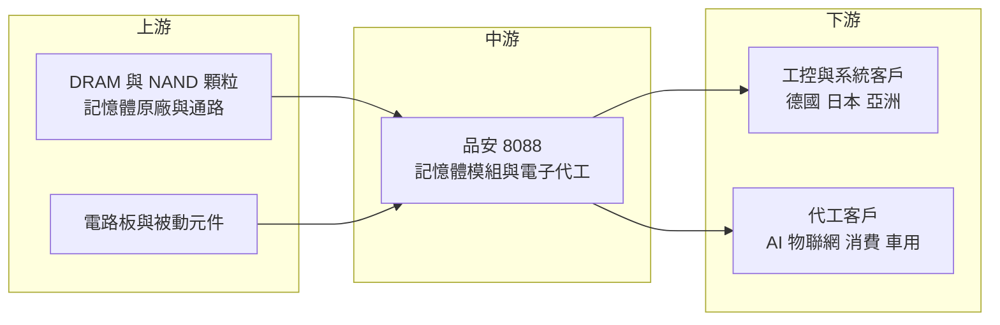

# 8088 品安

> 上櫃｜[[產業索引-半導體業|半導體業]]｜上市（櫃）日期 2004/02/27

# 第一章：企業模式與商業藍圖

> [!info] 撰寫說明
> 本文由 Claude 依公開資料整理，架構比照 [[2330台積電]] 的四章研究，資料截至 2026-10-08。財務數字來源：櫃買中心開放資料（基本資料、綜合損益、資產負債、本益比殖利率）、Goodinfo 台灣股市資訊網年度經營績效、MoneyDJ 理財網（康和證券）公司基本資料、富果研究 2025 年 12 月品安法說會整理、nStock；產業描述為整理性內容，尚未逐條比對原始文件。#待校對

在評估單一個股的長期投資價值時，首要步驟是拆解企業的底層獲利邏輯。本章針對品安科技（股票代號：8088，以下簡稱品安）的商業模式進行定性分析，說明一家規模不大的記憶體模組廠，如何在 DRAM 價格劇烈波動的產業中，以自有模組加上電子代工的「雙引擎」降低單一業務的風險。

## 一、核心定位：自有記憶體模組加上代工服務的中小型廠商

品安成立於 1994 年，2004 年在櫃買中心掛牌，總部位於台北內湖，實收資本額約 6.09 億元，屬於規模較小的記憶體相關公司。依 nStock 整理的公司登記資料，品安的主要業務是研發、生產與銷售[[記憶體模組]]及相關應用產品，早期也生產隨身碟、讀卡機與快閃記憶卡等消費性產品；公司沒有母公司或集團控制者。

記憶體模組廠的角色是向 [[DRAM]] 原廠或通路購買記憶體顆粒，再把顆粒焊接到印刷電路板上，做成電腦、伺服器或工業設備可以直接插用的模組。模組廠本身不製造晶片，附加價值來自採購時機、產品設計、測試品質與客戶服務。這種商業模式的特性是：營收大小很大程度取決於 DRAM 價格，毛利率則取決於「買進顆粒的成本」與「賣出模組的價格」之間的時間差。

品安近年最重要的結構變化，是把自有產線轉為對外提供電子代工服務（[[EMS]]）。依富果研究整理的 2025 年 12 月法說會，代工業務占營收比重由 2024 年的約 20% 大幅提高到 2025 年的約 69%，自有產品約占 31%。公司把這個模式稱為「代工與自有產品雙引擎」：代工業務收取加工費，不必承擔記憶體價格漲跌的庫存風險；自有產品則在記憶體價格上漲時享有庫存增值的利潤。

## 二、終端應用／產品板塊

依 MoneyDJ 理財網的 2025 年營收分類，品安營收結構如下：

這個分類和法說會「代工約 69%」的口徑不同，推估差異來自部分代工案件包含記憶體模組的整包代工（連工帶料），在會計分類上仍列為模組產品，本文無法從公開資料進一步拆分。

* **記憶體模組產品：** 以 DDR4 與 [[DDR5]] 的 DRAM 模組為主，銷售給工業電腦、網通設備與系統整合客戶。工控客戶重視產品長期供貨與穩定品質，比起追求最低價格的消費性市場，訂單較穩定。
* **加工業務（代工）：** 提供從組裝、測試到包裝的全製程服務，產品涵蓋工控、AI 相關設備、物聯網、消費性電子（如顯示卡、手機配件）與車用電子。法說會提到公司積極拓展 AI 相關代工客戶，視為主要成長動能。
* **快閃記憶體相關產品：** 隨身碟、記憶卡等 [[NAND]] 相關產品，比重已降到 2% 左右，屬於逐漸淡出的舊業務。

客戶分布方面，法說會提到終端客戶涵蓋德國、日本與其他亞洲地區，並非集中於美國，公司以此分散關稅等地緣風險；客戶涵蓋大數據、工業製造、醫療、教育、交通與多媒體等領域，但未揭露具體客戶名稱與地區比重。

## 三、資本轉化邏輯：輕資產組裝與庫存操作

品安的獲利來源可以分成兩種邏輯。

第一是自有模組的「價差生意」。模組廠在記憶體價格上漲前買進顆粒，等價格上漲後出貨，就能賺到庫存增值；反過來，若在高價買進後遇到跌價，就必須認列損失。Goodinfo 的年度數據清楚呈現這種特性：2022 年毛利率 18.1%、EPS 3.48 元，2024 年記憶體價格回落時毛利率只剩 0.32%、營業利益率為負 4.34%。

第二是代工業務的「加工費生意」。代工收入按件計價，毛利率通常不高，但與記憶體價格的連動較低，可以讓工廠維持較高的[[產能利用率]]，攤提固定成本。品安在 2025 年大幅提高代工比重，等於是用較低但較穩定的加工毛利，換取營運的穩定度。

品安本身的資產規模不大。依櫃買中心資料，2026 年第二季底資產總計約 15.45 億元，其中流動資產約 10.94 億元，非流動資產約 4.51 億元；負債總計約 4.29 億元，幾乎全為流動負債，沒有長期借款。這種輕資產、低負債的結構，讓公司在記憶體景氣低谷時不至於面臨財務危機。

## 四、企業長期藍圖：從記憶體模組廠轉型為工控與 AI 代工夥伴

* **擴大代工、降低價格風險：** 法說會顯示，公司策略是深耕既有客戶、提供新製程方案，並積極爭取 AI 相關代工客戶。若代工比重能長期維持在六成以上，品安的獲利波動將比傳統模組廠小。
* **提升製造管理能力：** 公司導入製造執行系統（MES），提供從進料到出貨的完整生產履歷，並引進高階生產與檢測設備。2025 年取得 ISO 27001 資訊安全與 ISO 14064-1 溫室氣體盤查認證。這些認證是爭取國際工控、醫療與車用客戶的基本門檻。
* **選擇性承接訂單：** 管理層強調「重質不重量」的選客策略，並分散客戶與地區集中度。對小型代工廠而言，避免過度依賴單一客戶，是降低長期經營風險的必要做法。

整體而言，品安是一家在記憶體大廠與大型 EMS 廠之間尋找利基的小型公司。它的長期價值不在於規模成長，而在於能否用代工業務穩住基本營運，同時在記憶體上漲週期中掌握庫存利潤。

# 第二章：護城河深度與競爭優勢

在長期價值投資中，「護城河」指企業抵禦競爭、維持超額利潤的保護機制。本章分析品安的競爭優勢、主要競爭對手，以及這些優勢能守住多少。

## 一、品安護城河的核心組成要素

坦白說，品安的護城河很窄。記憶體模組與電子組裝都是技術門檻不高、競爭者眾多的產業，品安能做的是在利基市場建立服務與品質的差異。

* **1. 工控客戶的長期供貨關係：** 工業電腦、醫療與交通設備的生命週期長，客戶需要同一規格的記憶體模組連續供貨多年，也要求每一批產品的料件一致。一旦客戶完成驗證，更換供應商需要重新測試，這讓品安與既有工控客戶的關係具有一定黏著度。
* **2. 小批量、多樣化的彈性：** 大型 EMS 廠追求規模經濟，通常不願接少量多樣的訂單。品安規模小、產線彈性大，適合承接工控、醫療與 AI 周邊設備這類數量不大但規格多變的案子。
* **3. 製造履歷與認證：** MES 系統與 ISO 認證讓客戶可以追溯每一片產品的生產紀錄，這是工控與車用客戶的基本要求，也是小型代工廠與一般組裝廠的區隔點。
* **4. 低負債的財務體質：** 品安幾乎沒有有息負債，流動比率在 2025 年第三季達 649.86%（富果法說會整理）。在記憶體價格劇烈波動時，財務穩健的公司比較能承受庫存跌價，也能在低點備貨。

## 二、主要競爭對手格局

| 對手 | 定位 | 對品安的威脅 |
|---|---|---|
| [[3260威剛]] | 台灣最大記憶體模組品牌之一 | 規模與採購量大，消費與工控模組全面競爭 |
| [[8271宇瞻]] | 工控記憶體與儲存模組 | 工控市場直接競爭，客戶基礎深 |
| [[4967十銓]] | 電競與工控記憶體模組 | 在模組市場價格競爭 |
| [[2451創見]] | 工控與消費性記憶體品牌 | 工控品牌知名度高 |
| 中型 EMS 代工廠 | 電子組裝與測試 | 在代工業務以價格與產能競爭 |

## 三、優勢轉化：哪些市場守得住、哪些守不住

* **守得住：** 已完成驗證的工控與專業設備客戶。這些客戶重視長期供貨與品質追溯，訂單金額雖不大，但不容易被低價對手搶走。
* **守不住：** 標準規格的消費性記憶體模組與一般組裝代工。這兩個市場價格透明、競爭激烈，品安的規模不足以在採購成本上勝過大型模組廠，也無法在產能與價格上勝過大型 EMS 廠。快閃記憶體產品比重降到 2% 左右，就反映了這類市場的競爭結果。
* **觀察重點：** 第一，代工比重能否維持在高檔，並爭取到 AI 相關的長期代工客戶。第二，記憶體上漲週期中，自有模組的庫存利潤能否轉化為長期的股東權益累積，而不是在下一次跌價時回吐。第三，毛利率能否在記憶體跌價年度維持正值，避免 2024 年的情況重演。

# 第三章：財務體質與盈利規模

資料日期：2026-10-08。數字取自櫃買中心開放資料與 Goodinfo 年度經營績效，表格是撰寫當時的快照；最新月營收、毛利率、累計 EPS 由自動排程寫在本筆記的屬性欄位（月營收、毛利率、累計EPS 等）。#待校對

財務報表是檢驗護城河是否真實存在的最終標準。本章用三率、[[ROE]]、現金流與資本報酬，檢視品安在記憶體景氣循環中的獲利品質。

## 一、獲利能力的基石：三率

| 年度 | 營收（億元） | [[毛利率]] | [[營業利益率]] | EPS（元） | [[ROE]] |
|---|---|---|---|---|---|
| 2019 | 15.6 | 18.6% | 12.2% | 2.37 | 15.7% |
| 2020 | 18.9 | 14.5% | 9.4% | 1.96 | 12.2% |
| 2021 | 18.4 | 11.4% | 7.2% | 1.64 | 10.1% |
| 2022 | 17.6 | 18.1% | 12.4% | 3.48 | 19.7% |
| 2023 | 15.2 | 16.0% | 11.0% | 2.61 | 13.7% |
| 2024 | 10.8 | 0.3% | -4.3% | 0.16 | 0.9% |
| 2025 | 16.8 | 11.3% | 7.0% | 1.70 | 9.7% |
| 2026 上半年 | 8.76 | 14.1% | 8.9% | 1.14 | 年化約 12.5%（推算） |

註：2019 至 2025 年取自 Goodinfo 年度經營績效；2026 上半年取自櫃買中心綜合損益開放資料（營收 8.76 億元、營業毛利 1.24 億元、營業利益 0.78 億元），三率由本文計算。2026 上半年 ROE 以稅後淨利 0.70 億元乘以 2，除以 2026 年第二季底權益總計 11.16 億元推算。

* **[[毛利率]]跟著記憶體價格走：** 品安的毛利率在 0.3% 到 18.6% 之間大幅擺盪。2022 與 2023 年毛利率維持在 16% 至 18%，2024 年記憶體價格與需求同步走弱，毛利率幾乎歸零；2025 年下半年起記憶體報價上漲，全年毛利率回到 11.3%，2026 上半年再升到 14.1%。這說明品安的毛利率主要由記憶體景氣決定，而非公司本身的定價能力。
* **[[營業利益率]]與費用結構：** 2026 上半年營業費用約 0.46 億元，占營收約 5%，費用結構精簡。只要毛利率維持在 10% 以上，公司就能有穩定的營業利益；毛利率低於 5% 時就會出現本業虧損。
* **營收規模停滯：** 2019 年營收 15.6 億元，2025 年 16.8 億元，六年的年複合成長率只有約 1.2%（推算）。營收波動主要來自記憶體價格，而非出貨量的長期成長。

## 二、[[ROE]]：資本效率

2021 至 2025 年品安的平均 ROE 約 10.8%（推算），景氣好的年度可以接近 20%，記憶體跌價年度則接近零。以一家幾乎無負債的公司而言，平均一成上下的 ROE 屬於中等水準。2026 年第二季底每股淨值約 18.32 元，股東權益約 11.16 億元，規模不大，股本約 6.09 億元。

## 三、資本支出與[[自由現金流]]

* **[[CapEx]] 低：** 品安的產線以表面黏著（SMT）組裝與測試設備為主，資本支出遠低於晶圓廠或封測廠，具體金額未查得。非流動資產只有約 4.51 億元，代表公司的資產主要是存貨、應收帳款與現金等流動資產。
* **自由現金流的季節性：** 模組廠的營業現金流受存貨影響很大。記憶體上漲前公司會增加備貨，現金流可能轉為負值；跌價或去化庫存時，現金反而會回流。因此品安的自由現金流方向與獲利方向不一定同步（推估，未查得歷年現金流量表）。
* **股利政策：** 依櫃買中心本益比殖利率資料，最近一年度現金股利為每股 1.50 元，以 2025 年 EPS 1.70 元計算，[[配息率]]約 88%（推算）；2024 年 EPS 只有 0.16 元，現金股利為 0.5 元（富果法說會整理），代表公司在獲利低迷年度仍以保留盈餘維持配息。nStock 顯示近五年平均現金股利約 1.6 元。

## 四、[[ROIC]] 與 [[WACC]]：價值創造利差

* **ROIC（推算）：** 以 2025 年營收 16.8 億元乘以營業利益率 7.02%，營業利益約 1.18 億元，乘以（1－20% 稅率）得到稅後營業利益約 0.94 億元。品安的非流動負債只有約 35 萬元，幾乎沒有有息負債，投入資本以 2026 年第二季底權益總計約 11.16 億元計算。2025 年 ROIC 約 0.94 ÷ 11.17 ≈ 8.4%（推算）。若以 2026 上半年營業利益 0.78 億元年化，稅後營業利益約 1.25 億元，ROIC 約 11.2%（推算）。
* **WACC（推算）：** 無風險利率取台灣 10 年期公債約 1.75%，市場風險溢酬取 6%，β 值取 MoneyDJ 理財網頁面顯示的 1.08，股東權益成本約 1.75% + 1.08 × 6% ≈ 8.2%。公司幾乎沒有有息負債，WACC 約等於股東權益成本，約 8.2%（推算）。
* **價值創造判斷：** 2025 年 ROIC 約 8.4%，與 WACC 約 8.2% 幾乎相等；2026 上半年年化 ROIC 約 11.2%，利差約 3 個百分點。2022 至 2023 年景氣較好時 ROIC 明顯高於 WACC，2024 年則遠低於 WACC（推估）。整體來看，品安在整個記憶體循環中大致只賺回資金成本，長期價值創造能力有限。代工業務若能把低谷期的獲利墊高，才能讓 ROIC 穩定高於 WACC。

# 第四章：總體風險與地緣政治

任何企業都無法脫離宏觀環境獨立存在。本章分析品安未來必須面對的地緣政治、產業週期、營運與技術風險。

## 一、地緣政治風險

* **記憶體供應受大國政策影響：** 全球 DRAM 產能集中在韓國、美國與台灣的少數原廠，中國則在政策支持下發展本土記憶體。美中出口管制、關稅或產能分配政策改變時，模組廠的顆粒取得成本與供應穩定度都會受影響。
* **關稅與客戶分布：** 法說會提到品安的終端客戶分布在德國、日本與其他亞洲地區，對美國的直接曝險較低，這降低了美國關稅的衝擊，但全球貿易摩擦仍可能透過客戶需求間接影響訂單。
* **台灣生產據點：** 品安的生產與營運集中在台灣，面臨與其他台灣電子廠相同的兩岸風險。

## 二、產業週期與市場結構風險

* **記憶體價格循環：** DRAM 是全球最典型的景氣循環產品，價格可能在一年內上漲或下跌數成。2024 年品安毛利率幾乎歸零，就是記憶體跌價對模組廠的直接衝擊。法說會預期 DDR4 與 DDR5 缺貨可能延續至 2026 甚至 2027 年，但這類預期隨時可能因原廠擴產而改變。
* **[[長鞭效應]]：** 記憶體缺貨時，模組廠與客戶會同時加碼備貨；需求轉弱時又會同步去化庫存，使價格與訂單的波動比終端需求更劇烈。
* **大廠擠壓：** 記憶體原廠與大型模組廠在採購與品牌上具規模優勢，小型模組廠的議價空間有限。

## 三、營運環境的隱性風險

* **庫存跌價風險：** 為了掌握上漲週期，品安會預先儲備庫存。如果記憶體價格突然反轉，高價庫存必須認列跌價損失，侵蝕過去累積的獲利。
* **代工客戶集中：** 代工業務比重大幅提高後，若主要代工客戶轉單或縮減訂單，營收可能明顯下滑。公司未揭露代工客戶名稱與集中度，投資人難以評估這項風險。
* **規模限制：** 公司資本額約 6 億元，人力與資金有限，若要承接大型 AI 或車用代工專案，可能需要擴充設備與人員，增加營運風險。

## 四、科技演進風險

記憶體規格持續世代交替，從 DDR4 走向 DDR5，伺服器端也發展出 [[HBM]]、CXL 等新架構。模組廠必須跟上每一代的測試與設計能力，否則產品會被淘汰；而 HBM 這類直接封裝在處理器旁邊的記憶體，完全不需要傳統模組，長期可能壓縮伺服器模組市場。另一方面，電子代工業務需要因應客戶產品的高速訊號、散熱與可靠度要求，持續投資檢測設備與製程能力。品安若能在工控與 AI 周邊設備累積專業代工能力，就能減少對記憶體價格的依賴；反之，仍會停留在隨記憶體景氣起伏的位置。

# 專有名詞解析

## 半導體

- **[[DRAM]]**：動態隨機存取記憶體，電腦與伺服器的主記憶體，斷電後資料會消失，價格循環明顯。
- **[[NAND]]**：快閃記憶體的一種，斷電後仍能保存資料，用於隨身碟、記憶卡與固態硬碟。
- **[[DDR5]]**：第五代 DDR 記憶體規格，傳輸速度與容量高於 DDR4，是新一代電腦與伺服器的主流。
- **[[HBM]]**：高頻寬記憶體，把多層 DRAM 垂直堆疊並與處理器封裝在一起，用於 AI 加速器。

## 金融

- **[[產能利用率]]**：實際生產量占總產能的比例，產能利用率高時固定成本攤提較低、獲利較好。
- **[[配息率]]**：現金股利占每股盈餘的比例，反映公司把多少獲利回饋給股東。
- **[[自由現金流]]**：營業活動現金流減去資本支出，代表企業可自由用於配息、還債或併購的現金。
- **[[長鞭效應]]**：終端需求的小幅變動，沿供應鏈往上游傳遞時被逐級放大，造成上游庫存與訂單劇烈波動。

## 產業

- **[[記憶體模組]]**：把多顆記憶體顆粒焊在電路板上，做成可直接插入電腦或伺服器的記憶體條。
- **[[EMS]]**：電子製造服務，替品牌或設計公司代工組裝、測試電子產品的商業模式。
- **[[SMT]]**：表面黏著技術，把電子零件直接焊接在電路板表面的組裝方式，是電子代工的基本製程。
- **[[MES]]**：製造執行系統，記錄工廠每一道生產步驟與料件來源，讓客戶可以追溯產品履歷。

# 核心供應鏈

## 1. 上游：記憶體顆粒與零組件
- DRAM 原廠：[[005930三星電子]]、SK 海力士、美光、[[2408南亞科]]（品安實際採購來源未查得，此為產業主要供應商）
- 電路板與被動元件供應商

## 2. 中游：品安本身
- 自有記憶體模組（DDR4、DDR5）與快閃記憶體產品
- 電子代工（組裝、測試、包裝）

## 3. 下游：客戶
- 工業電腦、網通、醫療、交通、教育與多媒體設備客戶，終端分布在德國、日本與亞洲（客戶名稱未公開）

## 4. 同業與競爭者
- 記憶體模組：[[3260威剛]]、[[8271宇瞻]]、[[4967十銓]]、[[2451創見]]

## 最新新聞
<!-- news:start -->
<!-- news:end -->

## 相關連結
- [公開資訊觀測站](https://mopsov.twse.com.tw/mops/web/t05st03?step=1&firstin=1&co_id=8088)
- [Goodinfo](https://goodinfo.tw/tw/StockDetail.asp?STOCK_ID=8088)
- [Yahoo 股市](https://tw.stock.yahoo.com/quote/8088)
- [鉅亨網新聞](https://www.cnyes.com/twstock/8088/news)
