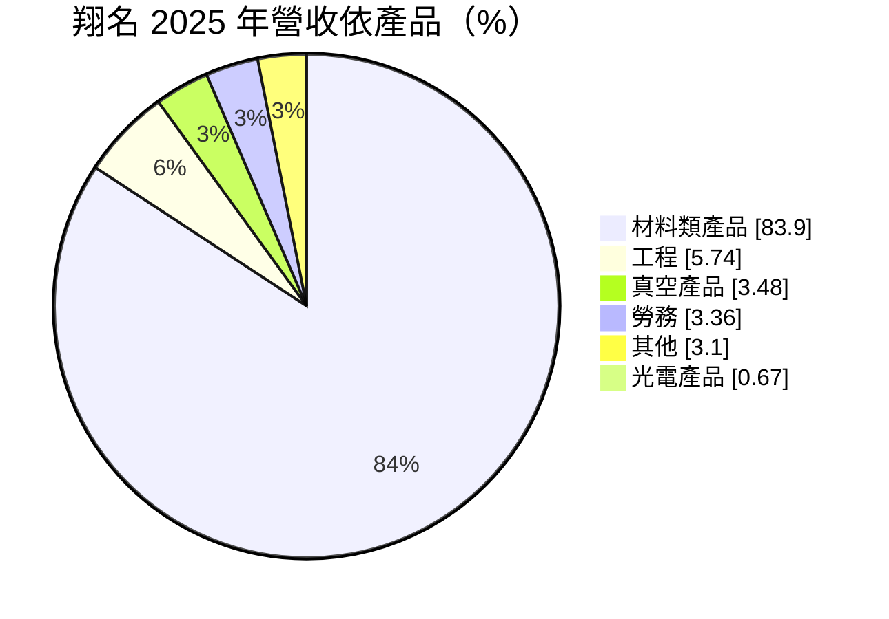
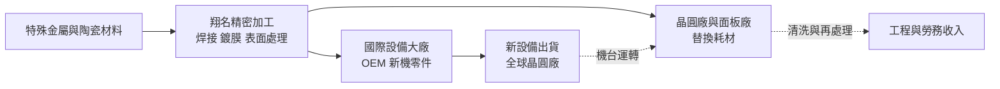
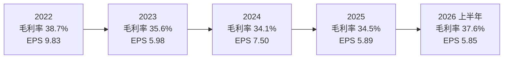
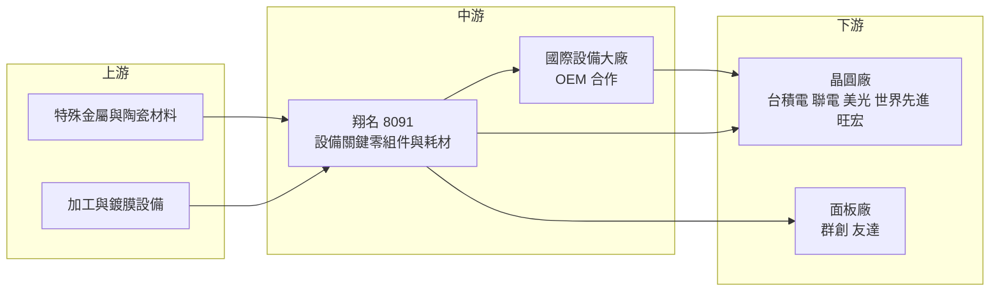

# 8091 翔名

> 上櫃｜[[產業索引-半導體業|半導體業]]｜上市（櫃）日期 2004/06/24

# 第一章：企業模式與商業藍圖

> [!info] 撰寫說明
> 本文由 Claude 依公開資料整理，架構比照 [[2330台積電]] 的四章研究，資料截至 2026-10-08。財務數字來源：櫃買中心開放資料（基本資料、綜合損益、資產負債、本益比殖利率）、Goodinfo 台灣股市資訊網年度經營績效、MoneyDJ 理財網（康和證券）公司基本資料、富果研究 2025 年 9 月翔名法說會整理、理財周刊 2026 年 6 月報導、nStock；產業描述為整理性內容，尚未逐條比對原始文件。#待校對

在評估單一個股的長期投資價值時，首要步驟是拆解企業的底層獲利邏輯。本章針對翔名科技（股票代號：8091，以下簡稱翔名）的商業模式進行定性分析，說明它如何從離子植入機的耗材零件起家，成為台灣半導體設備關鍵零組件的重要供應商，並逐步把精密加工、焊接與鍍膜能力延伸到更多前段製程設備。

## 一、核心定位：半導體設備的「耗材與關鍵零件」供應商

翔名成立於 1991 年，2004 年在櫃買中心掛牌，總部位於新竹市香山區。依理財周刊 2026 年 6 月報導，翔名是台灣半導體[[離子植入]]機關鍵零組件的最大供應商，提供從設計到製造的 OEM 與 ODM 服務。

要理解翔名，先要理解「設備耗材」這門生意。晶圓廠的機台在運作過程中，有許多零件會因高溫、電漿或離子束轟擊而逐漸損耗，必須定期更換。以離子植入機為例，它用高能離子束把摻雜元素打進晶圓，機台內部的離子源、電極、遮罩等零件長期承受轟擊，壽命有限。這些零件就像汽車的煞車皮或濾網，只要機台在運轉，就會持續產生更換需求。

翔名的客戶分成兩類。第一類是晶圓廠與面板廠，依理財周刊報導，包括 [[2330台積電]]、[[2303聯電]]、美光、[[5347世界先進]]、[[2337旺宏]]、[[3481群創]]、[[2409友達]]，它們直接向翔名採購替換用耗材。第二類是國際半導體設備大廠（OEM），翔名替它們製造零組件，零件隨設備銷往全球。富果研究整理的 2025 年 9 月法說會資料顯示，半導體相關營收約占九成，2025 上半年半導體製造與服務占 93%、光電占 7%。

## 二、終端應用／產品板塊：材料類產品為絕對主力

依 MoneyDJ 理財網的 2025 年營收分類，翔名營收結構如下：

* **材料類產品（約 84%）：** 主要是離子植入機與其他前段設備使用的耗材與關鍵零件。法說會提到，產品已用於離子植入、薄膜、黃光、蝕刻與清洗、量測檢驗等前段製程設備，技術涵蓋精密加工、電子束焊接、表面處理、鍍膜與自動清洗。
* **工程與勞務（合計約 9%）：** 包括零件清洗、維修與工程服務。耗材使用後經過清洗與再處理可以延長壽命，這類服務讓翔名與晶圓廠的往來更加緊密。
* **真空產品（約 3.5%）：** 真空腔體與相關零件，半導體設備大多在真空環境下運作，真空零件是另一個需要精密加工與焊接能力的市場。
* **光電產品（約 0.7%）：** 包括 LED 與面板設備的耗材與代理，比重已大幅縮小。

理財周刊也提到，翔名內銷約 47%、外銷約 53%，外銷部分多是透過國際設備大廠的設備出貨到全球。

## 三、資本轉化邏輯：裝機量帶動的經常性耗材收入

翔名的獲利邏輯有一個重要特色：營收與「全球累積的機台數量」連動，而不只是和「當年新買的機台數量」連動。晶圓廠擴產時會購買新設備，翔名可以透過 OEM 零件分享這波需求；擴產結束後，這些機台仍要運轉十年以上，每一台都會持續消耗零件。因此，耗材業務比純設備業務更有延續性，景氣下行時營收的下滑幅度通常小於設備廠。

此外，產能利用率也會影響耗材需求。晶圓廠稼動越高，離子植入機運轉時間越長，零件更換頻率就越高。這解釋了翔名在 2023 年半導體庫存調整期營收略降，但並未出現崩跌：2023 年營收 18.1 億元，只比 2022 年的 20 億元少約一成。

在產能布局上，法說會提到兩座新廠。日本熊本廠預計 2026 年第一季進機，初期生產離子植入耗材，就近服務日本客戶；嘉義馬稠後廠預計 2027 年第一季進機，建置高階焊接與表面處理產線，主攻蝕刻製程耗材。這兩座新廠代表翔名從「新竹單一據點」走向「台灣多地加日本」的布局。

## 四、企業長期藍圖：從離子植入延伸到更多前段製程

* **與國際大廠共同開發高門檻零件：** 法說會提到，翔名的策略是與國際設備大廠共同開發，切入模組組裝、先進製程耗材等門檻較高的產品，並鎖定三大目標市場：設備及製程模組、鍍膜製程零件、真空電漿腔特殊零件。從單一零件走向模組組裝，可以提高單一客戶的採購金額與黏著度。
* **六大研發主題：** 包括特化管路（用於 3 奈米以下製程，已量產）、真空異質焊接（非半導體，驗證中）、陶瓷鍍膜、光學濾光器、波紋管與光學反射器。其中陶瓷鍍膜與蝕刻耗材是前段製程中消耗量大的品項，若能成功量產，可望成為材料類產品之外的第二條成長線。
* **[[先進封裝]]與非半導體：** 先進封裝治具已進入驗證並有少量出貨；理財周刊也提到翔名進入航太精密加工領域。這些布局的目的在於把精密加工能力用在更多產業，降低對半導體單一景氣的依賴。
* **多地設廠分散風險：** 熊本廠與嘉義廠的設立，既是跟隨客戶在日本擴產，也是分散地緣政治與關稅風險。對國際客戶而言，供應商在台灣以外有產能，是供應鏈安全的加分條件。

# 第二章：護城河深度與競爭優勢

在長期價值投資中，「護城河」指企業抵禦競爭、維持超額利潤的保護機制。本章分析翔名的護城河構成、全球主要競爭對手，以及這些優勢在設備原廠與在地供應商的競爭中能守住多少。

## 一、翔名護城河的核心組成要素

翔名的護城河屬於「中等寬度、以認證與服務為基礎」的類型。

* **1. 晶圓廠的零件認證門檻：** 半導體晶圓廠對機台內的每個零件都有嚴格要求，零件的材質純度、尺寸精度與表面處理都可能影響[[良率]]。替換用耗材必須通過晶圓廠的驗證才能上線，驗證通過後，晶圓廠通常不會為了小幅降價就更換供應商，因為一旦出問題，損失遠大於節省的零件成本。
* **2. 完整的製程技術鏈：** 法說會強調，翔名擁有從精密加工到鍍膜、焊接、表面處理、清洗的完整技術鏈。許多零件需要多道特殊製程，能在同一家公司完成，可以縮短交期並確保品質一致，這是一般機械加工廠難以複製的能力。
* **3. 隨設備大廠出貨全球：** 翔名替國際設備大廠製造 OEM 零件，零件隨設備銷往全球晶圓廠。這讓翔名不必自己在每個國家建立銷售網絡，就能分享全球半導體擴產的需求。
* **4. 經常性的耗材需求：** 機台一旦安裝，就會在十年以上的使用期間持續消耗零件。累積的裝機量越大，翔名的經常性收入基礎就越穩固，這讓它的營收波動小於設備廠。

## 二、全球主要競爭對手格局

| 對手 | 定位 | 對翔名的威脅 |
|---|---|---|
| [[AMAT應用材料]] | 全球最大半導體設備廠，也銷售原廠零件 | 原廠零件與服務合約，掌握設備設計 |
| Axcelis | 離子植入機專業大廠，提供原廠耗材 | 在離子植入耗材直接競爭 |
| [[3413京鼎]] | 台灣半導體設備零組件與模組代工 | 在設備零組件與模組組裝重疊 |
| [[6196帆宣]] | 設備代工與廠務工程 | 在設備模組與工程服務部分重疊 |
| 其他台灣精密加工與清洗再生廠 | 零件加工與清洗服務 | 在一般零件與清洗服務以價格競爭 |

理財周刊報導將 Applied Materials 與 Axcelis 列為翔名的主要競爭對手，兩者既是設備原廠，也銷售原廠零件。

## 三、優勢轉化：哪些市場守得住、哪些守不住

* **守得住：** 台灣晶圓廠離子植入機的替換耗材。翔名在這個市場耕耘超過三十年，與台灣主要晶圓廠建立了長期的認證與服務關係，在地服務的反應速度與成本都優於國外原廠。這是翔名最穩固的基本盤。
* **較難守住：** 標準化程度高、加工門檻較低的一般零件，以及設備原廠嚴格控管的核心零件。前者容易被其他精密加工廠以價格搶單；後者則受原廠的設計專利與服務合約保護，翔名需要與原廠合作才能切入。
* **觀察重點：** 第一，熊本廠與嘉義廠能否如期量產並取得客戶認證，這決定翔名能否從新竹單一據點擴展為多地供應商。第二，蝕刻與鍍膜耗材能否成為材料類產品之外的成長支柱。第三，毛利率能否在擴產期間維持在 35% 左右，代表新產品的定價能力。

# 第三章：財務體質與盈利規模

資料日期：2026-10-08。數字取自櫃買中心開放資料與 Goodinfo 年度經營績效，表格是撰寫當時的快照；最新月營收、毛利率、累計 EPS 由自動排程寫在本筆記的屬性欄位（月營收、毛利率、累計EPS 等）。#待校對

財務報表是檢驗護城河是否真實存在的最終標準。本章用三率、[[ROE]]、現金流與資本報酬，檢視翔名在半導體景氣循環中的獲利品質。

## 一、獲利能力的基石：三率

| 年度 | 營收（億元） | [[毛利率]] | [[營業利益率]] | EPS（元） | [[ROE]] |
|---|---|---|---|---|---|
| 2019 | 12.0 | 32.2% | 15.7% | 3.30 | 6.2% |
| 2020 | 13.1 | 36.8% | 19.5% | 4.00 | 7.4% |
| 2021 | 16.2 | 33.5% | 18.2% | 5.92 | 10.5% |
| 2022 | 20.0 | 38.7% | 24.7% | 9.83 | 16.1% |
| 2023 | 18.1 | 35.6% | 17.9% | 5.98 | 9.4% |
| 2024 | 20.0 | 34.1% | 16.7% | 7.50 | 10.8% |
| 2025 | 21.4 | 34.5% | 18.2% | 5.89 | 8.1% |
| 2026 上半年 | 15.41 | 37.6% | 23.4% | 5.85 | 年化約 14.7%（推算） |

註：2019 至 2025 年取自 Goodinfo 年度經營績效；2026 上半年取自櫃買中心綜合損益開放資料（營收 15.41 億元、營業毛利 5.80 億元、營業利益 3.61 億元），三率由本文計算。2026 上半年 ROE 以歸屬母公司淨利 3.09 億元乘以 2，除以 2026 年第二季底歸屬母公司權益 41.99 億元推算。

* **[[毛利率]]長期穩定：** 2019 至 2025 年，翔名毛利率都落在 32% 至 39% 之間，波動遠小於一般半導體設備或記憶體公司。這說明耗材生意的定價能力相對穩定，晶圓廠景氣差時減少的是用量，而不是大幅壓低零件價格。
* **[[營業利益率]]與營運槓桿：** 營業利益率在 15.7% 至 24.7% 之間。2026 上半年營收大幅成長，營業利益率升到 23.4%，接近 2022 年的高峰，顯示營收成長時費用增加幅度較小，產生[[營運槓桿]]。
* **業外影響：** 法說會提到 2025 年第二季因匯兌損失約 6,500 萬元，單季 EPS 只有 0.74 元。翔名外銷比重約五成，匯率波動會透過業外損益影響淨利，這也是 2025 年 EPS 低於 2024 年、但營業利益率反而較高的原因之一。

## 二、[[ROE]]：資本效率

翔名的 ROE 長期在 6% 至 16% 之間，2021 至 2025 年平均約 11.0%（推算）。以一家毛利率三成以上、幾乎無負債的公司來說，ROE 不算高，主要原因是股東權益規模大：2026 年第二季底歸屬母公司權益約 41.99 億元，其中資本公積約 22.46 億元，占比超過一半，代表過去曾以溢價增資或可轉換公司債轉換等方式籌資（推估，資本公積來源細節未查得）。資產中也包括不少現金與金融資產，拉低了整體報酬率。

營收方面，2019 年 12.0 億元成長到 2025 年 21.4 億元，六年年複合成長率約 10.1%（推算），成長速度與台灣晶圓廠擴產節奏大致同步，而且沒有出現大幅衰退的年度。

## 三、資本支出與[[自由現金流]]

* **[[CapEx]] 進入擴張期：** 熊本廠與嘉義馬稠後廠的建設，代表翔名在 2025 至 2027 年進入資本支出較高的階段（具體金額未查得）。2026 年第二季底非流動資產約 24.50 億元，占總資產約 43%，比過去以加工為主的輕資產結構更重。新廠量產後，折舊增加會在初期壓抑毛利率，需要靠新產品放量抵銷。
* **財務結構：** 2026 年第二季底負債總計約 14.08 億元，非流動負債只有約 1.00 億元，財務槓桿低。
* **股利政策：** 翔名長期維持高配息。富果法說會整理提到，2023 與 2024 年股利配發率都超過 100%，現金股利分別為 6 元與 8 元；依櫃買中心資料，最近一年度現金股利約 4.22 元，以 2025 年 EPS 5.89 元計算，[[配息率]]約 72%（推算）。nStock 顯示近五年平均現金股利約 5.82 元。配發率超過 100% 的年度，代表公司動用過去的保留盈餘或資本公積配發，顯示經營層重視股東現金回報。

## 四、[[ROIC]] 與 [[WACC]]：價值創造利差

* **ROIC（推算）：** 以 2025 年營收 21.4 億元乘以營業利益率 18.2%，營業利益約 3.89 億元，乘以（1－20% 稅率）得到稅後營業利益約 3.12 億元。投入資本以 2026 年第二季底權益總計 42.40 億元（含非控制權益）加上非流動負債 1.00 億元（有息負債明細未查得，以非流動負債作為上限近似）計算，約 43.40 億元。2025 年 ROIC 約 3.12 ÷ 43.40 ≈ 7.2%（推算）。若以 2026 上半年營業利益 3.61 億元年化，稅後營業利益約 5.77 億元，ROIC 約 13.3%（推算）。由於權益中包含現金與金融資產，實際投入營運的資本報酬率應高於上述數字。
* **WACC（推算）：** 無風險利率取台灣 10 年期公債約 1.75%，市場風險溢酬取 6%，β 值取 MoneyDJ 理財網頁面顯示的 0.86，股東權益成本約 1.75% + 0.86 × 6% ≈ 6.9%。稅前負債成本假設 2.5%、稅率 20%，以權益約 98% 的資本結構加權，WACC 約 6.8%（推算）。
* **價值創造判斷：** 2025 年 ROIC 約 7.2% 略高於 WACC 約 6.8%，利差很薄；2026 上半年年化 ROIC 約 13.3%，利差擴大到約 6.5 個百分點。2022 年景氣高峰時 ROIC 也明顯高於 WACC（推估）。整體而言，翔名的本業長期能賺回資金成本，但因帳上資本規模大，價值創造的幅度受到稀釋。新廠投產後的報酬率，是判斷這輪擴張能否提升長期價值的關鍵。

# 第四章：總體風險與地緣政治

任何企業都無法脫離宏觀環境獨立存在。本章分析翔名未來必須面對的地緣政治、產業週期、營運與技術風險。

## 一、地緣政治風險

* **客戶集中於台灣晶圓廠：** 翔名的主要客戶是台灣的晶圓廠與面板廠，與台灣半導體產業的命運高度綁定。兩岸情勢若升溫，晶圓廠營運受影響，翔名的耗材需求也會同步下滑。熊本廠的設立是分散風險的第一步，但台灣仍是營收主力。
* **客戶海外設廠的機會與挑戰：** 台積電等客戶在日本、美國與歐洲設廠，翔名需要跟隨客戶在當地提供耗材與服務，否則可能被當地供應商取代。熊本廠是跟隨日本擴產的布局，其他地區的服務能力仍待建立。
* **出口管制：** 半導體設備與零組件屬於美國出口管制的重點項目，若管制範圍擴大到特定零件或客戶，可能影響翔名部分外銷業務。

## 二、產業週期與市場結構風險

* **半導體資本支出循環：** 晶圓廠擴產時，OEM 零件需求增加；擴產暫停時，新機零件需求會明顯下降。雖然耗材收入可以緩衝，但翔名的成長速度仍與半導體資本支出循環高度相關。
* **晶圓廠利用率：** 記憶體或成熟製程景氣低迷時，晶圓廠利用率下降，耗材更換頻率也會降低，2023 年營收小幅下滑即反映這一點。
* **原廠零件政策：** 設備原廠可能透過服務合約或設計變更，限制第三方耗材的使用，壓縮翔名的替換耗材市場。

## 三、營運環境的隱性風險

* **新廠執行風險：** 熊本廠與嘉義廠需要取得客戶認證才能量產，若認證進度延遲，新增的折舊與人力成本會先壓縮獲利。日本的人力與營運成本也高於台灣。
* **匯率：** 外銷約占五成，新台幣升值會造成匯兌損失，2025 年第二季約 6,500 萬元的匯損即是一例。
* **原物料：** 耗材使用的特殊金屬與陶瓷材料價格波動，可能影響成本。

## 四、科技演進風險

半導體製程持續微縮，從 [[FinFET]] 走向環繞閘極電晶體，並大量採用[[先進封裝]]，製程步驟與設備種類都在改變。離子植入在新製程中的使用次數與規格可能變化，蝕刻、薄膜沉積與清洗的步驟則持續增加。翔名必須跟著製程演進開發新零件，例如法說會提到的 3 奈米以下特化管路與陶瓷鍍膜，才能維持在先進製程中的地位。若翔名的產品長期停留在成熟製程的離子植入耗材，成長空間會受限；反之，若能把完整的加工、焊接與鍍膜技術鏈延伸到蝕刻與先進封裝，就能隨著製程複雜度提升而擴大市場。

# 專有名詞解析

## 半導體

- **[[離子植入]]**：用高能離子束把硼、磷等摻雜元素打進晶圓，改變局部電性的製程，是製作電晶體的關鍵步驟。
- **[[蝕刻]]**：用化學液或電漿把晶圓表面不需要的材料移除，形成電路圖形的製程。
- **[[電漿]]**：氣體被高能量激發後形成的帶電狀態，半導體蝕刻與薄膜沉積設備大量使用。
- **[[先進封裝]]**：把多顆晶片以高密度方式整合在一起的封裝技術，例如 CoWoS、SoIC。
- **[[FinFET]]**：鰭式場效電晶體，把電晶體通道做成立體鰭片以降低漏電，是 16 至 3 奈米的主流架構。
- **[[良率]]**：一片晶圓上合格晶片所占的比例，晶圓廠對任何可能影響良率的零件都嚴格把關。

## 金融

- **[[營運槓桿]]**：固定成本占比高的公司，營收小幅變動會造成營業利益大幅變動的現象。
- **[[配息率]]**：現金股利占每股盈餘的比例，反映公司把多少獲利回饋給股東。
- **[[自由現金流]]**：營業活動現金流減去資本支出，代表企業可自由用於配息、還債或併購的現金。

## 產業

- **[[設備耗材]]**：半導體機台運轉時會逐漸損耗、需定期更換的零件，需求隨機台數量與運轉時間增加。
- **[[電子束焊接]]**：在真空中以高速電子束熔接金屬，焊縫細窄、純度高，適合精密真空零件。
- **[[陶瓷鍍膜]]**：在零件表面鍍上一層耐電漿的陶瓷材料，延長蝕刻設備零件的壽命並減少微粒污染。
- **[[OEM]]**：原始設備製造，替其他公司依其規格生產零件或產品，再由對方以自有品牌銷售。

# 核心供應鏈

## 1. 上游：材料與加工設備
- 特殊金屬與陶瓷材料供應商（具體供應商未查得）
- 精密加工、焊接與鍍膜設備

## 2. 中游：翔名與設備大廠
- 離子植入耗材、真空零件、鍍膜零件與工程服務：翔名
- 國際半導體設備大廠（OEM 客戶），同時也是原廠零件的競爭者：[[AMAT應用材料]]、Axcelis

## 3. 下游：晶圓廠與面板廠
- 晶圓廠：[[2330台積電]]、[[2303聯電]]、美光、[[5347世界先進]]、[[2337旺宏]]
- 面板廠：[[3481群創]]、[[2409友達]]

## 4. 同業
- 設備零組件與模組：[[3413京鼎]]、[[6196帆宣]]

延伸閱讀：[[台積電供應鏈]]

## 供應鏈關係
- 供應給 [[2330台積電]]：離子植入機耗材與零組件（台積電供應鏈 › 上游：在地設備零組件與代工）

## 最新新聞
<!-- news:start -->
<!-- news:end -->

## 相關連結
- [公開資訊觀測站](https://mopsov.twse.com.tw/mops/web/t05st03?step=1&firstin=1&co_id=8091)
- [Goodinfo](https://goodinfo.tw/tw/StockDetail.asp?STOCK_ID=8091)
- [Yahoo 股市](https://tw.stock.yahoo.com/quote/8091)
- [鉅亨網新聞](https://www.cnyes.com/twstock/8091/news)
