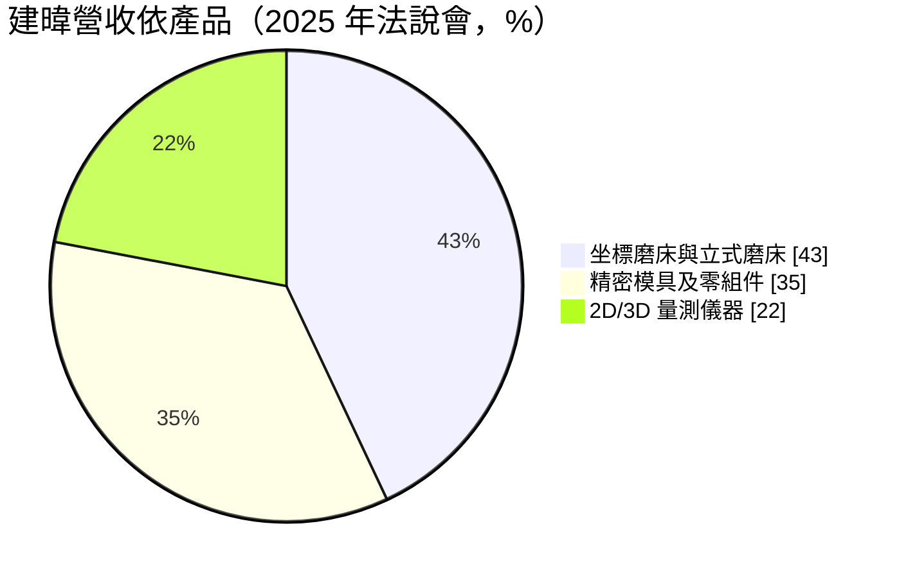
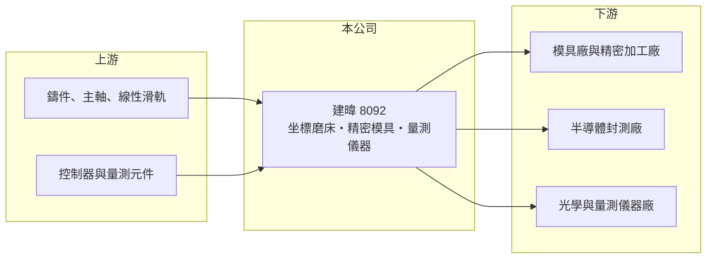

# 8092 建暐

> 上櫃｜[[產業索引-其他電子業|其他電子業]]｜上市（櫃）日期 2004/02/02

# 第一章：企業模式與商業藍圖

> [!info] 撰寫說明
> 精簡版，由 Claude 依公開資料整理，架構比照 [[2330台積電]]，資料截至 2026-10-08。來源：富果研究 2025 年 12 月建暐法說會整理、nStock 建暐公司概況、MoneyDJ 理財網財務比率年表（2021 至 2025 年）。#待校對

建暐精密是台灣少數能自製坐標磨床的工具機廠，同時替半導體封裝廠製作精密模具與零件，並銷售量測儀器。

- **核心業務：** 建暐成立於 1981 年，產品分三條線：坐標磨床與立式磨床、IC 封裝模具與精密零組件加工，以及 2D／3D 量測儀器。[[坐標磨床]]是用來加工模具上高精度孔位的母機，建暐自稱為全球五大坐標磨床製造商之一。
- **營收結構：** 依 2025 年 12 月法說會，磨床占營收 43%、精密模具及零組件 35%、量測儀器 22%。外銷占 66%，主要市場為中國、土耳其、印度、東南亞與東歐，內銷占 34%。
- **營運據點：** 公司在台灣生產，員工約 174 人，2004 年在櫃買中心掛牌，資本額約 5.7 億元。客戶包括日本光學儀器大廠、[[3711日月光投控]]、恩智浦，以及德國量測儀器客戶。
- **長期方向：** 公司採自有品牌（OBM）與代工設計（[[ODM]]）雙軌，開拓印度與越南等新興製造市場，並在台灣鎖定[[先進封裝]]與[[矽光子]]所需的精密模具與零件。這些方向若成功，可以讓營收從傳統模具業轉向半導體相關的高精度需求。

# 第二章：護城河深度與競爭優勢

建暐的護城河來自坐標磨床這種少量、高精度母機的技術累積，但規模小，抗景氣能力有限。

- **競爭優勢：** 坐標磨床的精度取決於機構設計、熱變形控制與組裝經驗，新進者很難在短期內追上，這讓建暐能在全球少數供應商中占有一席。公司同時懂得用自家設備做精密模具，設備與加工服務可以互相驗證，這是一般模具廠沒有的優勢。
- **主要對手：** 坐標磨床的主要對手是瑞士 Hauser 等歐洲老牌與日本精密磨床廠，品牌與精度領先；精密模具與零件方面，對手是台灣與東南亞眾多模具廠。
- **觀察重點：** 長期要看半導體先進封裝與矽光子相關模具能否形成穩定訂單，以及新興市場的工具機銷售能否抵銷中國需求的波動。量測儀器若能配合 AI 自動量測做出差異化，有助提高毛利率。

# 第三章：財務體質與盈利規模

資料日期：2026-10-08，表格是撰寫當時的快照；最新月營收、毛利率、累計 EPS 由自動排程寫在本筆記的屬性欄位（月營收、毛利率、累計EPS 等）。#待校對

建暐毛利率約在一到兩成，但營業費用相對營收偏高，近五年多數年度本業虧損。

| 年度 | 營收（億元） | [[毛利率]] | [[營業利益率]] | EPS（元） | [[ROE]] |
|---|---|---|---|---|---|
| 2021 | 約 3.4（推算） | 10.53% | -6.66% | -0.58 | -7.40% |
| 2022 | 約 4.2（推算） | 17.16% | 2.25% | 0.14 | 1.82% |
| 2023 | 約 4.3（推算） | 17.71% | 1.88% | 0.03 | 0.32% |
| 2024 | 約 3.2（推算） | 20.51% | -9.36% | -0.50 | -5.53% |
| 2025 | 3.44 | 16.11% | -6.87% | 0.00 | 0.02% |

註：2025 年營收取自 nStock；其他年度依 MoneyDJ 營收成長率回推。

- **長期指標：** 2021 至 2025 年營收大致持平（年複合成長率約 0%，推算），近 5 年平均 ROE 約 -2.2%（推算）。負債比率由 2021 年的 62.94% 降到 2025 年的 38.11%，財務結構明顯改善；近五年沒有配發股利。
- **[[ROIC]] 與 [[WACC]]：** 2025 年稅後營業利益約 -0.19 億元，ROIC 約 -2.6%（推算：分母為股東權益約 5.6 億元加有息負債以總負債一半推估約 1.7 億元）。WACC 推估約 6.4%（推算：無風險利率 1.75%、市場風險溢酬 6%、β 取工具機同業常見值 1.0，股東權益成本 7.75%；稅前負債成本 2.5%、稅率 20%；權益比重約 76%）。ROIC 長期低於 WACC，公司尚未證明能替股東創造價值。
- **財務特色：** 工具機屬於接單生產，營收容易因一兩張大單而大幅波動，2024 年營收年減 26.27% 就是例子。規模小使得研發與管理費用難以攤提，營收需要明顯放大才能穩定獲利。

# 第四章：總體風險與地緣政治

建暐的風險在於工具機景氣循環與中國市場的不確定性。

- **產業週期：** 工具機屬於資本設備，客戶在景氣好時擴產、景氣差時延後採購，訂單波動遠大於終端消費。模具與零件業務也跟著半導體封裝廠的擴產週期起伏。
- **營運風險：** 營收規模只有數億元，任何大客戶延後交貨都會直接影響當年損益。高精度母機的關鍵零件與人才不易取得，技術傳承是長期課題。
- **其他風險：** 外銷占三分之二，新台幣升值會壓縮報價空間；中國市場面臨當地工具機國產化，而美中科技管制可能限制部分設備出口。

# 專有名詞解析

## 半導體

- **[[先進封裝]]**：把多顆晶片以中介層、混合鍵合等方式高密度整合的封裝技術，例如 CoWoS、SoIC。
- **[[矽光子]]**：在矽晶片上製作光學元件，以光取代電傳輸資料，可降低 AI 資料中心的傳輸耗電。

## 金融

- **[[ROIC]]**：投入資本報酬率，稅後營業利益除以股東權益加有息負債，衡量本業運用資本的效率。
- **[[WACC]]**：加權平均資金成本，股東與債權人要求報酬率的加權平均，是 ROIC 要超越的門檻。

## 產業

- **[[坐標磨床]]**：以座標定位、對工件內孔與輪廓做高精度研磨的工具機，是製作精密模具的母機。
- **[[ODM]]**：原廠委託設計製造，由代工廠負責設計與生產，產品掛客戶品牌銷售。

# 核心供應鏈

- 上游：鑄件、主軸、線性滑軌（如 [[2049上銀]]）、控制器與量測元件供應商
- 下游／客戶：[[3711日月光投控]]、恩智浦、日本光學儀器大廠、德國量測儀器客戶，以及中國、印度、東南亞的模具與加工廠
- 同業：瑞士與日本精密磨床廠、台灣工具機與模具廠

## 最新新聞
<!-- news:start -->
<!-- news:end -->

## 相關連結
- [公開資訊觀測站](https://mopsov.twse.com.tw/mops/web/t05st03?step=1&firstin=1&co_id=8092)
- [Goodinfo](https://goodinfo.tw/tw/StockDetail.asp?STOCK_ID=8092)
- [Yahoo 股市](https://tw.stock.yahoo.com/quote/8092)
- [鉅亨網新聞](https://www.cnyes.com/twstock/8092/news)
