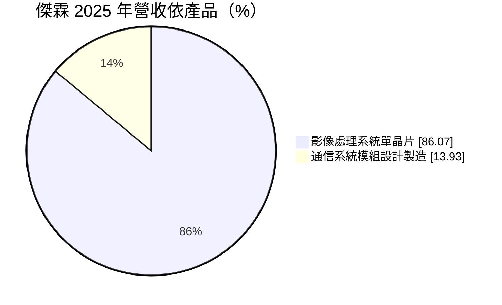
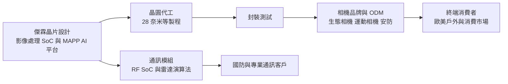
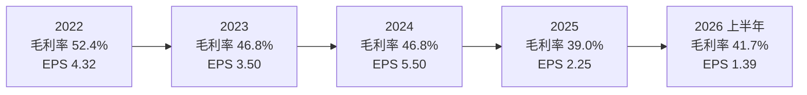
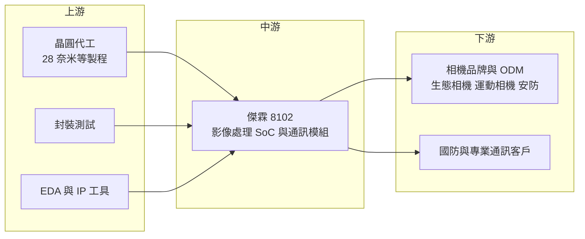

# 8102 傑霖科技

> 上櫃｜[[產業索引-半導體業|半導體業]]｜上市（櫃）日期 2025/12/22

# 第一章：企業模式與商業藍圖

> [!info] 撰寫說明
> 本文由 Claude 依公開資料整理，架構比照 [[2330台積電]] 的四章研究，資料截至 2026-10-08。財務數字來源：櫃買中心開放資料（基本資料、綜合損益、資產負債、本益比殖利率）、Goodinfo 台灣股市資訊網年度經營績效（2022 至 2025 年）、MoneyDJ 理財網（康和證券）公司基本資料、經濟日報 2025 年 11 月報導、優分析轉載之 2025 年 11 月上櫃前業績發表會報導、旺得富理財網；產業描述為整理性內容，尚未逐條比對原始文件。#待校對

在評估單一個股的長期投資價值時，首要步驟是拆解企業的底層獲利邏輯。本章針對傑霖科技（股票代號：8102，以下簡稱傑霖）的商業模式進行定性分析，說明一家營收只有數億元的小型 IC 設計公司，如何在生態追蹤相機等「大廠看不上」的利基市場站穩腳步，並嘗試以邊緣 AI 與國防通訊模組開出新的成長路線。

## 一、核心定位：利基型影像處理 SoC 設計公司

傑霖成立於 1992 年，總部位於新北市中和區，2025 年 12 月 22 日在櫃買中心掛牌上櫃，實收資本額約 2.34 億元，是規模很小的 IC 設計公司。董事長兼總經理為梁春林。傑霖屬於 [[Fabless]] 模式：公司負責晶片架構與電路設計，晶圓製造與封裝測試委外生產。

傑霖的核心產品是影像處理系統單晶片（[[SoC]]），也就是相機裡負責把感測器拍到的原始訊號轉成影像、壓縮成影片並存檔的「大腦」。它的應用不是手機或監視器這類大眾市場，而是數位相機、生態追蹤攝影機（[[Trail Camera]]）、運動攝影機、戶外安防、夜視裝置與警用與行車記錄系統等利基產品。這些產品的出貨量遠小於手機，大型晶片公司通常不會為它們設計專用晶片，傑霖則長期深耕，成為這類產品的主要晶片供應商之一。

除了影像 SoC，傑霖也有一條通訊系統模組業務，主要應用於國防雷達。依優分析轉載的 2025 年 11 月上櫃前業績發表會報導，傑霖具備自研 [[RF SoC]]、雷達演算法與系統整合能力，並受惠台灣提升國防預算與國防自主政策。

## 二、終端應用／產品板塊

依 MoneyDJ 理財網的 2025 年營收分類，傑霖營收結構如下：

* **影像處理 SoC（約 86%）：** 是傑霖的長期本業，報導形容這是一項成熟、毛利與現金流穩定的業務。2025 年推出 6580 與 2580 兩個高階系列，採用 28 奈米製程，報導指出公司最大與第二大客戶都已採用，相關專案從原本 2 個增加到 20 個以上；公司預估 2026 年高階 IC 占 SoC 營收比重可能超過四成。
* **通訊系統模組（約 14%）：** 應用於國防雷達、嵌入式平台與特殊環境通訊設備。這類產品的客戶門檻高、毛利率高，公司預期 2026 年通訊模組業務的成長幅度與影像 SoC 相當。

應用市場方面，旺得富理財網報導引用的市場研究提到，生態追蹤相機市場規模預估由 2.5 億美元成長到 2033 年的 4 億美元。報導也提到美國自 2026 年起在 14 個州實施校園禁用手機措施，可能推升輕便型數位相機的需求。這些數據顯示傑霖所在的市場規模不大，但仍有穩定成長空間。

## 三、資本轉化邏輯：小市場、高毛利的晶片設計

傑霖的獲利邏輯有三個特點。第一，晶片設計的成本主要是研發人力與[[光罩]]，晶片量產後每多賣一顆的邊際成本很低，因此毛利率可以維持在四成以上；Goodinfo 數據顯示 2022 至 2024 年毛利率都在 46.8% 至 52.4% 之間。

第二，利基市場的客戶數量少但黏著度高。相機品牌一旦採用傑霖的晶片並完成產品開發，通常會在後續數代產品延續使用，因為更換晶片需要重寫軟體、重新調校影像品質。

第三，產品成本控制是競爭關鍵。報導提到，同業多採用 DDR3 記憶體，傑霖的晶片使用較便宜的 [[DDR2]] 即可支援 4K 30fps 錄影，讓客戶的整機成本更低。對價格敏感的生態相機與入門相機市場而言，這種「幫客戶省錢」的設計是重要賣點。

傑霖本身是輕資產公司。依櫃買中心資料，2026 年第二季底資產總計約 5.31 億元，其中流動資產約 3.76 億元；負債總計約 1.02 億元，財務結構單純。

## 四、企業長期藍圖：邊緣 AI 單晶片與國防通訊

* **以 MAPP 平台切入邊緣 AI：** 傑霖自主研發 MAPP 可程式平行處理平台，可提供最高 2 [[TOPS]] 的 AI 運算能力，讓單一晶片同時完成影像處理與[[邊緣AI]]運算。公司主張，相較於「影像晶片外掛 AI 晶片」的組合方案，單晶片在功耗、整合度與成本上更有優勢。對電池供電的生態相機與戶外裝置來說，低功耗是關鍵規格。
* **產品線上下延伸：** 公司規劃推出 40 奈米中階產品，並在 2027 年推出 22 奈米新品；下一代 SoC 目標支援 3,600 萬畫素與更高效率的 AI 運算。應用市場則規劃擴展到運動攝影機、無人機、戶外安防與行車紀錄器。
* **國防與專業通訊：** 通訊模組受惠台灣強化國防自主的政策，若能持續承接國防相關訂單，將成為與消費性相機不同景氣循環的第二條業務線。

傑霖在 2025 年底上櫃，取得資本市場的籌資管道，可以用來支應先進製程晶片的光罩與研發費用。這是公司從「小型利基晶片廠」走向「產品線較完整的影像 AI 晶片公司」的重要一步，但轉型能否成功，仍取決於高階新品的放量速度。

# 第二章：護城河深度與競爭優勢

在長期價值投資中，「護城河」指企業抵禦競爭、維持超額利潤的保護機制。本章分析傑霖的護城河構成、主要競爭對手，以及這些優勢在利基市場中能守住多少。

## 一、傑霖護城河的核心組成要素

傑霖的護城河屬於「利基市場型」：市場小到大廠不想進入，但專業度又高到新進者不容易做好。

* **1. 利基市場的專注：** 生態追蹤相機、夜視裝置等產品有特殊需求，例如長時間待機、低光源拍攝、紅外線觸發與極端溫度下運作。傑霖長期針對這些需求調整晶片與軟體，累積了大量客戶應用經驗，這些經驗不是一般影像晶片公司能快速複製的。
* **2. 軟硬體整合帶來的轉換成本：** 影像 SoC 不只是一顆晶片，還包括影像調校、韌體與開發工具。相機品牌採用傑霖方案後，產品的影像風格與功能都與晶片綁定，更換供應商需要重新開發，因此客戶關係具有黏著度。
* **3. 成本優勢的系統設計：** 用 DDR2 支援 4K 錄影、用單晶片整合影像與 AI 運算，都是從客戶整機成本出發的設計。在價格敏感的市場中，能幫客戶降低總成本的供應商較不容易被取代。
* **4. 國防通訊的進入門檻：** 國防雷達與特殊環境通訊需要資安、可靠度與長期供貨的保證，加上國防自主政策傾向採用本土供應商，這部分業務的競爭者有限。

## 二、主要競爭對手格局

| 對手 | 定位 | 對傑霖的威脅 |
|---|---|---|
| 安霸（Ambarella） | 美國影像處理與 AI 視覺晶片大廠 | 高階運動相機、安防與車用影像市場的領導者 |
| 中國影像 SoC 廠商（如君正、星宸科技） | 安防與消費性影像晶片 | 以價格與在地供應鏈優勢搶攻中低階市場 |
| [[2401凌陽]] | 台灣消費性多媒體晶片 | 在部分消費影像產品重疊 |
| 聯詠、瑞昱等大型 IC 設計公司 | 安防與影像處理晶片 | 若利基市場擴大，可能以規模優勢切入 |

公開報導未點名傑霖的直接競爭對手，上表為依產業結構整理的潛在競爭者，屬推估。

## 三、優勢轉化：哪些市場守得住、哪些守不住

* **守得住：** 生態追蹤相機與夜視裝置等專業利基市場。這些市場規模小、需求特殊，傑霖已有主要客戶的長期採用基礎，大廠缺乏進入誘因。
* **較難守住：** 一般安防攝影機與行車紀錄器。這些市場規模大，中國影像 SoC 廠商價格競爭激烈，傑霖規劃切入時將面對更強的對手，毛利率可能承壓。2025 年第三季毛利率 36.9%，比前一年同期減少 8.2 個百分點，顯示即使在本業，價格與產品組合的壓力也存在。
* **觀察重點：** 第一，6580 與 2580 高階系列能否如公司預估在 2026 年占 SoC 營收四成以上。第二，美國關稅政策對主要終端市場的影響是否持續，2025 年營收衰退就與關稅有關。第三，通訊模組的國防訂單能否穩定成長，形成與相機業務互補的營收來源。

# 第三章：財務體質與盈利規模

資料日期：2026-10-08。數字取自櫃買中心開放資料與 Goodinfo 年度經營績效，表格是撰寫當時的快照；最新月營收、毛利率、累計 EPS 由自動排程寫在本筆記的屬性欄位（月營收、毛利率、累計EPS 等）。#待校對

財務報表是檢驗護城河是否真實存在的最終標準。本章用三率、[[ROE]]、現金流與資本報酬，檢視傑霖這家小型 IC 設計公司的獲利品質。

## 一、獲利能力的基石：三率

| 年度 | 營收（億元） | [[毛利率]] | [[營業利益率]] | EPS（元） | [[ROE]] |
|---|---|---|---|---|---|
| 2021 | 未查得 | 未查得 | 未查得 | 未查得 | 未查得 |
| 2022 | 3.39 | 52.4% | 25.4% | 4.32 | 32.7% |
| 2023 | 3.77 | 46.8% | 22.6% | 3.50 | 27.0% |
| 2024 | 5.68 | 46.8% | 24.1% | 5.50 | 37.3% |
| 2025 | 4.35 | 39.0% | 14.7% | 2.25 | 12.6% |
| 2026 上半年 | 2.25 | 41.7% | 15.5% | 1.39 | 年化約 15.1%（推算） |

註：2022 至 2025 年取自 Goodinfo 年度經營績效，該頁未提供 2021 年以前資料；2026 上半年取自櫃買中心綜合損益開放資料（營收 2.25 億元、營業毛利 0.94 億元、營業利益 0.35 億元），三率由本文計算。2026 上半年 ROE 以稅後淨利 0.32 億元乘以 2，除以 2026 年第二季底權益 4.28 億元推算。2025 年底上櫃時辦理承銷，股本增加，2025 年後的 EPS 與 ROE 會因權益增加而被稀釋（推估）。

* **[[毛利率]]高但呈下滑趨勢：** 2022 至 2024 年毛利率維持在 47% 至 52%，是典型利基晶片公司的水準。2025 年降到 39.0%，原因包括美國關稅造成的需求下滑、產品組合變化與報價壓力。2026 上半年回升到 41.7%，公司表示新一代中低階產品上市後可望提升毛利率，這是觀察重點。
* **[[營業利益率]]受規模限制：** 傑霖營收規模只有數億元，研發與管理費用相對固定。2026 上半年營業費用約 0.59 億元，占營收約 26%，因此營收只要下滑，營業利益率就會明顯縮小，2025 年從 24.1% 降到 14.7% 就是例子。
* **營收波動：** 2022 年營收 3.39 億元，2025 年 4.35 億元，三年年複合成長率約 8.7%（推算）；但 2024 年達 5.68 億元後 2025 年又衰退約兩成，小型利基公司的營收容易受少數客戶與單一市場影響。

## 二、[[ROE]]：資本效率

傑霖在 2022 至 2024 年的 ROE 高達 27% 至 37%，2022 至 2025 年平均約 27.4%（推算），代表在上櫃前，公司以很少的資本創造了相當高的獲利。2025 年 ROE 降到 12.6%，一方面是獲利下滑，另一方面是上櫃承銷增資讓股東權益增加。2026 年第二季底每股淨值約 18.33 元，權益約 4.28 億元，其中資本公積約 1.07 億元。上櫃後的資本規模擴大，未來要維持過去的高 ROE，需要新產品帶動獲利成長。

## 三、資本支出與[[自由現金流]]

* **[[CapEx]] 低：** 作為 Fabless 公司，傑霖的資本支出主要是研發設備、EDA 工具與光罩，非流動資產只有約 1.55 億元。先進製程（28 奈米、22 奈米）的光罩費用遠高於成熟製程，未來研發投入會增加（具體金額未查得）。
* **現金流：** 由於輕資產與高毛利，傑霖在獲利年度應能產生正的自由現金流（推估，未查得歷年現金流量表）。
* **股利政策：** 依櫃買中心本益比殖利率資料，最近一年度現金股利約每股 1.0 元，以 2025 年 EPS 2.25 元計算，[[配息率]]約 44%（推算）。MoneyDJ 頁面顯示 2026 年上半年累計配發現金股利 0.9 元，公司可能採取一年多次配息（推估）。上櫃時間短，長期股利政策仍待觀察。

## 四、[[ROIC]] 與 [[WACC]]：價值創造利差

* **ROIC（推算）：** 以 2025 年營收 4.35 億元乘以營業利益率 14.7%，營業利益約 0.64 億元，乘以（1－20% 稅率）得到稅後營業利益約 0.51 億元。投入資本以 2026 年第二季底權益 4.28 億元加上非流動負債 0.25 億元（有息負債明細未查得，以非流動負債作為上限近似）計算，約 4.53 億元。2025 年 ROIC 約 0.51 ÷ 4.53 ≈ 11.3%（推算）。若以 2026 上半年營業利益 0.35 億元年化，稅後營業利益約 0.56 億元，ROIC 約 12.3%（推算）。
* **WACC（推算）：** 無風險利率取台灣 10 年期公債約 1.75%，市場風險溢酬取 6%。傑霖上櫃時間短，未查得 β 值，本文假設小型 IC 設計股常見的 1.0，股東權益成本約 1.75% + 1.0 × 6% ≈ 7.8%。稅前負債成本假設 2.5%、稅率 20%，以權益約 95% 的資本結構加權，WACC 約 7.4%（推算）。
* **價值創造判斷：** 2025 年 ROIC 約 11.3% 高於 WACC 約 7.4%，利差約 4 個百分點；2022 至 2024 年 ROE 長期在 27% 以上，當時 ROIC 遠高於 WACC（推估）。傑霖長期屬於創造價值的公司，但上櫃後資本增加、毛利率下滑，利差已明顯縮小。新產品能否讓 ROIC 回到兩成以上，是判斷它能否維持高品質成長的關鍵。

# 第四章：總體風險與地緣政治

任何企業都無法脫離宏觀環境獨立存在。本章分析傑霖未來必須面對的地緣政治、產業週期、營運與技術風險。

## 一、地緣政治風險

* **美國關稅與終端市場：** 傑霖的晶片多數用於銷往歐美市場的相機產品。報導指出，2025 年前 10 月營收年減 17.7%，主要原因就是美國關稅政策。終端市場若高度集中於美國，關稅、貿易政策與消費景氣都會直接影響訂單。
* **中國供應鏈：** 相機的組裝與模組廠多在中國，若美中貿易摩擦升高，客戶可能被迫調整生產基地，晶片供應商需要配合轉移支援。
* **國防業務的政策依賴：** 通訊模組業務受惠台灣國防自主政策，但國防預算與採購方向會隨政策調整，訂單節奏可能不穩定。

## 二、產業週期與市場結構風險

* **市場規模有限：** 生態相機等利基市場的總規模只有數億美元，成長空間有限。傑霖若要長期成長，必須切入規模更大但競爭也更激烈的安防、運動相機與行車紀錄器市場。
* **消費性景氣：** 數位相機與戶外裝置屬於非必需消費品，經濟衰退時需求會先下滑。
* **晶圓代工成本：** 28 奈米與更先進製程的晶圓與光罩價格較高，若代工價格上漲，小型 IC 設計公司的議價能力有限，毛利率可能受壓。

## 三、營運環境的隱性風險

* **客戶集中：** 報導提到最大與第二大客戶採用高階新品，顯示營收可能集中在少數相機品牌，單一客戶的產品週期變化就會影響傑霖的營收。
* **規模與人才：** 傑霖規模小，研發團隊有限，同時開發 40 奈米、28 奈米與 22 奈米多個世代產品，加上 AI 與雷達技術，資源分配壓力大。
* **上櫃後的股本稀釋：** 承銷增資擴大股本，若獲利無法同步成長，EPS 與 ROE 會被稀釋。

## 四、科技演進風險

影像處理晶片的技術演進快速，從 4K 錄影、HDR 到 AI 物件辨識，每一代產品的運算需求都在增加。大型晶片公司的 AI 視覺晶片持續降價，可能往下侵蝕利基市場；手機的影像能力不斷提升，也會擠壓入門數位相機的需求。傑霖的 MAPP 平台與單晶片 AI 方案，是因應這股趨勢的關鍵布局，但 2 TOPS 的運算能力相對於大廠產品仍屬入門等級。傑霖若能在低功耗、低成本的邊緣 AI 影像市場建立代表性產品，就能延續利基優勢；若技術落後，客戶可能轉向整合度更高的大廠方案。

# 專有名詞解析

## 半導體

- **[[SoC]]**：系統單晶片，把處理器、影像處理、記憶體控制等多種功能整合在同一顆晶片上。
- **[[Fabless]]**：只做晶片設計、不擁有晶圓廠的 IC 設計公司，製造委外給晶圓代工廠。
- **[[TOPS]]**：每秒兆次運算，衡量 AI 晶片運算能力的常用單位。
- **[[RF SoC]]**：把射頻收發電路與數位處理整合在同一晶片的系統單晶片，用於通訊與雷達。
- **[[DDR2]]**：較舊世代的 DRAM 記憶體規格，價格低於 DDR3 與 DDR4，適合成本敏感的嵌入式產品。
- **[[光罩]]**：把電路圖形轉印到晶圓上的模板，先進製程的一套光罩費用可達數千萬元以上。

## 應用

- **[[邊緣AI]]**：在終端裝置本身執行 AI 運算，而不是把資料傳回雲端處理，可降低延遲與耗電。
- **[[Trail Camera]]**：生態追蹤相機，架設在野外、以紅外線感應自動拍攝動物的相機，常用於狩獵與生態研究。

## 金融

- **[[配息率]]**：現金股利占每股盈餘的比例，反映公司把多少獲利回饋給股東。
- **[[自由現金流]]**：營業活動現金流減去資本支出，代表企業可自由用於配息、還債或併購的現金。

# 核心供應鏈

## 1. 上游：晶圓代工、封測與設計工具
- 晶圓代工：28 奈米與成熟製程（傑霖實際代工夥伴未查得）
- 設計工具：[[SNPS新思科技]]、[[CDNS益華電腦]]（產業主要供應商，實際採用情況未查得）

## 2. 中游：傑霖本身
- 影像處理 SoC（6580、2580 系列等）與 MAPP AI 平台
- 通訊系統模組（國防雷達與特殊環境通訊）

## 3. 下游：客戶與終端
- 數位相機、生態追蹤相機、運動攝影機、夜視裝置、警用與行車記錄系統的品牌與代工廠（客戶名稱未公開）
- 台灣國防與專業通訊設備客戶

## 4. 同業與競爭者
- 影像處理晶片：安霸（Ambarella）、中國影像 SoC 廠商、[[2401凌陽]]

## 最新新聞
<!-- news:start -->
<!-- news:end -->

## 相關連結
- [公開資訊觀測站](https://mopsov.twse.com.tw/mops/web/t05st03?step=1&firstin=1&co_id=8102)
- [Goodinfo](https://goodinfo.tw/tw/StockDetail.asp?STOCK_ID=8102)
- [Yahoo 股市](https://tw.stock.yahoo.com/quote/8102)
- [鉅亨網新聞](https://www.cnyes.com/twstock/8102/news)
