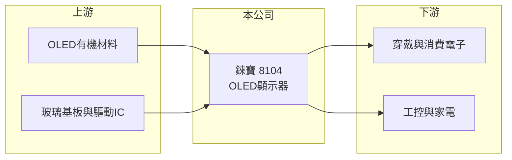

# 8104 錸寶

> 上市｜[[產業索引-光電業|光電業]]｜上市（櫃）日期 2019/01/17

# 第一章：企業模式與商業藍圖

> [!info] 撰寫說明
> 精簡版，由 Claude 依公開資料整理，架構比照 [[2330台積電]]，資料截至 2026-10-07。來源：nstock.tw 錸寶公司概況、winvest.tw 營收快訊。公開資料有限，產品與應用別營收比重、主要客戶未查到。#待校對

錸寶是新竹湖口的[[OLED]]顯示器製造商，2026 年營收較前一年大幅縮水。

- **核心業務：** 錸寶成立於 2000 年，2019 年掛牌，主要從事有機電激發光顯示器（OLED）的製造、加工與買賣，產品以小尺寸[[PMOLED]]為主（推估）。
- **營收結構：** 本次未查到產品或應用別比重；2025 年全年營收 35.88 億元。
- **營運據點：** 工廠位於新竹工業區（新竹縣湖口鄉），海外據點本次未查到。
- **長期方向：** 小尺寸 OLED 應用在穿戴裝置、工控與家電等，公司需要在需求下滑時找到新的應用支撐營收（推估）。

# 第二章：護城河深度與競爭優勢

錸寶的優勢在於小尺寸 OLED 的長期量產經驗，但面臨中國廠商的價格競爭。

- **競爭優勢：** OLED 蒸鍍與封裝需要製程經驗與良率控制，錸寶長期專注小尺寸 OLED，具備量產與客製能力（推估）。
- **主要對手：** 中國小尺寸 OLED 廠，以及 [[3481群創]]、[[2409友達]]、[[6116彩晶]] 等面板廠的中小尺寸產品。
- **觀察重點：** 下半年月營收能否延續年增、[[毛利率]]能否回到兩成以上，以及新應用接單。

# 第三章：財務體質與盈利規模

資料日期：2026-10-07，以下數字是撰寫當時的快照；最新月營收、毛利率、累計 EPS 由自動排程寫在本筆記的屬性欄位（月營收、毛利率、累計EPS 等）。#待校對

錸寶 2026 年前八月營收年減超過三成，獲利率偏低。

- **營收規模：** 2026 年 1 至 8 月累計營收 18.44 億元，年減 34.35%；8 月單月 2.63 億元，月減 16.68%、年增 15.69%。2025 年全年營收 35.88 億元。
- **獲利：** 2026 年第二季 EPS 0.17 元，[[毛利率]] 19.98%，[[營業利益率]] 3.02%，淨利率 2.09%。
- **財務特色：** 資本額約 10.41 億元、市值約 33.04 億元；近五年平均現金股利 0.72 元。OLED 產線折舊等固定成本高，營收下滑時[[營運槓桿]]會壓縮獲利（推估）。

# 第四章：總體風險與地緣政治

錸寶的風險在於終端需求變化與小尺寸顯示的價格競爭。

- **產業週期：** 小尺寸 OLED 需求受消費電子、穿戴裝置與家電景氣影響，2026 年營收大幅衰退顯示需求或訂單轉弱。
- **營運風險：** 固定成本高，營收規模縮小時獲利容易轉弱；客戶集中度本次未查到。
- **其他風險：** 中國廠商擴產帶來的價格壓力、有機材料價格與新台幣匯率。

# 專有名詞解析

## 金融

- **[[營運槓桿]]**：固定成本占比高時，營收小幅變動就會讓獲利大幅增減；營收萎縮時虧損也會被放大。

## 產業

- **[[OLED]]**：有機發光二極體顯示技術，每個像素自行發光，不需背光模組。
- **[[PMOLED]]**：被動矩陣式 OLED，以行列掃描驅動，結構簡單、成本低，多用於小尺寸單色或簡易顯示。

# 核心供應鏈

- 上游：OLED有機材料、玻璃基板與驅動IC供應商（推估）
- 下游／客戶：穿戴裝置、消費電子、工控與家電製造商（推估）
- 同業：中國小尺寸 OLED 廠、[[3481群創]]、[[2409友達]]、[[6116彩晶]]

## 最新新聞
<!-- news:start -->
<!-- news:end -->

## 相關連結
- [公開資訊觀測站](https://mopsov.twse.com.tw/mops/web/t05st03?step=1&firstin=1&co_id=8104)
- [Goodinfo](https://goodinfo.tw/tw/StockDetail.asp?STOCK_ID=8104)
- [Yahoo 股市](https://tw.stock.yahoo.com/quote/8104)
- [鉅亨網新聞](https://www.cnyes.com/twstock/8104/news)
