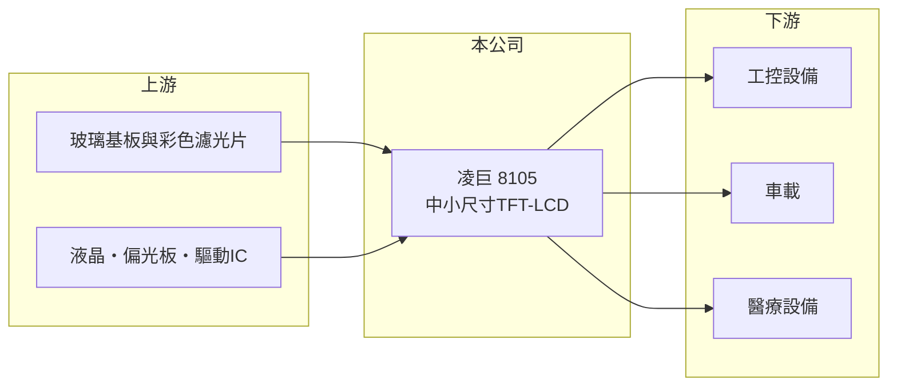

# 8105 凌巨

> 上市｜[[產業索引-光電業|光電業]]｜上市（櫃）日期 2006/12/27

# 第一章：企業模式與商業藍圖

> [!info] 撰寫說明
> 精簡版，由 Claude 依公開資料整理，架構比照 [[2330台積電]]，資料截至 2026-10-07。來源：富果研究 2025 年 12 月凌巨法說會整理、winvest.tw 營收快訊。2026 年季度獲利本次未查到。#待校對

凌巨是專做中小尺寸利基型顯示器的面板廠，近年處於虧損縮小、調整產品組合的階段。

- **核心業務：** 凌巨生產中小尺寸顯示器（以[[TFT-LCD]]為主，推估），專注利基型、高附加價值應用，技術特色包括戶外可視、低功耗、[[反射式顯示]]、半穿反式與柔性顯示。
- **營收結構：** 主要應用為[[工業顯示器]]（工控）、車載與醫療，法說會表示工控占比持續增加，但本次未查到具體百分比。
- **營運據點：** 生產與營運據點本次未查到，本文不推測。
- **長期方向：** 醫療產品經約 5 年開發，預計 2026 年量產；車載後照鏡應用呈成長趨勢，公司也導入 AI 管理工具與精實管理提升良率。

# 第二章：護城河深度與競爭優勢

凌巨的競爭力在於特殊規格顯示技術，避開大尺寸面板的規模競爭。

- **競爭優勢：** 戶外可視、低功耗、反射式等特殊顯示技術適合工控、車載與醫療，這些客戶重視長期供貨與認證，轉換成本較高。
- **主要對手：** [[3481群創]]、[[2409友達]]、[[6116彩晶]] 的中小尺寸產品線，以及日本、中國的中小尺寸面板廠。
- **觀察重點：** 醫療產品量產進度、[[毛利率]]能否穩定轉正，以及 2026 年營收年減能否止住。

# 第三章：財務體質與盈利規模

資料日期：2026-10-07，以下數字是撰寫當時的快照；最新月營收、毛利率、累計 EPS 由自動排程寫在本筆記的屬性欄位（月營收、毛利率、累計EPS 等）。#待校對

凌巨 2025 年第三季勉強損益兩平，2026 年月營收仍較去年同期衰退。

- **營收規模：** 2025 年第三季營收 21.88 億元；2026 年 6 月營收 6.80 億元、年減 8.9%，8 月 7.07 億元、年減 10.43%。
- **獲利：** 2025 年第三季營業淨損 8,793 萬元，稅後淨利僅 49 萬元，EPS 0.001 元；法說會提到毛利一度為負、持續改善中（推估指部分期間）。
- **財務特色：** 2025 年 9 月底現金 16.65 億元，總資產 106.89 億元，權益 76.88 億元，每股淨值 17.71 元，負債比例不高。

# 第四章：總體風險與地緣政治

凌巨的風險在於本業獲利薄弱與面板產業的價格競爭。

- **產業週期：** 工控與車載需求受全球製造業與汽車景氣影響，面板產業供需變化也會影響報價。
- **營運風險：** 本業仍在虧損邊緣，若營收持續年減，新產品貢獻又不如預期，可能再度虧損。
- **其他風險：** 中國面板廠的價格競爭、醫療與車用認證時程，以及新台幣匯率。

# 專有名詞解析

## 金融

- **[[毛利率]]**：營業毛利占營收的比率，反映產品售價扣除直接成本後的獲利空間。

## 產業

- **[[TFT-LCD]]**：薄膜電晶體液晶顯示器，以每個像素的電晶體控制液晶，是目前主流的面板技術。
- **[[工業顯示器]]**：用於工廠、交通、醫療與戶外的顯示器，強調高亮度、寬溫與長期供貨。
- **[[反射式顯示]]**：利用環境光反射顯示畫面、不需或少用背光的技術，耗電低且在陽光下清楚。

# 核心供應鏈

- 上游：玻璃基板、彩色濾光片、液晶、偏光板與驅動IC供應商（推估）
- 下游／客戶：工控、車載與醫療設備製造商，客戶名稱未揭露
- 同業：[[3481群創]]、[[2409友達]]、[[6116彩晶]]、日本與中國中小尺寸面板廠

## 最新新聞
<!-- news:start -->
<!-- news:end -->

## 相關連結
- [公開資訊觀測站](https://mopsov.twse.com.tw/mops/web/t05st03?step=1&firstin=1&co_id=8105)
- [Goodinfo](https://goodinfo.tw/tw/StockDetail.asp?STOCK_ID=8105)
- [Yahoo 股市](https://tw.stock.yahoo.com/quote/8105)
- [鉅亨網新聞](https://www.cnyes.com/twstock/8105/news)
