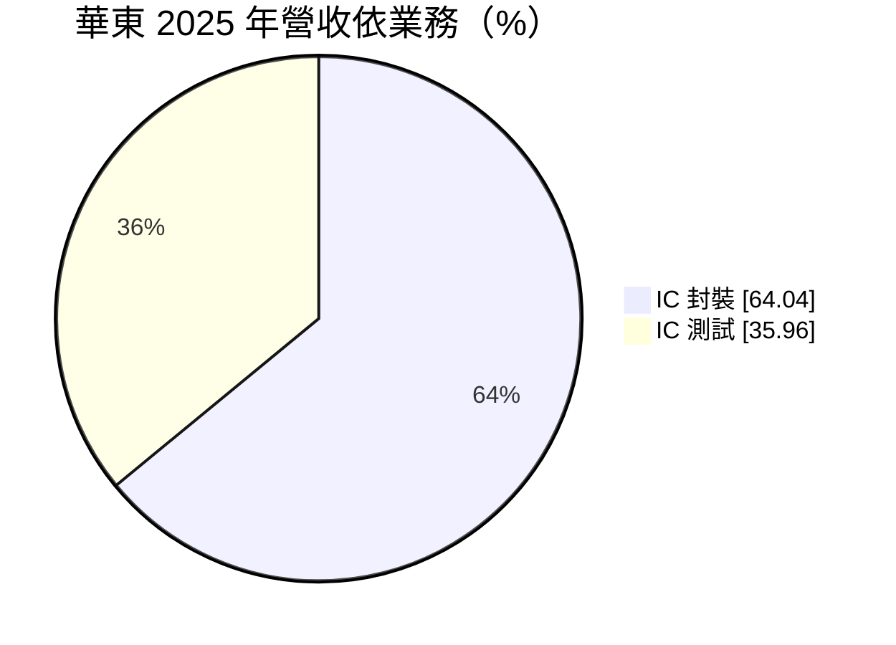
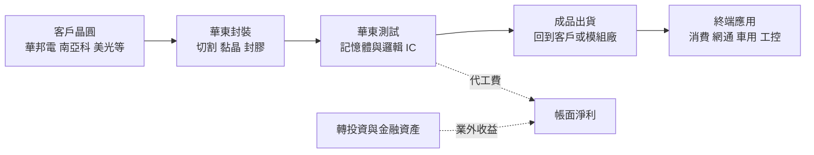
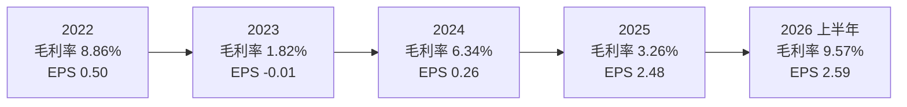
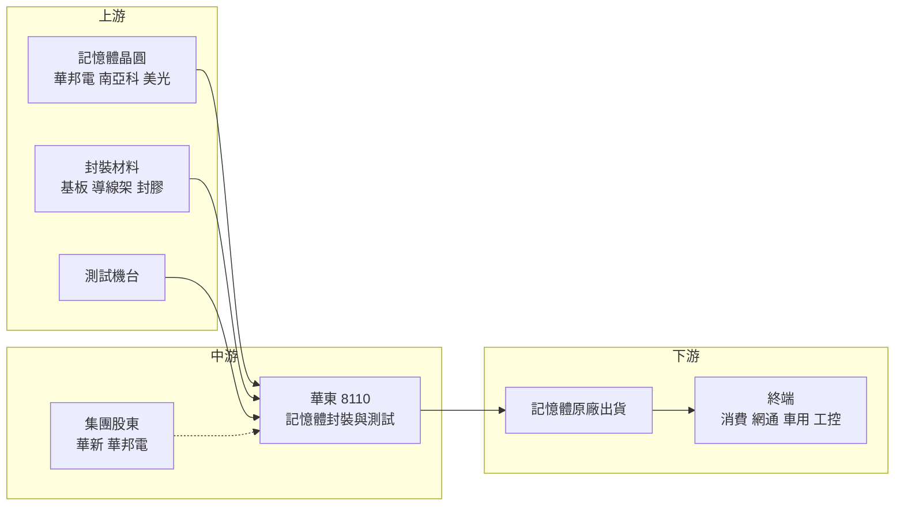

# 8110 華東

> 上市｜[[產業索引-半導體業|半導體業]]｜上市（櫃）日期 2007/10/31

# 第一章：企業模式與商業藍圖

> [!info] 撰寫說明
> 本文由 Claude 依公開資料整理，架構比照 [[2330台積電]] 的四章研究，資料截至 2026-10-08。財務數字來源：證交所開放資料（基本資料、綜合損益、資產負債、營益分析、股利、本益比殖利率）、Goodinfo 台灣股市資訊網年度經營績效、MoneyDJ 理財網（康和證券）公司基本資料、經濟日報 2026 年 1 月報導、工商時報 2025 年 12 月與 2026 年 1 月報導、旺得富理財網 2026 年 8 月報導、優分析、nStock；產業描述為整理性內容，尚未逐條比對原始文件。#待校對

在評估單一個股的長期投資價值時，首要步驟是拆解企業的底層獲利邏輯。本章針對華東科技（股票代號：8110，以下簡稱華東）的商業模式進行定性分析，說明這家華新麗華集團旗下的記憶體封測廠，如何在與主要客戶高度綁定的結構下經營，以及為什麼它的本業長期微利、帳面獲利卻常由業外收益決定。

## 一、核心定位：華新集團旗下、服務華邦電的記憶體封測廠

華東成立於 1995 年，總部與工廠位於高雄前鎮區，2006 年在櫃買中心掛牌，2007 年轉往證交所上市，實收資本額約 51.77 億元。依 nStock 整理的公司沿革，華東由 [[1605華新]]（華新麗華，約 19%）與 [[2344華邦電]]（約 9%）投資設立，原名華新先進電子，之後更名為華東科技，並在 2002 年吸收合併轉投資的華東先進電子。現任董事長為華新集團的焦佑衡。

華東的本業是半導體封裝與測試。晶片在晶圓廠完成製造後，需要經過切割、黏晶、打線或覆晶、封膠等封裝步驟，再進行電性測試，才能成為可以焊在電路板上的成品。華東專注在記憶體 IC 的封裝與測試，優分析報導形容它是台灣少數深耕記憶體封測的業者，提供封裝、成品測試到組裝的一站式服務。

華東與主要客戶的關係非常緊密。旺得富理財網 2026 年 8 月報導指出，華東營運與主力客戶華邦電高度連動；工商時報 2025 年 12 月報導也提到，大股東華邦電的訂單是華東業績的重要支撐，國際大廠美光也增加對台灣封測廠的委外訂單。優分析報導則提到華東服務 [[2408南亞科]] 與華邦電。

## 二、終端應用／產品板塊：封裝與測試兩大業務

依 MoneyDJ 理財網的 2025 年營收分類，華東營收結構如下：

* **IC 封裝（約 64%）：** 以記憶體顆粒的封裝為主，客戶包括華邦電的利基型 DRAM、NOR Flash 等產品。封裝收入與客戶的出貨顆數直接相關，DRAM 量價齊揚時，客戶產出的晶片顆粒增加，華東的封裝訂單也隨之增加。
* **IC 測試（約 36%）：** 記憶體測試需要長時間在不同溫度與電壓下檢驗晶片，測試機台昂貴、測試時間長，是封測廠重要的收入來源。旺得富報導提到，華東 2026 年投入約 7 億元資本支出，購置記憶體與高階邏輯 IC 測試機台，並擴大布局車用電子、工業控制等利基型封測市場。

華東的終端應用跟著客戶產品走。華邦電的產品以利基型記憶體為主，廣泛用於消費性電子、網通、車用與工業設備，因此華東的需求來源相對分散，但都受記憶體景氣影響。

## 三、資本轉化邏輯：重資產代工與業外資產並存

華東的獲利由兩股力量決定。

第一是本業的封測代工費。封測廠和晶圓代工廠一樣屬於重資產產業，機台與廠房折舊是主要成本，[[產能利用率]]決定毛利率。華東的問題在於本業毛利率長期偏低：Goodinfo 數據顯示，2019 年毛利率只有 0.03%，2020 至 2025 年在 1.8% 至 8.9% 之間，營業利益率多數年度為負值或接近零。這說明在客戶議價力強、記憶體封測價格競爭激烈的情況下，華東的本業長期只能維持微利。2026 上半年毛利率回升到 9.57%、營業利益率 2.74%，是近年較好的水準。

第二是業外收益。華東 2025 年本業營業損失約 2.84 億元，但稅後淨利約 12.54 億元、EPS 2.48 元創新高；2026 上半年營業利益只有約 1.07 億元，業外收支卻約 13.03 億元，稅前淨利率高達 36%。經濟日報與工商時報都指出華東獲利主要來自業外挹注，但未說明具體來源。從資產負債表看，2026 年第二季底非流動資產約 146.72 億元，占總資產超過六成；權益中的「其他權益」約 74.96 億元，上半年其他綜合損益約 61.73 億元，推估華東持有規模可觀的轉投資與金融資產，其評價與收益對帳面獲利影響很大（具體持股標的與業外收益明細未查得）。

這種結構代表：分析華東時，必須把「封測本業」與「投資收益」分開看。本業決定公司的長期競爭力，業外收益則可能隨持股標的的獲利與股價大幅波動，不一定能持續。

## 四、企業長期藍圖：跟隨主要客戶擴產、擴大利基封測

* **跟隨華邦電的產品放量：** 旺得富報導指出，為滿足華邦電多產品線的放量需求，華東在 2026 年投入約 7 億元資本支出購置測試機台。華邦電在利基型 DRAM、NOR Flash 與相關產品的出貨成長，是華東本業最直接的動能。
* **擴大車用與工控封測：** 車用與工業控制晶片要求長期供貨與高可靠度，封測價格較穩定。華東擴大布局這類利基市場，目的在於提高本業毛利率，降低對消費性記憶體價格的依賴。
* **承接國際記憶體大廠委外：** 工商時報提到美光增加對台灣封測廠的委外訂單。若記憶體原廠把更多封測外包，華東有機會分散客戶結構。

從經營層的資本配置習慣來看，華東長期把部分資源放在轉投資，本業則維持較保守的資本支出。這讓公司在本業微利的年代仍能維持財務穩健，但也使本業的技術與規模擴張較慢。

# 第二章：護城河深度與競爭優勢

在長期價值投資中，「護城河」指企業抵禦競爭、維持超額利潤的保護機制。本章分析華東的競爭優勢、主要競爭對手，以及這些優勢能守住多少。

## 一、華東護城河的核心組成要素

華東的本業護城河很窄，長期微利的財務數據就是最直接的證據。它的優勢主要來自集團關係，而非技術或成本領先。

* **1. 集團內的穩定客戶：** 華邦電是華東的投資股東，也是主力客戶。這種股權加訂單的關係，讓華東在記憶體景氣低迷時仍能取得基本訂單，不至於失去客戶。但同樣的關係也限制了華東的定價能力，因為主要客戶有足夠的議價力。
* **2. 記憶體封測的專業經驗：** 記憶體測試需要大量長時間測試與溫度循環，需要專門的測試程式與機台配置。華東深耕記憶體封測近三十年，累積了服務利基型記憶體客戶的經驗，對小量多樣的利基型記憶體產品特別適合。
* **3. 南台灣據點：** 華東工廠位於高雄，與南部的晶圓廠與封測聚落距離近，物流與人力取得有一定便利性。

## 二、主要競爭對手格局

| 對手 | 定位 | 對華東的威脅 |
|---|---|---|
| [[6239力成]] | 全球最大記憶體封測廠之一 | 規模、技術與客戶廣度遠大於華東 |
| [[8131福懋科]] | 台塑集團記憶體封測，南亞科為主要客戶 | 同樣是集團型記憶體封測廠，與華東模式最接近 |
| [[2329華泰]] | 記憶體與邏輯 IC 封測、模組 | 在記憶體封測與模組業務重疊 |
| [[8150南茂]] | 記憶體與驅動 IC 封測 | 在記憶體測試與封裝直接競爭 |
| 記憶體原廠自有封測 | 三星、SK 海力士、美光等 | 原廠內部產能優先，外包量隨景氣變動 |

## 三、優勢轉化：哪些市場守得住、哪些守不住

* **守得住：** 華邦電利基型記憶體的封測訂單。股權關係與長期合作讓這部分訂單相對穩定，是華東的基本盤。
* **守不住：** 標準型記憶體的封測價格。標準品封測的價格透明、競爭者眾多，大型封測廠的規模經濟使其成本更低，華東難以在價格上取得優勢，這也是本業毛利率長期偏低的原因。
* **觀察重點：** 第一，本業毛利率能否穩定站上 10%，代表測試機台投資與利基市場布局開始發揮效果。第二，非華邦電客戶（如美光委外）的比重能否提升。第三，帳面獲利中業外收益的比重，若業外收益持續大於本業，投資人應把華東視為「封測本業加投資組合」的混合型公司來評價。

# 第三章：財務體質與盈利規模

資料日期：2026-10-08。數字取自證交所開放資料與 Goodinfo 年度經營績效，表格是撰寫當時的快照；最新月營收、毛利率、累計 EPS 由自動排程寫在本筆記的屬性欄位（月營收、毛利率、累計EPS 等）。#待校對

財務報表是檢驗護城河是否真實存在的最終標準。本章用三率、[[ROE]]、現金流與資本報酬，檢視華東本業與業外並存的獲利結構。

## 一、獲利能力的基石：三率

| 年度 | 營收（億元） | [[毛利率]] | [[營業利益率]] | EPS（元） | [[ROE]] |
|---|---|---|---|---|---|
| 2019 | 67.3 | 0.03% | -5.54% | 0.33 | 1.47% |
| 2020 | 59.7 | 3.32% | -1.57% | 0.51 | 2.16% |
| 2021 | 81.2 | 5.53% | 0.68% | 0.43 | 1.03% |
| 2022 | 95.1 | 8.86% | 3.72% | 0.50 | 1.45% |
| 2023 | 72.8 | 1.82% | -3.50% | -0.01 | -1.08% |
| 2024 | 78.6 | 6.34% | 1.01% | 0.26 | -0.26% |
| 2025 | 73.15 | 3.26% | -3.88% | 2.48 | 9.94% |
| 2026 上半年 | 39.13 | 9.57% | 2.74% | 2.59 | 年化約 13.8%（推算） |

註：2019 至 2025 年取自 Goodinfo 年度經營績效，其中 2023、2024 年 ROE 的正負號與 EPS 方向不一致，可能涉及非控制權益或計算口徑差異，需回原始財報核對；2025 年營收取自經濟日報報導。2026 上半年取自證交所營益分析與綜合損益開放資料，ROE 以歸屬母公司淨利 13.29 億元乘以 2，除以 2026 年第二季底歸屬母公司權益 192.64 億元推算。

* **[[毛利率]]長期在個位數：** 2019 至 2025 年華東毛利率最高只有 8.86%（2022 年），多數年度低於 6%。對重資產的封測廠而言，這代表營收只夠支付折舊與人力，幾乎沒有餘裕。2026 上半年回升到 9.57%，是記憶體景氣上升與測試業務擴張帶來的改善，能否延續仍待觀察。
* **[[營業利益率]]多數年度為負：** 七個年度中有四年營業利益為負，代表本業長期沒有為股東創造利潤。2025 年營業利益率負 3.88%，但 EPS 卻達 2.48 元，差距完全來自業外收益。
* **業外決定帳面獲利：** 2026 上半年營業外收支約 13.03 億元，是營業利益 1.07 億元的 12 倍。投資人看到華東 EPS 大增時，必須先確認獲利來源是本業改善還是業外收益。

## 二、[[ROE]]：資本效率

2021 至 2025 年華東的平均 ROE 只有約 2.2%（推算），即使 2025 年因業外收益提高到 9.94%，長期資本效率仍明顯偏低。一個重要原因是股東權益規模很大：2026 年第二季底歸屬母公司權益約 192.64 億元，是股本 51.77 億元的 3.7 倍，其中其他權益約 74.96 億元、保留盈餘約 58.80 億元。大量權益以金融資產形式存在，若這些資產的報酬不高，就會拉低整體 ROE。

營收方面，2019 年 67.3 億元到 2025 年 73.15 億元，六年年複合成長率約 1.4%（推算），本業規模基本停滯。

## 三、資本支出與[[自由現金流]]

* **[[CapEx]]：** 旺得富報導指出，華東 2026 年資本支出約 7 億元，用於記憶體與高階邏輯 IC 測試機台。以年營收七、八十億元的規模來看，資本支出屬於保守水準。
* **財務結構：** 2026 年第二季底負債總計約 42.70 億元，非流動負債約 10.30 億元，負債占資產比例不到兩成，財務穩健。
* **股利政策：** 依證交所股利資料，2025 年度每股現金股利 1.5 元，以 EPS 2.48 元計算，[[配息率]]約 60%（推算）；2024 年度現金股利只有 0.2 元（nStock）。公司章程寫明股利著重穩定性與成長性，但實際配息明顯隨帳面獲利（含業外）波動。

## 四、[[ROIC]] 與 [[WACC]]：價值創造利差

* **ROIC（推算）：** ROIC 只計算本業的稅後營業利益，不含業外收益。2025 年營業利益約負 2.84 億元，稅後營業利益約負 2.27 億元；投入資本以 2026 年第二季底權益總計 192.62 億元加上非流動負債 10.30 億元（有息負債明細未查得，以非流動負債作為上限近似）計算，約 202.92 億元，2025 年 ROIC 約負 1.1%（推算）。若以 2026 上半年營業利益 1.07 億元年化，稅後營業利益約 1.72 億元，ROIC 約 0.8%（推算）。由於權益中有大量金融資產，若只計算封測本業實際使用的資本，ROIC 會較高，但從營業利益率長期接近零來看，本業報酬率仍偏低。
* **WACC（推算）：** 無風險利率取台灣 10 年期公債約 1.75%，市場風險溢酬取 6%，未查得華東的 β 值，本文假設記憶體封測股常見的 1.2，股東權益成本約 1.75% + 1.2 × 6% ≈ 9.0%。稅前負債成本假設 2.5%、稅率 20%，以權益約 95% 的資本結構加權，WACC 約 8.6%（推算）。
* **價值創造判斷：** 華東本業的 ROIC 長期接近零甚至為負，遠低於約 8.6% 的 WACC，代表封測本業長期沒有賺回資金成本。帳面上的股東報酬主要依賴業外投資收益，而這部分是否能持續，取決於持股標的的表現，無法由本業競爭力保證。除非本業毛利率能長期站上兩位數，否則華東的本業很難被視為創造價值的事業。

# 第四章：總體風險與地緣政治

任何企業都無法脫離宏觀環境獨立存在。本章分析華東未來必須面對的地緣政治、產業週期、營運與技術風險。

## 一、地緣政治風險

* **記憶體產業的國家競爭：** 記憶體是各國半導體政策的重點，中國積極發展本土記憶體與封測產能，美國則以出口管制限制中國先進記憶體。這些政策會改變全球記憶體的產能分布與委外需求，間接影響華東的訂單。
* **客戶海外擴產：** 若主要客戶為了分散風險在海外設廠，封測也可能跟著移往當地，華東需要評估是否跟進投資。
* **台灣生產集中：** 華東的產能集中在高雄，面臨與其他台灣半導體廠相同的兩岸風險。

## 二、產業週期與市場結構風險

* **記憶體景氣循環：** 記憶體價格與出貨量的波動，會直接反映在客戶的封測需求與價格上。2023 年記憶體低谷時，華東毛利率降到 1.82%、營業利益率為負 3.5%。
* **[[長鞭效應]]：** 記憶體缺貨時客戶會增加投片與封測，需求轉弱時又會同步去化庫存，封測廠的利用率波動往往比終端需求更大。
* **客戶議價力：** 主要客戶同時是股東，封測價格的調整空間有限，在景氣好時也未必能大幅漲價。

## 三、營運環境的隱性風險

* **客戶集中：** 華東營運與華邦電高度連動，若華邦電調整封測策略、增加自有產能或轉單給其他封測廠，華東的營收會受到明顯衝擊。
* **業外收益的波動：** 帳面獲利高度依賴業外收益，若持股標的獲利下滑或評價下跌，華東的 EPS 與股利可能大幅縮水，而這與封測本業無關。投資人容易把業外獲利誤認為本業好轉。
* **內部人持股變動：** 工商時報 2026 年 1 月報導，總經理于鴻祺在 2025 年 11 月與 2026 年 1 月申報轉讓持股。這類申報屬於公開資訊，本身不代表經營問題，但可作為觀察經營層信心的參考之一。
* **人力與成本：** 封測業需要大量現場人力，基本工資與人力成本上升會壓縮本已微薄的毛利率。

## 四、科技演進風險

記憶體封裝技術正快速升級，[[HBM]] 需要 [[TSV]] 矽穿孔與多層堆疊，DDR5 與 LPDDR5 也需要更高速的測試能力。這些先進記憶體封裝主要由記憶體原廠與大型封測廠掌握，資本支出規模遠超過華東的能力。華東若停留在傳統打線封裝與一般測試，長期可能被邊緣化到利基型、低單價產品；若能在車用、工控與高階邏輯測試建立專長，才有機會提高本業的附加價值。華東 2026 年購置高階邏輯 IC 測試機台，就是朝這個方向的嘗試。

# 專有名詞解析

## 半導體

- **[[封裝測試]]**：晶片製造完成後的切割、封裝與電性測試流程，讓晶片成為可焊接在電路板上的成品。
- **[[DRAM]]**：動態隨機存取記憶體，電腦與伺服器的主記憶體，斷電後資料會消失，價格循環明顯。
- **[[NOR Flash]]**：一種可直接執行程式碼的快閃記憶體，常用於儲存開機程式，華邦電為主要供應商。
- **[[利基型記憶體]]**：容量較小、用於消費性、網通、車用與工控設備的記憶體，規格與標準型 DRAM 不同。
- **[[打線封裝]]**：用細金屬線把晶片與基板連接的傳統封裝方式，成本低、技術成熟。
- **[[TSV]]**：矽穿孔，在晶片上鑽出垂直導通孔，讓多層晶片直接堆疊連接，是 HBM 的關鍵技術。
- **[[HBM]]**：高頻寬記憶體，把多層 DRAM 垂直堆疊並與處理器封裝在一起，用於 AI 加速器。

## 金融

- **[[FVOCI]]**：透過其他綜合損益按公允價值衡量的金融資產，評價變動計入其他權益而非當期損益。
- **[[業外收益]]**：營業活動以外的收益，例如投資收益、股利收入、處分資產利益與匯兌損益。
- **[[產能利用率]]**：實際產出占總產能的比例，封測廠的毛利率高度取決於此數字。
- **[[配息率]]**：現金股利占每股盈餘的比例，反映公司把多少獲利回饋給股東。
- **[[自由現金流]]**：營業活動現金流減去資本支出，代表企業可自由用於配息、還債或併購的現金。
- **[[長鞭效應]]**：終端需求的小幅變動，沿供應鏈往上游傳遞時被逐級放大，造成上游庫存與訂單劇烈波動。

# 核心供應鏈

## 1. 上游：客戶晶圓與封測材料
- 委託封測的記憶體晶圓：[[2344華邦電]]、[[2408南亞科]]、美光
- 封裝材料：基板、導線架與封膠，測試機台（具體供應商未查得）

## 2. 中游：華東本身與集團
- 記憶體與利基型 IC 封裝測試：華東
- 集團股東：[[1605華新]]、[[2344華邦電]]

## 3. 下游：客戶與終端
- 封測完成的晶片交回記憶體原廠，再銷往消費性電子、網通、車用與工業設備市場

## 4. 同業與競爭者
- 記憶體封測：[[6239力成]]、[[8131福懋科]]、[[2329華泰]]、[[8150南茂]]

## 最新新聞
<!-- news:start -->
<!-- news:end -->

## 相關連結
- [公開資訊觀測站](https://mopsov.twse.com.tw/mops/web/t05st03?step=1&firstin=1&co_id=8110)
- [Goodinfo](https://goodinfo.tw/tw/StockDetail.asp?STOCK_ID=8110)
- [Yahoo 股市](https://tw.stock.yahoo.com/quote/8110)
- [鉅亨網新聞](https://www.cnyes.com/twstock/8110/news)
